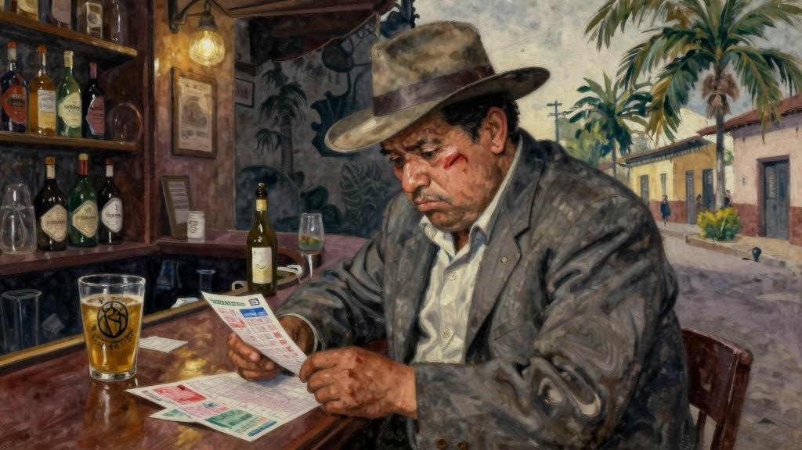
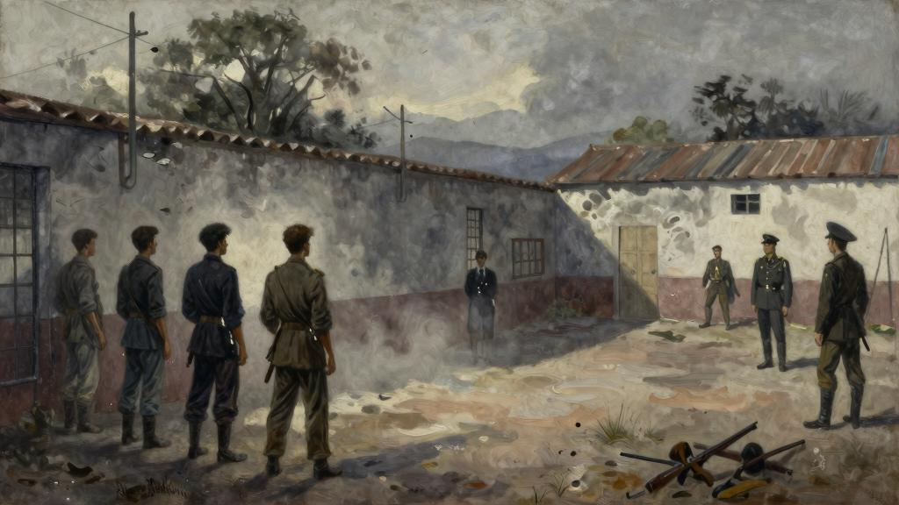
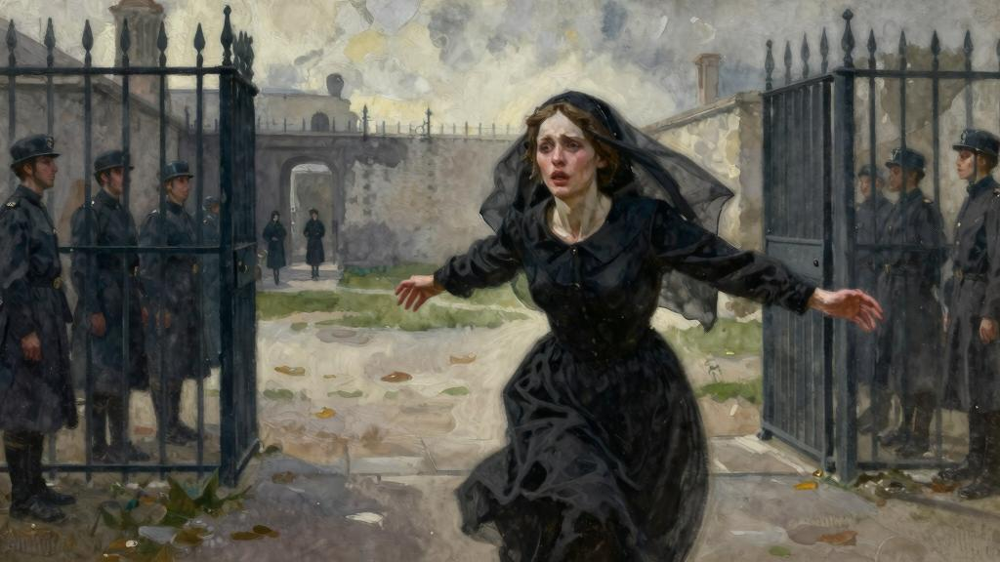
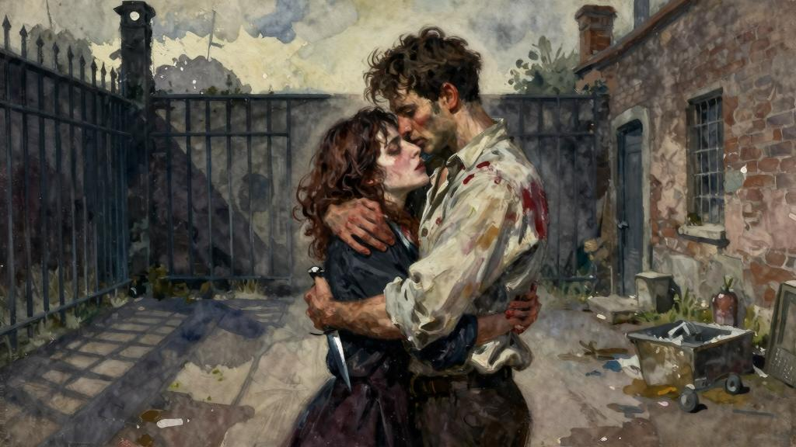

因为那条伤疤，我才第一次注意到他。那伤疤从太阳穴延伸到下巴，又宽又红，呈新月状。当时的伤口一定很吓人，我不知道是军刀还是弹壳碎片留下的。在这张又圆又胖、和和气气的脸上，这伤疤感觉有些突兀。他长得小鼻子小眼、其貌不扬的，但一看就心性单纯，跟他肥胖的身体显得不太协调。他气力过人，身材高大。除了一套破旧的灰色西装、一件卡其色衬衫和一顶破旧的宽边帽，我没见过他穿别的衣服。他一点也说不上干净。以前他去危地马拉城的皇宫酒店，每天到了鸡尾酒会时间，都在吧台周围溜达着兜售彩票。如果他靠这个谋生的话，我觉得他一定过得很穷，为我没见谁买过他的彩票。但时不时地，我看到有人会请他喝杯酒，他也从不拒绝。在桌子中间来回走动的时候，他步子迈得摇摇摆摆的，好像习惯了走远路的样子。他在每张桌子旁边都要停一会儿，面带笑容跟人介绍他的彩票号码。见没人理他，他就同样面带笑容地离开，到别的桌继续兜售。我想很多时候他都有点喝多了。

一天晚上，我和跟一个熟人在吧台边喝酒，脚踩在栏杆上——危地马拉城皇宫酒店的干马提尼调得非常好——这时，那个带伤疤的男人走了过来。我摇了摇头，我到这儿以来，他这是第二十次给我看他的彩票了。而我的同伴则友好地向他点头致意。

“嗨，将军，你好吗？”

“还凑合。生意不太好，可能会更差。”

“要喝点什么，将军？”

“来杯白兰地。”

他一饮而尽，把杯子放回吧台上，向我的熟人点点头。

“谢谢你，再见。”

然后他转过身去，向我们旁边的人继续兜售他的彩票。

“你这位朋友是谁？”我问道，“他脸上的伤疤真吓人。”

“那条疤没让他更好看是吧？他是个尼加拉瓜来的流亡者。当然，他是个流氓，是个强盗，但人不坏。我不时地给他几比索。他之前是一名领导革命的将军，要不是他的弹药耗尽了，他现在可能已经颠覆了政府，成了陆军大臣，而不是在危地马拉卖彩票了。他们逮捕了他，连同他的下属，把他送上了军事法庭受审。你知道，在这些国家，这种事情是不会仔细调查的，他被判天一亮就枪决。我猜，他被抓住的时候，就知道自己的结果了。他在监狱里过了一夜。那天晚上他和其他几个人关在一起，一共五个，一起打扑克打发时间，用火柴当筹码。他告诉我他这辈子手气从来没这么背过。他们玩的是‘双J开局’游戏，用的牌也不全，他一次好牌也没有拿到过。那一晚上，他统共没赢过六回，而且每次刚买了一堆火柴，接着就输光了。当天亮以后士兵他们来牢房里提他们去行刑的时候，他输掉的火柴比一个平常人一辈子能用掉的火柴还多。”

“他们被带到监狱的院子，靠着墙，五个人并排站着，开枪的人正对着他们。过了一会儿还没动静，我们这位朋友问管事的警官，他们到底在等什么。这名警官说，政府军的将军想来看看这次处决，他们在等他。”

“‘那我还有时间再抽一支烟，’我们这位朋友说，‘他从来不准时的。’”

“但是他刚点着烟，将军就带着他的副官走进了院子。顺便说一句，这位将军是圣·伊格纳西奥，不知道你有没有见过他。惯常的程序都走完了，圣·伊格纳西奥问那些犯人，在行刑前还有没有什么愿望。五个人中有四个都摇头表示没有，但我们这位朋友说话了。”

“‘是的，我想跟我的妻子告别。’”

“‘好的，’将军说，‘我不反对。她在哪儿呢？’”

“‘她就在监狱门口等着。’”

“‘那顶多耽误五分钟。’”

“‘用不了，将军先生。’我们的朋友说。”

“‘先把他带到一边。’”

“两名士兵走上前来，将这位被判刑的叛军拉到指定地点。行刑队的警官在将军点头后下了命令，接着传来一声刺耳的枪响，四个人应声倒地。他们倒下的时候也是奇怪，不是一起倒，而是一个接一个地倒，动作也怪，就像剧院里的木偶。那警官走到他们跟前，看到有一个人还活着，就在他身上补了两枪。我们这位朋友抽完了烟，扔掉了烟蒂。”

“门口有点骚动。一个女人快步冲进院子，但突然把手放在胸口，停下了。随后她哭喊了一声，伸出双臂又向前跑去。”

“‘唉。’将军感叹道。”

“她穿着黑色衣服，戴着头纱，脸色苍白。她不过是个小姑娘，身材苗条，五官标致而小巧，眼睛格外大，但很痛苦。她跑的时候嘴微微张着，痛苦的脸看上去都是那么美，那些麻木的士兵看到她，都惊讶地深吸了一口气。”

“这个叛军向前走了一两步去迎她。当她扑到他的怀里的时候，他用粗哑的嗓音激动地喊了一声：我的心，我的魂！然后去亲她。与此同时，他从破旧的衬衫里抽出一把匕首——我不知道他是怎么把这东西留在身上的——刺进了她的脖子。血管被割断，鲜血涌出来，把他的衬衫也染红了。然后他伸出双臂搂住她，再一次疯狂地亲她。”

“一切发生得太快了，许多人还没反应过来是怎么回事。有的人惊叫起来，冲向前去抓住了他，掰开他的手。要不是那个副官接住了女孩，她就直接倒下去了。她已经没了知觉。他们把她放在地上，站在周围惊愕地看着她。这个叛军知道他刺中的是要害，血是不可能止住的。过了一会儿，跪在女孩身边的副官站了起来。”

“‘她死了。’他低声道。”

“这个叛军在胸前画了个十字。”

“‘你为什么要这样做？’将军问道。”

“‘我爱她。’”

“挤在周围的人都叹了口气，困惑地看着凶手。将军注视着他，没有说话。”

“‘这是一个高尚的选择。’他终于说，‘我不能处死这个人。用我的车把他送到边境上去吧。先生，我向您表示敬意，这是一个勇士对另一个勇士应有的敬意。’”

“那些听到这话，人们开始低声赞叹。副官轻拍了一下这个叛军的肩膀。然后，两名士兵带他走向等在那里的汽车，他一句话都没说。”

我的朋友停了下来，我沉默了一会儿。我必须解释一下，我朋友是危地马拉人，一直用西班牙语跟我讲故事。我尽力把他告诉我的翻译成英语，连他那相当夸张的语言也如实保留了。说实话，我认为这种夸张的语言挺适合这个故事。

“那么，他的伤疤是怎么来的呢？”我终于问道。

“哦，那是为我开汽水瓶时，瓶子爆了。就是一瓶姜汁汽水。”

“我从不喜欢这东西。”我说。

门歇业事发生在一个幸福的国家，我不愿提事，也绝不会吐露个国家的名字。当然，承认它是美洲大陆上一个自由独立的国家倒也无妨。平心而论，已经说得够含糊了，想来也不会酿成什么外交事件。个国家的首都是一个宽敞明朗的小城，里有一片广场和一座不失庄严的教堂，以及几栋古老的西班牙建筑。个自由独立的国家总统本来就善于闻香识女人，而恰有一位密歇根州的女士来到此地，她眉清目秀、举止可人，一下子俘获了总统的心。于是，总统迫不及待地向她表明心意，知道居然是两情相悦，他自然喜之不尽。但女人认为，一个是罗敷有夫，一个是使君有妇，是万万不能结合的，又使他哀伤不已。妇道人家的婚姻观虽然在总统听来似乎不太合理，但他自然不能拒绝美人之意，所以依然会满足她的心愿，并且承诺为她安排妥当，俩人做正头夫妻。他将律师他们召集起来，说明了情况，并且提出了一个他考虑了很久的问题，那就是对于一个进步的国家来说，他们的婚姻法显然已经过时，亟待修正。退席短暂休息之后，律师他们便构思出了一条离婚法，深得总统欢心。但我所描述的乃是一个高度文明、高度民主的国家，向来遵循宪法，颇有盛誉，处理事自然格外谨慎。即使关乎总统的切身利益，只要他尊重自己，并且遵循自己的就职宣言，便不会枉顾法律程序，而程序偏偏积年累月、耗时长久。总统还没来得及签署法令，份新离婚法尚未生效，就爆发了革命，他也非常不幸地被绞死在广场的灯杆上，恰好位于那座庄严的大教堂前。

于是，那个眉清目秀、十分讨喜的女士匆忙离开了，而项法律却保留了下来。它的条文非常简单：凡在本国居住满三十天者，只需缴纳一百美金，即可在不通知另一方的情况下同其妻子或丈夫离婚。你的妻子或许告诉你她打算回娘家待一个月，陪一陪她年迈的母亲，但是一个月之后，你在早饭时间收到她的来信时，便得知她已经同你离婚，并且另嫁他人了。

现在，个振奋人心的消息已经不胫而走，人们都知道了在距离纽约不远的地方，有么一个国家，它的首都气候温和，食宿条件也还算差强人意。在里，女人们无须过多破费就能干脆利索地摆脱一段讨厌的婚姻。实际上，趁丈夫还蒙在鼓里的时候