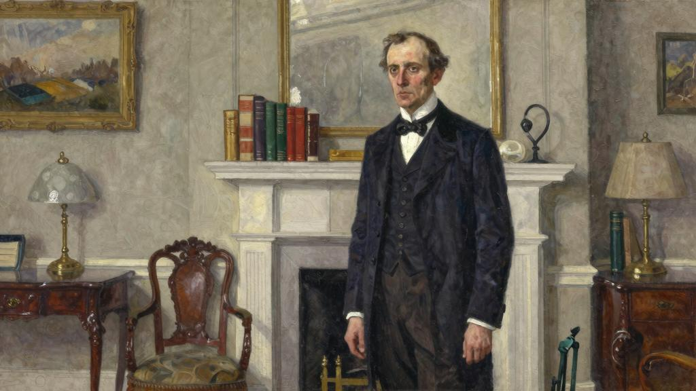
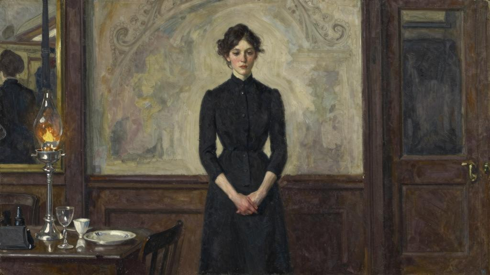
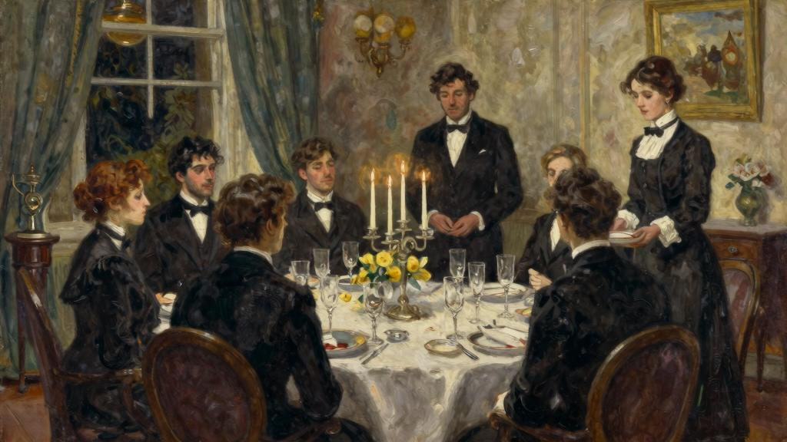
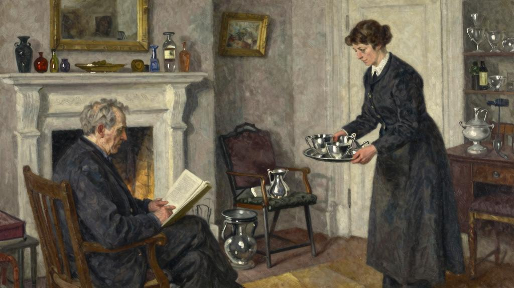

查德·哈伦杰是个幸福的人。从《传道书》[33]开始，不管悲观主义者他们怎么说，其实在这个不尽如人意的世界里，幸福的人不在少数。但查德·哈伦杰能感觉到自己是幸福的，这就稀奇了。古人推崇的中庸之道已经过时，很多人不再认为自我约束是一种美德，也不再相信常识能有什么价值，因此恪守中庸之道的人总要承受他们貌似客气的嘲讽。面对这些嘲讽，查德·哈伦杰只是礼貌地耸耸肩，一笑了之。就让他们在不测之渊中生活吧，让他们像宝石般燃烧吧，让他们在纸牌的轮回往复中孤注一掷，行走在通往荣耀或是坟墓的钢索上，或是为了一番事业、一腔激情、一次冒险赌上身家性命吧。他既不眼红那些人的壮举所带来的功成名就，也不为那些人的功亏一篑而浪费自己的同情心。但也绝不能由此断定查德·哈伦杰是个自私自利、铁石心肠的人。实际上，他既不自私自利，也不是铁石心肠。他为人细心周全、慷慨大方，向来愿意为朋友慷慨解囊，也因为家底殷实，所以能尽情享受行善的乐趣。他自己有点小钱，再加上在内政部供职，还能有一笔丰厚的固定收入。这份工作倒挺适合他：按点上下班、稳定可靠、轻松愉快。每天下班后他都要去俱乐部打上两个小时的桥牌，到了周六周天就去打高尔夫。假期则出国旅行，住高档酒店，参观教堂、艺术馆和博物馆。碰上戏剧要首演，他会时常出席，还会去餐厅用餐。因为和他很能谈得来，朋友他们也都喜欢他。他阅读广泛、知识渊博且幽默风趣。此外他的外表也是风度翩翩，虽称不上一表人才，但身形修长、姿态挺拔、脸型瘦削，看上去聪敏机智。因为年近半百，所以他的头发有些稀疏了，但一双棕色眼睛依旧是炯炯有神，一口牙齿也都还健全。他生来就体格健硕，平时也注重保养。要说他不幸福，这世上还真没这个道。如果说他有那么一丝沾沾自喜，那他也会说，他受之无愧。

他运气也不错，能一帆风顺地渡过危机四伏、波涛汹涌的婚姻之海，而多少睿智正派的好男儿都在海里翻了船。才二十出头，他就和妻子结婚了，俩人在经历了几年几

乎美满幸福的婚姻后，也渐行渐远。但他们都不打算再婚，因此也不曾想过离婚（事实上离婚会给查德·哈伦杰在政府供职带来不良影响），但为了方便起见，他们在家庭律师的协调下分居了，这么一来，俩人都可以随心所欲地生活而不受对方的干扰。分手的时候也表达了对彼此的祝福和敬意。

查德·哈伦杰把他在圣约翰伍德的房子卖了，然后买了一套公寓，从那里步行就能到白厅。他的起居室里陈列了很多书籍，餐厅的构造与那套齐彭代尔家具相得益彰，卧室大小合适，正适合他一个人睡，厨房的另一头是两个女仆的房间。他带上了在圣约翰伍德跟了自己很多年的厨师，但因为不再需要那么多人服侍，就辞退了其余的佣人，去职业介绍所要求只雇一位客厅女仆。他十分清楚自己想要找一个什么样的人，因此向介绍所的负责人描述得很精确。他要找的女仆不能太年轻，一来是因为小姑娘往往不够稳重，二来是因为他是个中年男子，有自己坚守的原则，即便是大家不在背后议论，门房和来往的商人也有闲话。为了自己和小姑娘的声誉着想，他认为应聘的人务必有一定年龄，为人处世都要严谨。再者，他要找一位擅长清洗银器的女仆。查德一直对旧银器情有独钟，要是你的叉子和勺子安妮女王时期的贵妇使用过，那要求女仆在清洗的时候毕恭毕敬、轻手轻脚，不算过分吧？他还生性好客，每周会至少举办一次小型晚宴，邀请四到八位宾客。他相信自己的厨师能让客人们尽享口腹之乐，因此也希望她的女仆在侍餐的时候干净整洁、手脚麻利。查德·哈伦杰要找的女仆还要充分胜任男仆的工作。他自己穿着很讲究，不仅要符合年龄还要和身份相匹配，因此他希望他的衣物能有人精心打，那这位女仆必须得会熨烫裤子和领带，也能把鞋子擦得锃亮。他的脚偏小，要想买到剪裁精致的鞋子得费不少工夫，他还要求他那堆鞋子都要在离脚的时候就马上用楦子撑上。最后一点，公寓必须保持整洁。不消说，应聘者必须具备无可指摘的品格，沉稳、老实、可靠、落落大方这些都是少不了的。反过来，他也会给他们提供丰厚的报酬、合的自由以及充沛的假期。职介所的主管目不转睛地听着，然后拍着胸脯向他保证，一定为他觅得一位称心的女仆，随后便安排一行人前去应聘。但事实证明，他说的话主管一个字也没听进去。查德·哈伦杰亲自考察了这些人，发现有些应聘者明显能力不足，有些毛毛躁躁，有的岁数太大，有些又太年轻，也缺乏他认为相当重要的气质。总之，里面没有一个人是他愿意试用的。不过查德·哈伦杰是位彬彬有礼的

绅士，在拒绝这些应聘者时他都会面带微笑，向他们表示自己的错失良人的遗憾，以宽慰他们。他一直很耐心，也打算一直面试下去，直到找到合适的女仆。

生活就是这么有意思，如果你坚持宁缺毋滥，那你通常都能如愿以偿；如果你决不敷衍将就，那你总有办法心想事成。就好像命运女神在说，这男人真是个十足的呆子，居然妄想尽善尽美，说罢这任性的女人便不折不扣地满足了他的全部心愿。有一天，公寓的门房突然告知查德·哈伦杰：

“先生，我听说您在招客厅女仆，我这儿有个人想找份这样的工作，可能会适合您。”

“你能亲自介绍一下她吗？”

查德·哈伦杰有个观点挺有道，那就是佣人间的介绍比雇主的介绍更有参考价值。

“我可以为她的品行打包票，她之前干过几份工作，都干得不错。”

“我大概七点会回来换衣服，如果她那时候方便的话，我倒可以见见她。”

查德·哈伦杰回家还不到五分钟，厨师就听到前门传来的门铃声，于是前去开门，随后进来告诉他：门房说过的那个人来了。

“领她进来吧。”他说道。

他又打开了几盏灯以便自己能看清应聘者的长相，然后起身背对着壁炉等着。一位女士走了进来，恭恭敬敬地站在门框里。

“晚上好。”查德·哈伦杰问候道，“该怎么称呼你呢？”

“普里查德，先生。”

“今年贵庚啊？”

“三十五了，先生。”

“挺好，这个年龄倒挺合适的。”

他抽了一口烟，若有所思地打量着这位女士。她个头挺高，几乎赶上自己了，不过他想这大概是因为她穿了高跟鞋的缘故。一身的黑裙子很合她的身份，人站得笔直，五官也端正，气色也还不错。

“你能脱掉帽子吗？”查德问道。

这位女士脱掉了帽子。他看到她那一头淡棕色的头发，梳得整齐大方。整个人不胖不瘦，看上去健康强壮，要是穿上合身的工作服，应该也是有模有样的。她虽称不上漂亮，但还算标致，没准在其他阶层中，她还是个美人呢。接着，查德·哈伦杰又问了几个问题，回答都令他很满意。她上一次离职的由相当充分，之前又是在一位男管家的手下接受训练的，因此看起来她对自己职责范围内的事情都是驾轻就熟的。在上一位雇主家，她是三位客厅女仆的领班，但现在她不介意一人打这个公寓。她还给一位绅士干过贴身女仆的活儿，那时还被送到裁缝那儿学怎么熨烫衣物。她有那么一点害羞，但算不上腼腆或者不自在。查德问她问题的时候态度和蔼从容，而她回答的时候也是镇定自若、谦和有礼，给他留下了深刻的印象。他又问有没有带介绍信过来。看过之后，查德也极为满意。

“这么说吧。”他说道，“我很愿意雇用你。但我不喜欢有变化，我的厨师跟我也有十二年了，如果你合我心意，这个工作环境也适合你，我希望你能留下来。我的意思是，我可不想三四个月后你过来告诉我你要离职去结婚了。”

“这您不用担心，先生，我是个寡妇。而且像我这种地位的女人，结婚不是什么好归宿。自打结婚以后，我丈夫一点活儿都不干，全靠我养着他。现在我只盼望着有个舒心的家。”

“我倒是很同意你的观点。”他笑了笑，“婚姻是挺不错的，但总结婚就不是好事了。”

她的反应非常得体，没有接话，只是等待他宣布决定，看上去一点也不心急。查德盘算着，如果她真的像看起来那样能力出众，那她也清楚自己不愁找不到雇主。他告诉她自己愿意提供的薪酬后，对方似乎也挺满意。他又介绍了一下这套公寓的基本信息，但她好像已经有所了解了。普里查德在应聘的时候显然对他做过一些调查，这一点不仅不让他反感，反而让他很欣赏。这足以表明，她本是一个谨慎智之人。

“如果我录用你，你什么时候能过来上班？我现在一个人手都没有，现在是厨师在尽力打这些杂务，我呢也想尽快安顿下来。”

“这样的话，先生，我本想给自己放一个礼拜的假，但如果能为您这样的绅士效劳，我也不介意放弃假期。要是方便，我明天就可以过来。”

查德·哈伦杰露出迷人的微笑。

“我想这个假期你已经盼了很久了，我不能坏了你的好事。我再等一个礼拜也没事，你就去度你的假吧，假期结束了再过来。”

“那太感谢您了，先生，那我就从今天算起，第八天的时候再过来上班，您看行吗？”

“很好。”

普里查德走后，查德·哈伦杰觉得这一天的工作做得挺好，似乎已经找到自己中意的女仆了，于是摇铃叫来了厨师，告诉她自己终于找好客厅女仆了。

“我想您会喜欢她的，先生。”厨师说道，“她今天下午过来时和我聊了一会，我一眼就看出来，她是那种知道自己职责所在的人，不像是不安分的人。”

“那我们就拭目以待了，洁迪太太。我想你没有把我说得太不堪吧。”

“这个嘛，我说您要求高，是位喜欢做事到位的绅士。”

“这点我承认。”

“她说她不介意这个，她说她就喜欢能分辨好坏的人，要是自己把事情做得很到位，但没有人注意到，那就没有成就感了。您到时候一定会发现，她会对自己所做的工作感到自豪。”

“我想要的正是这个。我想我们再找下去也不见得会找到更好的。”

“是的，先生，当然是这样。布丁好不好吃，一试便知。依我看，她会是个称职的帮手。”

事实证明，普里查德正是料家务的能手。还没有人能像查德一样享受到她这样的服务。她能把鞋子擦得锃亮，让你觉得不可思议。在某个阳光明媚的早晨，查德·哈伦杰步行去办公室的步伐都比往常要轻快许多，因为他的鞋面干净得能看到自己的倒影。她把他的衣物也打得很细致，以至于同事他们都开他的玩笑，说他是穿得最好看的公务员。有一天，他回家很突然，看到卫生间里晾了一排的袜子和手帕，就叫来了普里查德。

“是你亲自洗了我的袜子和手帕吗，普里查德？我想你完全没有必要做这事啊。”

“洗衣房会洗坏的，先生。如果您没有异议的话，我还是想在家里洗。”

查德·哈伦杰在什么场合要穿什么衣服，她也知道得一清二楚，都无须请示，就明白应该拿出餐服佩黑领带，还是燕尾服佩白领带。当查德·哈伦杰要出席某个聚会，展示荣誉的时候，他会发现自己的翻领上已经自动别上了一排整齐的勋章。很快，他也不会每天早晨去衣柜里挑选他当天想打的领带了，因为他发现普里查德每次摆出来的领带都与他心里想要的不谋而合。她的品位简直是无可指摘。他想普里查德应该会读他的信，因为她总能知道他的活动行程，如果他忘了自己要参加的某个活动的时间，都不用查笔记本，问普里查德就行了。对于在电话里和什么样的人说话用什么样的语气这

一点，她心里也一清二楚。除了和商店老板说话有些不依不饶以外，她还是谦恭有礼的。但要是和哈伦杰先生的某位文学界朋友或是内阁大臣的妻子说话，还是能看出她态度上明显的不同。她几乎是下意识地就知道查德愿意接谁的电话。有时候，查德坐在客厅里就能听到她告知来电者查德先生已经外出了，语气平静且信誓旦旦。挂了电话后，她会进来告诉查德·哈伦杰某某某打过电话了，但她觉得他肯定不想被打扰，就替他回绝了。

“做得好，普里查德。”他冲她笑了笑。

“我知道她只想用音乐会的事来叨扰您。”普里查德说道。

查德的朋友他们要和他见面都得通过她预约时间。晚上他回家的时候，普里查德再告知他替他所做的安排。

“索莫斯太太来过电话了，先生，她想问您周四，也就是八号，能否和她共进午餐。我说很遗憾，您那天中午已经约了维新德夫人。奥克利先生也打过电话来，问您下周六是否能出席在萨沃伊酒店举办的一个鸡尾酒会，我说您要是能抽得出时间就去，因为您那天可能要去看牙医。”

“做得不错。”

“我觉得您到时候再看情况就行，先生。”

她把整个公寓收拾得干干净净。才到岗没多久，有一次查德度假回来了，他去书架拿书，立马就注意到了这些书被除过尘了，于是摇铃把普里查德叫了过来。

“我忘了告诉你，我不在的时候绝对不能碰我的书。每回我的书除过尘后，都归不到原处。我倒不介意书落灰，但找不到它们我很烦。”

“很抱歉，先生。”普里查德说道，“我知道有些绅士对这事很细致，所以我留了个心，把每本书都放回了原处。”

查德·哈伦杰扫了一眼他的书，在目之所及的地方，发现每本书都原封不动地摆放在原来的地方，于是舒心一笑。

“我要向你道歉，普里查德。”

“它们都脏兮兮的，先生。我的意思是，每次翻书后，您都要沾上一手的灰。”

当然了，她能把银器擦得焕然一新，从未有过的新。查德觉得有必要特意夸她一句。

“你也知道，大多数的银器都是安妮女王和乔治一世时期的。”查德解释道。

“是的，先生，我知道。有这样的宝贝，尽可能把它们打好，这是件让人高兴的事。”

“你肯定有什么清洗银器的小窍门。我还没见过有哪位男管家能把银器打得这么干净。”

“男人不像女人那么耐心。”她回答得很谦逊。

查德以前喜欢每周举办一次小型的晚宴，等他觉得普里查德差不多安顿下来之后，就想继续举办。他已经发现，她不仅懂得侍奉餐饮，而且能将一个聚会安排得井井有条，他更是感到温暖和满足。普里查德动作麻利，从不多话，而且很有眼色。没等客人意识到自己需要什么，她就已经把东西递到手边了。很快，她就掌握了他那些老交情的口味，记住了一位喜欢在威士忌里加水而不是苏打，还有一位尤其喜欢羊腿的下部。

她还一清二楚地知道，肘子应该放多凉才不会影响口感，红酒应该醒多久才能释放出酒香。她能倒出一瓶勃艮第而不带出任何沉淀，看她露这一手简直是一种享受。有一次，她没有呈上查德指名要的红酒，于是后者便有些严厉地质问了她。

“先生，那瓶酒打开之后有一点木塞味，所以我换了香贝坦红酒，这样放心一些。”

“做得很好，普里查德。”

没过多久，查德就把挑酒的事都交给了普里查德，因为他发现，她对客人们喜欢什么样的酒了如指掌。如果家里来了懂酒的客人，无须查德的吩咐，她就能呈上酒窖中最上乘的好酒和珍藏最久的白兰地。但她对女人的味觉却没什么信心，因此但凡聚会上有女性在场，她就会拿出即将过期的香槟来招待她们。她有着英国仆人的直觉，能一眼辨出尊卑上下，不会将高贵的头衔和万贯的家产与真正的绅士等量齐观。查德的朋友里也有几位尤其合她心意，每当他们过来用餐时，她都会拿出哈伦杰为特殊场合珍藏的酒，然后为他们斟上一杯，那模样活像吞了一只金丝雀的猫儿，心满意足的。查德觉得实在有趣。

“你可真是会讨普里查德的欢心啊，老兄。”他惊呼道，“还没有几个人能让她拿出这瓶酒呢。”

没过多久，普里查德就显身扬名了，被誉为完美的客厅女佣。哈伦杰最让人眼红的不是别的，而是他这位得力的帮手。据称她的身价被炒到跟她一样重量的黄金，甚至比红宝石还要贵重。当客人们对她赞不绝口时，查德·哈伦杰笑得满面春风。

“有良主自有良仆。”他笑容可掬地回应道。

一天晚上，他们坐着一起喝着波特酒，恰巧普里查德走出了房间，于是便在背后议论起她来。

“要是哪天她离开了，对你定是沉重的打击。”

“她为什么要走？确实有一两个人想挖走她，但她都拒绝了，哪里待遇好，她可清楚得很。”

“总有一天她要结婚的嘛。”

“我觉得她不是那种女人。”

“可她长得挺好看的。”

“不错，是有几分端庄。”

“你这说的什么话？她可是个美人坯子。要是有点身份地位的话，肯定会在社交圈名声大噪的，那时各大报纸刊物都会抢着登她的照片。”

这时普里查德端着咖啡进来了，查德细细地打量着她。每天与她抬头不见低头见的，竟也有四年了——天哪，真是光阴似箭啊——要不是面对面，还真想不起她长什么样。她似乎和第一回见面时没什么两样，身材未见发福，气色也不减当年，五官端正，神情还是那样，既专注又茫然。一身黑色工作服十分合身。放下咖啡后，普里查德便又退下了。

“毫无疑问，她就是个典范。”

“我知道。”哈伦杰回答道，“她是无可挑剔的，要是没有她，我还真不知道该怎么办。但奇怪的是，我不怎么喜欢她。”

“为什么？”

“我觉得她有点无聊。你看，她从不聊天，我试着和她说过几次话，但她也只是有人问必答，仅此而已。四年来，她从来没有主动发表过意见，因此我对她一无所知。我不知道她是不是喜欢我，还是只是把我当成雇主，对我满不在乎。她就是一个冷冰冰的机器人。我尊敬她、感激她、信任她，她集世间优良品德于一身。但我也时常在想，为什么眼前有这么一位尽善尽美的人，我对她却始终没什么好感。我想可能她一点魅力都没有吧。”

大家都不接话。

两三天后，轮到普里查德晚上休假，哈伦杰又没什么安排，就一个人在俱乐部里用餐了。这时一个小听差过来告诉他，公寓打电话过来了，说他出门没带钥匙，是否要

派人打车过来送钥匙。哈伦杰摸了摸口袋，确实是没带钥匙。不知怎么地，他出门时竟忘了将钥匙放到这身哔叽西服里了。他本想打桥牌的，但今天俱乐部有点冷清，没什么好玩的。这时他突然想到有一部电影口碑还不错，正好去看看，于是打发小听差去回话，半个小时后自己会回家拿钥匙。

到公寓后，他按了门铃，给他开门的是普里查德，只见她手上拿着钥匙。

“你在家做什么，普里查德？”他问，“今晚不是你休假吗？”

“没错，先生，但我不怎么想出门，所以就让洁迪太太出去放松一下。”

“有这个机会，还是要出门走一走的。”他像往常一般关切地说道，“整天闷在家里对你不好。”

“我有时会出门办点事，但已经有一个月晚上没出门了。”

“为什么不出去？”

“哎，一个人出门总是没什么劲头，现在我认识的人里头，也想不出特别想跟谁出去。”

“那你也要时常给自己找点乐子，这对你有好处。”

“不知怎的，我现在也没这个习惯。”

“你看，我现在正要去电影院，你愿不愿意和我一块去。”

他说这个完全是出于好意，但话刚说出口，就有些后悔了。

“好啊，先生，我很愿意。”普里查德回答。

“那赶紧收拾一下，把帽子也戴上。”

“马上就好。”

说着普里查德便走开了。哈伦杰则走进客厅，点上一支雪茄。对自己的行为他颇为自得，也很高兴：毕竟不费吹灰之力，就能让人快活，这种感觉不错。普里查德还是那副做派，既不诧异也不犹豫。等了大约五分钟，她收拾好了。哈伦杰发现，她竟换上了一条蓝色的连衣裙，料子应该是人造丝绸，戴了一顶黑色帽子，上面别着一个蓝色的饰针，脖子上还系了一条银狐毛皮。看她打扮得既不寒酸又不张扬，他稍稍松了口气。

碰到他们的人一定想不到，这居然是内政厅的高官和女仆出来看电影。

“抱歉，先生，让您久等了。”

“不碍事的。”他亲切地说道。

他为普里查德开了门，让女士优先。这时他想起了路易十四和朝臣那些耳熟能详的轶事[34]，不由得赞赏起她的果断。他们要去的影院离哈伦杰的公寓不是很远，因此俩人便步行前去。一路上哈伦杰对天气、路况和阿道夫·希特勒侃侃而谈，普里查德则适时地做出回应。到电影院的时候，《米奇老鼠》刚好开始，他们看得非常开心。四年来，查德·哈伦杰还没见她笑过，现在听到普里查德一阵阵欢快的笑声，他感到心满意足。她的快乐就是他的幸福。接下来要正式放映影片了。这部电影不错，俩人都兴奋地屏住呼吸，盯着屏幕。不一会儿哈伦杰拿出了烟盒，下意识地递给了普里查德。

“谢谢你，先生。”说罢，她拿了一支出来。

查德给她点了烟。普里查德的眼睛紧紧地盯着屏幕，完全意识不到自己的这一举动。电影结束后，他们随着人流走到街上，然后朝着公寓走去。夜空中繁星闪烁。

“你喜欢这部电影吗？”查德问。

“很喜欢，先生，今天真是大饱眼福了。”

突然他闪过了一个念头。

“说起来，你晚饭吃了吗？”

“没有呢，先生，没来得及吃。”

“那你现在饿吗？”

“一会儿到家我吃点面包和奶油，再喝杯可可。”

“这也太将就了。”

空气中洋溢着喜庆欢乐的气氛，周围来来往往的路人似乎都喜气洋洋的。一不做二不休，查德心里这样想着：“这样吧，你愿不愿意和我找个地方吃晚饭？”

“听你的，先生。”

“那来吧。”

他拦下一辆出租车。此刻查德觉得自己善心大发，他对这种感觉很受用。他告诉司机去牛津街的一家餐馆，那里气氛欢快，而且一定不会遇见什么熟人。餐馆里还会有乐队以及跳舞的人，普里查德肯定会喜欢的。他们就座后，服务员就走过来了。

“他们这儿晚上会有套餐。”他一边说，一边想着普里查德应该会喜欢的，“我建议我们就吃这个。你要喝点什么？来点白葡萄酒？”

“我其实想喝一杯姜啤。”她说道。

查德·哈伦杰给自己点了一杯加了苏打水的威士忌。哈伦杰虽然不饿，但看普里查德吃得津津有味，便也应景陪她吃了一点。刚刚看完的电影倒成了很好的谈资。那天晚上他们说得没错，普里查德长得是不错，即便有人撞见他们在一起吃饭，他也不会介意。要是跟朋友他们说自己带着这位大名鼎鼎的普里查德去看了电影，之后又吃了晚餐，肯定会引起轰动。普里查德看着这些舞者，嘴角浮现出一丝笑意。

“喜欢跳舞吗？”查德问她。

“我年轻的时候跳得很好，结婚之后就不怎么跳了。我丈夫个头比我小一点，可不知怎么的，我认为舞伴的身高要比我高些看上去才协调，不知道你懂不懂我的意思。我想我很快就要跳不动了。”

查德肯定比这位客厅女仆高一点，他俩要是一块跳舞会很合拍。他自己也喜欢跳舞，而且水平不差。但他犹豫了。他怕冒昧地邀请普里查德跳舞，会使她尴尬。还是不要失了分寸的好。但这又有什么要紧呢？她的生活单调乏味，况且她又这么明白事，要是她觉得不合规矩，肯定会找出一个得体的由拒绝。

“想不想跳上一支，普里查德？”趁着乐队再次奏起的时候，他问道。

“我可是好久没跳过了，先生。”

“这有什么。”

“要是您不嫌弃的话，先生。”她从容地回答着，然后站起身来。

她一点都不害羞，唯一担心的就是跟不上查德的节拍。走到了舞池，查德发现她跳得相当好。

“呀，你跳得可真是太好了，普里查德。”他说道。

“我慢慢地找着感觉了。”

普里查德虽然块头不小，但舞步却很轻盈，而且有与生俱来的节奏感，和她跳舞确实很享受。查德瞄了一眼墙上的镜子，不由得想他俩看上去真是琴瑟和鸣啊。这时他们的目光在镜中交会，他在琢磨，普里查德是不是也作如是观。又跳了两支舞后，查德·哈伦杰提出时候不早了，该回去了。他结完账然后俩人走出饭店。他注意到，她穿过人群时很是自然，丝毫不露扭捏窘迫之态。接着他们上了一辆出租车，十分钟后便到家了。

“我就从后门进去吧，先生。”普里查德说道。

“没有这个必要，你就和我一起搭电梯上去吧。”

他带着她上了楼，哈伦杰朝着夜间值班的门房冷冷地瞥了一眼，表明自己和女仆这么晚才回家没什么大不了的。到公寓门口后，他取出弹簧锁钥匙，俩人便进了门。

“好了，晚安了，先生。”她说道，“真是太谢谢你了，今晚真的很开心。”

“也要谢谢你，普里查德。要不是你，我今晚一个人肯定很无聊。希望你喜欢这次外出。”

“我很喜欢，先生，说不出有多喜欢了。”

今晚真是收获颇丰，查德·哈伦杰感觉十分怡然自得，他觉得自己的所作所为是一大善举，能让别人切实地感受到快乐竟令他如此称心快意。这份善意似一股暖流，让他心里暖融融的。有那么一瞬间，他对整个人类都充满了爱。

“晚安，普里查德。”他说道。今天他满心欢喜，兴致勃勃，于是顺势搂住了普里查德的腰，吻上了她的唇。

她的嘴唇很柔软，先是在他的唇上停留了一会儿，才回吻了他。这是一位身体健康且正值韶华的女子，她的拥抱是那么温暖、熨帖。这种感觉真是让人心醉神怡，于是查德将她抱得更紧了，而普里查德也将手臂围上了他的脖子。

要在平时，普里查德端着信件走进房间时他才会醒来，但第二天早上，他七点半就醒了，而且心头涌上一种异样的感觉，让他摸不着头脑。他习惯垫着两个枕头睡觉，但他突然发现自己只垫了一个。接着，像是突然想起什么似的，他惊恐地往边上一瞧。

还好，另一个枕头就在自己边上，没人枕在上面，真是谢天谢地！但仔细一瞧，不好！

显然有人睡过。他心里猛地一沉，冷汗直冒。

“我的天啊，我真是个蠢货。”他大声嚎叫。

他怎么能干这种蠢事呢？他是吃错什么药了？和女仆他们纠缠不清？他查德绝对不是这样的人！都这把岁数了，还是有头有脸的人物，做出这种事真是太失脸面了！早上没听到普里查德悄悄溜出去的声音，想必自己肯定睡得很沉。他算不上很喜欢她，她也不是他喜欢的类型。相反，正如他那天晚上说的，他觉得普里查德很无趣。到目前为止，他只知道她姓普里查德，至于叫什么名字，他并不清楚。这算什么事啊！现在可怎么办呢？已经没有回旋的余地了，显然是不能再留用她了。可这事俩人都有错，但到头来要打发她走人，对她也极不公正。因为一时糊涂，就失去了世间最好的女仆，实在是愚蠢至极！

“都是我这该死的善心。”他嘟囔着。

他再也找不到像她这样的女仆，能将衣物打得纹丝不乱，能将银器擦洗得锃亮可鉴。她能记住他所有朋友的电话号码，也很懂红酒。但不管怎么说，她是必走无疑的。想必她自己也清楚，发生这样的事之后，就再也回不到以前了。他会送她一份大礼，再给她写一封极好的介绍信。眼下她随时都会进来。进来时她会不会故意撒娇，跟他亲昵，还是拿腔作势？没准儿她都懒得给他送信了。要是他摇铃之后进来的是洁迪太太，并且告诉他：普里查德还没起床，昨晚发生了那种事，她今天要好好睡一觉。那就真坏事了。

“我怎么就那么蠢。真是个可耻的流氓。”

这时传来了敲门声。因为刚才太过焦虑，他觉得有点晕乎乎的。

“进来吧。”

查德·哈伦杰此刻真是霉运当头啊。

普里查德进门的时候闹钟刚好响了。她还是像每天早上一样，穿着条印花裙子。

“早上好，先生。”她说。

“早上好。”

拉开窗帘后，她将信和报纸一并递给他。她的脸看上去还是冷冰冰的，和以前没什么两样。动作也像以前一样细致能干。她既不回避查德的眼神，也不刻意与他对视。

“今天穿这件灰色的吗，先生？昨天裁缝店刚送回来的。”

“好的。”

他假装看信，但一直抬眼悄悄观察着普里查德。她背对着他，将他的马甲和衬裤叠好放在椅子上，又把昨天穿过的那件衬衣上的饰纽取下来，别到一件干净的衬衣上，再拿出一双干净的袜子放到椅子上，边上还摆好了配套的吊袜带。接着她拿出那套灰色西装，把背带扣在裤腰上。随后她打开衣橱，思索片刻后，选了一条配套的领带。最后，普里查德将他昨天穿过的西服收拾好挂在自己的手臂上，然后提起了他的鞋。

“您现在要用早餐吗，先生？还是您想先洗个澡？”

“我先吃早餐吧。”他回答。

“好的，先生。”

她走出了房间，动作还是那么轻巧从容，神情依旧是那般严肃、恭敬乃至茫然。

说不定昨晚的事就是一场梦罢了。从普里查德的言谈举止中，也丝毫看不出她对昨晚的事有什么印象。他松了一口气，没事就好，这下她不用走了，不用走了……普里查德确实是一位无可指摘的女仆。查德心里明白，她是绝不会通过言行来暗示，他们之间除了主仆关系，还有过别的什么。查德·哈伦杰真乃大福之人。

记《月亮和六便士》《人生的枷锁》等长篇小说闻名于世的英国作家毛姆在短篇小说创作上也是一流的。一九五一年，他亲自甄选九十一篇精品佳作，汇集为三大卷本《短篇小说全集》。一九六三年，英国企鹅出版公司将其作为四大卷本重新刊印。三年前的一天，著名翻译家吴建国教授告诉我，九久读书人有意将该《短篇小说全集》翻译出版，问我有无兴趣和勇气牵头，尽快组织人员做成这件事。我二话没说，非常爽快地答应下来，根本没有充分考虑可能会遇到的各种困难。

众所周知，毛姆的短篇小说大体可分为三种类型：欧美为背景的“西方故事”，南太平洋、东南亚和中国、印度等为背景的“东方故事”及“阿申登间谍故事”。这些故事：1）内容源于生活又高于生活。既能满足读者的猎奇心理，激发其心灵共鸣，也能帮助读者认识历史原貌，感悟人生；2）语言谐谑风趣，寓庄于谐，就连讥诮、讽刺也不乏幽默感，意味深长；3）半数上采用了第一人称讲述，亲切自然，仿佛在和家人及朋友他们闲聊社会各个阶层的世情风貌和生活姿态；4）具有一种愤世嫉俗、悲天悯人的基调，人情味浓郁，道德意义深刻，而且结局出人意料，非常契合普通读者的心理诉求和审美品位。掩卷之余，令人难忘怀。迄今为止，不仅在欧美各国一版再版，而且被翻译成多种文字，在世界各地广为流传。

我们本次翻译任务所恪守的一个总原则可用四个字来概括：达信兼备。所谓“达”，意思是译文语言须符合汉语的“语文习惯”。用钱钟书先生的话来讲就是，译文语言“不因（英汉[35]）语文习惯的差异而露出生硬牵强的痕迹”。所谓“信”：一是译文语义“不倍原文”；二是译文语效与原文相同或相似。用钱钟书先生的话来讲就是，尽量“完全保存原作风味”。实话说，译文语义“不倍原文”，做到这一点不是太难；难就难在使得“译文语效与原文相同或相似”，其前提自然是译文语言须符合汉语的“语文习惯”。众所周知，毛姆的短篇小说语言清新流畅、简洁朴实、诙谐幽默、通俗易懂，鲜有诘屈聱牙的辞藻堆砌及艰涩难懂的句法结构，可读性极强。这也是他能够拥有众多

读者的重要原因。这就是说，若要译好毛姆的短篇小说，就必须全力保存其语言风格，即要在译文语义“不倍原文”、译文语言须符合汉语“语文习惯”的同时，尽最大努力实现“译文语效与原文相同或相似”。

值得一提的是，我们经过反复讨论，最后决定将英国企鹅四卷本《毛姆短篇小说全集》拆分成7册，其中第一卷拆分成第1—2册；第二卷拆分成第3—4册；第三卷不作拆分，为第5册；第四卷拆分成第6—7册。而且，我们将每一册都加命名。我本人主译第1册《雨》，邀请哈尔滨工业大学齐桂芹副教授主译第2册《狮子的外衣》，山东大学赵巍教授主译第3册《带伤疤的男人》，上海海事大学青年教师李佳韵和才女董明志女士主译第4册《丛林里的脚印》，上海交通大学王越西教授主译第5册《英国特工》，上海电机学院李和庆教授主译第6册《贪食忘忧果的人》，上海海事大学吴建国教授主译第7册《一位绅士的画像》。

最后，请允许我借此机会表示我由衷的谢意。首先，感谢九久读书人和人民文学出版社，感谢他们“为人作嫁衣”的奉献精神，感谢他们“吹毛求疵”的敬业精神。第二，感谢各位译者，感谢他们不畏艰难的笔耕，及他们的家人所给予的莫大支持。最后，衷心感谢作为读者的您，如蒙批评指正，我和各位译者将倍感荣幸！

薄振杰2020年3月

[1]出《道林·格雷的画像》第二章。

[2]原文为The Vessel of Wrath，字面意思为“愤怒之器”。出自《圣经》，指上帝愤怒之下造出的某些人注定要受到惩罚、遭到毁灭。

[3]英里（miles），英制长度单位。1英里≈1.61公里。

[4]约等于1.63米。

[5]巴汝衣（baju），一种无领长袖衫，马来西亚男子传统服装是上穿巴汝，下身围布质纱笼。

[6]等于摄氏40度。

[7]巴兰（Balaam），《圣经》中的先知，被请去诅咒以色列人，路上驴子三次提醒他耶和华的使者在路上，被巴兰鞭打，后来巴兰发现了使者，听从耶和华指示，转而祝福了以色列人。

[8]《异邦谷田》（Alien Corn），出自济慈的诗《夜莺颂》。诗中描写《圣经》人物路得在丈夫死后跟随婆婆回到以色列，在“异邦的谷田中落泪”。

[9]米里亚姆（Miriam），犹太人的名字，穆丽尔（Muriel）则源自凯尔特。

[10]零差点（scratch），高尔夫球中的选手等级以“差点”表示，即高于标准杆多少杆。“零差点”形容一位高尔夫球手达到了顶尖水平。

[11]豆宴（Beano），英国乡下雇主一年一度招待雇工的宴会，因席间必有熏肉豆子拼盘，故名。

[12]帕岱莱夫斯基（Ignacy Paderewski，1860—1941），波兰钢琴家、作曲家、政治家，19世纪末曾在美国巡演，广受欢迎。一战期间致力于波兰独立运动，1919年一度出任新波兰的首任总理。

[13]指罗马尼亚国王卡罗尔二世（Carol II，1893—1953）两次为情人放弃继承权。

[14]牛津裤（Oxford Bags），踝部特别宽大的裤子，20世纪20年代流行一时。

[15]原文为德：du，“你”的主格形式。

[16]配制酒（Synthetic gin），在美国禁酒时期（1920—1933），大部分酒精饮料是地下工厂用蒸馏法提取乙醇之后合成的，口感极差。

[17]马颈轭（horse-collar），指英国旧时一种游戏。大多在酒吧外，众人轮流将脸探出马轭做鬼脸，以表情最夸张者为胜。

[18]莫里哀（Moliere），法国作家，他常把自己的剧作读给厨师听。

[19]圣塞巴斯蒂安（San Sebastian，256—288），基督教殉教士，在绘画艺术中常被描绘成带有阴柔之美的俊秀少年。

[20]威灵顿公爵（Duke of Wellington），英国陆军元帅、首相，以在滑铁卢战役中指挥英普联军击败拿破仑而闻名，有“铁公爵”之称，他鼻子非常大。

[21]阿尔伯特·福里斯特夫人模仿莎士比亚的名句“生存还是毁灭，这是个问题”。

[22]草莓叶（strawberry leaves），英国贵族按一定规格，用冠饰上草莓叶的多少代表身份高低。

[23]原文为拉丁。恺撒被共和派刺死时，发现好友布鲁图也在其列，不由得感慨道：“连你也（背叛我），布鲁图。”这句话由此广为流传。

[24]出自《哈姆雷特》。全剧开场时，两个守卫换班，其中一人终于不用忍受天寒地冻，对另一位说了这句话。

[25]《高档出租马车悬疑案》（The Mystery of a Handsom Cab），英国作家福格斯·休莫（FergusHume）的一本悬疑小说，被约翰·萨瑟兰（John Sutherland）称为“20世纪最轰动的探案悬疑小说”。据称柯南·道尔创造福尔摩斯的灵感便来源于此。

[26]此处引用的是叶芝的诗《茵尼斯弗利岛》。

[27]原意是指很多圣歌用的是流行的、非宗教的旋律，一般认为最早说这句话的是英国传教士罗兰·希尔（Rowland Hill，1744—1833）。

[28]盖里（Gerry），杰拉尔德的亲昵称法。

[29]原话一般认为是拿破仑所说。威灵顿指的是在滑铁卢大败拿破仑的威灵顿公爵。

[30]传说埃及艳后克娄巴特拉与罗马将军安东尼打赌，说她一顿饭可以花掉1000万塞斯特斯币。她取胜的办法是将自己的珍珠耳环丢在一杯醋里，待其溶化后一饮而尽。

[31]白色凉船（white cool ship），是内置了通风管道，可以让海风流通于客舱中的船。这种最初级的“空调”设备在当时被宣传为“让海变凉”（Sea-cooling）。

[32]西班牙海（Spanish Main），大致从巴拿马地峡到奥利诺科河三角洲之间的南美洲北海岸，在西班牙控制年代有此称呼。

[33]《传道书》（Ecclesiastes），一般认为是由所罗门作于公元前10世纪左右。其中一个重要的主题是“日光之下一切皆虚空，皆捕风”。

[34]指路易十四参加典礼前召唤某侍臣，正欲动身时侍臣恰好赶到，国王说：你让我躲过了等待。

[35]作者加。

权信息林里的脚印作者：（英）毛姆译者：李佳韵　董明志品牌方：九久读书人

录权信息

“一花一世界”——《毛姆短篇小说全集》总序前言上校夫人蒙特雷戈勋爵为人处世教堂司事客居异乡大班领事患难之交凑满一打人性的因素简丛林里的脚印机会之门后记

“花世界”——《毛姆短篇小说全集》总序引言现代英国文学史上，毛姆（William Somerset Maugham，1874—1965）是一位多才多艺、成就斐然的重要作家。他的社会阅历之广博，创作生涯之漫长，几乎无人堪比。毛姆一生著有二十一部长篇小说、一百五十多篇短篇小说、三十一部戏剧、两部文学评论集、三部游记、四部散文集和两部回忆录，是二十世纪上半叶英国文坛极负盛名的一位能工巧匠。尽管评论家他们历来对他褒贬不一，毛姆本人也曾戏称自己为“二流作家中的佼佼者”，但他确是同时代的英国作家群体中寥若晨星的几位雅俗共赏的经典作家之一。他读者中所享有的声誉远胜于文艺批评界对他的认可度。他的作品，尤其是短篇小说，一直深受读者的喜爱，不仅欧美连续再版，而且被翻译成多种文字，并改编为戏剧或拍摄成电影，世界各地广为流传，甚至走进了各类教材。人们对他作品的阅读和研究兴趣至今方兴未艾。

文学向来是生活和时代的审美反映。文学创作的对象是人的社会生活，或者说是社会生活中的人，而社会生活则是文学创作的唯一源泉。作家靠着充实的生活，才可能写出真正的作品。毛姆丰赡的文学成就与他纷繁复杂的生活经历以及独特的审美观密不可分。他所描写的生活是一个现象与本质、偶然性与规律性、具体性与概括性相融合的不可分割的整体，表现了他对生活和时代整体的透视和评价。他笔下的每一个故事都不啻为一个完整的“自我世界”、一个具体场景，即可烛照出一个时代和一代人生活的整体面貌。

毛姆很会讲故事。他创作中常常刻意追寻人生的曲折离奇，布下疑局，巧设悬念，描述各种山穷水尽的困境和柳暗花明的意外结局。他的作品不仅对上流社会的揭露和批判入木三分、对人的本性刻画淋漓尽致，而且故事性强，情节跌宕多变又不落窠

臼。他的故事既融思想性和娱乐性于一体，又艺术表现手法上常有神来之笔，隽语警句俯拾即是，幽默的揶揄或辛辣的讽刺随处可见，真是达到了内容与形式完美的结合。

二　毛姆小传毛姆出身于律师世家，祖父是英国声名显赫的律师，父亲是英国派驻法国大使馆的律师，其长兄也是闻名遐迩的律师，曾担任过英国大法官兼上议院议长，另外两个哥哥也都是著名律师。毛姆于一八七四年一月二十五日出生巴黎，第一语言是法语，自幼便接受了法国文化的熏陶。他八岁母亲死于肺结核，十岁父亲死于癌症，父母的早逝给他留下了难以磨灭的心灵创伤。一八八四年，他被伯父接回英国，送入坎特伯雷一所贵族寄宿制学校就读。由于英语不好，且身材矮小，常常被同学耻笑，加之伯父生性严峻高冷，缺少沟通，致使毛姆落下了终身间隙性口吃的缺陷。幸运的是，童年的种种不幸遭遇竟然变成了一种伟大而珍贵的财富，不仅激发了他的语言和文学天赋，也造就了他善于精妙讥诮、辛辣讽刺的本领，这种本领他以后的文学创作中随处可见。

毛姆十六岁中学毕业。伯父的支持下，他于一八九〇年赴德国海德堡大学修习文学、哲学和德语。此期间，他编写了一部描写歌剧作曲家生平的传记作品《贾科莫·梅耶贝尔传》（A Biography of Giacomo Meyerbeer，1890），并与一个年长他十岁的英国青年相恋。次年他返回英国，被伯父安排一家会计事务所工作，但一个月后他便辞去了这份工作。伯父希望他继承家族传统当律师，可是他不感兴趣；伯父继而又劝说他教会担任牧师，他又因为口吃无法胜任；他想政府任职，但伯父认为这不是一个高尚的绅士应当从事的职业。最后，朋友劝说下，伯父勉强同意他进入伦敦圣托马斯医学院学医，同时以实习医生的身份贫民区兰贝斯为穷苦人接生、治病。

五年后，他取得外科医师资格，但并未正式开业行医，因为他从十五岁起就开始练笔写作，渴望成为一名职业作家。他的第一部长篇小说《兰贝斯的丽莎》（Liza ofLambeth，1897），就是根据他当见习医生贫民区为产妇接生的经历撰写而成。

他作品中以冷静、客观甚至挑剔的目光审视人生，笔锋凌厉、超逸，富有强烈的嘲讽意味。首次创作大获成功，作品几周之后便告售罄，这促使他立即放弃了医生职业，从此开启了长达六十五年的文学生涯。为积累创作素材，他西班牙、法国等欧洲各国游

历了数十年，创作了十部长篇小说、大量散文、文学评论、新闻报道和短篇小说。一九〇七年，他的剧作《弗里德里克夫人》（Lady Frederic，1903）首次伦敦公演，好评如潮。第二年，伦敦西区的四家剧院同时上演他的四部剧本，盛况空前，他成为了英国名噪一时的剧作家，从而也使他创作舞台剧的热情一发不可收。一九〇三至一九三三年间，他编写了近三十部剧本，深受观众的欢迎。

第一次世界大战爆发，毛姆因已超过服兵役年龄，便自告奋勇地加入了英国红十字会组织的“文艺界战地救护车队”（Literary Ambulance Drivers），欧洲前线救治伤员。这支救护车队的二十四名成员里有美国作家约翰·多斯·帕索斯、E.E.卡明斯、欧内斯特·海明威等人。一九一四年十一月初，毛姆结识了同这支救护车队中来自美国旧金山的文学青年弗里德里克·哈克斯顿（Frederic Gerald Haxton，1892—1944），俩人遂成为好友并发展成同性恋人，这种关系一直存续了三十一年，直至哈克斯顿于五十二岁时纽约死于肺癌。这些岁月里，毛姆始终孜孜不倦地坚持创作，并敦刻尔克附近的军营校对了他的长篇巨作《人生的枷锁》（Of HumanBondage，1915）。这是一部具有自传性的小说，描写了医科大学生菲利普·凯里受到不合理的教育制度的摧残和宗教思想的束缚，爱情上屡遭打击的人生经历，从而表现了作者对新思想和新的人生道路的向往与追求，这是毛姆最重要、流传最广的作品之一。小说出版之初曾受到英美两国一些评论家的猛烈抨击，但是美国小说家兼文学评论家西奥多·德莱塞却对它赞誉有加，称它为“天才之作”、“堪与贝多芬的交响曲相媲美”，将小说高举到了经典之作的地位。

一九一五年九月，毛姆加入英国情报机构，负责瑞士搜集情报，监视和记录参战各国派驻日内瓦的使节他们的外交活动。一九一六年，他辞去间谍工作，与哈克斯顿同行，首次前往南太平洋诸岛，为他的长篇小说《月亮和六便士》（The Moon andSixpence，1919）收集素材。这部小说以法国印象派画家保罗·高更的经历为原型，描写一位画家来到南太平洋中的塔希提岛，与当地纯朴的土著人共同过着原始的生活中，创作了不少著名画作。小说表现了这位天才画家对社会的逃避和执著追求，这是毛姆又一部广为流传的重要作品。一九一七年六月，他再次受聘为英国“秘密情报局”（后简称“MI6”）的军官，被秘密派往俄国，肩负劝阻俄国退出战争的特殊使命，并与临时

政府的首脑克伦斯基有过接触。两个半月后他回国述职时，俄国爆发了“十月革命”。毛姆自认为继承了父亲的律师天赋，具有沉着冷静、多谋善断、慧眼识人的本领，不会被表象所迷惑，是适合做间谍的人才。以后，他以这段当间谍和密使的经历为素材，写出了脍炙人口的《英国特工》（AshendenOr the British Agent，1928）。他该系列故事中，塑造了一位风度翩翩、精明强干、特立独行的特工阿申登。这部小说对英国小说家伊恩·弗莱明（Ian Lancaster Fleming，1908—1964）的影响颇深，他后来创作的长篇系列小说《詹姆斯·邦德》（James Bond）中的那位风靡全球的主人公邦德，可谓与阿申登一脉相承。

一九一五至一九五六年间，毛姆与英国著名药业巨擘亨利·卫尔康姆（HenryWellcome，1853—1936）风姿绰约的妻子赛瑞（Syrie Wellcome，1879—1955）有过一段婚外情，并与她生下女儿丽莎。他们于一九一七年五月正式结婚，遂将女儿改名为玛丽·毛姆（Mary Elizabeth Maugham，1915—1998）。然而这段婚姻并不幸福，俩人终于一九二七年宣告离婚。毛姆一九二八年迁居法国，海滨度假胜地里维埃拉的卡普费拉镇买下了占地面积九英亩的莫雷斯克别墅。此后他的大部分岁月都这里度过。这座豪华别墅也是当时英法文人和上流社会名流常相聚的文艺沙龙之地。

一次大战后，毛姆多次前往远东和南太平洋地区旅行，足迹遍布东南亚各国、南太平洋诸岛、中国和印度等地。毛姆历来喜欢将沿途的所见所闻、风土人情和自己的真实感受详细记录。正因如此，他的许多游记、随笔、散文、戏剧和长短篇小说都写得栩栩如生，具有鲜活的时代和生活气息。一九二〇年，他来到中国的大陆和香港，写下游记《中国屏风上》（On a Chinese Screen，1922），并以中国为背景，创作了长篇小说《面纱》（The Painted Veil，1925）和若干短篇小说。此后他又游历了拉丁美洲。毛姆的作品之所以能够引起不同国家、不同时代和不同阶层读者的兴趣，都与他作品中富有浓郁的异国情调和他丰富的阅历息息相关。

二十世纪二十至三十年代，毛姆依然保持着旺盛、高产的创作势头，各类作品层出不穷。长篇小说《寻欢作乐》（Cakes and Ale，1930）是毛姆最得意和喜欢的

作品。这部小说以漫画式的笔调描绘一战后英国文艺圈内各种可笑和可鄙的人与事，锋芒毕露地鞭笞和嘲讽欧洲种种光怪陆离、尔虞我诈的丑陋现象。迷人的酒吧侍女罗西，是毛姆笔下最为丰满的女性形象，而故事里的另外两位作家则是毛姆影射英国作家托马斯·哈代和休·华尔浦尔。短篇故事《相约萨马拉》（An Appointment inSamarra，1933）以巴比伦的古老神话为题材，表现“叙事者和主人公的最终归属都是死亡”的主题。美国小说家约翰·奥哈拉（John O'Hara，1905—1970）曾宣称，他的长篇小说《相约萨马拉》（Appointment in Samarra，1934）的创作灵感，则得益于毛姆。《总结》（The Summing Up，1938）则是一部文字优美、可读性极强的作家自传，毛姆以直白、坦诚的语言描述了自己的创作生涯和心路历程。

二次大战爆发后，法国沦陷，毛姆一九四〇年逃离了里维埃拉，旅居美国。此期间，他应英国政府的要求发表过数次爱国演讲，号召美国政府支持英国联合抗击纳粹法西斯。洛杉矶时，他改编了不少电影脚本，曾是当年稿酬最高的作家之一。以后他相继南卡罗来纳、纽约、罗德岛等地居住，并潜心于文学创作。长篇小说《刀锋》（The Razor's Edge，1944）即是他旅美期间的作品。《刀锋》是毛姆的重要代表作，描写一名年轻的美国复员军人如何丢掉幻想、探索人生终极意义和存价值的艰苦历程，富有哲学和美学意蕴。故事的场景大都欧洲和印度，但主人公拉里·达雷尔以美国著名哲学家维特根斯坦为原型。作品中表现的东方神秘主义和厌战情绪，激起了正身处二战硝烟烽火中读者的心灵共鸣，那些引人入胜的故事情节和通俗易懂的表达形式，也深得历代读者的喜爱。

一九四四年毛姆回到英国，两年后再度返回他法国的别墅。此后，除外出采风，他常年居住此，尽管已年逾七十，却仍笔耕不辍，主要撰写回忆录、文学评论和整理旧作。一九四七年，他设立了“萨默塞特·毛姆文学奖”（Somerset MaughamAward），用于奖励优秀作品和资助三十五岁以下杰出文学青年。英国著名作家V.S.奈保尔、金斯利·艾米斯、马丁·艾米斯、汤姆·冈恩等，都曾获此奖项。一九四八年，他出版了以十六世纪西班牙为背景的长篇小说《卡塔丽娜》（Catalina  ARomance），并陆续发表了《作家笔记》（A Writer's Notebook，1948）、《随性而至》（The Vagrant Mood，1952）、《观点》（Points of View，

1958）、《回望》（Looking Back，1962）等著作。毛姆曾收藏了大量戏剧油画，数量仅次于英国嘉里克文艺俱乐部的藏品。从一九五一年起，这些油画英、法各地巡回展出达十四年之久，一九九四年被收藏英国戏剧博物馆。为表彰毛姆卓越的文学成就，牛津大学一九五二年授予他荣誉博士学位，英国女王一九五四年授予他“荣誉爵士”称号，并吸纳他为英国“皇家文学会”成员。一九五九年，毛姆完成了最后一次远东之行。一九六五年十二月十六日，毛姆法国与世长辞，享年九十一岁。去世前夕，他将自己的全部版税捐赠给了英国皇家文学基金会。

三　毛姆短篇小说的艺术特色毛姆享有“故事圣手”“英国的莫泊桑”“二十世纪最伟大的短篇小说家”之盛誉。跨越两个世纪的文学生涯中，毛姆曾数度将他的短篇小说汇编成册出版，如《方向集》（Orientations ，1899 ）、《叶之震颤》（The Trembling of a Leaf ，1921）、《木麻黄树》（The Casuarina Tree，1926）、《阿金》（AhKing，1933）、《四海为家之人》（Cosmopolitans，1936）、《换汤不换药》（The Mixture As Before ，1940 ）、《环境的产物》（Creatures ofCircumstance，1947）等。一九五一年，他从中甄选出九十一篇精品佳作，汇编为洋洋三大卷《短篇小说全集》。一九六三年，英国企鹅出版公司将其改为四卷本重新刊印。此后，该版本被多次再版，并被翻译成各种文字，世界各地广为流传至今。这套《毛姆短篇小说全集》（7卷）即据此译出，以飨我国读者。

毛姆的创作始终坚持把读者放首位，力求“投读者所好”，创作“具体、充实、戏剧性强的故事”。他的短篇小说有伏笔、有悬念、有高潮、有余音，结构紧凑、情节曲折，强调故事的完整、连贯和生动。他的短篇小说大体可分为三大类：以欧美为背景的“西方故事”；以南太平洋、东南亚、中国和印度等为背景的“东方故事”；以及“阿申登间谍故事”系列。

叙事视角与叙事声音　毛姆的短篇小说大多用第一人称撰写，故事中的“我”几乎就是毛姆本人的形象：温厚、友善，喜欢读书和打桥牌，对世事和人生的千变万化充满好奇。故事常常用一种漫不经意的口吻开头，然后娓娓道来发生普通人身上的那些富

有传奇色彩的经历，犹如向朋友闲聊他道听途说来的轶事趣闻，因而能快速地拉近作品与读者间的距离。即便以第三人称讲述的故事中，叙事者通常也是个置身局外的旁观者，只是用其敏锐的目光观察事件的发展，偶尔加以评判，与毛姆的“我”如出一辙。

聆听那些或身陷囹圄、或心怀鬼胎、或历经磨难、又往往是可笑的主人公诉说衷肠时，“旁观者”至多只是点点头，或宽慰地附和几声。换言之，故事里“重中之重”的叙述者常常扮演着一个次要的角色，但他始终是一位饱经世故、处事不惊、温文尔雅的人。

他的叙事声情并茂，斐然成章，即使是讽刺挖苦也不乏幽默感，而且总显得那么超然而儒雅。很多故事中，叙事者通常是一个见多识广的作家，他周围的大都是上层社会的名流：作家、歌手、演员、政要，或他所熟悉的绅士，而作为作者的毛姆与他笔下的叙事者间的界线却被有意混淆了。采用这种若是若非的创作手法，无疑增添了故事的可信度，然而这种将真实生活中的人与事作为创作原型的手法，难免会使心虚者“对号入座”，招来非议。我们他创造的那个首尾呼应的文学世界里，不难看见社会各阶层人物的百态脸谱，也领略了出人意表的启示。

人物塑造　一个多世纪以来，受弗洛伊德和拉康理论的影响，文学创作和文艺批评越来越重视“意识流”和“心理现实主义”，那就是通过心理分析来解读人的内心世界，解构人对客观世界的认知。但毛姆既没有像詹姆斯·乔伊斯和弗吉尼亚·伍尔夫那样采用“意识流”手法，通过心理描写来塑造人物，也没有像E.M.福斯特和D.H.劳伦斯那样去深入探究两性关系相和谐或相对抗的深层原因，而是他创作中始终坚持传统的现实主义和自然主义。尽管他作品里也对人物的心理活动和情感变化描绘得细致入微，富有艺术张力，但这不是他创作的重点。他的大部分故事主要涉及的是社会生活中人的世态百相，叙事者似乎也只关心眼前人物的外表形象。正因为如此，他的故事能最大程度地贴近读者的现实生活。

毛姆笔下的人物大多是肖像式的，常“以貌取人”，通过对人物直观、具体的描绘来揭示其内的心理和性格特征，寥寥数笔就将人物从外表到灵魂刻画得活灵活现。毛姆不仅采用人物的对话和各种错综复杂的矛盾冲突来铺设和展开情节，而且常常用人物的仪表容貌为主线，着重描写他们面对一系列事件、场景和紧要关头时做出的反应，

同时细腻地刻画他们表情、姿势、言行举止、生存方式甚至穿着打扮等方面出于本能或习惯性的细节变化，以此突显人物的本质特征，由表及里、有血有肉地塑造人物形象。即使那些描写惊心动魄的谋杀或惨不忍睹的自杀事件的故事中，人物的心理活动往往也是通过其外表形象及其微妙的变化表现出来，而叙事者则不露声色，保持着冷峻、超然的态度。读者看到的往往是表象，很少能走进这些各具特色人物的内心世界，因为叙事者讲述的大多是他“事后”听来的，或通过“第三者的叙述”得来的故事。这样的写法使人物形象显得更加丰满，也更加容易使读者有身临其境的感觉，诚如奥斯卡·王尔德的那句绝妙的遁词所言：“只有浅薄的人才不以貌取人。”[1]艺术真实　艺术真实是文学的基本品格，文学作品所反映的善与美必须以真为伴。毛姆短篇小说的成功秘诀就于其源于生活又高于生活。他的很多故事，究其本质而言，是经过他自出机杼的拔高，已经升华为艺术真实的“街谈巷议”。除了利用第一人称或第三人称的叙事者故事中夹叙夹议、推波助澜之外，毛姆还时常别出心裁地唤起读者的“群体意识”，因为他笔下的人物及其非凡的人生故事，往往正是人们日常生活中耳熟能详或津津乐道的人与事。这些源自生活、为大众所喜闻乐见的“民间杂谈”、“桌边闲话”和“内幕新闻”，经过作者融会贯通的再创造之后，往往被赋予了崭新的艺术魅力，既能满足读者的猎奇心理，也能激发人们的心灵共鸣。尤其以南太平洋诸岛和远东各地为背景的故事中，毛姆不但以精湛的笔触如实记述了英属末代殖民地的社会风貌、生活习惯和旖旎的自然风光，还刻意使用当地的土语和词汇来描写富有东方神秘色彩的宗教礼俗、田园房舍，以及人们的服饰装束、菜肴饮品、交往方式等，栩栩如生地展现了当地原生态的生活。这些富有原始质朴的乡土气息的故事，使人百读不厌。

毛姆一生走南闯北，交游广阔，结识了大量禀赋各异的人，从高官贵族，到平民百姓，从欧洲白人到土著居民，三教九流无所不有。如同他很多故事中所说，作为深谙人情世故的作家，人们愿意向他敞开心扉，吐露衷肠，使他获得了大量真实的创作素材。经过艺术提炼后，这些或凄婉动人、或骇人听闻的奇人逸事都被他绘声绘色地融化作品里。毛姆喜欢搜集和讲述来自现实生活中的人们千姿百态的人生故事，他笔下的主人公他们也喜欢讲故事和听故事，而不少故事本身也会交待或评判故事的来龙去脉（即

所谓“环环相扣”的“故事套故事”）。这些具有文学品味的真实故事，既使读者真实地认识和了解历史的原貌，感悟人生，也使作品拥有了持久的生命力。

反讽　人类思想史和文学批评史上，反讽是理论家他们争论已久、各执己见的话题。长期以来，研究者们从哲学、语言学、修辞学、叙事学、跨文化研究等领域对其进行阐发，使反讽得到了较为全面的诠释。

反讽源于古希腊语eironeia，意为“装傻”，原指苏格拉底式的谈话方式：即智者面前装作一无所知地请教问题，结果推演出与之相反的命题。反讽的基本特征是“言非所指”或“言此而意反”的二元对立。言语反讽又称反语（verbal irony），是一种修辞手段，与讽刺和比喻相近，其意义产生于话语的字面意思与真实内涵的不符甚至悖反，并能不动声色地传递某种情感诉诸，听者/读者可从这种“表象与事实”相互矛盾的对比反观中解读出具有幽默或讽刺意味的“韵外之韵”。戏剧性反讽则是一种文学表现方法，具体可分为悲剧性反讽、结构性反讽、情境反讽和随机反讽等，其意义蕴涵作品的整体结构之中，通过故事的语境和情节铺展来实现：读者对故事里的事件、场景、个人命运的了解会先于或高于“身其中”的人物，因此，故事中的人物的言行举止、动机和目的往往与读者的理解和审美体验相冲突，呈现出截然不同甚至完全相反的意义。文学叙事中，作者不仅通过话语层面的反讽，更通过现象与本质、期望与现实、主观意志与现存伦理等方面的相互矛盾、相互排斥、相互消解来表现人的认识能力和价值取向的相对性、多重性和心智活动的复杂性，藉以形成强烈的反讽意味，从而增强故事的戏剧性效果和艺术张力。

如同欧·亨利、契诃夫、莫泊桑，毛姆也是善于使用戏剧性反讽的行家里手。我们可以看到，悲剧故事中，他常常直截了当地采用悲剧性反讽，故事的主人公大多是“被命运之神捉弄的傻瓜”——满怀希望、孜孜以求地想实现某个既定目标，经过百般努力和抗争后却发现，结果总是事与愿违、适得其反。言情故事、间谍故事和寓言故事中，毛姆常巧妙运用随机反讽、情境反讽和结构性反讽，由低到高、张弛有度地构建不同层级的反讽意义，使故事情节峰回路转，并逐步将故事推向高潮。叙事进程中，毛姆常将叙述的重点集中读者、叙事者与主人公之间伦理判断和心理期待等方

面的审美差距上，通过多角度的交替变换和对比关照，形成多层次、多维度的反讽。故事戛然而止的零度结尾或出人意表的结局往往蕴含着幽默而又深刻的道德意义，耐人反复回味。这是他的短篇故事常使人掩卷之余久久难以忘怀的另一个原因。

中年视阈　毛姆短篇小说创作上取得卓越成就的另一重要原因或许与他的年龄有关。早一八九九年毛姆就有短篇小说集问世，但他自认为这些故事不够成熟。晚年他选编这套《短篇小说全集》时，便没有将那些早期作品纳入其中。毛姆真正开始热衷于创作短篇小说是一战结束之后。一九二一年出版的《叶之震颤》标志着他创作领域迈上一个新的高度。那时他已人到中年，具有宽广的视野、丰富的经验和敏锐独到的见解。他创作的优秀、精湛的短篇小说，大都是他年届五十之后写成的。

毛姆已臻成熟的创作经验和审美取向使他讲述的故事都带有意味深长的人生哲理和岁月的厚重感。毛姆经历过爱德华时代的歌舞升平和维多利亚时代的空前繁荣，纵情参与过英国上流社会声色犬马的时尚生活和法国名人荟萃、灯红酒绿的社交聚会，但他并没有像司各特·菲茨杰拉德那样去描绘朝气蓬勃、怀揣理想的年轻一代面对令人眼花缭乱的现实世界和“美国梦想”时的惊奇不已以及他们理想幻灭之后的失望、彷徨与悲哀，也没有像海明威那样浓笔重墨地记叙“迷惘的一代”巴黎天马行空、纸醉金迷、放浪不羁的生活景象。他描写的常常是年长的一代人稳练达观、富有雅趣的行事作风和虚怀若谷的境界。作为一个饱经沧桑、老成持重的作家，他的激情已经渐渐淡去，能够以冷静、超脱的姿态看待世态炎凉和生死人生。他笔下的主人公他们也常以疑惑、忧戚、嘲讽的眼光看世界，尽管偶有迷离困窘、错愕惶恐，但终究还是表现得温厚、儒雅、理性、风趣。无论风云变幻，他都处之泰然，始终保持着他那份闲情逸致和文质彬彬的良好修养。

同样，毛姆笔下的女主人公大多也是与他本人年龄相仿、已身为人母甚或祖母的女人。故事中虽不乏清纯美丽的少女和风骚冶艳的美妇，但他着重描写的并不是她们年轻貌美的姿容或离经叛道的表现，而是长辈对她们的担忧和管束。值得一提的是，毛姆的同性恋倾向使他描绘的女性形象与众不同。他对女性的态度向来礼貌得体，既没有把她们塑造成供男人去勾引和发泄的对象，也没有墨守成规地谴责和批判她们不守妇道的

堕落行为，而是客观中肯、准确传神地描摹她们本来的面貌，把她们从外表到心灵刻画得惟妙惟肖。为了创造喜剧效果，他的故事中有时会出现饱经风霜、邋遢干瘪、面目丑陋，却浓妆艳抹、搔首弄姿的老妇人，但作者同样也对她们寄予了深厚的同情。这是毛姆不同于其他作家、而被读者和评论家们所称道的一大特点。

剖析人性　毛姆对人性的深刻剖析和锐敏透彻的洞察力与他的家庭背景、童年经历和他后来坎坷的职业生涯中逐渐形成的人生观密不可分。毛姆见证了整整三代人的盛衰变迁。他亲历了两次世界大战的浩劫，切身体验过英国宦海沉浮和文坛争衡的滋味，亲眼目睹了各色人物的悲欢离合和命途多舛的凄凉境遇，而他的个人生活中也多有艰辛和变故，因此，对人生的态度他总体上是消极、悲观的。他看来，人的命运是由各种变数、个人无力左右的外界因素和偶然事件决定的。他是个无神论者，认为基督教信仰纯属一派胡言。他蔑视“普渡众生”之说，不相信上苍能拯救芸芸众生。他也不相信善良和美德是人类与生俱来的本性，甚至对人的聪明才智也持怀疑态度。这些尖锐的观点和他对人的本质的深刻认识，使他的作品常常流露出一种愤世嫉俗、悲天悯人的情感，再加上他所特有的寓庄于谐、意言外的讽喻形式和戏谑幽默、引人发噱的精妙笔调，因而，非常迎合普通读者的心理诉求和审美品位。

对人性鞭辟入里的剖析应该是毛姆的作品最震撼人心的显著特色，也是他的每一篇短篇小说几乎必不可少的重要内容和主题。当过医生和间谍的作家，毛姆无疑会将这些经历糅合到他的创作中去。他总会别开生面地以医生的眼光审视和剖析人的本性和良知，或从间谍和侦探的视角去探究和破解现实生活中各等人物的日常活动、行为方式、爱恋与婚姻、希望与失望、道德与罪孽等的成因和导致他们最终结局的奥秘，将人性中可憎可悲的阴暗面，诸如怯懦、嫉妒、傲慢、虚荣、愚妄、歧视、偏见、自私、自负、贪婪、色欲、势利、骄横、残忍等缺陷，毫无保留地展示读者面前，并对其根源加以深入细致的剖析，做出恰如其分的评判。这些故事里，我们可以清楚地看到，他对盛行于西方上流社会的因循守旧、浮华炫鬻、腐败堕落之风深恶痛绝，对欧洲中上阶层的绅士贵妇、神甫和传教士、政界要人、商界大贾、文艺圈名流，以及英国派驻南太平洋和东南亚等殖民地的总督和各类官员充满了鄙夷和嫌恶之情，经常站道德的制高点上，以犀利、辛辣的笔锋揭露和抨击他们欺世盗名、尔虞我诈、恃强凌弱、伤天害理、

草菅人命、肆意践踏法律和人的尊严，以及嫖妓、通奸、乱伦等道德缺失的恶劣行径，毫不留情地讽刺和痛斥，揭露他们道貌岸然、实为男盗女娼的虚伪本质。对于生活社会底层的穷苦人和殖民地的土著居民他有一颗仁厚友善、宽宥大度、以礼相待的心。尽管他作品中也常常会善意地取笑他们的愚昧无知和缺少教养，幽默地调侃他们刁顽古怪的性格和某些滑稽可笑的恶习和癖好，揶揄和嘲讽他们的自私自利、目光短浅等缺点，但这些都难掩他喜欢这些淳朴、善良、耿直的百姓，对他们怀有真挚的同情、怜悯和关爱之心。

毛姆刻画的形形色色的人物和那些感人肺腑的故事，不仅富有不可抗拒、令人着迷的艺术魅力，而且具有极强的说服力和可信度，因为那些讽刺和鄙夷、怜悯和感伤，是经历过苦难和创伤、见识过世道悲凉的人才能有的感悟。这样的文学作品无疑具有强大的感染力，可改变人们对人性的根本认识，甚至刷新人们的世界观。

鲜活明畅的语言　毛姆虽说成名已久，但他并没有像同时期的其他现代主义作家那样勇于革故鼎新。毛姆的语言以清新流畅、简洁朴实、诙谐幽默、通俗易懂见长，尤其注重让人“看着悦目、听着悦耳”。他的叙述鲜有晦涩冷僻或华美矫饰的辞藻堆砌，也没有诘屈聱牙、艰涩难懂的句法结构，更罕见深奥玄妙的心理描写，而是采用贴近生活、直白易懂的语句和扣人心弦的情节来讲述故事。我们常可以看到，他一个段落就能将一个人物的容貌特征勾勒得纤毫毕见，然后便执手牵引读者缓缓走进他布下的迷宫，张弛有度的节奏中一步步走向令人意想不到的情景和地域，循序渐进地发现始料不及的惊天秘密，最终到达快意恩仇的结局，或走向假作悲哀、实则富有喜剧色彩的故事高潮。

毛姆向来喜欢从现实生活中去捕捉和采撷鲜活、生动的语言。那些自然、人人皆知的语句经过他的打磨之后，被赋予了新的含义，一经问世便广为流传，成为人们的时尚用语甚至金科玉律，尤其为普通读者所喜爱。他的作品中，无论借景抒情、或阐发议论、或人物对话，毛姆都采用口语化的语言，以一种体恤人意、推心置腹、犹如酒吧与朋友交谈的口吻娓娓道来，仿佛他就你的眼前，不露声色之中运用他的睿智和幽默与你侃侃而谈，并煞有介事地向你讲述“蜚短流长”、令人称奇的坊间传闻。这些故

事会令你时而忍俊不禁，时而目瞪口呆，时而又不寒而栗。他善于运用富有活力的意象比喻，善于借助特定的细节来渲染和烘托气氛，那些精湛的象征和比拟常含有多种层次的意义和情感，能诱发丰富的联想，使读者进入如梦如画的意境。此外，毛姆设譬的智慧和他特有的暗含讥讽的幽默格调也无处不。即使主题非常严肃或描写血腥凶杀案的故事里，他也照样妙语如珠，精辟、凝练、发人深省的隽语警句和至理名言俯拾即是，运用得恰到好处。这些特点使他的故事不仅具有极高的可读性，而且具有极高的欣赏性和美学意义。毛姆鲜活明畅、幽默风趣的语言是他能拥有无数读者的一个重要法宝。

四　毛姆短篇小说的迷人魅力这套《毛姆短篇小说全集》（7卷）题材广泛，风格多样，几乎囊括了短篇小说文学题材的所有类别：爱情故事、间谍故事、悬疑故事、恐怖故事、童话故事，历险小说、惊悚小说、艳情小说，赌场见闻、幽默小品等应有尽有，而且长短相宜，各具特色，中篇短篇辉映成趣，可谓名篇荟萃，异彩纷呈。这些作品如实反映了社会生活中各个层面的世情风貌和各种矛盾与冲突，触及到人类灵魂最深处的隐秘，揭示了人的本性中的善恶是非及可悲、可恨、可怜、可笑之处，同时寄托了作者深藏若虚的忧患意识和人文情怀。这些风格各异、富有奇趣的故事的共同点是：主题明确，结构严谨，情节引人入胜，语言幽默晓畅，寓意深刻隽永。每一篇都堪称经典之作。

文学作品能够给人带来阅读的快感。毛姆的短篇小说不仅内容丰富多彩，表现形式也不拘一格：有言重九鼎的社会伦理小说，有感人至深的悲情故事，有令人唏嘘的人生无常，有令人毛骨悚然的惨案，也有皆大欢喜的喜剧和令人捧腹的闹剧，更有美轮美奂、令人心驰神往的异域风情的描写，凡此种种，不一而足。这些各有千秋的故事有供娱乐消遣的，有令人扼腕感慨的，也有让人会心一笑的，故事的结尾都含有振聋发聩的反讽意义或耐人寻味的弦外之音。读者倘若看厌了那些揭露和批评社会丑恶现象和人性阴暗面的故事，不妨转而去浏览那些滑天下之大稽的历险故事，或者去翻阅那些篇幅短小、却笑话迭出的轶事趣闻之作。无论为了欣赏名作、陶冶情操，还是为了猎奇解颐、消磨时光，读者都能从这部全集中找到适合自己的故事。尽管有评论家认为，其中一篇

很短的故事《一位绅士的画像》是例外，但这个短篇也写得妙趣横生，值得玩味。毛姆短篇小说的迷人魅力就于其老少皆宜、雅俗共赏。

五　无法终结的结语毛姆是一位视野广阔、博闻强识的文学家和旅行家。他一生探奇览胜，足迹几乎遍及欧亚美三大洲。这些故事大都以他自己英国和世界各地的切身经历为原型和素材创作而成的。让人匪夷所思的是，毛姆本人的身影竟会毫不避讳地时时出现故事里，而且常以第一人称来讲述那些奇人奇事。我猜想，这也许正是他屡遭英国上流社会的嫉恨，却让普通读者倍感亲切的原因所致吧。

毛姆笔下的故事，从欧洲到南美洲，从南太平洋到亚洲，值得注意的是，故事里的人物虽然来自不同国度，操各种语言，穿不同服饰，肤色和形象迥然有别，但本质上却如此惊人地相近——他们的所思所想，他们的爱与恨，甚至连欺骗和撒谎的招数都大同小异。我们不可否认，世界各地的人们确有诸多相通之处，但也存千差万别。毛姆以不同的故事向我们展现的正是这个千奇百怪的世界里同时并存、互为映衬的同质性和异质性的相互交融和碰撞，以及由此而产生的无穷魅力，正所谓“一花一世界”。

至于毛姆是不是“二流作家”，还是由读者来评说为好。

吴建国2020年3月5日

言于这些故事，我想说明一点。读者会注意到很多故事都用了第一人称写作。这是种古老的文学传统。佩特罗尼乌斯·阿尔比特[2]的《萨蒂利孔》以及《一千零一夜》里许多讲故事的人都用过这种方法，目的自然是为了让故事听起来更加可信。比起讲述发生在他人身上的故事，读者更愿意相信某个人讲述的亲身经历是真实的。另外，从故事叙述者的角度写作还有一个优点，作者只需要告诉读者他知道的事实，把他不知道或无法知晓的部分留给读者想象。以前，有些用第一人称写作的小说家并未留意这一点，把小说的主角不可能听到的长篇对话叙述出来，把主角不可能看见的事件也描写出来。

小说的真实性因此大打折扣，而真实性恰恰是第一人称写作的优势。不过，叙述故事的“我”和其他人一样，都是故事里的人物，可能是主人公、旁观者，或是知情人。不管怎样，这个“我”是书中的人物。用这种方法写作，作家是在创作虚构的小说，如果作者把故事里的“我”写得比他本人更加聪明冷静、精明勇敢、足智多谋、幽默明智，那么读者肯定会沉迷其中。读者应当牢记，作者并非是在描述真实的自己，而是出于讲故事的目的，创造出了这样一个人物。

（李佳韵　译）

校夫人[3]一切都发生在战争爆发之前那两三年。

佩里格林夫妇正在用早餐。尽管只有他们两个人，尽管餐桌很长，但他们却分别坐在餐桌的两端。四面墙壁上悬挂着乔治·佩里格林上校先祖他们的画像，些画像均出自当年那些名噪一时的画师他们之手，抬眼望去，列祖列宗全都在俯视着他们。男管家把当日早晨送达的邮件拿进屋来。邮件中有写给上校的几封信，是几封公函，有《泰晤士报》，还有寄给他妻子艾薇的一个小邮包。佩里格林上校朝那些信件看了看，然后便翻开《泰晤士报》浏览起来。他们用完早餐，起身离开餐桌了。他留意看了一眼，发觉妻子还没有打开那只包裹。

“那是什么？”他问道。

“不过是几本书罢了。”

“要我帮你打开吗？”

“你看着办吧。”

他不喜欢剪断打包的绳子，于是就费了点儿力气把绳结解开了。

“哎呀，全都是一模一样的书嘛，”拆开包裹后，他说道，“你为什么会要六本同样的书呢？”他翻开其中的一本。“诗歌。”接着，他看了看书的扉页。时，映入他眼帘的是：《金字塔的消逝》，E.K.汉密尔顿著。伊娃·凯瑟琳·汉密尔顿：是他妻子出嫁前的闺名。他露出惊讶的表情，笑盈盈地望着她。“艾薇，你写书啦？你可真是个很有心机的人物啊。”

“我还以为种东西不会引起你多大兴趣呢。要给你一本吗？”