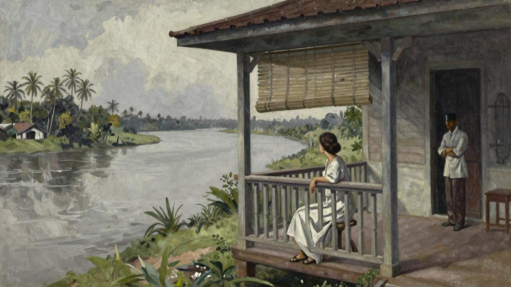
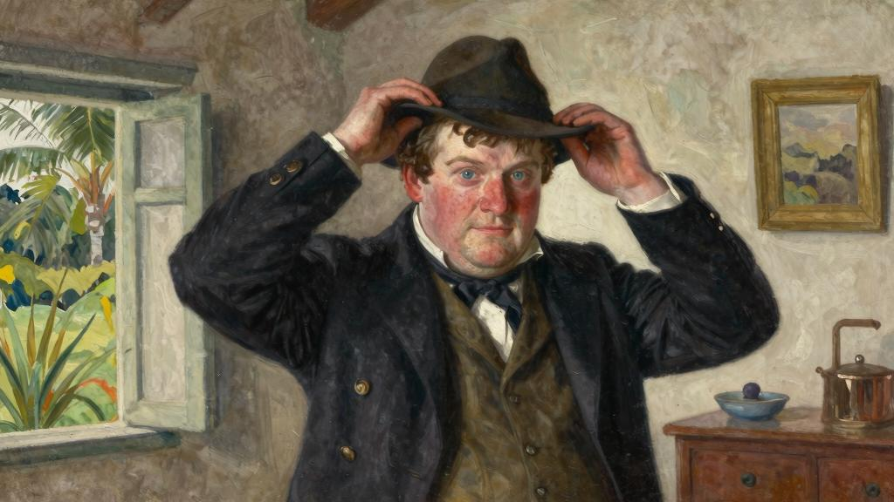
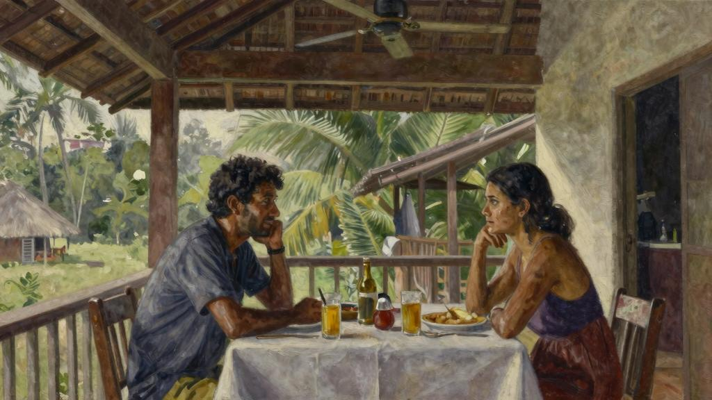
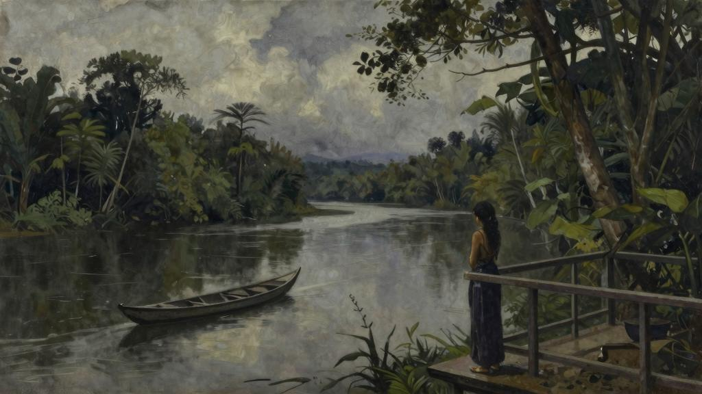

她坐在凉台上，等着丈夫回家吃午饭。早晨的清凉劲儿一过，马来男仆就把窗帘拉了下来。卷起一面窗帘，想观赏河间风景。在午间太阳的炙烤下，河上泛起一片死灰色。一个马来人撑着独木舟行驶在水面上，那舟很小，刚露出水面。天色一味地灰白而暗淡，那是深浅不一的炎热的色调。（就像用小调谱出的东方曲子，单调而含混，听了让人心烦；等着听一首和谐乐曲也是徒劳。）知了不知疲倦地尖叫着，那声音就像是溪水流过石头，永不停歇而又单调乏味；突然，一阵嘹亮的鸟鸣声淹没了蝉噪，这鸟声悦耳动人，悠远浑厚，一瞬间就触动了的心，使想起了英国画眉。

这时听到了丈夫踩在屋后石子路上的脚步声，顺着这条路可以走到他工作的法庭。起身迎上前去。屋子建在桩子上，他跑上那段不长的台阶，这时仆人已经在门口恭候他，接下他的遮阳帽。他走进那间餐厅兼客厅，一见到，便满眼欢喜。

“喂，多丽丝。饿了吗？”

“我都快饿坏了。”

“我去洗个澡，马上就吃饭。”

“快点啊。”微笑着说。

他钻进更衣室。多丽丝听见他快活地吹着口哨，脱下衣服，漫不经心地扔到地上。多丽丝经常数落他这种大大咧咧的行为。他已经二十九岁了，但还跟一个小学生一样，永远长不大。或许正是因为这个才爱上他的吧，因为无论多么爱他也不认为他是个俊男。他个子不高，体型微胖，脸蛋红润，恰似满月，上面长着一双蓝眼睛。他的脸上满是斑点。多丽丝仔细瞧过他，最后不得不承认，他的长相没有一处值得赞扬。经常跟他说，他压根不是自己喜欢的类型。

“我从没说过我是个俊男啊。”他笑道。

“真不知道我看上你哪了。”但很清楚其中的原因。他是个乐观开朗的小伙子，对任何事都不会太当真，整天嘻嘻哈哈的。他能让多丽丝快活。他觉得生活乐趣多多，没必要过得那么一本正经，他的笑容也很迷人。跟他在一起的时候多丽丝快乐无比，温柔可亲。从那双笑盈盈地蓝眼睛里，能看到他流露出的深深爱意，令心动。被他那样爱着，多丽丝心满意足。

在他们蜜月期间，有一次，坐在他的膝头，捧起他的脸说：

“你是个又矮又丑还有点胖的男人，盖伊，可你真有魅力，我不由自主爱上了你。”

爱如潮水，情到深处，不由得热泪盈眶。看到盖伊感动得脸都抽搐了，他回答时的声音都颤抖起来。

他说：“娶了你这么个不正常的女人，太可怕了。”

多丽丝咯咯笑起来。这正是盖伊风格，也正是想听到的。

很难想象，九个月之前，还从未听说过他。当时跟妈妈在海边一个小镇度假，为期一个月，他俩便在那里相遇了。多丽丝给一位国会议员当秘书，而盖伊正休假回家。他俩住在同一个旅馆里，很快盖伊便向介绍了自己。他出生于森布卢，他父亲在第二任苏丹治下，已经在那儿任职三十年了，他一毕业就到父亲那个部门工作，为自己的国家效力。

“毕竟，英国对于我来说是外国。”他说，“森布卢才是我的家。”

现在，森布卢也是的家了。一个月的假期快要结束之际，盖伊向求婚了。多丽丝早就猜到了，本准备拒绝他的。母亲守寡，而是唯一的孩子，没法离母亲那么

远。但当那一刻真的来临时，不知道自己怎么了，一冲动便接受了他。如今，他们在他分管的署地已经住了四个月了，很幸福。

有次多丽丝告诉盖伊，本来打定主意要拒绝他的。

“那你没拒绝，你觉得遗憾吗？”他蓝色眼睛闪烁着笑意。

“要是拒绝了，我可就是个十足的傻子。说不清是命、是机会，还是别的什么，就替我把这事定了，算是我走运吧。”

这时听到盖伊踢踏着脚步去了楼下浴室。他这个人动静大，即使是光着脚也安静不下来。突然他嚷了一声，又嘟囔了两句，用的是方言，多丽丝也听不懂。随后听到有人同他说话，声音不大，像是窃窃私语。别人要洗澡的时候拖住人家说话，真是太讨厌了。多丽丝又听到了他在说话，尽管声音很小，但能听出来他很烦躁。另一个声音也提高了，是一个女人。多丽丝猜，是来向他陈情投诉的。那样偷偷摸摸的，跟马来女人一个样。显然，这个女人一无所获，因为听到他说：出去。无论如何，这话还能听懂，然后听到盖伊拴上门。随即传来哗哗的流水声，那是他在往自己身上浇水（觉得那套洗浴设备很有意思：浴室在卧室下面，建在地上：里面有一大桶水，洗澡时用一个小铅桶往自己身上浇水），两分钟后他回到卧室，头发还是湿的。他们坐下吃午饭。

“好在我不起疑心，不爱嫉妒。”笑道，“可你在洗澡的时候还跟其他女人聊得这么起劲，不知道这事我要不要赞成啊。”

他进屋的时候不像平时那样眉开眼笑的，而是阴沉着脸，但此刻脸色又开朗起来。

“我可不想见到。”

“我从你的语气里也听出来了。说实话，你对那个年轻女士不太礼貌啊。”

“该死，居然那样拦着我。”

“想干吗？”

“我不知道，是村里的，可能跟丈夫吵架了吧。”

“今天早上有个人一直在附近转悠，我怀疑就是。”

他皱了下眉。

“有人在附近转悠吗？”

“是的，今早我去收拾你的更衣室，然后下楼去浴室。我下楼的时候看到有人溜出门去，我往外看时，发现有人站在那儿。”

“你跟说话了吗？”

“我问想干什么，说了一两句，但是我不太明白。”

“我可不能让这些人瞎头瞎脑地在这溜达，他们没有权利来这儿。”盖伊说。

他微微一笑，但凭借一个热恋中的女人的敏锐直觉，多丽丝注意到，他只是嘴角上扬，眼里却没有往常的笑意。不由得琢磨：究竟是什么使他烦心呢？

他问：“你今天早上在做什么？”

“没什么，就散了会儿步。”

“进村子了吗？”

“我看到一个男人，让链子拴着的猴子上树摘椰子，好刺激啊。”

“好玩，对吧？”

“对了，盖伊，有两个小男孩也在旁边看，这俩人比其他人白很多。我想他们不会是混血儿吧。我和他们说话，可他们不懂英语。”

“村子里确实有两三个混血儿。”他回答道。

“他们是谁的孩子呢？”

“村里一个姑娘的。”

“那他们的父亲是谁？”

“亲爱的，在这地方，打听这种事情是有危险的。”他停顿了一下，“好多人在当地都有老婆。他们回家或结婚的时候，会给当地的老婆一笔钱，送他们回村里。”

多丽丝沉默了。他说话时的那种冷漠，让多丽丝觉得有些冷酷无情。回答时，那张坦诚、直率而又美丽的英国人面孔上流露出不悦之色。

“但是那些孩子怎么办？”

“我敢保证，他们的生活很有保障，只要经济能力许可，他们的父亲会给足够的钱，让他们受到很好的教育。他们在政府机关任职，过得很好。”

冲着盖伊苦涩一笑。

“你不会指望我觉得这是个好办法。”

“千万不要过于苛刻。”他也冲笑了笑。

“我不是苛刻，只是庆幸你没娶个马来老婆。要是那两个小东西是你的呢，恨死我了。”

男仆为他们换了菜。他们的饭菜一向单调，午餐的头菜是河鱼，寡淡无味，要加很多番茄酱才能变得可口些，然后是炖菜。盖伊在上面浇了些伍斯特酱。

“老苏丹认为，白种女人就不该来这种地方。”他紧接着说，“他甚至鼓励人们跟当地姑娘过活。当然，现在不一样了。这地方已经相当平静了，我觉得我们也知道如何更好地应对这里的气候了。”

“但是，盖伊，那些孩子大一点不过七八岁，剩下的也就五岁左右。”

“属地的日子太无聊了。连续六个月见不到一个白人。有个人来这儿的时候还只是个毛头小子呢。”他冲迷人地一笑，那张相貌平平的圆脸鲜活了起来，“那情有可原，你懂的。”

总觉得那微笑无法抗拒，那是盖伊最有力的辩词。的眼神恢复了先前的温柔。

“那当然情有可原。”手伸过桌子，叠在他手上，“能这么早有了你，我觉得很幸运。说真的，如果我知道你也有过那样的经历，我会非常难过的。”

他紧紧握住妻子的手。

“亲爱的，你在这儿开心吗？”

“超级开心！”

穿着亚麻连衣裙，看起来清新凉爽。炎热的天气并没有使烦躁不安。有年轻人都有的那种青春美，不过那棕色的眼睛确实漂亮；那种坦率的神气很讨人喜欢，而且有一头乌黑短发，既整洁又有光泽。给人一种精力充沛的印象，你会觉得有这么个出色的秘书，国会议员真是找对了人。

“我一到这儿就爱上了这地方。”说，“虽然我一个人待在这儿，但我从不觉得孤独。”

当然，早就读过关于马来群岛的小说，对马来早就有了一种印象：一片暗沉的土地，凶险的河川和无法穿越的寂静丛林。那艘沿海航行的汽艇把他们送到河口的时

候，有一艘十几个本土人驾驶的大船，正等着送他们去驻地分署。当时被眼前的美景惊呆了，只觉得亲切无比，而并不觉得害怕。令始料未及的是，这里居然洋溢着一种欢乐气氛，就像树丛中鸟儿婉转的歌声。河两岸长着红树林和纳帕棕榈树，后面则是郁郁葱葱的森林。蓝色的山脉绵延不断，层峦迭起，一望无际。毫无拘束和压抑感，只觉得天高地阔，可以天马行空地驰骋想象。阳光下这满眼苍翠闪闪发光，风轻云淡，赏心悦目。这片亲和的土地像在微笑着欢迎的到来。

船桨不停地划动，紧紧贴着河岸行进，一对海鸥在上空飞翔。有一道光从他们的水道前掠过，就像是一颗有生命的宝石。原来是一只翠鸟。两只猴子拖着尾巴，并排坐在树枝上。穿过宽阔湍急的河头，越过丛林，天地间飘浮着一缕淡淡的白云。那是天空中仅有的云彩，像是一排身穿白色衣裙的芭蕾舞女，在舞台后兴高采烈而又全神贯注地等待幕布拉起。当时多丽丝满心欢喜；想起这些，又望了望丈夫，眼睛里充满了感激和深深的依恋。

布置他俩的房间多有意思啊！那房间很大。刚到的时候，地板上是又脏又破的席子；没有上漆的木墙面上挂着（太高了）皇家艺术协会的凹版印刷画、季亚克盾牌和帕兰刀。桌子上铺着暗色的季亚克土布，上面放着满是污渍的文莱铜器、空烟盒还有一些马来银器。屋里立着一个粗制的木头书架，上面放着几本廉价小说和封皮破烂的皮面游记；另一个架子上堆满了空瓶子。这是一个单身汉的房间，杂乱而单调；虽觉得好笑，但也不免觉得心疼。盖伊在这里过得肯定枯燥乏味。想到这些，挽过盖伊的脖子，亲了他一下。

“你真是个可怜鬼。”笑着说。

有一双巧手，不久就将这房间布置成一个温馨爱巢。整整这个，弄弄那个，再把那些不需要的东西清理掉。这时结婚礼品都派上了用场。现在这个房间已经温馨舒适。玻璃花瓶里插着美丽的兰花，大花盆里种着一簇簇盛开的花草。多丽丝感到异常自豪，因为这是的家（过去只住过简陋公寓），而且替盖伊将他们的房间装饰得如此舒适宜人。

“对我还满意吗？”收拾完之后，这样问道。

“还算满意。”他笑着说。

这种有意为之的轻描淡写甚合的心意。他们之间如此心有灵犀，真是让人喜不自胜！他们都不善于表达自己的感情，即使偶尔有所表示，也都是意在言外地相互打趣。

吃过午饭，盖伊窝进长椅里睡觉。走向自己的房间。当经过的时候，他把拉近前来，吻了的嘴唇。这让有些惊喜，他们还不习惯白天随时相互拥抱。

“填饱了肚子你就变得多情了吗，我的小可怜？”打趣地说。

“赶紧出去，至少两个小时别让我再看到你。”

“可别打呼噜哦。”

走开了。他俩天刚一亮就起床了，所以没过五分钟就都睡着了。

多丽丝被盖伊在浴室的洗澡声吵醒。这屋子的墙更像是一块传声板，不管做什么，彼此都能听到。懒得动，听到男仆将茶端了进来，便跳了起来，跑进自己的浴室。水不冷，但很凉，让人觉得神清气爽。走进客厅的时候，盖伊正从拍夹里往外拿网球拍，因为他们在傍晚刚凉下来那会儿打网球。六点就入夜了。

网球场离房子大概有两三百米远，喝过茶后，为了不浪费时间，他们散步到了网球场。

“你瞧。”多丽丝说，“那就是我今天早上看到的那姑娘。”

盖伊快速转过身。他盯着一个当地女人看了一会儿，却没说话。

“的纱笼好漂亮啊！”多丽丝说，“我想知道从哪里弄来的。”

他们从身边走过。娇小玲珑，长着他们种族特有的乌黑闪亮的大眼睛和一头浓密的秀发。他们经过的时候，一动不动，却用一种奇怪的眼神打量着他们。多丽丝发现，没有自己一开始想得那么年轻。的五官略嫌粗笨，皮肤发黑，但确实非常漂亮。怀里抱着个小孩。看到怀里的孩子，多丽丝笑了，但那个女人的嘴唇却一动不动，表情仍然很冷漠。没有看盖伊，只盯着多丽丝。盖伊也仿佛没有看到这个女人，继续往前走。多丽丝对盖伊说：

“那小孩可爱吗？”

“我没留意。”

盖伊脸上的表情让感到困惑。他脸色煞白，那些本来就让觉得碍眼的粉刺，现在红得有点反常。

“你注意的手和脚了吗？大概是个公爵夫人吧。”

“这里所有的人手脚都长得好看。”他回答时不像平时那么高兴，好像不太情愿似的。但是多丽丝却很好奇：“你知道是谁吗？”

“是村里一个姑娘。”

他们现在已经到了网球场。盖伊去看网有没有拉紧时，回头瞅了瞅。那个女孩儿还站在原地。他们的眼神相遇了。

“我发球吗？”多丽丝问道。

“是的，球在你那边。”

这次他打得很差。往常他让十五分也能赢，但这次多丽丝很轻易就取胜了。而且今天他打球时却一言不发。平时他聒噪得很，全程叫嚷，接不到球的时候会骂自己笨蛋，多丽丝没接到球他就嘲笑。

“你没在打球啊，小伙子！”喊道。

“没有的事。”他说。

他开始用力，试图打败，把球一个个地朝网打飞过去。从未见过他那等表情。会不会是因为他打得不好所以气恼呢？球场灯熄了，他们不打了。他们来时碰到的那个女人还站在原地，面无表情地目送他们经过。

现在凉台上的窗帘已经拉起，两把长椅中间的桌子上摆上了酒瓶和苏打水。到了喝第一杯酒的时候了。盖伊配好了两杯杜松子酒。宽阔的河流从他们眼前流过，河的对岸，渐次降临的夜幕使丛林平添了几分神秘色彩。一个当地人站在船头，划着桨溯游而上。

盖伊打破了沉默：“我打得真臭，我不太舒服。”

“哎哟，你不会发烧了吧。”

“没有，明早就没事了。”

他们周围黑了下来。青蛙开始大声聒噪，不时还能听到夜鸟短促的鸣叫。萤火虫从凉台前飞过，像星星点点的小蜡烛，闪烁着柔和的光，将树装扮成圣诞树的模样。多丽丝似乎听到了一声叹息，这使心头有些不安，因为盖伊一直都是兴高采烈的。

“怎么了，伙计？”轻柔地说道，“跟我说说。”

“没什么。再喝一杯吧。”他轻描淡写地说。

第二天，他恢复了平日的笑容，邮件也送达了。海岸汽艇每月经过河口两次，一次是去煤田的时候，另一次是返航的时候。汽艇外出的时候会顺便把信件带回来，盖伊派了艘小船去取。汽艇的到来为他们平淡的生活增添了一些新鲜感。头一两天，他们会把所有寄来的东西浏览一遍，包括信件、英国和新加坡报纸、杂志和书，剩下的几个星期再细细品读。他们抢着看那些带插图的报纸。多丽丝要是不光埋头看报，可能就会

察觉到盖伊的变化。会发现这种变化很难形容，更难以解释。他眼里多了一种警觉，微微下垂的嘴角流露出忧虑。

大概一周之后，有天早上，正坐在放下窗帘的房间里学习马来语语法（正勤奋学习这门语言），突然听到院子里一片嘈杂。先听到男仆在发火，还有一个男人的声音，可能是挑水夫，然后是一个女人尖锐的叫骂声，似乎还动手了。走到窗边，打开窗帘。挑水夫正抓住一个女人的胳膊把往外拖，男仆则从后面把往外推。多丽丝一眼就认出了，就是那天早上在院子里转悠，后来又在网球场外碰到的那个女人。怀里抱着一个婴儿。这三个人都怒气冲冲地叫嚷着。

“别吵了！”多丽丝呵道，“你他们在干什么？”

一听到多丽丝的声音，挑水夫立马放开了那个女人，男仆还从后面推，结果那女人一下子跌倒在地上。院子里突然安静下来，男仆沉着脸两眼朝天。挑水工犹豫了一下，赶紧溜走了。那个女人慢慢站起来，抱好孩子，一脸冷漠地站在那里盯着多丽丝。

男仆对那个女人说了些什么，声音很小，即使多丽丝能听懂也听不清：可那个女人脸上毫无反应，显然并不为男仆的话所动，但慢慢走开了，男仆一直跟着到院门口。他回来的时候，多丽丝叫他，他假装没有听到。多丽丝心头火起，厉声喊他。

“立马过来！”大喊道。

他猛转身朝平房走过来，躲着多丽丝愤怒的目光。进屋后，他站在门口，板着脸看着。

“刚才你他们跟那个女人是怎么回事？”陡然问道。

“老爷说，不能到这里来。”

“你不能那样对一个女人，我不允许。我刚才看到的，我都会告诉老爷。”

男仆没有回答，移开了目光，但多丽丝能感觉到，他正透过那长长的睫毛观察。不想跟他啰嗦了。

“就这样吧。”

他一言不发，转身回到了仆人的住处。多丽丝十分恼火，发现自己很难集中精力学习马来语了。过了一会儿，男仆进来铺好午餐桌布。突然，他走到门口。

“怎么了？”问道。

“老爷回来了。”

他走出门，接过盖伊的帽子。仆人的耳朵就是灵敏，早就听到了主人的脚步。盖伊没有像往常那样直接走上台阶。他停下来，多丽丝马上意识到，男仆要抢先告诉盖伊今早的事情。耸了耸肩膀。但盖伊进来的时候，吓了一大跳：他的脸色苍白。

“盖伊，究竟是怎么回事？”

他的脸唰地一下红了。

“没事啊，怎么了？”

十分诧异，看着盖伊进了自己的房间，把想说的话强咽了回去。他这次洗澡和换衣服的时间比平时要长。当盖伊回来的时候，午饭已经准备好了。

“盖伊，”他们坐下来的时候，说：“那天我们看到的那个女人今天早上又来了。”

“我听说了。”他答道。

“仆人们对太粗鲁了，我必须制止他们，你一定要好好跟他们说说。”

虽然那个马来仆人很清楚多丽丝在说什么，但他没有任何反应。他把烤面包递给。

“已经告诉过不要来这儿了，我吩咐过的。再来，就把赶出去。”

“他们用得着这么粗暴吗？”

“不愿走，我觉得，他们也是没办法吧。”

“看着一个女人那样被人欺负，真是太可怕了。怀里还有个婴儿呢。”

“不是婴儿，都三岁了。”

“你怎么知道？”

“我对一清二楚，不该来这找我们的麻烦。”

“想干什么？”

“就是刚才做的，想找事。”

多丽丝沉默了一会儿。盖伊说话的语气让十分惊讶。他不愿多说，好像这一切都与他无关。觉得盖伊有些不近人情。他很焦虑，也很烦躁。

“今天下午怕是不能打网球了。”他说，“我看好像要有一场暴风雨。”

当多丽丝醒过来的时候，外面已经在下雨了，出门是不可能了。喝茶的时候，盖伊没有说话，一副心不在焉的样子。拿起针线，开始干活。盖伊坐下来，读那些还没一页一页认真翻阅的报纸；但他心神不宁；他在宽敞的房间里踱来踱去，然后走到了凉台上，望着外面的暴雨。他在想什么呢？多丽丝隐隐感到不安。

直到晚饭结束，他才开始说话。晚饭很清淡，盖伊竭力装得像平时那样轻松愉快，但伪装得太刻意了。雨停了，夜空中繁星闪烁。他们坐在凉台上。为了避免招引虫

子，他们熄了客厅的灯。大河在他们脚下默默地缓缓流淌，不可抵挡而又庄重肃穆。如命运一般，有一种令人生畏的从容不迫和冷酷无情。

“多丽丝，我有事要告诉你。”他突然说道。

盖伊的声音听起来很奇怪，一直在发抖，难道是的错觉吗？看他忧心忡忡，多丽丝的心也隐隐作痛。把手轻轻放在他手上，而他却缩了回去。

“这事说来话长。这不是什么好事，我说不出口。我想请你别打断我，什么也别说，让我说完。”

周围一片漆黑，多丽丝看不清他的脸，但仍能感觉到他面色憔悴。没吭声，盖伊声音很低，几乎没有打破这夜的沉寂。

“我刚来这儿的时候只有十八岁。那时刚念完高中。我在吉隆坡（吉所罗）待了三个月，然后就被派往森布卢河上游的一个驻地分署了。当然那里有一个驻地长官，还有他的妻子。我在公署住，但我经常跟他们一起吃饭，晚上也跟他们待在一块儿。那段时间，我非常开心。后来这个长官生病了，必须回国。那时因为战争，这里男人很少，我就接替了他的职位。当然我很年轻，可我的马来语很地道，再者我也是沾了我父亲的光。能独立自主，我很高兴。”

他沉默了，把烟灰从烟斗里磕出来，装上新烟丝。他划火柴的时候，多丽丝虽没看他，却感觉到他的手在抖。“我从没独自一个人生活过。在家有父母，通常还有一个仆人。在学校，身边自然有很多同伴。我出国时，船上也一直有很多人，在吉隆坡，甚至在我第一次到任的时候，也是那样的。那儿的人很像我家乡的人。我好像一直生活在人群当中。我喜欢跟人接触，天生喜欢热闹，爱说爱笑。我想过得开心一点。身边的所有事物都能让我笑，但我总不能一个人笑吧。但在这儿不一样。当然在白天还好，我要工作，可以和迪亚克人交流。那个时候他们还是野蛮人，打赢了还割敌人的头，也时不时地给我找点麻烦，但他们是好人。我跟他们相处得很好。我本想有个白人同我谈天说地，但有这些人总比没有好。他们也没把我当外人，我也轻松不少。我很喜欢我的工

作。晚上我坐在凉台上喝杜松子酒和苦啤酒，觉得一个人蛮孤独，但是有书可以看。仆人都在旁边。我的仆人叫阿卜杜勒。他认识我父亲。我读书读得累了就会叫他过来，跟他说说话。”

“我受不了的是晚上。晚饭过后，仆人们关好门窗就回村了。只剩下我一个人。平房里除了壁虎发出沙沙的声音以外，啥声音都没有。这种动物出来的时候很突然，所以会吓我一跳。我有时能听到村子里的锣鼓声和鞭炮声。他们过得很愉快，离我又那么近，可我只能待在这儿。我看书看累了，觉得跟待在监狱里的犯人比，我也好不了多少。夜复一夜，我都是这么过来的。我试着连喝三四杯威士忌，发现一个人喝毫无乐趣，仍然开心不起来；结果第二天更萎靡不振。我试过晚饭之后立马睡觉，但是我睡不着。我躺在床上，越来越烦躁，越来越清醒，最后也不知道该怎么办了。天哪，那些夜晚太漫长了。你知道吗？我那时情绪很低落，有时觉得自己很可怜——现在想起来还有些好笑，但我那时才十九岁半——有时候我还哭。”

“有天晚上，吃过晚饭之后，阿卜杜勒收拾好餐桌，正准备离开，他轻轻咳嗽了一下。他问我晚上一个人在这房子里会不会寂寞，‘不，还好吧。’我说。我不想让他知道我过得不好，但我觉得他都明白。他站在那儿不说话，我猜他有话对我说。‘怎么了？’我问，‘说吧。’然后他说如果我想要一个姑娘跟我一起生活，他知道有一个愿意来。那姑娘很好，他可以介绍给我。不会给我添麻烦，再说房子也得有人收拾。可以替我缝缝补补……我觉得特别消沉。雨下了一天，我没能出去锻炼。我知道我又会好几个小时睡不着觉。他说，那不会花我很多钱，的家人都很穷，只要一点小礼物就会很满足了。两百叻币就可以。‘您看，’他说，‘要是您不喜欢，可以把送走。’我问他那姑娘在哪里。‘就在这儿。’他说，‘我这就去叫。’他朝门口走去，那姑娘和妈妈一直在台阶上等着。他们走进来，坐在地上。我给了他们一些糖果。很害羞，却也很淡定，我跟说话的时候，会冲我笑。很年轻，跟个孩子差不多，他们说十五岁。那姑娘非常漂亮，还穿上了最好的衣服。我们开始聊天。话很少，但是我逗的时候，就一直笑。阿卜杜勒说，跟我熟悉之后，会有很多话说。他让坐到我身边来。咯咯笑着，不肯过来，但妈妈让过来，我给腾了个空。红着脸笑了，但还是挪了过来，依偎着我。阿卜杜勒也笑了。‘您看，已经喜欢上您了。’他

说，‘您想让待在这儿吗？’他问道。‘你想留在这儿吗？’我问。笑着把脸埋在我的肩上。很温柔，身材娇小。‘很好，’我说，‘让留下吧。’”

盖伊往前一探身，拿了一杯威士忌和苏打水。

“我现在可以说话了吗？”多丽丝问。

“等一下，我还没说完。我没爱过，刚开始也不爱。我留下，只想屋里能够有个人。要不然我会疯掉的，或者借酒消愁。我当时快崩溃了。我太年轻，没法一个人生活。除了你，我没爱过别人。”他犹豫了一下，“直到我去年放假回家，才走。你看到的那个在附近逛的女人，就是。”

“是的，我猜到了，怀里有个孩子，是你的吗？”

“是，一个小女孩。”

“你他们只有这一个孩子吗？”

“你那天在村子里看到的那两个小男孩，你提过的。”

“所以有三个孩子？”

“是的。”

“你真是家全人全啊。”

听了这话，盖伊一动，但多丽丝没再说什么。

“你突然带着妻子回到这儿，才知道你结婚了吗？”多丽丝问道。

“当时知道我要结婚了。”

“什么时候？”

“我离开的时候把送回村了。我告诉我和到此为止，我答应的也都给了。一直都知道，在这里是暂时的。我受够了，我告诉我会娶一个白人。”

“但那时你还没遇到我呢。”

“是，我知道。我在家的时候就决定要结婚了。”他咯咯笑着，像以前一样，“不瞒你说，刚遇到你的时候，我还在为这事苦恼呢。我对你一见钟情，后来我发现非你不娶。”

“你为什么不告诉我？你不觉得给我一次自己做决断的机会才公平吗？你应该想象得到，一个女孩发现的丈夫曾和其他女人一起生活过十年，还有三个孩子，这对来说是多么大的打击。”

“我当时觉得你没法理解我，这里的情况很特别。这是常事。六个男人里面有五个会这样。我觉得这种事情会吓到你，而且我不想失去你。你知道，我当时非常爱你，现在也是，亲爱的。你本没有必要知道这些，我也没打算回这里。一个人休假回家之后很少回到原来的分署。我们到这儿的时候，我答应只要能去其他村子住，我会给一些钱。刚开始说可以，后来就变卦了。”

“你为什么现在告诉我？”

“总是来这里捣乱。不知道怎么发现你对这些毫不知情的。知道了之后就开始敲诈我。我已经给了很多钱了。我曾下过命令，不许到院子里来。今天早上那样做就是为了引起你的注意。想威胁我。事情不能这样发展下去。我想，唯一的办法就是实话实说了。”

盖伊说完之后，是长时间的沉默。最后，他把手放在的手上：“多丽丝，你能理解我，是吗？我知道这都怪我。”

没抽回自己的手。盖伊觉得的手冰凉。

“嫉妒吗？”

“我敢说，从前在这儿的时候弄到了不少钱。现在没钱了，肯定不愿意。但从没爱过我，对我、我对都没什么太深的感情。土著女人从不会真正爱上白种人，你知道的。”

“那孩子他们呢？”

“孩子他们都很好。我出钱抚养他们。男孩长大之后，我会送他们去新加坡读书。”

“他们对你来说，什么也不是吗？”

他迟疑了一下。

“我想对你实话实说。如果他们发生什么意外，我会很难过。第一个孩子快出生的时候，我觉得我更喜欢他而不是他妈妈。如果那孩子是白人，我可能真的会喜欢他。当然，他还是个婴儿的时候很好玩儿，很招人疼爱，但是我没觉得那是我自己的孩子。我想也就这样了吧；你知道，我不觉得他们是我的。有时，我会斥责自己，因为这想法实在不合情理。但说实话，对我来说，他们和别人家的孩子没什么两样。当然，那些没有孩子的人会把这些说得特别难听。”

现在，一切都知道了。盖伊等着开口说话，但一言不发，一动不动地坐在那儿。

“多丽丝，你还有其他问题要问我吗？”他终于问道。

“没了，我头疼得厉害。我想睡觉了。”的声音像以往一样平静，“我不知道说什么。当然，这些我完全没想到。你必须给我点时间想想。”

“你生我的气吗？”

“没有，我一点也不生气。只是——只是我得一个人待会儿。你别动。我去睡了。”

从长椅上站起来，把手放在他肩膀上：

“今晚很热，你睡在更衣室比较好。晚安。”

走了，盖伊听到把卧室的门锁上了。

第二天，多丽丝脸色苍白，盖伊看得出来，一夜未眠。说话行事并无怨愤之情，语气还像往常那样，但失去了那种自如感；拉拉杂杂地说说这个，聊聊那个，好像在跟一个陌生人拉话。他们并没吵过架，但在盖伊看来，这样说话就好像他们刚刚有过不愉快，虽然和好了，但仍在伤心难过。的眼神让他很困惑；他像是从中看到了一种莫名其妙的恐惧。吃过晚饭之后，立马说：

“我今晚不太舒服，我这就去睡了。”

“哦，亲爱的，真糟糕。”他嚷道。

“没事，一两天就好了。”

“待会我会去卧室跟你说晚安。”

“不，别过来。我得想办法尽快睡。”

“好的，亲我一下再去吧。”

他发现脸红了，好像犹豫了一下，然后移开目光，向他俯下身。他搂住，想去够的嘴唇，但别过脸去，他只亲到了的脸颊。多丽丝快速离开他，他又听到轻轻地用钥匙给门上了锁。他重重地倒进长椅里，想看几页书，可总是不由自主地竖起耳朵，捕捉多丽丝卧室里细小的声音。说要睡觉，但盖伊没听到上床的动静。卧室里一片寂静，让他有一种说不出来的紧张感。盖伊用手遮住灯光，看到从房间门下

透出一丝亮光：还没熄灯。究竟在做什么呢？他放下书。如果跟他发火，大吵大闹、失声痛哭，他都不会惊讶，也能应付；但多丽丝的冷静却着实让他害怕。他从眼里很明显能看到一种恐惧，这究竟意味着什么呢？他一遍遍回想前一天晚上对说过的话。他不知道自己除了那样讲，还能怎么跟和盘托出。毕竟最重要的是，他干下的那点事人人都会干，而且在他认识之前这事早就了结了。当然，照事态发展来看，他还是太傻，但人都是经过历练才变聪明的。他把手放在胸口：奇怪，胸口竟然疼得厉害。

“我想这就是人们所说的心碎的感觉吧。”他自言自语道，“这种感觉还要持续多久呢？”

他是否应该敲开门，告诉自己必须跟谈谈？坦诚相对会更好一些。他必须让理解。但是那片寂静让他害怕。一丝声音也没有！或许让自己待着会更好。当然，这事儿让深受打击。他必须给足够的时间。毕竟，知道盖伊是多么真心地爱着。耐心是唯一的解决办法；可能现在内心正在进行激烈的斗争；他必须给时间；他必须有耐心。第二天早上，他问睡得怎么样。

“嗯，好多了。”说。

“你很生我的气吗？”他可怜兮兮地问道。

真诚和坦率地看着他。

“一点也不。”

“哦，亲爱的，我太高兴了。我真是个畜生。我知道这对你伤害很大。但是请原谅我，我也很难过。”

“我原谅你，也不怪你。”

他冲着愧疚地一笑，看上去像是被鞭子抽打过的小狗。

“这两天夜里我自己睡，好不习惯。”

看着别处，脸色变得苍白。

“我让人把我房间里的床搬走了，它太占地方了。我在那儿放了一张小行军床。”

“亲爱的，你在说什么呢？”

现在平静地看着他。

“我不想再作为你的妻子和你一起生活了。”

“永远不了？”

多丽丝摇了摇头。盖伊不解地看着。他简直不能相信自己听到的话，心开始痛起来。

“但是那对我太不公平了，多丽丝。”

“你不觉得，这种处境对我也有点不公平吗？”

“可你刚刚说了，你不怪我。”

“我确实不怪你，但跟你一起生活是另一回事，我做不到。”

“但像你说的那样，我们怎么能一起生活呢？”

盯着地板，像在深思。

“昨天你想亲我嘴唇的时候，我觉得很恶心。”

“多丽丝。”

突然看着他，眼神冷酷，充满敌意。

“我睡的那张床是不是生孩子时睡过的？”看到盖伊满脸通红，“天哪，太可怕了。你怎么能这样对我？”绞着双手，手指就像是受到折磨的小蛇在扭动。努力控制着自己的情绪。“我已经下定决心了。我不想对你太绝情，但是有些事你不能逼我去做。我把事情从头到尾想了一遍。从你跟我说了之后，我没日没夜地想这件事，一直想到我心神俱疲。我的本能反应是起床，离开这儿。立马就走。再有两三天，汽艇就来了。”

“对你来说，我对你的爱一文不值吗？”

“哦，我知道你爱我。我没打算马上走。我想给彼此一个机会。我曾经那么爱你，盖伊。”的声音有些哽咽，但没有哭，“我不想无理取闹。天知道，我不想太绝情。盖伊，你能给我一些时间吗？”

“我不太明白你的意思。”

“我只想你能让我一个人待着，我自己都害怕我的这种感觉。”

盖伊猜到了，是害怕。

“什么感觉？”

“请别问我，我不想伤害你。过段时间就好了。天知道，会过去的。我会尽力。我答应你，我会尽力让它过去。给我六个月的时间。我为你什么都可以做，除了那件事。”恳求似地向他微微示意。“我们一起生活，没有理由过得不痛快。如果你真的爱我，你会——你会有耐心的。”

他深深叹了一口气。

“好。”他说，“我自然不会强迫你做你不喜欢的事。就按你说的来。”

他心情沉重地坐了一会儿，好像一瞬间变老了，连动一下都很费劲；然后，他站了起来。

“我要去办公室了。”

他拿起他的遮阳帽，走出门去。

一个月过去了。女人比男人更善于隐藏自己的情绪，任何来拜访他俩的陌生人都察觉不到多丽丝有了心事；但盖伊就不一样了，他明显精神紧张；那张和善可亲的圆脸拉得老长，眼睛里流露出得不到满足的痛苦表情。他观察多丽丝的一举一动。轻松欢快，还像以前那样逗他；他们一起打网球，一起谈天说地。但很明显，多丽丝只是在做戏。终于，盖伊忍不住了，他又试着解释自己和那个马来女人的关系。

“哦，盖伊，再提那些陈年旧事一点意义也没有。”轻描淡写地说，“该说的都说了，我不怪你。”

“你为什么这样惩罚我？”

“我可怜的盖伊，我并不想惩罚你。这不能怨我，如果……”耸了耸肩膀，“人性就是这么奇怪。”

“我不明白。”

“那就别想了。”

这些话可能有些绝情，但脸上那亲切、友善的笑容使之缓和了许多。每天晚上，要睡觉的时候，就会靠近盖伊，轻吻他的脸颊。就只是碰碰嘴唇，就像是飞蛾掠过他的脸一样。

两个月过去了，接着是第三个月，貌似漫长的六个月转瞬即逝。盖伊心想，多丽丝是否还记得说过的话呢。现在，他紧张地时刻观察多丽丝的一颦一笑、举手投足。仍然那样不可捉摸。曾要求给六个月时间；这不，他做到了。

海岸汽艇经过了河口，留下他们的信件，接着又上路了。盖伊忙着写一些信，这样汽艇返航时可以捎带出去。两三天过去了。那是星期二，一艘普拉胡船要在周四凌晨

出发，去迎候小汽艇。除了吃饭时多丽丝会打起精神说几句话之外，他们在一起几乎不说话；晚饭之后，他们像往常一样，拿起书开始读；可当男仆收拾完，准备睡觉时，多丽丝放下了书。

“盖伊，我有些事要跟你说。”喃喃说道。

他的心扑通跳了一下，觉得自己脸色都变了。

“噢，亲爱的，别那样，没那么可怕。”笑着说。但他察觉到，多丽丝的声音有些颤抖。

“是什么呢？”

“我想让你为我做一些事。”

“亲爱的，我可以为你做任何事。”

他伸出手，想握住多丽丝的手，但缩了回去。

“我想请你放我回家。”

“你回家？”他惊慌失措地喊道，“什么时候？为什么？”

“我已经尽了最大努力了。我已经快要崩溃了。”

“你想回家待多久？不回来了吗？”

“我不知道，应该是吧。”鼓足了勇气，“是的，不回来了。”

“哦，天哪。”

听起来，他完全崩溃了，多丽丝觉得他要哭了。

“噢，盖伊，不要怪我。这真的不是我的错。我控制不了我自己。”

“你说让我给你六个月的时间。我接受了你的条件。你不能说，我惹你讨厌了吧。”

“不，没有。”

“我这段时间过得有多难过，我尽力不让你察觉。”

“我知道，我很感激你，你一直对我这么好。听我说，盖伊，我还想跟你说一遍，不管你做过什么，我都不怪你。毕竟，你那时候只是个孩子，你做的那些事，大家都会做的；我知道在这儿有多寂寞。哦，亲爱的，我真的非常抱歉。我知道这件事的来龙去脉，所以才会让你给我六个月时间。我的常识告诉我，我在小题大做，我不通人情，这样对你不公平。但是，你知道吧，常识与这没有关系；我整个人都很难接受这一事实。

我在村子里看到那女人和的孩子，就觉得两腿发抖。这个房子里所有的东西；一想到我睡的那张床，我就起鸡皮疙瘩……你不知道我是怎么忍过来的。”

“我想我已经劝离开了，我也申请了调离。”

“没用的。会一直在这儿。你属于他们，不属于我。如果只有一个孩子，我想我可能会忍一忍，但是有三个呢；而且那些男孩也很大了。你跟一起生活了十年啊。”现在终于要和盘托出了，“这是我的身体上的反应，我也没办法，它比我强大。

一想到那双黑瘦的胳膊抱着你，我就觉得很恶心。我想到你抱着那些黑娃娃。噢，太讨厌了。你碰我时，我很不情愿。每天晚上我必须鼓起勇气去亲你。我还得攥紧拳头，逼着自己去碰你的脸。”此刻，处于极度焦虑中，手指反反复复地攥紧又松开；的声音已经失控了。“我知道现在是我不对。我很蠢，也很歇斯底里。我以为自己可以克服。然而我不能，我永远也做不到。我是自作自受；我愿意承担这些后果；如果你必须让我留下，我会留下，但是我会死的。我求你让我走吧。”

此刻，忍了很久的眼泪一下子涌出眼眶，失声痛哭起来。盖伊从未见哭过。

“当然，我不想强迫你留在这儿。”他声音嘶哑。

疲惫不堪地靠在椅子上，整个脸已经完全扭曲变形。往日平和的脸此时看上去痛不欲生，让人看了心痛。

“我很抱歉，盖伊。我毁了你的生活，我也毁了我的。我们本应该很幸福的。”

“你想什么时候走？周四？”

“是的。”

多丽丝可怜巴巴地看着盖伊。他双手捂着脸。最后，他抬起头。

“我太累了。”他喃喃说道。

“我可以走了吗？”

“可以。”

大概有两分钟，他们坐在那里，一言不发。离开时，壁虎发出刺耳而又嘶哑的叫声，极为奇怪，像是人类的哭声。盖伊站起身，走到凉台上。他倚着柱子，看着缓缓流淌的河水，听见多丽丝走进了自己房间。

第二天早上，他起得比平时要早，走到多丽丝门前，敲了敲门。

“怎么了？”

“我今天要去河上游，要很晚才回来。”

“知道了。”

看出来了。他故意让自己一整天都在外面忙活，免得看到收拾行李的场面。

收拾行李的过程真是让人肝肠寸断。装好衣服之后，又环顾了整个客厅，瞧了瞧属于

的东西。把它们都带走太绝情了。除了妈妈的照片，多丽丝将其他东西都留下了。

盖伊直到晚上十点才回来。

“很抱歉，我没能回来吃晚饭。”他说，“我去的那个村子，村长有很多事要我处理。”看到他来回扫视着房间，发现妈妈的照片不在原来的位置了。

“一切都准备好了吗？”他问道，“我已经吩咐过船夫，让他天亮在楼梯那里等着。”

“我告诉仆人，让他明早五点叫醒我。”

“我应该给你点钱。”他走向桌子，写了张支票，又拉开抽屉，拿了一些现金，“这些钱够你到新加坡，在那里你可以兑换这张支票。”

“谢谢你。”

“你想让我和你一起去河口吗？”

“不了，我想我们在这里告别比较好。”

“好吧。我想我应该回房间了，我今天累坏了。”

他甚至都没有碰一下的手，径直进了自己房间。过了几分钟，多丽丝听见他重重地躺到了床上。坐了一会儿，最后看了看这个房间。这个房间曾带给无上的幸福，也曾经让伤心欲绝。深深地叹了口气，站起身，走进自己的房间。把一切都收拾好了，只留下一两件今晚用的东西。

仆人叫醒他们的时候，天还没亮。他们赶紧穿衣服，等收拾完，仆人已经把早饭准备好了。不久，他们听到船到了平房下面的码头，仆人把多丽丝的行李拿了下去。俩人都没心思吃东西。黑夜逐渐褪去，河流依然一片幽暗。天还没亮，但黑夜已经过去了。一片寂静中，当地人在码头上说话的声音格外清晰。盖伊看了一眼自己妻子丝毫未动的早餐。

“如果你吃完了，我们就下去吧。我想你该出发了。”

多丽丝没说话，起身走进自己的房间，最后检查一遍有没有忘了东西。随后和盖伊并肩走下了台阶，顺着一条蜿蜒小路走到河边。在码头，当地警卫队穿着整洁的制服，排成一列。多丽丝和盖伊经过的时候，他们举枪行礼。走上船的时候，领头的船工伸手去扶。回头看着盖伊，想最后说点儿话安慰他，再一次请求他原谅，但如鲠在喉、有口难言了。

他伸出手来。

“再见了，一路平安。”

他们握了下手。

盖伊朝那个领头船工点了点头，接着小船就开走了。晨曦逐渐漫过朦朦胧胧的河流，但黑暗依然蛰伏在幽暗的丛林间。他一直站在码头，直到船消失在清晨的阴影中。

他叹了口气，转身离开了。警卫队再次向他致敬，他漫不经心地点了点头。但一回到平房，他立刻叫来了男仆。他在房里四处搜寻，挑出了所有多丽丝的东西。

“把这些东西都放起来。”他说，“留在这儿不好。”

之后，他坐在凉台上，看着天光逐渐放亮，就像是一种苦涩却无法释怀的痛苦。

最终，他看了看自己的表，是时候去办公室了。

下午他睡不着，头疼得厉害，索性就拿了枪到丛林里去了。他什么也没猎到，只是想走一走让自己累一点。他迎着落日回到家，喝了两三杯饮料，然后就到了更衣吃饭的时间。现在没必要收拾了，舒服自在就好；他穿上一件当地人穿的宽松外套和一条笼纱。多丽丝到来之前，他经常这样穿。他光着脚，无精打采地吃完了晚饭。仆人收拾好餐桌，离开了。盖伊坐下来读《闲谈者》。平房里很安静，他读不下去，就把报纸放在膝盖上。他身心俱疲，无法思考，脑子里一片空白。那晚壁虎很聒噪，它们沙哑而又突

兀的叫声好似在嘲笑他。你很难想象，这么小的喉咙发出的声音居然能在空中这样回荡。这时，他听到了轻微的咳嗽声。

“谁在那儿？”他大喊。

咳嗽声停止了。他朝门口望了望。壁虎发出尖锐的嘲笑。一个小男孩悄悄走进来，站在门槛上。这是一个混血儿，穿着破旧的汗衫和笼纱。那是盖伊的大儿子。

“你想干什么？”盖伊问道。

男孩儿走进房间，盘腿坐下。

“谁让你来这儿的？”

“我妈妈让我来的，问你需要什么吗？”

盖伊目不转睛地看着他。男孩不再多说什么，坐下一面等，一面怯生生地看着地面。盖伊用手捂住脸，陷入痛苦的沉思。有什么用呢？一切都完了。完了！他妥协了。

他坐回椅子里，深深地叹了口气。

“告诉你妈妈，收拾一下你他们的东西。可以回来了。”

“什么时候？”男孩面无表情地问道。

盖伊那张逗人的、长满雀点的圆脸上流下了行行热泪。

“今天晚上。”

涯末路曼·格兰奇家里有个橡胶种植园。天不亮他就起床了，先去给种植园里的工人点名，然后围着庄园转一圈，检查机器是否都已准备妥当。工作完成后他就回家洗澡、换衣服，和妻子面对面吃一顿丰盛的饭，这种在早饭和午饭之间的餐在婆罗洲被称为早午饭。格兰奇边吃饭边看书。餐厅里光线阴暗，有磨损的银具、破旧的调味瓶，还有切碎的饭菜，完全是穷人家的样子，而且穷得已经漠然了。桌子上再放几朵花会显得好看一点，但显然没人在乎身边是什么样子。格兰奇吃饱之后，打了个嗝，又把烟斗填满，点上，随即起身走到了凉台上。他没多看妻子一眼，好像她不存在一样。他在一张长藤椅上躺下，继续看书。格兰奇夫人伸手从香烟罐里拿了一支烟，边喝茶边抽烟。她忽然向外面张望，原来是家里的仆人走上了台阶，还带着两个男人来找她丈夫。一个是迪亚克人，另一个是中国人。这里很少有陌生人来，她不知道他们要干什么，就站起身，走到门口听他们说话。虽然她在婆罗洲生活了许多年，但还是不知道如何跟这些仆人相处，而且只能大概听懂他们的话。从丈夫的语气中，她得知出了些事，惹他生气了。他像是先问了那个中国人一些问题，又问了迪亚克人；看起来，他们在逼着丈夫做一些他不想做的事；不过，最后格兰奇皱着眉头从椅子上站起来，跟着他们走下台阶。她很好奇他们要去哪儿，就偷偷溜到了凉台上去看个究竟。格兰奇走上了那条通往河边的路。她耸了耸瘦削的肩膀，进了自己的房间。不久格兰奇突然喊了她一声，吓了她一跳。

“维斯塔。”

她走了出来。

“备好一张床，码头上有条马来帆船，里面有个白人，病得很厉害。”

“他是谁？”

“我怎么可能知道？他们带过来的。”