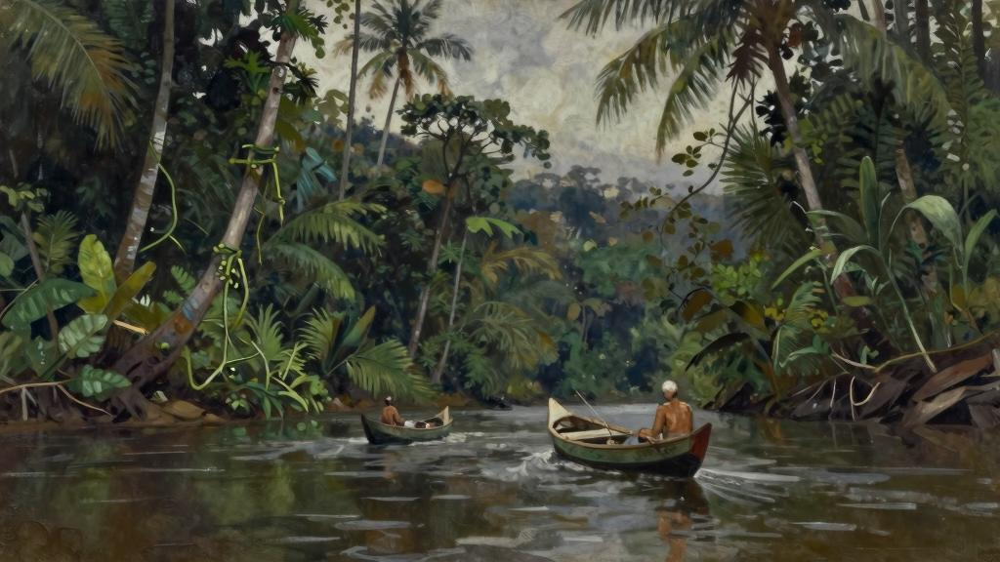
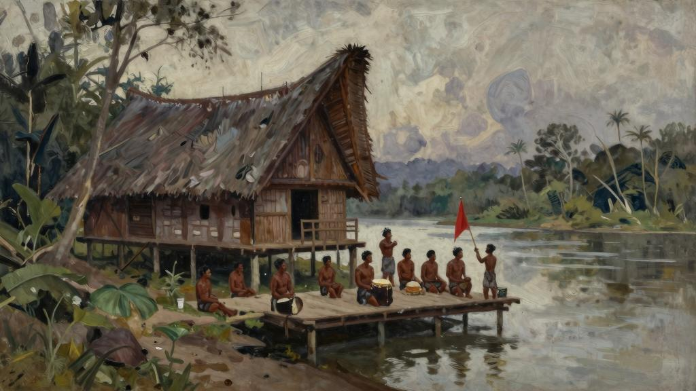
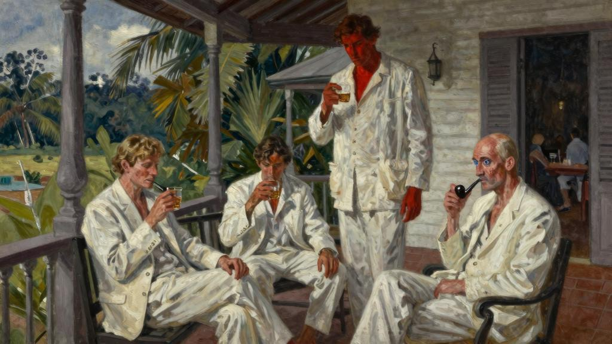
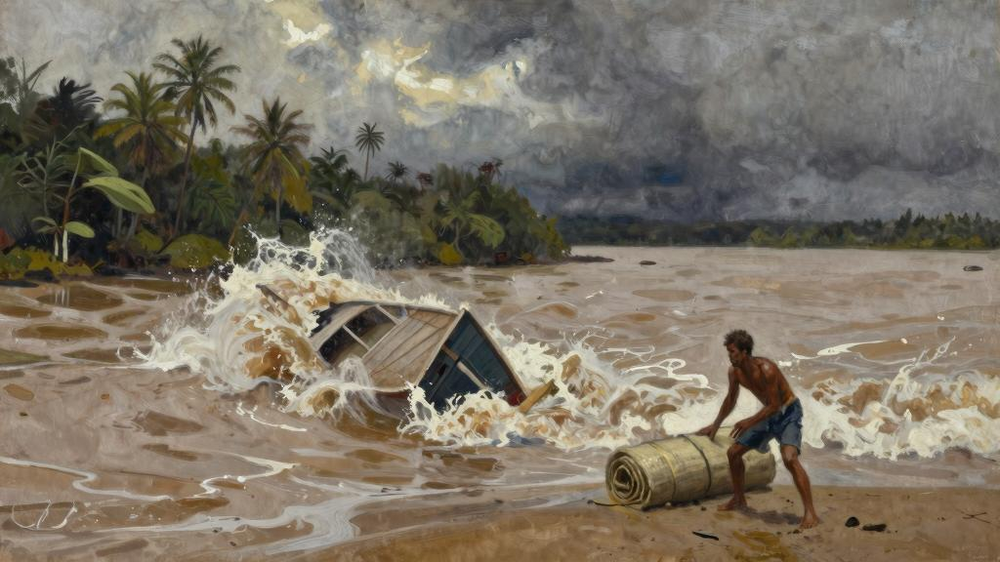
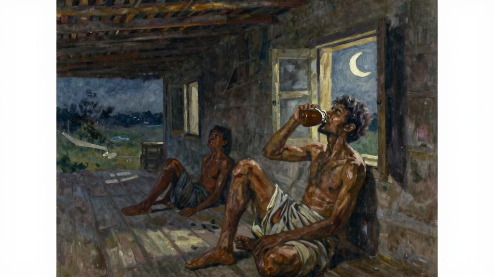
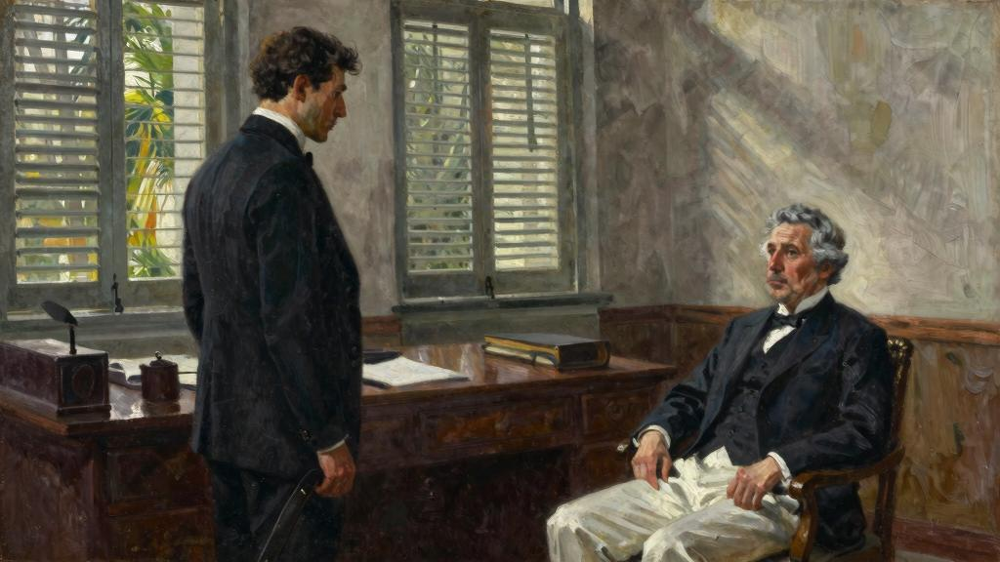

一艘帆船顺流而下，一前一后相隔只有几码[141]远。前一艘船上坐着位白人。

经过七周的河上航行后，想到今晚可以在一个舒适、惬意的房子里留宿，他们倍感兴奋。战争爆发以来，依扎特一直住在婆罗洲，所以对于他来说，达雅克人[142]的住房和宴会已经是司空见惯了。可是，坎皮恩就不同了，他是第一次来到这个国家，一开始所有见闻都感到新奇，但是现在他最渴望的就是有人把椅子坐，有张床可以躺下来睡一觉。

达雅克人热情好客，但是在他们的房子里是否可以住得舒服满意就不得而知了。他们款待客人的形式祖祖辈辈一成不变，很快就会令人感到乏味、倦怠。傍晚，旅行的人们到达码头时，酋长举着一面旗帜，各家各户的重要成员来到河边接待客人。接着，来客被引领到长屋[143]。长屋被称作同一个屋檐下的村庄，是靠多根柱子支撑着的房子。顺着树干上砍凿出的台阶而上，一行人一字排开，伴随着锣鼓声出出进进。台阶边簇拥着一张张棕色的面孔，他们坐在垫子上，默默地注视着面前经过的白人。长屋里摆好了干净的垫子，客人们一一就座。此时，酋长拿着一只活鸡，抓住只鸡腿在空中挥舞三次，高声呼唤神灵见证，祈祷保佑。然后，有人依次进来给客人送上鸡蛋，随后端上来了亚力酒[144]。一个年纪很小的女孩羞答答地走了进来，她像花朵般优雅，可是表情凝滞，让人联想到僧侣。她把一个杯子端到白人嘴边，一直等到喝干，之后喝彩声响起。

伴随着锣鼓声，男人们登场了，他们手持盾牌和帕兰刀，一个接一个踏着细碎的步伐舞过。仪式持续了一段时间后，客人们被带进一个房间。从这里向外看是一个长长的平台，这是普通人家日常生活的地方。晚餐开始了，女孩他们使用中国勺子给客人送上食物。不久，客人都略带醉意，一直畅聊到深夜。

至此，他们的长途跋涉暂告一段落，开始去往海岸。第二天，天刚蒙蒙亮，他们起身上路。河水清澈见底，河床的石子晶莹可见，岸的树木手拉手环绕在河水之上，仰面望去只可见蓝天一线。随着船向前行驶，河床渐渐变宽，船工不再用竹嵩撑船，改用桨划行。河岸枝繁叶茂、郁郁葱葱，满眼的绿树和翠竹。野生的西米棕榈犹如鸵鸟

展开的羽翼一样舒展。岸树木的叶子或硕大无比，或柔软如羽毛，仿佛置身于金合欢树之中，而椰子和槟榔白白的树干鹤立鸡群，直冲云霄。零零散散地，可见一些被雷击和老朽的枯木，白色的树干点缀在一片苍翠之中，格外醒目，盎然怡情；星星点点地，树木之王高高挺起，俯视着热带森林的芸芸众生。时而映入眼帘的还有寄生植物，一簇簇栖息在树杈间，苍翠欲滴。一棵棵开满鲜花的攀援藤条挂在树枝上，仿佛新娘的面纱。这些蔓生植物有的缠绕在高大的树干上，犹如曼妙的紧身外衣；有的仿佛一只开满鲜花的手臂，从一根树枝伸向另一根树枝。如此强烈的生长渴望令人震撼，使人感受到了大自然的激情，又联想到游牧部落以神的名义暴动时的勇猛无敌和放纵不羁。

一天慢慢过去，闷热的天气缓解了很多。坎皮恩看了一眼那只破旧的手表，就要到达目的地了。

“哈钦森这个人怎么样？”他问。

“我不认识他，应该不错。”

哈钦森是这里的驻地官，他们今晚要留宿在他的住处，而且已经派一个达雅克人乘坐独木舟先行去通报了。

“我真希望他能有威士忌，因为喝了太多亚力酒，这辈子都不想再喝了。”

坎皮恩是一位采矿工程师。当时，苏丹[145]去英国的途中，在新加坡与他偶遇。

得知他无事可做，于是苏丹就委托他到森布鲁考察一下，看看是否可以发现可开发的矿藏。苏丹给索洛岛的驻地官威尔斯下达命令，一定提供一切必要的设施和条件。于是，威尔斯派依扎特负责照顾坎皮恩，因为依扎特的马来语和达雅克语都讲得非常地道。这是他们第三次到内陆考察，现在坎皮恩即将带着报告返回。苏丹艾迈德号后天凌晨要经过河口，他们计划乘坐这艘船返回。所以，如果顺利的话，当天下午他们就可以回到索洛岛。他们人都期待返回索洛岛，那里可以打网球、高尔夫球，酒吧里配有台球桌；那里的食物要好很多，一切都舒适惬意。依扎特更是归心似箭，起码他不用天天陪在坎皮恩身边，还可以和他人交往。他瞟了一眼坎皮恩，矮矮的个子，头很大且已经秃顶，

看上去怎么也有五十多岁。但是，他身材匀称结实，脸上胡子拉碴，一双明亮的蓝眼睛看起来机敏过人。坎皮恩长着一口发黄的牙齿，参差不齐，无时无刻不叼着一个石楠木的烟斗。他的穿着很邋遢，卡其色的短裤破旧不堪，汗衫也已穿破，头上的遮阳帽已经磨损，看起来历经沧桑。十八岁起，他便游历世界各地，到过南非、中国和墨西哥。他很会讲故事，和任何人一见面就觥筹交错，喝个不停。总之，和他在一起你不会寂寞。

他们位相处得也算融洽，可是，陪在这么一个人身边，依扎特却总感觉不自在。他们讲笑话，一同开怀大笑，一起举杯畅饮，但是在伊扎特心底却无法产生亲近感。虽然他们的关系比较真挚，可是却始终是熟人而已。依扎特对自己在别人心目中的形象非常敏感。从坎皮恩那双明亮的蓝眼睛和活泼的外表背后，依扎特感到一种冷漠。他总觉得坎皮恩已经对他有了一定成见，可是又很难说清楚是什么，这使得依扎特非常苦恼。这个外表平平的小个子，对他的印象很可能并不好。想到这些，依扎特就恼羞成怒。因为，他心底里所希望的是被他人爱戴，成为一个受欢迎的人。渴望他遇到的人一眼就爱上他而无法自拔，而他只好委屈自己，羞于拒绝而接受这份友情。他多么希望自己能够八面玲珑，然而总是担心被拒绝而裹足不前。有时，他极力逢迎，可到头来却发现自己的唠唠叨叨令人惊慌畏怯，这让他更加心神不安。

阴差阳错地，他和哈钦斯从未谋面，但是冥冥之中好像已经非常了解哈钦斯。当然，哈钦斯也一定知道他。见面后，他们可以聊聊很多共同的朋友。依扎特得知哈钦斯过去住在温彻斯特[146]，所以借此机会可以告诉他，很荣幸自己以前住在哈罗[147]。

帆船在河上一直向前，驶过一个河湾，忽然一片高地映入眼帘，上面矗立着一个平屋。几分钟后，码头上的一切便清晰可见。在一群土著人中间，一位身穿白色衣服的人在朝他们招手。

哈钦斯高高的个子，非常健壮，加之红堂堂的面孔，使人感到他一定是个自信、活泼的人。可是，接触后很快会发现大错特错了，他非常羞怯。他和位客人一一握手致意，依扎特先介绍了自己，然后又引荐了坎皮恩。三人一同向平屋走去。为了尽地主之谊，哈钦斯很想和客人们聊聊天，但是又不知该说些什么。于是，他便带客人来到阳台上。阳台的桌子上摆好了威士忌和苏打水，他们在桌旁的一条长椅上坐了下来。伊扎

特看得出哈钦斯在陌生人面前非常拘谨，于是主动展开话题，侃侃而谈，显得充满活力。他先提起在索洛岛哈钦斯也认识的朋友，自然地过渡到他自己在哈罗的经历。

“您过去是在温彻斯特，是吗？”他问。

“是的。”

“不知道您是否认识乔治·帕克？我们当年在一个部队，他也在温切斯特。不过，他肯定比您年纪小。”

依扎特认为这样可以拉近他和哈钦斯的关系，因为他们同属这类特殊的群体，坎皮恩却没有这样的经历，自然被排挤在外。喝了三杯威士忌后，依扎特便开始亲切地称呼主人为哈奇。他开始高谈阔论，聊起“我的部队”，以及战争期间在“我的部队”结识的朋友，“我的部队”里的老战友他们人品多么多么好。谈话间，他提到三个人的名字，哈钦斯根本不可能知道，而这些人更不可能是坎皮恩会遇到过的人。他完全冷落了一旁的坎皮恩，竟然没有一丝歉意，口若悬河地讲着他认识的人。

“比利·梅多斯？多年前我在锡那罗亚认识一个叫比利·梅多斯的人。”坎皮恩说。

“哦，我认为绝对不可能是同一个人，”依扎特笑着说，“另外，比利是世袭贵族，他就是赛马场上的梅多斯勋爵。那匹‘春天的胡萝卜’就是他的，你记得吗？”

晚餐时间快到了，他们洗漱完毕，喝了杯杜松子酒，大家坐下来聊天。哈钦斯差不多有一年的时间没到索洛岛去了，甚至最近三个月里没见过一个白人，所以他想好好招待一下位客人。虽然他这里没有葡萄酒，但是威士忌可以尽情喝。晚餐后，他拿出了珍藏的泵酒[148]，大家非常尽兴，谈天说地，开怀畅饮。依扎特表现得特别随和，好像哈钦斯是他见过的最贴心的朋友，所以一再邀请他一定尽快去索洛岛。在依扎特看来，这个晚宴堪称完美。他处处暗示坎皮恩，一定要注意自己的身份，不要随意插话。

再加上哈钦斯的羞涩寡言，所以整个谈话似乎和坎皮恩没有任何关系。很快，他哈欠连天，然后告辞，回去休息了。哈钦斯引领他去了房间。回来后，依扎特说：

“你还不想睡觉，是吧？”

“还不想睡，我们再喝一杯吧。”

他们坐下来继续聊天，人都有些醉了。哈钦斯告诉依扎特，他和一个马来女孩在一起，而且已经有了个孩子。他叮嘱他们坎皮恩在场时，不要出来。

“我想她现在已经睡着了。”哈钦斯目光转向旁边的一扇门，“明天早晨让你见见孩子他们。”依扎特知道从那扇门进去就是哈钦斯的房间。

就在这时，听到孩子的哭声。“哦，小家伙醒了。”哈钦斯走到门口，打开门。过了一会儿，他抱着孩子走了出来，后面跟着一位妇女。

“他这段时间长乳牙了，”哈钦斯说，“所以睡不安稳。”

跟在后面的妇女下身穿着一件纱笼，上身是一件白色的薄上衣，赤着脚。她很年轻，黝黑的眼睛非常漂亮。依扎特和她打招呼时，脸上露出灿烂、迷人的微笑。她自己找个位子坐下后，点燃一支烟。出于礼貌，依扎特和她聊了几句，她落落大方应对自如，却没有流露太多的热情。哈钦斯问她是否想喝杯威士忌或者苏打水，她拒绝了。个男人又开始用英语聊了起来。她在一旁一声不响，在椅子上轻轻地摇动着，仿佛陷入某种莫名的沉思。

“她是个很好的女孩。”哈钦斯说，“家里面打理得井井有条，从不多事。当然了，在这里我也只能这样。”

“我绝不会这么做。”依扎特说，“当然，每个人都有结婚的冲动，可之后各种麻烦事就接踵而至。”

“但是，谁能和我结婚呢？对于一个白人妇女来说，这里的生活无法想象，就算给他们世界上所有东西，她们都不会嫁到这里来。”

“当然，这就是个人的取向不同了。不过，我要是有孩子的话，孩子的妈妈一定要是个白人。”

哈钦斯低头看着怀里皮肤黝黑的孩子，微微一笑。

“说来也真是奇怪，你自然就会喜欢他们。”他说，“如果是你自己的孩子，什么肤色都不那么重要了。”

女人看了看孩子，站起来说她抱孩子到床上去睡。

“我们也该睡了。”哈钦斯说，“时间不早了。”

依扎特来到房间，他的随从哈森已经为他拉上了百叶窗。他重新拉开窗子，怕引蚊子进入房间，吹灭了蜡烛，坐在窗前，凝望着温柔的夜空。刚刚的威士忌使他非常清醒，一丝睡意都没有。他脱下身上的帆布裤子，换上一件纱笼，点燃一支雪茄。刚才的激昂和热情一下子烟消云散，哈钦斯深情地看他的混血孩子时的眼神使他心烦意乱，非常苦恼。

“他们有什么权利想要孩子就要孩子。”他自言自语，“在这个世界上，这样的孩子没有出人头地的机会，永远都不会有。”

想着这些，他用手抚摸着自己的腿。因为没有穿裤子，可以摸得到腿上的汗毛，他突然不寒而栗。虽然他努力锻炼，使小腿更健壮，可看起来仍然像扫帚把一样。他痛恨这样的腿，每次想到这些都非常苦闷。这条腿看起来和这里的土著人一样，只能说还有一个好处，那就是非常适合穿高腰靴子。穿上制服的依扎特英俊潇洒，高高的个子，足有六英尺，笔挺健壮；黑色的头发和胡须整整齐齐，一双大眼睛黑黝黝的，非常漂亮、机灵，整个人看起来飒爽英姿。他也自认为是个美男子，所以着装非常讲究。无论是平时休闲的穿着，还是笔挺的正装，他都根据需要选择不同的衣服。他喜欢做一名军人，所以战争结束必须离开部队时，内心备受打击。他的梦想并不远大，一年能赚千英镑，吃上美味的晚餐，经常举办聚会，再就是穿上军装。他非常渴望留在伦敦。

当然了，他母亲就住在那里。可是，他常想，如果找到一个称心如意的女孩，她的家世不错（经济实力比较雄厚），个人有意一同走入婚姻的殿堂，他该如何介绍自己的母亲？父亲已经过世多年，在他职业生涯的后期一直驻扎在最偏远的马来地区。所以，依扎特确信在森布鲁没有人了解母亲的情况。可是他一直生活在惶恐之中，生怕有人在伦敦遇到她，然后写信告诉这里的人们他是个混血儿。依扎特的父亲是一位工程师，始终为英国政府工作。结婚时母亲非常漂亮，可现在她已经是一个老人，身材发胖，头发花白，只知道呆呆地坐着吸烟。依扎特十二岁时，父亲去世，那个时候他的马来语说得比英语流利。一位姑母出钱让依扎特接受更好的教育，于是母亲陪着他到了英格兰。母亲通常喜欢住在配有家具的公寓里，室内装饰着东方风格的布帘，摆放着马来的银餐具，总是又闷又热。因为她随处乱丢烟蒂，和房东的关系非常紧张。依扎特看不惯母亲和朋友相处的方式：认识一个人，仿佛一见如故，然后开始争吵，激烈地吵闹后就气冲冲地跑出房间。生活中唯一让母亲开心的就是电影，一个礼拜每天都去看。在家里，她总是穿着那件颜色艳丽花哨的旧晨衣，但是，一旦出门就会打扮起来，全身装扮得五颜六色，混乱不堪。可以说母亲的这身打扮在整洁、干练的儿子面前，就是一种侮辱。所以，依扎特变得不耐烦，经常和她争吵，为有这样的母亲而蒙羞。可是，在心底里，他深藏着对她的爱，那是一种超乎母子情感的纽带。虽然让他愤怒、失望，但是她仍然是世界上唯一让他感觉自如、放松的人。

由于受到父亲在世时工作的影响，同时在母亲的耳濡目染下学会了马来语，战后无事可做时，依扎特便决定为森布鲁苏丹工作。他身体强壮，有运动天赋，各项比赛都表现不俗。在索洛岛的房间里，摆放着他在哈罗时参加径赛和田赛的奖杯，后来在高尔夫和网球比赛中又获得了多个奖杯。在社交方面，他擅长找到共同的话题与人攀谈，所以成为聚会时的核心人物，他的乐观开朗使他在处理人际关系时总是春风得意。按常理本该快乐地生活，可是他并不愉快，因为他奢望太多，想得到更多人喜欢。可是，令他失望的是，他隐隐约约感觉到，尤其此时此刻这种感觉愈发强烈，周围人对他的青睐已不如从前。他开始心生疑问：在索洛岛经常打交道的熟人是否已经得到了什么消息，知道他的身上有土著人的血脉。如果他们发现了真相，他非常清楚情况将会怎样。他们不会再认为他乐观、友善，而会说他和其他土著人没什么样。周围的人会指责他和许多混血儿一样低效、懈怠。如果这样，当他再谈及娶一个白人妻子时，人们不免投来嘲讽

的目光。天啊！太不公平了！血管里流淌着的土著人的血液，所产生的结果竟有着这样的天壤之别。也正是由于血统的不同，越是在关键时刻，他们会更加密切关注，希望在他身上看到那些土著人的弱点和失败。人人都明白，欧亚混血儿是不可靠的，迟早会做出令人失望的事来。这个道理他也懂，可是今天他禁不住自问：是不是人们笃定了他们会失败，所以他们才没办法成功呢？实际上，根本就没有给他们成功的机会。多么可怜！

听到公鸡的啼鸣，他才恍然意识到时间已经很晚了。他冻得发抖，于是上床睡下了。早晨，哈森把茶端进来时，他感到头痛欲裂。早餐时间，餐桌上摆着各类早餐，那些粥、培根肉和鸡蛋他看都不能看。哈钦斯也是一样，宿醉使他们没有食欲。

“我想我们昨晚喝得太痛快了。”主人笑着说，试图掩盖自己的尴尬。

“我感觉很糟糕。”依扎特说。

“我现在是宁可再喝点酒和苏打水，也不想吃这些东西。”哈钦斯说。

依扎特什么都不想吃。他们不想看到坎皮恩大吃大喝、胃口大开的样子。坎皮恩也趁机拿他们打趣。

“依扎特，老天作证，你脸色发白。”他说，“我从未见过一个人的脸色这么吓人。”

依扎特的脸一下子红了，黝黑的肤色总是能触碰到他敏感的神经，但是他还是佯装微笑。

“是这样的，我的祖母是西班牙人，”他回答，“所以在阳光下待久了，遗传自祖母的肤色就显现出来了。记得在哈罗时，因为一个男孩说我是混血儿，于是大打出手，他被我打翻在地。”

“你的肤色是比较黑，”哈钦斯说，“马来人有没有问过你，是否有土著人的血统？”

“是的，他们非常无礼。”

一艘小船载着他们的装备一大早就出发了，希望在坎皮恩和依扎特之前到达河口。如果苏丹艾迈德号提前到达的话，告诉船长等候一下，就说他们已经在赶往河口的途中了。坎皮恩和依扎特计划午饭之后马上就启程，希望在涌潮经过之前到达晚上留宿的目的地。涌潮是由于地形的特殊性而产生的河水激流汹涌的潮汐波。他们今天经过的河道恰好有一波涌潮经过。前一天晚上，哈钦斯已经提到过，从未见过这种现象的坎皮恩表现出极大的热情。

“这是婆罗洲地区比较大的涌潮，值得一看。”哈钦斯说。

他告诉他们当地人等待涌潮到来，然后随着波涛被推上了涌潮的顶峰，速度快得猝不及防，惊心动魄。他自己也曾经尝试过一次。

“我再也不敢了，”他说，“吓得七魂出窍。”

“我还真想尝试一下。”依扎特说。

“这倒是挺刺激。不过我提醒一下，如果你就乘一艘弱不禁风的独木舟，或者你发现当地人没有出来冲浪，那么你要是真的去了通常会被卷进汹涌的激流之中。万一是这样的话，生还的希望很小……千万别做，我不建议去冒这个险。”

“我年轻时，驶过很多急流险滩。”坎皮恩说。

“让急流见鬼去吧。你焦急地等待着，直到看见涌潮，这是我经历过最恐怖的事。

你他们知道吗？每年仅在这一条河上，因此而丧生的当地人就有十几个。”

整个上午，他们在阳台上懒洋洋地坐着。哈钦斯领他们参观了法务厅，之后有人端上来了杜松子酒，每人喝了三杯。这时，依扎特感觉好了很多，所以午餐开始时他

的食欲又恢复了正常。哈钦斯一直在夸耀他的马来咖喱菜，当热气腾腾、汁多味美的菜端上来时，他们立刻大口吃了起来。哈钦斯还不失时机地劝位客人多喝几杯。

“你他们到船上睡觉就可以了，没什么事情做，为什么不多喝几杯？”

他不舍得二位这么快就离开，很久没有和白人这样痛快地聊天了，所以他百般拖延时间。他劝位客人多吃些，切莫坐失良机，因为晚上长屋里的饭菜实在难以下咽，只能喝点亚力酒。坎皮恩再三催促，希望尽早出发。可是，哈钦斯和依扎特兴致正高，所以他们安慰他说时间还来得及。哈钦斯派人拿来了那瓶珍藏的泵酒，希望在出发前把昨天晚上剩下的全部喝完。

当哈钦斯陪着位客人来到河边时，每个人都喝得摇摇晃晃，分外兴奋。船上面搭起了聂帕棕榈的凉棚，哈钦斯安排在凉棚下铺好了垫子。划船的人都是罪犯，他们身上穿着脏兮兮的囚犯服，手里握着船桨等在那里。今天，他们的任务就是护送位白人到达目的地。依扎特和坎皮恩与哈钦斯握手道别，上船后就躺在了垫子上。船渐渐离岸，河道宽阔，河水浑浊，水波不兴，在午后炙热的阳光下犹如一面铜镜，熠熠闪光。

放眼望去，前方岸苍翠的树木交织在一起，难舍难分。他们都感到了困意。依扎特的头越来越沉，可是他尽力做点什么来排遣睡意。他坚持着，不想这么快就睡着，起码要吸完一支雪茄。然而，待到烟蒂烧到了手指时，他才把烟扔到了河里。

“美美地睡一觉。”他说。

“涌潮的事怎么办？”坎皮恩问。

“没什么，我们没必要担心。”

他打了个哈欠，很响亮，拉着长音，感到四肢像灌了铅一样。一开始，他好像意识到自己睡得很香，之后就什么都不知道了。突然，坎皮恩使劲摇晃，他终于醒了过来。

“我说，你有什么事？”

“那是什么？”

此时，他仍然昏昏欲睡，说话时语气愠怒。他什么也没有听到，顺着坎皮恩手指的方向望去，看到离他们很远的地方有三个白皑皑的波峰，一个接着一个向前涌去。不过，此时看起来还不是那么震撼。

“我想这就是涌潮。”

“我们怎么办？”坎皮恩喊了起来。

此时的依扎特还没有完全清醒，听到坎皮恩焦虑的喊叫声，他禁不住笑了。

“不用担心，这帮家伙了解这个，知道该怎么应对。不过，估计我们会被打湿。”可是，话音未落，涌潮已经迫近，速度惊人，犹如怒吼的大海一样发出轰轰隆隆的声音。依扎特看到波浪比他料想的要高得多，眼前的情景着实令人担忧。他紧了紧腰带，唯恐船翻了之后，裤子会被冲掉。眨眼间，波浪已经到了头顶，就像一面水墙，朝着他们铺天盖地压过来。惊恐中，他们目测海浪足足有十到十二英尺高，显然所有船只都难逃一劫。第一个波浪向他们袭来，所有人浑身都湿透了，一半的船舱积满了水。还没来得及反应，第二个波浪接踵而至，船员开始大喊，发疯似的握着船桨，舵手喊叫着下达命令。可是，面对着汹涌的急流，他们的努力无济于事，整艘船失控也就是个时间的问题，想到这些令人十分恐惧。波浪的力量巨大，船一会儿被推向一边，一会儿又被波涛裹卷着抛向前方，就这样小船在涌潮的浪尖上摇摆不定，完全失控。又一个巨大的波浪袭来，船开始下沉。依扎特和坎皮恩从他们躺着的遮阳棚里爬出来，刹那间船被彻底打翻。他们在水中挣扎着，周围波涛起起伏伏，汹涌澎湃。依扎特头脑里的一个念头就是拼命游到岸边，但是他的随从哈森拼命地喊着，让他靠在船边。很快，所有人都过来抓住了船边。

“你怎么样？”坎皮恩朝他喊。

“还好，享受了一次河水浴。”依扎特说。

在他的想象中，涌潮掀起了河水，波涛已经过去，再过几分钟等他们走出涌潮的中心区域，一切又会恢复平静。然而，他忘记了他们已经被推到浪尖之上，波涛还会席卷而来。大家紧紧地靠在船边，抓住遮阳棚的底座。忽然，一个巨浪打过来，在船被掀翻的一瞬间，所有人都无法再抓住任何东西，只能靠着滑溜溜的船底。依扎特无助地用双手抓摸着光滑的船底，可是船不停地翻滚，最后他终于拼命地抓住了船舷。波浪推动着船不停地翻滚，他感到手已经没有力气，无法抓牢，紧急时刻他一把抓住了遮阳棚的架子，可是这个架子也在随着波涛旋转，最后他又抓住船底一个可以握住的地方。整个船急速地翻来覆去，他想也许是因为大家都在船的同一侧造成的，所以喝令船员到另一侧去保持平衡。然而，他们似乎听不明白。实际上，船员他们无法听清，波浪席卷而来，咆哮震天，所有人都在呼喊。每一次船翻转过去，依扎特都被抛入水中，只好拼命抓住船舷或者遮阳棚才得以浮到水面。他在水中拼命挣扎，这时候他感到呼吸困难，一点力气都没有，无法抓住任何东西。然而，他并不恐惧，已经精疲力竭，周围发生的一切恍恍惚惚。哈森正好在身旁，他告诉哈森自己支撑不住了，哈森鼓励他千万不要放弃。河水依然在咆哮，波涛翻滚，船翻来覆去不停地转动。他们爬在船上，犹如笼中的松鼠，上蹿下跳，无法逃脱。依扎特被灌了好多水，他感到快不行了。哈森也无能为力，可是只要他在身边就是安慰和鼓励。依扎特知道这个男孩子从出生就和水打交道，堪称是游泳健将。过了一分钟，依扎特惊奇地发现船底朝下翻转过来，他终于抓住了船舷，喘了口气。正在这时，艘冲浪的独木舟从他们身旁飞速而过，船上坐着马来人。他们拼命呼喊，可是这些马来人看到有白人在，掉头就离开了，不想惹火上身。这些人见死不救，弃他们的安危于不顾，令人非常愤怒。此时，船又开始翻转起来，速度不快但是一刻不停，他们随着船体翻转，痛苦万分、筋疲力尽，仿佛五脏六腑都被掏空。短暂的喘息使依扎特缓解很多，感觉又有了力气可以支撑一会儿。突然，他又感到呼吸困难，胸口要爆炸了一样，他怀疑自己是否有力气游到岸边。就在这时，他听到一声呼喊。

“依扎特，依扎特，救命啊！救命！”

这是坎皮恩的声音，听得出是临死前挣扎的呼救。这声音使依扎特全身的神经为之一振。坎皮恩，好一个坎皮恩，为什么要去救这个人？他顿时感到非常害怕，一种禽

兽般的、不知所措的恐惧，然而这种恐惧却给了他力量，使他可以坚持下去。他没有回应。

“救救我！快来，快！”他朝哈森大喊。

哈森心领神会。说来也巧，一根船桨正好漂过来，哈森把桨推到依扎特可以够得到的地方，一只手驾着依扎特的胳膊，他们游了出去，离开了依然在翻滚的船。波涛袭来打在依扎特的脸上，他的心怦怦直跳，感到呼吸困难，非常虚弱。河岸是那么遥不可及，他觉得已经无力到达彼岸。就在这时，哈森高喊说他踩到了河底。依扎特也把腿伸下去，可是他什么也感觉不到。于是，他双眼盯着岸边，孤注一掷，拼尽全力游了几下。他又伸腿试了试，感觉到了下面厚厚的淤泥，心里无限感激。河岸近在眼前，他挣扎着往前走。脚踩下去，黑色的淤泥深及膝盖，于是他向前爬，使尽全身力气挣脱着离开了恐怖的河水。岸上杂草丛生，他和哈森一下子扑倒在地，死坨坨地倒在地上。他们精疲力竭，浑身上下满是淤泥，一动不动。可是，一种想法突然出现在依扎特的脑海中：坎皮恩溺水了。想到这里，极度的痛苦迅速传遍全身，令他惊恐不已：回到索洛岛后该如何解释发生的不幸。他肯定会受到责备，没有保护好坎皮恩，在关键时刻没有命令舵手开到岸边、停泊好船只。可是，这也不是他的错，都是舵手的失职。舵手应该了解河上的情况，为什么不开到安全地方避难呢？怎么可以幻想战胜恐怖的激流？当头脑中再次闪现汹涌的河水席卷而来的场面时，依扎特的四肢无意识地颤抖了一下。他下决心一定要找到坎皮恩的尸体，带回索洛岛。他想知道其他船员有没有溺水身亡。想到这里他身心俱疲，无法移动。但是，哈森现在已经站起来，一边拧着浸透河水的纱笼，一边向河上张望着，突然他朝着依扎特喊了起来。

“长官，过来了一艘船。”

依扎特身边是一片白茅草，什么也看不到。

“赶快向他们喊话。”他说。

于是，哈森跑到岸边，穿过悬垂在水面的树枝，一边呼喊，一边不停地挥手。很快，依扎特听到哈森和船上的人在说着什么，不一会儿哈森跑了回来。

“长官，他们看到我们的船翻了。”他说，“涌潮一停他们就过来了。河对面有一个长屋，如果您愿意，我们过去，他们可以给我们衣服和吃的东西，还可以在那里睡一觉。”

一时间，面对着捉摸不定的河水，依扎特已经失去了信心。

“另一位长官怎么样了？”他问。

“他们也不知道。”

“如果他溺水了，一定要找到尸体。”

“还有一艘船向上游划去了。”

依扎特不知道该怎么办才好。他感到四肢麻木，哈森把胳膊伸过去握住他的肩膀，扶他站起来，走过茂密的草丛，来到河边。这里停着一艘独木舟，上面有个达雅克人。此时的河面又恢复了以往的平静。当涌潮过去，很难想象如此宁静的水面片刻之前却像肆虐的大海，那么汹涌。达雅克人把刚才和哈森讲的话又说了一遍，依扎特无力回应，仿佛只要一开口，自己便难以控制，痛哭起来。哈森扶着他上了船，船上的达雅克人撑起浆，离开了岸边。他非常害怕，很想吸支烟，可是烟和火柴在后袋里已经浸满了水。从河的一边到另一边，感觉如此遥远，仿佛永远无法到达终点。此时，夜幕已经降临，当他们上岸时，星星已经爬上了天空，不停地在闪烁。他上了岸，其中一个达雅克人带他到了长屋。哈森拿起这人放下的船桨，和另一个达雅克人一起又离开了岸边。

有三个男人和一群孩子过来迎接依扎特。周围一片嘈杂，他来到长屋，爬上梯子，在问候和评论声中被领进一个年轻人睡觉的地方。人们匆忙铺上一个藤条做的垫子，临时腾出一个地方，他一下子扑到上面。有人拿来一坛子亚力酒，他一口气喝了很多。酒又辣又冲，感觉喉咙仿佛在着火，可是心里却暖呼呼的。依扎特脱下衬衣和裤子，换上了借给他的纱笼。猛然抬头，他看见了空中挂着的一弯新月，浑身感受到极大的快乐。他

禁不住庆幸，自己差一点就成了一具随波漂浮的尸体。他从未觉得月亮如此温馨、可爱。这时，他才意识到饥饿难耐，要人拿些米饭来。一位妇女走进房间开始做饭，此时的他也感觉好了很多，开始考虑回到索洛岛时怎么解释今天发生的一切。没有人会因为他睡着了而谴责他；他肯定是没有喝醉的，哈钦斯可以作证；他怎么会想到那个舵手这么愚蠢呢？这一切只能怪运气不好。可是，一想到坎皮恩，他浑身发抖。一大盘米饭终于端上来，正要开始吃的时候，一个人匆忙跑到他跟前。

“那位长官来了！”进来的人喊着。

“哪位长官？”

听到门口的嘈杂声，他一下子跳了起来，向前走了一步。正在这时，哈森从黑暗中跑进来。他听到有一个人在说话：

“依扎特，你在这里吗？”

坎皮恩走过来。

“啊！又见到你了。谢天谢地！真是死里逃生，不是吗？你看起来还不错，挺舒服的。天啊！我可得喝一杯。”

湿乎乎的衣服紧贴在坎皮恩身上，满身是泥，头发乱蓬蓬的，可是精神很好。

“我也不知道他们从哪里把我带回来的，本来我都做好准备在河岸上过一夜，我还以为你溺水了呢。”

“这有些亚力酒。”依扎特说。

坎皮恩嘴对着坛子喝了一大口，“噗噗”吹口气，然后又继续喝。

“见鬼吧，这是什么酒，不过真够劲。”他咧着嘴，露出了参差不齐的黄牙，冲着依扎特笑，“我说，老伙计，你最好洗个澡吧。”

“过一会儿再洗。”

“好吧，我也等一会儿再洗。让他们给我拿条纱笼来。你怎么逃出来的？”他等不及回答，又接着说，“我以为完蛋了，多亏了这位船员。”他微笑着点点头，向位达雅克罪犯示意。此时，依扎特才模模糊糊地看出他们就是船上的船员。“我紧靠着那个掀翻的船，他俩在我的左右。真不知他们怎么猜到我可能撑不住了。当时，我感觉一分钟都挺不过去了。他们朝我做手势，希望一起冒险尝试一下，游到岸上，可是我觉得已经没有力气了。的确，这是我这辈子吓得最狼狈的一次。这个伙计真是有运动员一样的体魄，我就想为什么他们不弃我而自己逃生。反正，不知道怎么做到的，最后他们抓住了我们一开始躺在上面的那个垫子，把它卷了起来，抛给我，我当时还以为是个破的救生圈。那一刻，我真正体会到了那句谚语太有道理了：将要溺死之人连一根草也要去抓[149]。我一下子抓住了那个东西，他俩一边一个，费了很大劲，历尽千辛万苦才把我拖上岸。”

经历了这么大的风浪后虎口脱险，坎皮恩异常兴奋，口若悬河，可是依扎特根本没有听清他说了些什么，耳畔又响起坎皮恩呼救的声音，这声音仿佛依然在空中回荡。

他极其难受，一种莫名的恐惧感迅速传遍全身。坎皮恩喋喋不休地讲着，是否他在掩盖内心的某种想法？依扎特凝视着那双清澈的蓝眼睛，试图读懂话语背后的真实想法。滔滔不绝的言语中是否掩藏着鄙视和讥讽？他知不知道依扎特不顾他的死活，自己逃离危险呢？依扎特的脸红得发紫。毕竟，事实摆在这里，他都做了些什么？人人都只考虑自己，谁落后谁倒霉。可是，如果回到索洛岛后坎皮恩告诉别人这件事，人们会怎么议论？他不应该自己逃走，现在他真心希望当时没有自顾逃离危险，可是那时候有一种声音他自己都无法战胜，怎么都不想伸出援手。难道每个人都会谴责他吗？任何亲身经历这样肆虐急流的人，应该理解，不会一味责备他的。天哪！汹涌的河水使他精疲力竭，他真想大哭一场。

“你要是也饿了，就把这些米饭吃了吧。”他说。

坎皮恩狼吞虎咽。可是依扎特只吃了一口，突然感到一点胃口都没有，只听着坎皮恩说个不停。依扎特越听越怀疑，他暗下决心，一定要倍加提防。于是，他又喝了

些亚力酒，头昏昏沉沉。

“回到索洛岛我一定会有麻烦。”他试探性地说。

“怎么这么说？”

“我是来照顾你的，你差点溺水，他们一定认为我做得不妥。”

“这也不是你的错，都怪那个可恶的舵手。不管怎么说，重要的是我们都幸免于难。的确，我也认为要送命了，我还朝你喊，不知你听到没有。”

“没有，什么也没听到，当时真是一片混乱，是吗？”

“也许你那时候已经离开了，我还真不知道你什么时候离开船的。”

依扎特突然看着坎皮恩，那眼神非常奇怪，难道是自己想多了？

“当时真是可怕，一切都乱了。”依扎特说，“我都快支撑不住了，我的随从扔给我一把船桨，并且告诉我说你已经上岸，没有危险了。”

船桨？他本来应该把船桨让给坎皮恩，然后让哈森来救他，因为哈森擅长游泳。

坎皮恩很快瞟了他一眼，目光非常锐利，难道这也是他自己想多了？

“我真希望当时能给你更多帮助。”依扎特说。

“哦，我知道当时你都自身难保了。”坎皮恩回答。

酋长又拿来几杯亚力酒，他们喝了很多。依扎特感到天旋地转，他觉得该睡觉了。床铺已经准备好，蚊帐也都支了起来。他们计划明天一早出发，沿河航行，完成剩下的路程。坎皮恩就睡在他旁边，刚刚躺下就进入了梦乡，几分钟后鼾声大起。长屋的年轻人和充当船员的几名罪犯一直聊到深夜。依扎特头痛欲裂，无法再想更多。第二天早晨，当哈森叫醒他时，感觉自己根本就没有入睡。虽然衣服已经洗过、晾干，可是他

他们没有洗澡，所以出来时满脸污垢，形象邋遢。沿着狭窄的小路，他们来到河边。帆船已经在岸边恭候，待他们上去后，船徐徐划行，离开河岸。清晨，一切都那么美好，一望无际的河面格外平静，刚刚升起的太阳照在水面上，波光粼粼。

“活着真好！”坎皮恩说。

他深吸了一口气，歪着嘴，呲牙笑着。今天的坎皮恩没有刮胡子，没有梳洗，但是可以看得出他享受着新鲜的空气，尽情地呼吸。蓝天、阳光、绿树，所有这一切令他欢快、幸福。依扎特无论如何也无法喜欢他。他明显感到坎皮恩的态度和昨晚不一样，不知该怎么办才好。他有心求得坎皮恩的宽恕，因为他的确做得太过分了，而且自己也很后悔，他愿意付出一切重新再来一次。可是覆水难收，做过的事就是过去了。如果坎皮恩告发他的话，他将离开森布鲁，一切都毁了。在婆罗洲，甚至整个英属殖民地，他将声名狼藉。如果他向坎皮恩坦白，相信坎皮恩会保证不提此事。可是，他能信守诺言吗？他看了一眼坎皮恩，一个贼眉鼠眼的家伙：这样的人怎么能信得过？依扎特想起自己昨晚说过的话，虽然不是事实，可又有谁知道呢？无论如何，谁能证明他当时并不是真心认为坎皮恩是安全的呢？无论坎皮恩怎么说，都需要他们个人进行对质，他可以哈哈大笑，耸耸肩，一口咬定坎皮恩昏了头了，根本不知道在说什么。再说，现在也不能确定坎皮恩就一定不相信他说的。当时的情形那么恐怖，人人都挣扎着活命，他也不能确定是什么情况。所以，依扎特有心想重提昨天的事，可是又担心自己这样做会使坎皮恩起疑心。他决定不能再提此事，这是保全自己的良策。回到索洛岛后，他要抢先汇报这件事。

“现在要是能有支烟，就完美了。”坎皮恩说。

“要等上岸后才能有烟抽。”

坎皮恩微微笑了一下。

“人就是这么不可思议。”他说，“早晨刚开始时，觉得活着就很幸福了，别无所求；可是现在又很惋惜，丢了笔记本、照片和剃须刀。”

有一种想法始终潜藏在依扎特的内心深处，虽然昨天夜里他自己都不愿意承认，可是此时此刻在他的头脑中，这个想法越来越清晰。

“乞求上帝，只有他淹死了，我才是安全的。”

“看，船来了！”坎皮恩突然喊起来。

依扎特环顾四周，发现已经到了河口，只见苏丹艾迈德号正在等着他们。他的心一下子沉了下去，竟然忘记船长是英国人，昨天的事肯定需要用英语向他讲述一遍。坎皮恩会怎么说？船长名叫布里登，在索洛岛时依扎特就和他见过面。这个船长一脸的黑胡子，是个活泼开朗的人，但是依扎特觉得这个人特别虚张声势。

“抓紧点，”在他们划到近前时，船长喊道，“从凌晨起就在这等你他们了。”他们登上船的那一刻，船长惊呆了。“喂，你们这是怎么了？”

“给我们拿点喝的，然后再讲给你听。”坎皮恩咧着嘴，笑嘻嘻地说。

“跟我来。”

他们坐在遮阳棚下，面前的桌子上摆着酒杯、一瓶威士忌和苏打水。船长让人倒酒，几分钟后三个人就喝得热火朝天。

“我们遇上了涌潮。”依扎特说。

他感觉自己必须抢先说。尽管在喝着酒，可是他仍然感觉非常干渴。

“啊！是吗？竟然都没有溺水，太幸运了。怎么回事？”

船长和依扎特比较熟，所以他看着依扎特，但是坎皮恩却接过话茬。他详细地叙述了事情的经过，依扎特听着，精神高度紧张。他讲述故事的前一部分时，始终说：他们如何如何；可是，当说到船被掀翻掉入水中时，立刻变成了：他自己怎样怎样。一开始是：他们都做了什么，可是现在是：他发生了什么事，完全不谈依扎特。依扎特不知

道这是否会使他得以解脱，或者恰恰是个危险的信号，为什么他不谈自己？难道是因为在生死存亡的挣扎中，他只想到了他自己，亦或是他已经知道了真相？

“那么，你怎么样？”布里登船长转过头问依扎特。

依扎特正要开口，坎皮恩却抢先回答了船长的话。

“我到河对岸之前，一直以为他溺水了，真不知道他是怎么逃出去的，估计他自己也说不清楚。”

“真是太危险了。”依扎特笑着说。

为什么坎皮恩会这么讲？依扎特看了他一眼，可以确定从他的表情看仿佛是在开玩笑。一切都难以断定，这令他非常痛苦，极度恐慌，又深感羞愧。他心里想，如果自己搞不清楚坎皮恩为什么这么说，现在或者过后找个时间问问他到了索洛岛后他是否也会这样讲。这样叙述发生的事件，不会引起任何人怀疑。如果其他人都不知道，只有坎皮恩清楚，那么当初还不如害死他更安全。

“好吧，总之我觉得你他们能活着，真是太幸运了。”船长说。

到索洛岛并不远，船沿着森布鲁河急速行驶，依扎特心事重重地看着河的岸。

靠河岸的海榄雌和聂帕棕榈常年经历着河水的冲刷，再往远处便是茂密的热带雨林。在成片的果树中间，不时可见木桩支撑着的马来人房屋。他们靠岸时，夜幕已经降临，警察局的戈林到船上来和他们握手致意。他一边核查当地的乘客，一边告诉他们说他也住在旅店里，晚上约了另一位同住在旅店，叫波特的朋友，一起吃晚餐。上来了几个小伙子负责搬走了他们的工具箱，坎皮恩和依扎特依次走下船。他们洗完澡，换了衣服，八点半四人在旅店的公共休息区会面。有人拿上来了杜松子酒，几个人喝了起来。

“喂，布里登告诉我你们差点溺水，是吗？”戈林进来时问道。

依扎特顿时感到自己的脸红了，还没来得及回话，坎皮恩就开始说了起来。依扎特觉得他之所以这样做，就是想按照他的想法讲述整个经历。他内心无比羞愧，浑身燥热。坎皮恩没有说一句蔑视他的话，甚至可以说一点都没有提到他。他暗想戈林和波特是否会感到很奇怪，坎皮恩讲的经历里为什么没有提他。依扎特认真地看了一眼滔滔不绝的坎皮恩，他讲得幽默风趣，虽然不避讳遇到的危险，可是却以开玩笑的方式一带而过。所以，听到他们当时左右为难的处境，个在场的人禁不住哈哈大笑。

“有件事特别好笑，”坎皮恩说，“我到了河对岸后，浑身上下全是淤泥，后悔没跳到河里洗洗。可是，转念一想，我都被河水折磨成这样，从来也没在里面待过这么久，所以就对自己说：不，绝不洗，宁可脏也不洗。可是，等我到了长屋，见到依扎特和我一样黑，我就知道我们是英雄所见略同啊！”

大家捧腹大笑，依扎特也迎合着笑了。他发现坎皮恩这次讲的和向“苏丹艾迈德号”船长叙述的一样。这其中只有一种可能性，那就是他自己很清楚，心知肚明，他已经做好准备怎么告诉其他人这次悲惨的经历。坎皮恩精心设计了这个故事，故意不提依扎特当时那种为人不齿的行为，这一招着实毒辣。可是，他为什么要手下留情呢？在生死攸关的时刻，一个人残酷地抛弃他，难道他不会感到唾弃和愤怒？猛然间，依扎特闪过一个念头：莫非他是要把实情告诉驻地官威尔斯？这样的话，依扎特当然也可以矢口否认，但是否认有什么好处？威尔斯并不傻，他可以去问哈森，绝对不能指望哈森闭口不谈，哈森有可能会出卖他。这样，他就将左右为难，威尔斯会责令他离开这里。

依扎特头痛欲裂，晚餐后就回到了自己的房间，他只想自己一个人静静，安下心来设计下一步行动计划。此时，一个想法突然出现在脑海中，这使他心烦意乱：长久以来他小心隐藏的事情，对于周围的人已经是公开的秘密。肯定是这样，他十分确定。为什么他也有着和当地人一样明亮的眼睛和黝黑的肤色？为什么他说马来语这样轻而易举，而且很快就学会了达雅克语？他们肯定都明白。自己还夜郎自大，编造出了西班牙祖母的谎言，多么愚蠢！每次他讲这些时，周围的人都在偷着嘲笑他，在背后会称呼他为“可恶的黑鬼”。他的脑海中又闪过一个念头：会不会就是由于血管里流淌着土著人的血液，在坎皮恩呼救时，他才会坐视不管，任其挣扎？不管是什么原因，在那一刻每个

人都惊恐万分，为什么就该是他站出来，牺牲自己去救一个根本不在乎他的人呢？难道疯了吗！可是，在索洛岛，人们就希望他这样做，任何借口都很苍白。

最后，他上床，躺下后翻来覆去，也不知道折腾了多久好不容易才睡着了，可噩梦中又突然惊醒。他梦见自己又遇到了肆虐的急流，船翻过来转过去，终于抓到了船舷，可是又无法抓牢，在松开手的一刹那绝望了，河水无情地向他涌来。天还没亮，依扎特就醒了，睡意全无，他想先入为主，尽快找到威尔斯，把发生的事情告诉他。他字斟句酌，要说哪些细节，用什么话讲这些经历，一遍遍谋划着。

依扎特起得很早，生怕坎皮恩早饭前出去，人碰见。他沿着大街走去，估计驻地官应该在办公室了，他才折返回去。报上自己的姓名，之后被领进了威尔斯的办公室。威尔斯年纪比较大，头发花白稀疏，脸色发黄。

“很高兴看到你安全返回。”他边和依扎特握手边说，“听说你们差点溺水，是吗？”

今天，依扎特打扮得英俊潇洒，帆布裤子洗得干干净净，遮阳帽洁净无瑕，黝黑的头发梳理得非常整齐，胡须也精心修剪过。整个人看起来干练、挺拔。

“长官，因为您让我照顾坎皮恩，所以我想应该马上过来向您汇报一下。”

“可以，说吧。”

依扎特讲了全部经历。他有意淡化这次事故的危险性，想让威尔斯感到没有那么严重。如果早点出发的话，绝对不会有这个麻烦。

“我当时极力想让坎皮恩早点出发，可他不想那么早离开，所以又多喝了杯。”

“他害怕了吗？”

“这个我不太清楚。”依扎特温和地笑了一下，“不过，也不能说他很镇定。”

他继续讲着，想尽办法暗示坎皮恩当时已经是慌了手脚。这是可以理解的，尤其对一个不太擅长游泳的人来说，的确很恐怖。言外之意，他依扎特就不同了，心里担忧的是坎皮恩，而没有顾虑自己的安危。他心里很清楚，只有冷静才有生的希望。在大家都非常沮丧的时候坎皮恩惊慌失措，非常害怕。

“这个也不能责怪他。”驻地官说。

“是的，长官。我尽力了。可是，当时的情况，我也无法做得更好。”

“好的，最令人欣慰的是你他们都幸免于难，如果他溺水身亡的话，我们大家的日子都不好过，那将很难处理。”

“是的，长官。所以我想在你见到坎皮恩之前，先来和您说一下这件事。我想他讲起来可能会故弄玄虚，实际上也没必要那么夸张。”

“总的来说，你他们人讲的是一致的。”威尔斯笑着说。

依扎特脑袋一片空白，呆呆地看着驻地官。

“今天上午你没见到坎皮恩吗？昨天，我听戈林说你他们遇到了麻烦，所以在堡垒那里吃过晚饭，就过去看了看。我去时，你已经回房间休息了。”

依扎特感到自己在颤抖，竭力控制，保持镇定。

“顺便问一下，你先逃离的，是吗？”

“长官，我也不知道到底是谁先离开的。您也知道，当时特别混乱。”

“如果你比他提前到了河对岸的话，那一定是你先离开的。”

“那么，可能是这样吧。”

“不过，谢谢你过来告诉我。”威尔斯说着，站起身。

在他站起来时碰到了一些书，书“嘭”的一声掉在了地板上。这突如其来的声音把依扎特吓了一跳，他惊讶地喊了一声，驻地官很快看了他一眼。

“嗨，你也太紧张了。”

依扎特无法控制自己，浑身发抖。

“非常抱歉，长官。”他低声说。

“我也想到了，这个事肯定是一次打击。你也不要太紧张，这几天放松放松。用不用找医生开点药？”

“我昨晚没睡好。”

驻地官点点头，似乎非常理解。依扎特离开驻地官办公室，出来时遇到了一个熟人，停下来祝贺他大难不死。看得出来，这里的人都知道了这件事。他步行回到旅店，一边走一边回想自己告诉驻地官的事情经过，真的和坎皮恩讲的一样吗？他万万没想到驻地官已经从坎皮恩那里知道了事情的来龙去脉。昨晚自己竟然提前回去睡觉，太愚蠢了！怎么能让坎皮恩离开自己的视线。驻地官还一直倾听他讲述，为什么不说已经知道了事情的经过？现在，依扎特特别恨自己，为什么要提到坎皮恩喝醉了，而且惊慌失措。本来，他这样说是想诋毁坎皮恩，可是现在看这么做愚蠢至极。可是，威尔斯怎么会提到他提前离开的事呢？难道他也会手下留情，或许想打探出什么细节？威尔斯可是老奸巨猾。到底坎皮恩都说了什么？无论付出什么代价，一定要搞清楚。依扎特强压怒火，如同一头被围猎的动物，已经无法控制。然而，理智告诉他必须镇定。他意识到威尔斯并不欣赏他，有三次在办公室里就责怪他办事粗心大意。或许等到把所有事实都搞清楚后，威尔斯就该采取行动了。依扎特感到自己快要崩溃了。

一进旅馆，迎面就看到坎皮恩伸着条腿坐在长椅上。他正在读着他们离开的这段时间送过来的报纸。看到这个卑劣的侏儒，想到他玩弄自己于掌心，依扎特感到一股莫名的冲动和仇恨涌上心头。

“喂！”坎皮恩抬起头说，“你去了哪里？”可是，在依扎特看来，他的眼中充满了讥讽和嘲笑。他握紧拳头，呼吸开始加快。

“你和威尔斯说了我什么？”他突然问。

这个突如其来的问题和咄咄逼人的语气是坎皮恩始料未及的，他惊呆了。

“我觉得没有说关于你的事，怎么了？”

“他昨天晚上不是来过吗？”

依扎特眉头紧锁，一脸愤怒的表情，紧盯着坎皮恩，想看看他是怎么想的。

“我告诉他你头疼，先睡去了。他想了解我们遇到的那个事故。”

“我刚见过他。”

依扎特走来走去。尽管是清晨，而且房间又大又荫蔽，但是太阳的炙热已经发挥了威力。依扎特感到自己仿佛被一张网裹着，完全失去了方向，心中充满愤怒。他恨不得抓住坎皮恩的脖子，把它扭断，可是又找不到仇恨倾泻的对象，愈发觉得无能为力。

他感到疲惫，备受煎熬，精神几乎崩溃。忽然，一直使他亢奋、勇猛的愤怒一下子不见了，他仿佛被抽空了，无限地失望。在他的血管里流淌的不是血液，而是滔滔的河水。

他感到心冰冷冰冷，双膝发软，如果不控制自己会嚎啕大哭。他伤心欲绝。

“该死的！我希望上帝再也不要让我见到你！”他悲哀地喊着。

“到底发生了什么事？”坎皮恩惊讶地问。

“好了，别装了，我们都装了天了，受够了。”他的声音格外刺耳，尤其是由一个有活力、强悍的男人发出来，更加让人感到奇怪，“我受够了。是我抛弃你逃走了，

是我任凭你在水里挣扎，坐视不管。我知道这么做不光彩，可我控制不住。”

坎皮恩慢慢地从椅子上站了起来。

“你到底在说些什么？”

从他的语气听得出，他非常吃惊。这反倒使依扎特吓了一跳，他感到脊背发凉，浑身颤抖。

“你呼喊救命时，我也是惊恐万分，当时刚抓住一根船桨，就让哈森扶我离开了。”

“你这么做是最理智的。”

“我没有帮你，当时我也束手无策。”

“那是自然的。我也是该死，喊你救我真是太愚蠢了，只能白白浪费力气。那种状态下，力气对我来说才是最要紧的。”

“你的意思是说你根本不知道？”

“那个伙计给我垫子的时候，我以为你还在船那里。所以，我一直以为我比你先离开。”

依扎特双手抱着头，无助地发出了沙哑的呼喊。

“天啊！我多么愚蠢。”

个人站在那里，注视着对方，这种沉默仿佛无休无止。

“现在你打算怎么做？”依扎特最后问。

“哦，老兄，别担心。我自己都魂飞魄散了，怎么能责怪一个同样胆怯的人，我不会和任何人讲。”

“好，但是你心里是清楚的。”

“我向你保证，你应该相信我。再说，我的任务已经完成，打算回去了，想坐下一班船去新加坡。”停顿了一会儿，坎皮恩若有所思地看着依扎特，“我只求你一件事。在这里，我也结识了很多朋友，有的事我还是很在意的。你向别人讲我们那天发生的不幸事件时，请不要说我当时表现得多么懦弱，不希望朋友他们认为我当时都不知所措了。这样，我将不胜感激。”

依扎特的脸红得发紫，他想起来自己向驻地官说过的话，仿佛坎皮恩在背后偷听到了他们的谈话。他清了清嗓子。

“我想知道，你为什么认为我会这么说？”

坎皮恩温和地嘿嘿一笑，他的蓝眼睛中又现出快乐的神情。

“惶恐。”他咧着嘴笑了起来，露出了参差不齐的黄牙，“孩子，抽支雪茄吧。”

[1]出《道林·格雷的画像》第二章。

[2]老贝利中央刑事法院（Old Bailey），英国最古老的法院，也被称作“老贝利”。

[3]法袍（robe），一种法官服装。身披法官袍的法官彰显了司法审判权的独特性、权威性和神圣性。

[4]波特酒（Port），葡萄酒名称，产于葡萄牙。

[5]蒙哈榭白葡萄酒（Montrachet），葡萄酒名称。该酒由法国罗曼尼康帝酒庄酿造。

[6]木桐酒庄（Mouton Rothschild），全名是木桐·罗斯柴尔德酒庄，位于法国波尔多的波亚克地区，是法国著名葡萄酒生产地。

[7]马丁尼（Martini），一种鸡尾酒，被誉为“鸡尾酒之王”。

[8]圣让（St Jean），法国的滨海小镇。

[9]英里（Miles），英制长度单位。1英里≈1.61公里。

[10]马来亚（Malaya），现称马来西亚半岛，当时称为“英属马来亚”，简称“马来亚”，是英国殖民地之一。

[11]蒙特卡洛（Monte Carlo），摩纳哥公国的一座城市，位于欧洲地中海之滨，有“赌博之城”的称号。

[12]高尔夫轻击手（putter），运动术。“轻击”属于短距离击球技术，“轻击手”是擅长使用轻击打法和推球的球手。

[13]轮盘赌（roulette），一种在赌场赌博的方式。玩法简单，在欧美比较流行。

[14]巴比妥（veronal），一种催眠药，有镇静、催眠、抗惊厥、麻醉等不同程度的中枢抑制作用。

[15]布鲁姆伯利居住区（Bloomsbury），英国伦敦中北部的居住区，因在20世纪初期与知识界的人士密切相关而闻名于世。

[16]塞尚（Cézanne，1839—1906），法国画家。全名保罗·塞尚（Paul Cézanne）。

[17]布拉克（Braque，1882—1963），法国画家。全名布拉克·乔治斯（Georges Braque）。

[18]毕加索（Picasso，1881—1973），西班牙画家、雕塑家。全名巴勃罗·鲁伊斯·毕加索（Pablo RuizPicasso）。

[19]诺福克夹克（Norfolk Jacket），一种男士上衣，起源于19世纪英国贵族绅士他们秋冬的狩猎活动，是19世纪后期休闲装的代表。

[20]英皇大道（King's Road），伦敦街道名称，20世纪时是伦敦时尚的代名词。

[21]奥维达（Ouida，1839—1908），英国维多利亚时代著名的女作家。

[22]爱德华时代（Edwardian era，1901—1910），英王爱德华七世在位的时期。

[23]梅尔巴（Melba，1861—1931），澳大利亚著名的花腔女高音。

[24]马扎尔人（Magyar），匈牙利的主要民族之一。

[25]大公妃（archduchess），欧洲封建等级称号。“Archduchy”的意思是“大公”，在欧洲封建诸侯等级中，其地位略高于公爵，他们的妻子就是大公妃。

[26]塞维利亚（Sevilla），西班牙西南部古都和工商业、文化中心。

[27]《第五交响曲》（The Fifth Symphony），德国作曲家贝多芬的C小调第五交响曲，又名《命运交响曲》，是贝多芬最为著名的作品之一。

[28]黑柏树（black cypress），一种地中海附近生长的柏树，以其稠密的墨绿色叶子而得名。

[29]科芬特花园（Covent Garden），位于伦敦中部的一座花园。

[30]查理二世（Charles II，1630—1685），苏格兰及英格兰、爱尔兰国王，生前享有“欢乐王”的称号。

[31]大都会歌剧院是纽约一个世界级的歌剧院。

[32]舒曼（Schuman，1810—1856），19世纪德国作曲家、音乐评论家，全名“罗伯特·舒曼”。

[33]原文为德：Mild und leise wie er lächelt, Wie das Auge der öffnet。取自瓦格纳歌剧《特里斯坦与伊索尔德》（Tristan and Isolde）中的唱段“爱之死”。

[34]伊索尔德，德国作曲家理查德·瓦格纳的巅峰之作《特里斯坦与伊索尔德》中的人物。

[35]“爱之死”（Liebestod），歌剧《特里斯坦与伊索尔德》第三幕的终场音乐，是伊索尔德在特里斯坦逝去时，也是在自己弥留之际的一段绝唱。

[36]痈（carbuncle），一种皮肤和皮下组织的化脓性炎症，易生于颈、背部，常伴有畏寒、发热等症状。

[37]罗伯特（Robert），即弗雷斯蒂上尉。

[38]新英格兰（New England），位于美国的东北部。

[39]匡登（Quorn），英国的一个狩猎组织名称。在英国王室的传统中，狩猎是最具代表性的户外娱乐活动，已经延续了几百年。

[40]什罗普郡（Shropshire），英国英格兰西米德兰兹的一个郡。

[41]克鲁瓦塞特大道（Croisette），戛纳主干道，最有名的酒店、餐馆、奢侈品店的聚集地。

[42]准男爵（baronetcy），英国特有的爵位，可以世袭。

[43]铁道牌（chemin de fer），法国的一种扑克牌游戏，属于“卡西诺牌戏”系列。

[44]克朗（Crown），英国旧时的货币单位。

[45]冷溪近卫团（Coldstream Guards），英国陆军近卫师和皇室近卫师的一部分，是英国正规军中历史最为悠久的军队单位。

[46]单人纸牌游戏（patience），一种扑克牌游戏。

[47]苏瓦松（Soissons），法国北部埃纳省的主要城市之一。

[48]马其诺防线（Maginot Line），军事防御建筑名称。法国在第一次世界大战后，为防德军入侵，在法国东北边境地区构筑的防线。

[49]油布（oil-cloth），一种用于防水或防湿、防潮而上过油的布，也可以用于搬运，防止搬运过程的磨伤。

[50]葛利亚奶酪（gruyere cheese），瑞士的一种奶酪，带着微甜、凝脂的味道，并且伴随着微咸的干果味。

[51]波尔多（Bordeaux），法国西南部城市。

[52]南锡（Nancy），法国东北部城市。

[53]雪铁龙（Citroën），法国著名汽车品牌之一，公司创立于1915年，创始人是安德烈·雪铁龙。

[54]共济会，宗教组织名称。全称为“Free and Accepted Masons”，字面意思为“自由石匠”，出现在18世纪的英国，是一种带宗教色彩的兄弟会组织。

[55]原文为德：Luftwaffen。此处指纳粹时代的德国空军。

[56]丽兹酒店（Ritz），由凯撒·丽兹于1898年创办，位于巴黎一区的旺多姆广场北侧。

[57]咖啡占卜（to see it in the coffee ground），一种占卜方法，又称为“希腊咖啡占卜”，或是“土耳其咖啡占卜”，方法是喝完咖啡之后，以所剩下的残渣、形状或图案，预测事情。

[58]扑克牌占卜（put out cards），一种占卜方法。在七世纪时由吉卜赛人流传入欧洲。

[59]斯图加特（Stuttgart），德国西南部的城市，是斯图加特地区首府和该州的第一大城市。

[60]温柔体贴之人（lamb），“lamb”有“羔羊”的意思，同时也可以表示“宝贝”“乖乖”“温顺的人”的意思。

[61]达佛涅斯和克洛伊（Daphnis and Chloe），古希腊田园传奇中被后人视为楷模的一对天真无邪的情侣。

[62]保罗与弗兰切斯卡（Paolo and Francesca），拉文纳的贵族基多出于政治动机，将女儿弗兰切斯卡许配给里米尼领主之子，丑陋、跛足的乔凡尼·马拉泰斯塔。马凡尼自知丑陋，特派弟弟保罗前去与弗兰切斯卡见面。弗兰切斯卡以为自己的未婚夫就是保罗，深深爱上了他。婚后，她与乔凡尼毫无感情，暗中仍与保罗幽会。乔凡尼得知此事后，在妒恨中将妻子和弟弟杀死。

[63]雅各与神角力（Jacob wrestled with the angel of God），《圣经》中的故事，这里喻指一生中最重要的经验，认识上更进一步的经历。

[64]科蒂先生（Monsieur Coty），此处指科蒂集团，由弗兰西斯·科蒂于1904年在法国巴黎创立，科蒂集团是香水公司，也是全球美容界的供应厂商。

[65]乔治王（King George），乔治王时代（Georgian era）指英国乔治一世至乔治四世在位时间（1714—1830）。文中“乔治王的臣民”指英国人。

[66]姜汁啤酒（ginger ale），姜汁啤酒分为含酒精和不含酒精两种。

[67]干马提尼（Dry Martini），也译为“干马丁尼”，是一种鸡尾酒，其调法最多可高达两百多种以上，故人们称其为“鸡尾酒之王”。

[68]亚历山大（Alexandria），埃及北部港口，亚历山大省省会。

[69]贝鲁特（Beirut），黎巴嫩首都。

[70]纽约第五大街（The Fifth Avenue），全球著名的商业街，位于美国纽约曼哈顿，美国最著名的高档商业街。

[71]维多利亚车站（Victoria Station），位于伦敦西敏市，现在是伦敦地铁及国家铁路局的车站兼伦敦首要交通枢纽，是最繁忙的车站之一。

[72]您曾经也学过医（You're in the medical），根据资料显示，本书作者于1892年至1897年在伦敦学医，并取得外科医师资格。

[73]坎伯威尔（Camberwell），原伦敦市的一个区。

[74]西勒诺斯（Silenus），希腊神话中的森林之神。

[75]高调悲剧（high tragedy），以悲剧的形式，尤其是通过悲剧人物形象和精神，激发人们在现实生活中实现自己的价值，鼓舞人们热爱生活，带给人奋斗的精神。

[76]瓜达尔基维尔河（Quadalquivir），位于西班牙南部，是西班牙的第五长河，也是安达卢西亚自治区境内的第一长河。

[77]萨拉曼卡（Salamanca），西班牙省的省府，坐落在托尔梅斯河（Tormes）北岸。

[78]谢尔佩斯（Sierpes），塞维利亚的一个街区。

[79]戈雅（Francisco de Goya，1746—1828），西班牙画家。

[80]安达卢西亚马（Andalusian horses），世界上最古老也最纯正的马种之一，在西班牙南部安达卢西亚省有培育该马的种马场。

[81]这个家族源自于西班牙的莱昂王国，生活在伊比利亚半岛的西北部。

[82]曼柴尼拉酒（Manzanilla），一种略带苦味的西班牙雪利酒。

[83]古老的多斯·帕洛斯家族（the ancient house of Dos Palos），此处指公爵夫人丈夫的家族。

[84]多斯·帕洛斯公爵（Duke of Dos Palos），此处指的是故事中公爵夫人的儿子。

[85]西班牙黄金时代（Spain in the Golden Age），从15世纪持续至17世纪，这段时期的西班牙是世界上最富有的国家之一，艺术和文学蓬勃发展。

[86]卡尔德隆（Calderón），西班牙剧作家。

[87]圣体节（Corpus Chiristi），一种宗教庆祝活动，始于13世纪比利时的一些教区，之后渐渐推行至各地的天主教会。

[88]美西战争（Spanish-American War），1898年美国为夺取西班牙属地古巴、波多黎各和菲律宾而发动的战争，是列强重新瓜分殖民地的第一次帝国主义战争。

[89]马尼拉麻披肩（Manila shawls），一种用马尼拉麻制作的披肩。马尼拉麻又称为马尼拉麻蕉，原产于菲律宾，广泛生长在婆罗洲和苏门答腊岛，其纤维坚实，常用来放缆索和地毯等。

[90]角斗士（gladiator），古罗马时代从事专门训练的奴隶、被解放的奴隶、自由人或是战俘，他们手持短剑、盾牌或其他武器，彼此角斗，博得观众的喝彩。

[91]格拉纳达王国衰败（The fall of Grannda），科尔多瓦衰败以后，西班牙的穆斯林内讧不断，曾经在安达卢西亚地区强大的伊斯兰统治不复存在，格拉纳达（Granada）是摩尔人最后一个城邦。

[92]摩尔人（Moorish），此处指在11—17世纪创造了阿拉伯安达卢西亚文化，并随后在北非作为难民定居下来的西班牙穆斯林居民或阿拉伯人。

[93]阿尔巴公爵（Duke of Alba），“阿尔巴”是西班牙最显赫、最古老的贵族家族——阿尔巴家族，堪称西班牙“贵族中的贵族”。

[94]比塞塔（Preseta），西班牙货币单位。

[95]阿尔卡萨尔（Alcázar），阿尔卡萨尔王宫在塞维利亚城市中心。这座王宫是欧洲最古老的皇家宫殿，始建于公元10世纪。

[96]唐·佩德罗一世（Pedrol Ⅰ，1798—1834），葡萄牙摄政王之子，巴西的第一任皇帝。

[97]菲利普二世（Philip II，1527—1598），菲利普二世执政时期是西班牙历史上最强盛的时代。

[98]菲利普四世（Philip IV，1268—1314），菲利普四世在任期间，西班牙帝国虽然仍拥有广大国土，但已经走向衰落。

[99]《唐怀瑟》（Tannhauser），一部根据德国中世纪传说写成的三幕歌剧。

[100]卡莫纳（Carmona），西班牙南部安达卢西亚地区的一个小镇，有着悠久历史。

[101]乔治·戈登·拜伦（George Gordon Byron，1788—1824），英国19世纪初期伟大的浪漫主义诗人，在他的诗歌里塑造了一批“拜伦式英雄”。

[102]波旁家族（Bourbons），一个在欧洲历史上曾断断续续地统治若干公国的跨国家族。

[103]埃西哈（Ecija），西班牙安达卢西亚自治区塞维利亚省的一个市镇。

[104]马衣（caparison），给马或其他牲畜准备的一种护具。专业骑手都会给自己的爱驹购置各式各样、不同功能的马衣，有时出于美观的目的为普通的马也购置马衣。

[105]西班牙冒险家，指的是15世纪至17世纪间，到达并征服美洲新大陆及亚洲太平洋等地区的西班牙军人、探险家。

[106]马卡雷纳（La Macarena），西班牙塞维利亚市中心北部的一个行政区。

[107]安达卢西亚人（Andalusian），指位于西班牙南部的安达卢西亚地区的人。

[108]加利西亚人（Galician），西班牙少数民族，主要聚居在西班牙西北部的加利西亚地区。

[109]瑞尔（Reale），西班牙旧时的银币单位。

[110]特里亚纳（Triana），西班牙塞维利亚的一个街区。

[111]原文为西班牙：madre。

[112]圣伊西德罗（San Isidoro），塞维利亚的守护神。

[113]响板（castanet），西班牙民间的打击乐器，以贝壳形的两块乌木碰击发音，主要用于歌舞的伴奏。

[114]原文为西班牙：Olé，是感叹词，经常被用在和声和歌词中，加强节奏，表达欢快的心情。

[115]卡拉布里亚（Calabria），意大利南部的一个大区，包含了那不勒斯以南的意大利半岛。

[116]阿尔赫西拉斯（Algeciras），西班牙南部一港口城市，位于直布罗陀海峡对面的阿尔赫西拉斯湾。

[117]力拓河（Río Tinto），为西班牙，意思是“红酒河”，为西班牙南部安达卢西亚境内的一条河流。流域内富有铜、铁、金等矿藏。

[118]赫雷斯市（Jerez），西班牙西南部城市，以酿制雪利酒及培育混血良种马著称。

[119]特威德河（Tweed），苏格兰东南部和英格兰东北部河流，源于特威德韦尔斯西南的边境地区，形成英格兰与苏格兰的界河。

[120]卡莫纳（Carmona），西班牙安达卢西亚的一个小镇。

[121]梅里达（Mérida），西班牙城市，埃斯特雷马杜拉自治区首府所在地，由当时的罗马人在其战略要道上所建。

[122]卢卡（Lucca），意大利中部城市，是意大利农产品聚集区，也是橄榄油生产地。

[123]特雷西洛扑克牌（Tresillo），最早的西班牙牌（Hombre）是用40张牌玩的，“Tresillo”是后来衍生的玩法。

[124]躁狂症（mania），也称为“躁狂抑郁症”或“情感性精神病”。病状主要为情感的不正常，行为及思维有障碍。

[125]婆罗洲（Borneo），位于东南亚马来群岛中部，历史上曾为英国殖民地。

[126]差点（handicap），这个词起源于赛马比赛，一位职业的赛马骑师把赌注的比率放在帽子里递上去（hand-in-cap）。在高尔夫比赛中，指给弱者增加的杆数，按击球次数计数，并随参赛者的进步而减少，目的是即使两个水平不同的人，也可以进行一次比赛；如果没有差点，水平低的人会毫无悬念地输了，也没有比的必要了。

[127]林肯律师学院（Lincoln's Inn Fields），英国伦敦四所律师学院之一。

[128]维多利亚女王（Queen Victoria），本文指的是19世纪英国维多利亚女王在丈夫阿尔伯特亲王去世后，完全放弃了以往的着装，改穿丧服，为亡夫服丧近半个世纪，也因此形成了维多利亚时期的丧服时尚。

[129]热病（fever），指夏天的暑病。

[130]震颤性精神错乱（delirium tremens），或震颤性谵妄（简写成DT），多发生于酒依赖患者突然断酒或突然减量过程中，是一种急性戒酒综合征。

[131]波状刃短剑（kris），或译为波形刀，是马来或印度尼西亚地区用的工具。

[132]帕兰刀（parang），是马来人用的带鞘砍刀，也称“马来剑”。

[133]海榄雌（mangrove），海榄雌科的植物，多生于海边或盐沼地。

[134]聂帕棕榈（nipah），属于常绿乔木植物，是世界上最悠久的棕榈之一，扇形叶，簇生，主要分布于东南亚。

[135]纱笼（sarong），马来人穿的一种服装，由一块长方形的布系于腰间，类似一种筒裙。

[136]英国黑醋（Worcester sauce），也可译为“伍斯特沙司”，是一种英国的调味料，口味酸甜微辣，黑褐色。

因为发明地是伍斯特郡，因此而得名。

[137]猩红热（scarlet fever），一种急性呼吸道传染病。

[138]克拉里奇酒店（Claridge's），位于伦敦西区的中心。

[139]戴维斯街（Davies Street），位于伦敦梅菲尔区。

[140]布伦园林（Bois de Boulogne），法国巴黎的公园，与塞纳河畔的纳伊郊区接界，从17世纪开始便是公众娱乐的中心。

[141]码（yard），长度单位，等于3英尺或0.9144米。

[142]达雅克人（Dyak），印度尼西亚加里曼丹岛的土著居民，分布在印尼、马来西亚和文莱三国。

[143]长屋（long-house），马来西亚东部的一种独特民居。长屋往往沿河而建，靠木桩支撑而起，屋子长短不同。

[144]亚力酒（arak），一种亚洲产的烈酒，用椰子汁，糖蜜等制成。

[145]苏丹（the Sultan），某些伊斯兰教国家统治者的称号。伊斯兰教在10世纪传至马来西亚，后来这个地区分裂成众多以伊斯兰教为主的苏丹国。

[146]温切斯特（Winchester），英格兰南部城市。

[147]哈罗（Harrow），伦敦哈罗区的一个大镇，位于伦敦西北郊。

[148]泵酒（benedictine），产自法国的一种甜酒。

[149]小说中的这句谚原文是“A drowning man will clutch at a straw”，可翻译为“救命稻草”，“有病乱投医”。

[150]作者加。

权信息伤疤的男人作者：（英）毛姆译者：赵巍　牛万程品牌方：九久读书人

录权信息

“一花一世界”——《毛姆短篇小说全集》总序神罚之人情非得已天涯末路异邦谷田创作冲动贞洁带伤疤的男人关门歇业乞丐凶梦弥足珍贵后记

“花世界”——《毛姆短篇小说全集》总序引言现代英国文学史上，毛姆（William Somerset Maugham，1874—1965）是一位多才多艺、成就斐然的重要作家。他的社会阅历之广博，创作生涯之漫长，几乎无人堪比。毛姆一生著有二十一部长篇小说、一百五十多篇短篇小说、三十一部戏剧、两部文学评论集、三部游记、四部散文集和两部回忆录，是二十世纪上半叶英国文坛极负盛名的一位能工巧匠。尽管评论家他们历来对他褒贬不一，毛姆本人也曾戏称自己为“二流作家中的佼佼者”，但他确是同时代的英国作家群体中寥若晨星的几位雅俗共赏的经典作家之一。他读者中所享有的声誉远胜于文艺批评界对他的认可度。他的作品，尤其是短篇小说，一直深受读者的喜爱，不仅欧美连续再版，而且被翻译成多种文字，并改编为戏剧或拍摄成电影，世界各地广为流传，甚至走进了各类教材。人们对他作品的阅读和研究兴趣至今方兴未艾。

文学向来是生活和时代的审美反映。文学创作的对象是人的社会生活，或者说是社会生活中的人，而社会生活则是文学创作的唯一源泉。作家靠着充实的生活，才可能写出真正的作品。毛姆丰赡的文学成就与他纷繁复杂的生活经历以及独特的审美观密不可分。他所描写的生活是一个现象与本质、偶然性与规律性、具体性与概括性相融合的不可分割的整体，表现了他对生活和时代整体的透视和评价。他笔下的每一个故事都不啻为一个完整的“自我世界”、一个具体场景，即可烛照出一个时代和一代人生活的整体面貌。

毛姆很会讲故事。他创作中常常刻意追寻人生的曲折离奇，布下疑局，巧设悬念，描述各种山穷水尽的困境和柳暗花明的意外结局。他的作品不仅对上流社会的揭露和批判入木三分、对人的本性刻画淋漓尽致，而且故事性强，情节跌宕多变又不落窠

臼。他的故事既融思想性和娱乐性于一体，又艺术表现手法上常有神来之笔，隽语警句俯拾即是，幽默的揶揄或辛辣的讽刺随处可见，真是达到了内容与形式完美的结合。

二　毛姆小传毛姆出身于律师世家，祖父是英国声名显赫的律师，父亲是英国派驻法国大使馆的律师，其长兄也是闻名遐迩的律师，曾担任过英国大法官兼上议院议长，另外两个哥哥也都是著名律师。毛姆于一八七四年一月二十五日出生巴黎，第一语言是法语，自幼便接受了法国文化的熏陶。他八岁母亲死于肺结核，十岁父亲死于癌症，父母的早逝给他留下了难以磨灭的心灵创伤。一八八四年，他被伯父接回英国，送入坎特伯雷一所贵族寄宿制学校就读。由于英语不好，且身材矮小，常常被同学耻笑，加之伯父生性严峻高冷，缺少沟通，致使毛姆落下了终身间隙性口吃的缺陷。幸运的是，童年的种种不幸遭遇竟然变成了一种伟大而珍贵的财富，不仅激发了他的语言和文学天赋，也造就了他善于精妙讥诮、辛辣讽刺的本领，这种本领他以后的文学创作中随处可见。

毛姆十六岁中学毕业。伯父的支持下，他于一八九〇年赴德国海德堡大学修习文学、哲学和德语。此期间，他编写了一部描写歌剧作曲家生平的传记作品《贾科莫·梅耶贝尔传》（A Biography of Giacomo Meyerbeer，1890），并与一个年长他十岁的英国青年相恋。次年他返回英国，被伯父安排一家会计事务所工作，但一个月后他便辞去了这份工作。伯父希望他继承家族传统当律师，可是他不感兴趣；伯父继而又劝说他教会担任牧师，他又因为口吃无法胜任；他想政府任职，但伯父认为这不是一个高尚的绅士应当从事的职业。最后，朋友劝说下，伯父勉强同意他进入伦敦圣托马斯医学院学医，同时以实习医生的身份贫民区兰贝斯为穷苦人接生、治病。

五年后，他取得外科医师资格，但并未正式开业行医，因为他从十五岁起就开始练笔写作，渴望成为一名职业作家。他的第一部长篇小说《兰贝斯的丽莎》（Liza ofLambeth，1897），就是根据他当见习医生贫民区为产妇接生的经历撰写而成。

他作品中以冷静、客观甚至挑剔的目光审视人生，笔锋凌厉、超逸，富有强烈的嘲讽意味。首次创作大获成功，作品几周之后便告售罄，这促使他立即放弃了医生职业，从此开启了长达六十五年的文学生涯。为积累创作素材，他西班牙、法国等欧洲各国游

历了数十年，创作了十部长篇小说、大量散文、文学评论、新闻报道和短篇小说。一九〇七年，他的剧作《弗里德里克夫人》（Lady Frederic，1903）首次伦敦公演，好评如潮。第二年，伦敦西区的四家剧院同时上演他的四部剧本，盛况空前，他成为了英国名噪一时的剧作家，从而也使他创作舞台剧的热情一发不可收。一九〇三至一九三三年间，他编写了近三十部剧本，深受观众的欢迎。

第一次世界大战爆发，毛姆因已超过服兵役年龄，便自告奋勇地加入了英国红十字会组织的“文艺界战地救护车队”（Literary Ambulance Drivers），欧洲前线救治伤员。这支救护车队的二十四名成员里有美国作家约翰·多斯·帕索斯、E.E.卡明斯、欧内斯特·海明威等人。一九一四年十一月初，毛姆结识了同这支救护车队中来自美国旧金山的文学青年弗里德里克·哈克斯顿（Frederic Gerald Haxton，1892—1944），俩人遂成为好友并发展成同性恋人，这种关系一直存续了三十一年，直至哈克斯顿于五十二岁时纽约死于肺癌。这些岁月里，毛姆始终孜孜不倦地坚持创作，并敦刻尔克附近的军营校对了他的长篇巨作《人生的枷锁》（Of HumanBondage，1915）。这是一部具有自传性的小说，描写了医科大学生菲利普·凯里受到不合理的教育制度的摧残和宗教思想的束缚，爱情上屡遭打击的人生经历，从而表现了作者对新思想和新的人生道路的向往与追求，这是毛姆最重要、流传最广的作品之一。小说出版之初曾受到英美两国一些评论家的猛烈抨击，但是美国小说家兼文学评论家西奥多·德莱塞却对它赞誉有加，称它为“天才之作”、“堪与贝多芬的交响曲相媲美”，将小说高举到了经典之作的地位。

一九一五年九月，毛姆加入英国情报机构，负责瑞士搜集情报，监视和记录参战各国派驻日内瓦的使节他们的外交活动。一九一六年，他辞去间谍工作，与哈克斯顿同行，首次前往南太平洋诸岛，为他的长篇小说《月亮和六便士》（The Moon andSixpence，1919）收集素材。这部小说以法国印象派画家保罗·高更的经历为原型，描写一位画家来到南太平洋中的塔希提岛，与当地纯朴的土著人共同过着原始的生活中，创作了不少著名画作。小说表现了这位天才画家对社会的逃避和执著追求，这是毛姆又一部广为流传的重要作品。一九一七年六月，他再次受聘为英国“秘密情报局”（后简称“MI6”）的军官，被秘密派往俄国，肩负劝阻俄国退出战争的特殊使命，并与临时

政府的首脑克伦斯基有过接触。两个半月后他回国述职时，俄国爆发了“十月革命”。毛姆自认为继承了父亲的律师天赋，具有沉着冷静、多谋善断、慧眼识人的本领，不会被表象所迷惑，是适合做间谍的人才。以后，他以这段当间谍和密使的经历为素材，写出了脍炙人口的《英国特工》（AshendenOr the British Agent，1928）。他该系列故事中，塑造了一位风度翩翩、精明强干、特立独行的特工阿申登。这部小说对英国小说家伊恩·弗莱明（Ian Lancaster Fleming，1908—1964）的影响颇深，他后来创作的长篇系列小说《詹姆斯·邦德》（James Bond）中的那位风靡全球的主人公邦德，可谓与阿申登一脉相承。

一九一五至一九五六年间，毛姆与英国著名药业巨擘亨利·卫尔康姆（HenryWellcome，1853—1936）风姿绰约的妻子赛瑞（Syrie Wellcome，1879—1955）有过一段婚外情，并与她生下女儿丽莎。他们于一九一七年五月正式结婚，遂将女儿改名为玛丽·毛姆（Mary Elizabeth Maugham，1915—1998）。然而这段婚姻并不幸福，俩人终于一九二七年宣告离婚。毛姆一九二八年迁居法国，海滨度假胜地里维埃拉的卡普费拉镇买下了占地面积九英亩的莫雷斯克别墅。此后他的大部分岁月都这里度过。这座豪华别墅也是当时英法文人和上流社会名流常相聚的文艺沙龙之地。

一次大战后，毛姆多次前往远东和南太平洋地区旅行，足迹遍布东南亚各国、南太平洋诸岛、中国和印度等地。毛姆历来喜欢将沿途的所见所闻、风土人情和自己的真实感受详细记录。正因如此，他的许多游记、随笔、散文、戏剧和长短篇小说都写得栩栩如生，具有鲜活的时代和生活气息。一九二〇年，他来到中国的大陆和香港，写下游记《中国屏风上》（On a Chinese Screen，1922），并以中国为背景，创作了长篇小说《面纱》（The Painted Veil，1925）和若干短篇小说。此后他又游历了拉丁美洲。毛姆的作品之所以能够引起不同国家、不同时代和不同阶层读者的兴趣，都与他作品中富有浓郁的异国情调和他丰富的阅历息息相关。

二十世纪二十至三十年代，毛姆依然保持着旺盛、高产的创作势头，各类作品层出不穷。长篇小说《寻欢作乐》（Cakes and Ale，1930）是毛姆最得意和喜欢的

作品。这部小说以漫画式的笔调描绘一战后英国文艺圈内各种可笑和可鄙的人与事，锋芒毕露地鞭笞和嘲讽欧洲种种光怪陆离、尔虞我诈的丑陋现象。迷人的酒吧侍女罗西，是毛姆笔下最为丰满的女性形象，而故事里的另外两位作家则是毛姆影射英国作家托马斯·哈代和休·华尔浦尔。短篇故事《相约萨马拉》（An Appointment inSamarra，1933）以巴比伦的古老神话为题材，表现“叙事者和主人公的最终归属都是死亡”的主题。美国小说家约翰·奥哈拉（John O'Hara，1905—1970）曾宣称，他的长篇小说《相约萨马拉》（Appointment in Samarra，1934）的创作灵感，则得益于毛姆。《总结》（The Summing Up，1938）则是一部文字优美、可读性极强的作家自传，毛姆以直白、坦诚的语言描述了自己的创作生涯和心路历程。

二次大战爆发后，法国沦陷，毛姆一九四〇年逃离了里维埃拉，旅居美国。此期间，他应英国政府的要求发表过数次爱国演讲，号召美国政府支持英国联合抗击纳粹法西斯。洛杉矶时，他改编了不少电影脚本，曾是当年稿酬最高的作家之一。以后他相继南卡罗来纳、纽约、罗德岛等地居住，并潜心于文学创作。长篇小说《刀锋》（The Razor's Edge，1944）即是他旅美期间的作品。《刀锋》是毛姆的重要代表作，描写一名年轻的美国复员军人如何丢掉幻想、探索人生终极意义和存价值的艰苦历程，富有哲学和美学意蕴。故事的场景大都欧洲和印度，但主人公拉里·达雷尔以美国著名哲学家维特根斯坦为原型。作品中表现的东方神秘主义和厌战情绪，激起了正身处二战硝烟烽火中读者的心灵共鸣，那些引人入胜的故事情节和通俗易懂的表达形式，也深得历代读者的喜爱。

一九四四年毛姆回到英国，两年后再度返回他法国的别墅。此后，除外出采风，他常年居住此，尽管已年逾七十，却仍笔耕不辍，主要撰写回忆录、文学评论和整理旧作。一九四七年，他设立了“萨默塞特·毛姆文学奖”（Somerset MaughamAward），用于奖励优秀作品和资助三十五岁以下杰出文学青年。英国著名作家V.S.奈保尔、金斯利·艾米斯、马丁·艾米斯、汤姆·冈恩等，都曾获此奖项。一九四八年，他出版了以十六世纪西班牙为背景的长篇小说《卡塔丽娜》（Catalina  ARomance），并陆续发表了《作家笔记》（A Writer's Notebook，1948）、《随性而至》（The Vagrant Mood，1952）、《观点》（Points of View，

1958）、《回望》（Looking Back，1962）等著作。毛姆曾收藏了大量戏剧油画，数量仅次于英国嘉里克文艺俱乐部的藏品。从一九五一年起，这些油画英、法各地巡回展出达十四年之久，一九九四年被收藏英国戏剧博物馆。为表彰毛姆卓越的文学成就，牛津大学一九五二年授予他荣誉博士学位，英国女王一九五四年授予他“荣誉爵士”称号，并吸纳他为英国“皇家文学会”成员。一九五九年，毛姆完成了最后一次远东之行。一九六五年十二月十六日，毛姆法国与世长辞，享年九十一岁。去世前夕，他将自己的全部版税捐赠给了英国皇家文学基金会。

三　毛姆短篇小说的艺术特色毛姆享有“故事圣手”“英国的莫泊桑”“二十世纪最伟大的短篇小说家”之盛誉。跨越两个世纪的文学生涯中，毛姆曾数度将他的短篇小说汇编成册出版，如《方向集》（Orientations ，1899 ）、《叶之震颤》（The Trembling of a Leaf ，1921）、《木麻黄树》（The Casuarina Tree，1926）、《阿金》（AhKing，1933）、《四海为家之人》（Cosmopolitans，1936）、《换汤不换药》（The Mixture As Before ，1940 ）、《环境的产物》（Creatures ofCircumstance，1947）等。一九五一年，他从中甄选出九十一篇精品佳作，汇编为洋洋三大卷《短篇小说全集》。一九六三年，英国企鹅出版公司将其改为四卷本重新刊印。此后，该版本被多次再版，并被翻译成各种文字，世界各地广为流传至今。这套《毛姆短篇小说全集》（7卷）即据此译出，以飨我国读者。

毛姆的创作始终坚持把读者放首位，力求“投读者所好”，创作“具体、充实、戏剧性强的故事”。他的短篇小说有伏笔、有悬念、有高潮、有余音，结构紧凑、情节曲折，强调故事的完整、连贯和生动。他的短篇小说大体可分为三大类：以欧美为背景的“西方故事”；以南太平洋、东南亚、中国和印度等为背景的“东方故事”；以及“阿申登间谍故事”系列。

叙事视角与叙事声音　毛姆的短篇小说大多用第一人称撰写，故事中的“我”几乎就是毛姆本人的形象：温厚、友善，喜欢读书和打桥牌，对世事和人生的千变万化充满好奇。故事常常用一种漫不经意的口吻开头，然后娓娓道来发生普通人身上的那些富

有传奇色彩的经历，犹如向朋友闲聊他道听途说来的轶事趣闻，因而能快速地拉近作品与读者间的距离。即便以第三人称讲述的故事中，叙事者通常也是个置身局外的旁观者，只是用其敏锐的目光观察事件的发展，偶尔加以评判，与毛姆的“我”如出一辙。

聆听那些或身陷囹圄、或心怀鬼胎、或历经磨难、又往往是可笑的主人公诉说衷肠时，“旁观者”至多只是点点头，或宽慰地附和几声。换言之，故事里“重中之重”的叙述者常常扮演着一个次要的角色，但他始终是一位饱经世故、处事不惊、温文尔雅的人。

他的叙事声情并茂，斐然成章，即使是讽刺挖苦也不乏幽默感，而且总显得那么超然而儒雅。很多故事中，叙事者通常是一个见多识广的作家，他周围的大都是上层社会的名流：作家、歌手、演员、政要，或他所熟悉的绅士，而作为作者的毛姆与他笔下的叙事者间的界线却被有意混淆了。采用这种若是若非的创作手法，无疑增添了故事的可信度，然而这种将真实生活中的人与事作为创作原型的手法，难免会使心虚者“对号入座”，招来非议。我们他创造的那个首尾呼应的文学世界里，不难看见社会各阶层人物的百态脸谱，也领略了出人意表的启示。

人物塑造　一个多世纪以来，受弗洛伊德和拉康理论的影响，文学创作和文艺批评越来越重视“意识流”和“心理现实主义”，那就是通过心理分析来解读人的内心世界，解构人对客观世界的认知。但毛姆既没有像詹姆斯·乔伊斯和弗吉尼亚·伍尔夫那样采用“意识流”手法，通过心理描写来塑造人物，也没有像E.M.福斯特和D.H.劳伦斯那样去深入探究两性关系相和谐或相对抗的深层原因，而是他创作中始终坚持传统的现实主义和自然主义。尽管他作品里也对人物的心理活动和情感变化描绘得细致入微，富有艺术张力，但这不是他创作的重点。他的大部分故事主要涉及的是社会生活中人的世态百相，叙事者似乎也只关心眼前人物的外表形象。正因为如此，他的故事能最大程度地贴近读者的现实生活。

毛姆笔下的人物大多是肖像式的，常“以貌取人”，通过对人物直观、具体的描绘来揭示其内的心理和性格特征，寥寥数笔就将人物从外表到灵魂刻画得活灵活现。毛姆不仅采用人物的对话和各种错综复杂的矛盾冲突来铺设和展开情节，而且常常用人物的仪表容貌为主线，着重描写他们面对一系列事件、场景和紧要关头时做出的反应，

同时细腻地刻画他们表情、姿势、言行举止、生存方式甚至穿着打扮等方面出于本能或习惯性的细节变化，以此突显人物的本质特征，由表及里、有血有肉地塑造人物形象。即使那些描写惊心动魄的谋杀或惨不忍睹的自杀事件的故事中，人物的心理活动往往也是通过其外表形象及其微妙的变化表现出来，而叙事者则不露声色，保持着冷峻、超然的态度。读者看到的往往是表象，很少能走进这些各具特色人物的内心世界，因为叙事者讲述的大多是他“事后”听来的，或通过“第三者的叙述”得来的故事。这样的写法使人物形象显得更加丰满，也更加容易使读者有身临其境的感觉，诚如奥斯卡·王尔德的那句绝妙的遁词所言：“只有浅薄的人才不以貌取人。”[1]艺术真实　艺术真实是文学的基本品格，文学作品所反映的善与美必须以真为伴。毛姆短篇小说的成功秘诀就于其源于生活又高于生活。他的很多故事，究其本质而言，是经过他自出机杼的拔高，已经升华为艺术真实的“街谈巷议”。除了利用第一人称或第三人称的叙事者故事中夹叙夹议、推波助澜之外，毛姆还时常别出心裁地唤起读者的“群体意识”，因为他笔下的人物及其非凡的人生故事，往往正是人们日常生活中耳熟能详或津津乐道的人与事。这些源自生活、为大众所喜闻乐见的“民间杂谈”、“桌边闲话”和“内幕新闻”，经过作者融会贯通的再创造之后，往往被赋予了崭新的艺术魅力，既能满足读者的猎奇心理，也能激发人们的心灵共鸣。尤其以南太平洋诸岛和远东各地为背景的故事中，毛姆不但以精湛的笔触如实记述了英属末代殖民地的社会风貌、生活习惯和旖旎的自然风光，还刻意使用当地的土语和词汇来描写富有东方神秘色彩的宗教礼俗、田园房舍，以及人们的服饰装束、菜肴饮品、交往方式等，栩栩如生地展现了当地原生态的生活。这些富有原始质朴的乡土气息的故事，使人百读不厌。

毛姆一生走南闯北，交游广阔，结识了大量禀赋各异的人，从高官贵族，到平民百姓，从欧洲白人到土著居民，三教九流无所不有。如同他很多故事中所说，作为深谙人情世故的作家，人们愿意向他敞开心扉，吐露衷肠，使他获得了大量真实的创作素材。经过艺术提炼后，这些或凄婉动人、或骇人听闻的奇人逸事都被他绘声绘色地融化作品里。毛姆喜欢搜集和讲述来自现实生活中的人们千姿百态的人生故事，他笔下的主人公他们也喜欢讲故事和听故事，而不少故事本身也会交待或评判故事的来龙去脉（即

所谓“环环相扣”的“故事套故事”）。这些具有文学品味的真实故事，既使读者真实地认识和了解历史的原貌，感悟人生，也使作品拥有了持久的生命力。

反讽　人类思想史和文学批评史上，反讽是理论家他们争论已久、各执己见的话题。长期以来，研究者们从哲学、语言学、修辞学、叙事学、跨文化研究等领域对其进行阐发，使反讽得到了较为全面的诠释。

反讽源于古希腊语eironeia，意为“装傻”，原指苏格拉底式的谈话方式：即智者面前装作一无所知地请教问题，结果推演出与之相反的命题。反讽的基本特征是“言非所指”或“言此而意反”的二元对立。言语反讽又称反语（verbal irony），是一种修辞手段，与讽刺和比喻相近，其意义产生于话语的字面意思与真实内涵的不符甚至悖反，并能不动声色地传递某种情感诉诸，听者/读者可从这种“表象与事实”相互矛盾的对比反观中解读出具有幽默或讽刺意味的“韵外之韵”。戏剧性反讽则是一种文学表现方法，具体可分为悲剧性反讽、结构性反讽、情境反讽和随机反讽等，其意义蕴涵作品的整体结构之中，通过故事的语境和情节铺展来实现：读者对故事里的事件、场景、个人命运的了解会先于或高于“身其中”的人物，因此，故事中的人物的言行举止、动机和目的往往与读者的理解和审美体验相冲突，呈现出截然不同甚至完全相反的意义。文学叙事中，作者不仅通过话语层面的反讽，更通过现象与本质、期望与现实、主观意志与现存伦理等方面的相互矛盾、相互排斥、相互消解来表现人的认识能力和价值取向的相对性、多重性和心智活动的复杂性，藉以形成强烈的反讽意味，从而增强故事的戏剧性效果和艺术张力。

如同欧·亨利、契诃夫、莫泊桑，毛姆也是善于使用戏剧性反讽的行家里手。我们可以看到，悲剧故事中，他常常直截了当地采用悲剧性反讽，故事的主人公大多是“被命运之神捉弄的傻瓜”——满怀希望、孜孜以求地想实现某个既定目标，经过百般努力和抗争后却发现，结果总是事与愿违、适得其反。言情故事、间谍故事和寓言故事中，毛姆常巧妙运用随机反讽、情境反讽和结构性反讽，由低到高、张弛有度地构建不同层级的反讽意义，使故事情节峰回路转，并逐步将故事推向高潮。叙事进程中，毛姆常将叙述的重点集中读者、叙事者与主人公之间伦理判断和心理期待等方

面的审美差距上，通过多角度的交替变换和对比关照，形成多层次、多维度的反讽。故事戛然而止的零度结尾或出人意表的结局往往蕴含着幽默而又深刻的道德意义，耐人反复回味。这是他的短篇故事常使人掩卷之余久久难以忘怀的另一个原因。

中年视阈　毛姆短篇小说创作上取得卓越成就的另一重要原因或许与他的年龄有关。早一八九九年毛姆就有短篇小说集问世，但他自认为这些故事不够成熟。晚年他选编这套《短篇小说全集》时，便没有将那些早期作品纳入其中。毛姆真正开始热衷于创作短篇小说是一战结束之后。一九二一年出版的《叶之震颤》标志着他创作领域迈上一个新的高度。那时他已人到中年，具有宽广的视野、丰富的经验和敏锐独到的见解。他创作的优秀、精湛的短篇小说，大都是他年届五十之后写成的。

毛姆已臻成熟的创作经验和审美取向使他讲述的故事都带有意味深长的人生哲理和岁月的厚重感。毛姆经历过爱德华时代的歌舞升平和维多利亚时代的空前繁荣，纵情参与过英国上流社会声色犬马的时尚生活和法国名人荟萃、灯红酒绿的社交聚会，但他并没有像司各特·菲茨杰拉德那样去描绘朝气蓬勃、怀揣理想的年轻一代面对令人眼花缭乱的现实世界和“美国梦想”时的惊奇不已以及他们理想幻灭之后的失望、彷徨与悲哀，也没有像海明威那样浓笔重墨地记叙“迷惘的一代”巴黎天马行空、纸醉金迷、放浪不羁的生活景象。他描写的常常是年长的一代人稳练达观、富有雅趣的行事作风和虚怀若谷的境界。作为一个饱经沧桑、老成持重的作家，他的激情已经渐渐淡去，能够以冷静、超脱的姿态看待世态炎凉和生死人生。他笔下的主人公他们也常以疑惑、忧戚、嘲讽的眼光看世界，尽管偶有迷离困窘、错愕惶恐，但终究还是表现得温厚、儒雅、理性、风趣。无论风云变幻，他都处之泰然，始终保持着他那份闲情逸致和文质彬彬的良好修养。

同样，毛姆笔下的女主人公大多也是与他本人年龄相仿、已身为人母甚或祖母的女人。故事中虽不乏清纯美丽的少女和风骚冶艳的美妇，但他着重描写的并不是她们年轻貌美的姿容或离经叛道的表现，而是长辈对她们的担忧和管束。值得一提的是，毛姆的同性恋倾向使他描绘的女性形象与众不同。他对女性的态度向来礼貌得体，既没有把她们塑造成供男人去勾引和发泄的对象，也没有墨守成规地谴责和批判她们不守妇道的

堕落行为，而是客观中肯、准确传神地描摹她们本来的面貌，把她们从外表到心灵刻画得惟妙惟肖。为了创造喜剧效果，他的故事中有时会出现饱经风霜、邋遢干瘪、面目丑陋，却浓妆艳抹、搔首弄姿的老妇人，但作者同样也对她们寄予了深厚的同情。这是毛姆不同于其他作家、而被读者和评论家们所称道的一大特点。

剖析人性　毛姆对人性的深刻剖析和锐敏透彻的洞察力与他的家庭背景、童年经历和他后来坎坷的职业生涯中逐渐形成的人生观密不可分。毛姆见证了整整三代人的盛衰变迁。他亲历了两次世界大战的浩劫，切身体验过英国宦海沉浮和文坛争衡的滋味，亲眼目睹了各色人物的悲欢离合和命途多舛的凄凉境遇，而他的个人生活中也多有艰辛和变故，因此，对人生的态度他总体上是消极、悲观的。他看来，人的命运是由各种变数、个人无力左右的外界因素和偶然事件决定的。他是个无神论者，认为基督教信仰纯属一派胡言。他蔑视“普渡众生”之说，不相信上苍能拯救芸芸众生。他也不相信善良和美德是人类与生俱来的本性，甚至对人的聪明才智也持怀疑态度。这些尖锐的观点和他对人的本质的深刻认识，使他的作品常常流露出一种愤世嫉俗、悲天悯人的情感，再加上他所特有的寓庄于谐、意言外的讽喻形式和戏谑幽默、引人发噱的精妙笔调，因而，非常迎合普通读者的心理诉求和审美品位。

对人性鞭辟入里的剖析应该是毛姆的作品最震撼人心的显著特色，也是他的每一篇短篇小说几乎必不可少的重要内容和主题。当过医生和间谍的作家，毛姆无疑会将这些经历糅合到他的创作中去。他总会别开生面地以医生的眼光审视和剖析人的本性和良知，或从间谍和侦探的视角去探究和破解现实生活中各等人物的日常活动、行为方式、爱恋与婚姻、希望与失望、道德与罪孽等的成因和导致他们最终结局的奥秘，将人性中可憎可悲的阴暗面，诸如怯懦、嫉妒、傲慢、虚荣、愚妄、歧视、偏见、自私、自负、贪婪、色欲、势利、骄横、残忍等缺陷，毫无保留地展示读者面前，并对其根源加以深入细致的剖析，做出恰如其分的评判。这些故事里，我们可以清楚地看到，他对盛行于西方上流社会的因循守旧、浮华炫鬻、腐败堕落之风深恶痛绝，对欧洲中上阶层的绅士贵妇、神甫和传教士、政界要人、商界大贾、文艺圈名流，以及英国派驻南太平洋和东南亚等殖民地的总督和各类官员充满了鄙夷和嫌恶之情，经常站道德的制高点上，以犀利、辛辣的笔锋揭露和抨击他们欺世盗名、尔虞我诈、恃强凌弱、伤天害理、

草菅人命、肆意践踏法律和人的尊严，以及嫖妓、通奸、乱伦等道德缺失的恶劣行径，毫不留情地讽刺和痛斥，揭露他们道貌岸然、实为男盗女娼的虚伪本质。对于生活社会底层的穷苦人和殖民地的土著居民他有一颗仁厚友善、宽宥大度、以礼相待的心。尽管他作品中也常常会善意地取笑他们的愚昧无知和缺少教养，幽默地调侃他们刁顽古怪的性格和某些滑稽可笑的恶习和癖好，揶揄和嘲讽他们的自私自利、目光短浅等缺点，但这些都难掩他喜欢这些淳朴、善良、耿直的百姓，对他们怀有真挚的同情、怜悯和关爱之心。

毛姆刻画的形形色色的人物和那些感人肺腑的故事，不仅富有不可抗拒、令人着迷的艺术魅力，而且具有极强的说服力和可信度，因为那些讽刺和鄙夷、怜悯和感伤，是经历过苦难和创伤、见识过世道悲凉的人才能有的感悟。这样的文学作品无疑具有强大的感染力，可改变人们对人性的根本认识，甚至刷新人们的世界观。

鲜活明畅的语言　毛姆虽说成名已久，但他并没有像同时期的其他现代主义作家那样勇于革故鼎新。毛姆的语言以清新流畅、简洁朴实、诙谐幽默、通俗易懂见长，尤其注重让人“看着悦目、听着悦耳”。他的叙述鲜有晦涩冷僻或华美矫饰的辞藻堆砌，也没有诘屈聱牙、艰涩难懂的句法结构，更罕见深奥玄妙的心理描写，而是采用贴近生活、直白易懂的语句和扣人心弦的情节来讲述故事。我们常可以看到，他一个段落就能将一个人物的容貌特征勾勒得纤毫毕见，然后便执手牵引读者缓缓走进他布下的迷宫，张弛有度的节奏中一步步走向令人意想不到的情景和地域，循序渐进地发现始料不及的惊天秘密，最终到达快意恩仇的结局，或走向假作悲哀、实则富有喜剧色彩的故事高潮。

毛姆向来喜欢从现实生活中去捕捉和采撷鲜活、生动的语言。那些自然、人人皆知的语句经过他的打磨之后，被赋予了新的含义，一经问世便广为流传，成为人们的时尚用语甚至金科玉律，尤其为普通读者所喜爱。他的作品中，无论借景抒情、或阐发议论、或人物对话，毛姆都采用口语化的语言，以一种体恤人意、推心置腹、犹如酒吧与朋友交谈的口吻娓娓道来，仿佛他就你的眼前，不露声色之中运用他的睿智和幽默与你侃侃而谈，并煞有介事地向你讲述“蜚短流长”、令人称奇的坊间传闻。这些故

事会令你时而忍俊不禁，时而目瞪口呆，时而又不寒而栗。他善于运用富有活力的意象比喻，善于借助特定的细节来渲染和烘托气氛，那些精湛的象征和比拟常含有多种层次的意义和情感，能诱发丰富的联想，使读者进入如梦如画的意境。此外，毛姆设譬的智慧和他特有的暗含讥讽的幽默格调也无处不。即使主题非常严肃或描写血腥凶杀案的故事里，他也照样妙语如珠，精辟、凝练、发人深省的隽语警句和至理名言俯拾即是，运用得恰到好处。这些特点使他的故事不仅具有极高的可读性，而且具有极高的欣赏性和美学意义。毛姆鲜活明畅、幽默风趣的语言是他能拥有无数读者的一个重要法宝。

四　毛姆短篇小说的迷人魅力这套《毛姆短篇小说全集》（7卷）题材广泛，风格多样，几乎囊括了短篇小说文学题材的所有类别：爱情故事、间谍故事、悬疑故事、恐怖故事、童话故事，历险小说、惊悚小说、艳情小说，赌场见闻、幽默小品等应有尽有，而且长短相宜，各具特色，中篇短篇辉映成趣，可谓名篇荟萃，异彩纷呈。这些作品如实反映了社会生活中各个层面的世情风貌和各种矛盾与冲突，触及到人类灵魂最深处的隐秘，揭示了人的本性中的善恶是非及可悲、可恨、可怜、可笑之处，同时寄托了作者深藏若虚的忧患意识和人文情怀。这些风格各异、富有奇趣的故事的共同点是：主题明确，结构严谨，情节引人入胜，语言幽默晓畅，寓意深刻隽永。每一篇都堪称经典之作。

文学作品能够给人带来阅读的快感。毛姆的短篇小说不仅内容丰富多彩，表现形式也不拘一格：有言重九鼎的社会伦理小说，有感人至深的悲情故事，有令人唏嘘的人生无常，有令人毛骨悚然的惨案，也有皆大欢喜的喜剧和令人捧腹的闹剧，更有美轮美奂、令人心驰神往的异域风情的描写，凡此种种，不一而足。这些各有千秋的故事有供娱乐消遣的，有令人扼腕感慨的，也有让人会心一笑的，故事的结尾都含有振聋发聩的反讽意义或耐人寻味的弦外之音。读者倘若看厌了那些揭露和批评社会丑恶现象和人性阴暗面的故事，不妨转而去浏览那些滑天下之大稽的历险故事，或者去翻阅那些篇幅短小、却笑话迭出的轶事趣闻之作。无论为了欣赏名作、陶冶情操，还是为了猎奇解颐、消磨时光，读者都能从这部全集中找到适合自己的故事。尽管有评论家认为，其中一篇

很短的故事《一位绅士的画像》是例外，但这个短篇也写得妙趣横生，值得玩味。毛姆短篇小说的迷人魅力就于其老少皆宜、雅俗共赏。

五　无法终结的结语毛姆是一位视野广阔、博闻强识的文学家和旅行家。他一生探奇览胜，足迹几乎遍及欧亚美三大洲。这些故事大都以他自己英国和世界各地的切身经历为原型和素材创作而成的。让人匪夷所思的是，毛姆本人的身影竟会毫不避讳地时时出现故事里，而且常以第一人称来讲述那些奇人奇事。我猜想，这也许正是他屡遭英国上流社会的嫉恨，却让普通读者倍感亲切的原因所致吧。

毛姆笔下的故事，从欧洲到南美洲，从南太平洋到亚洲，值得注意的是，故事里的人物虽然来自不同国度，操各种语言，穿不同服饰，肤色和形象迥然有别，但本质上却如此惊人地相近——他们的所思所想，他们的爱与恨，甚至连欺骗和撒谎的招数都大同小异。我们不可否认，世界各地的人们确有诸多相通之处，但也存千差万别。毛姆以不同的故事向我们展现的正是这个千奇百怪的世界里同时并存、互为映衬的同质性和异质性的相互交融和碰撞，以及由此而产生的无穷魅力，正所谓“一花一世界”。

至于毛姆是不是“二流作家”，还是由读者来评说为好。

吴建国2020年3月5日