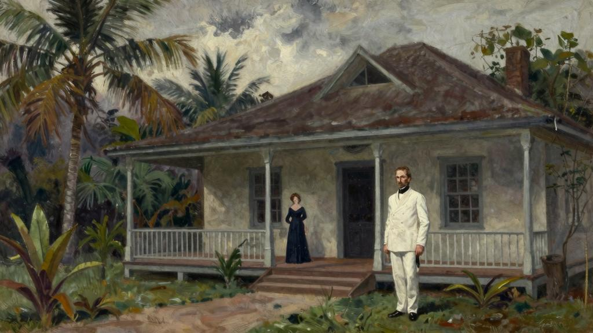
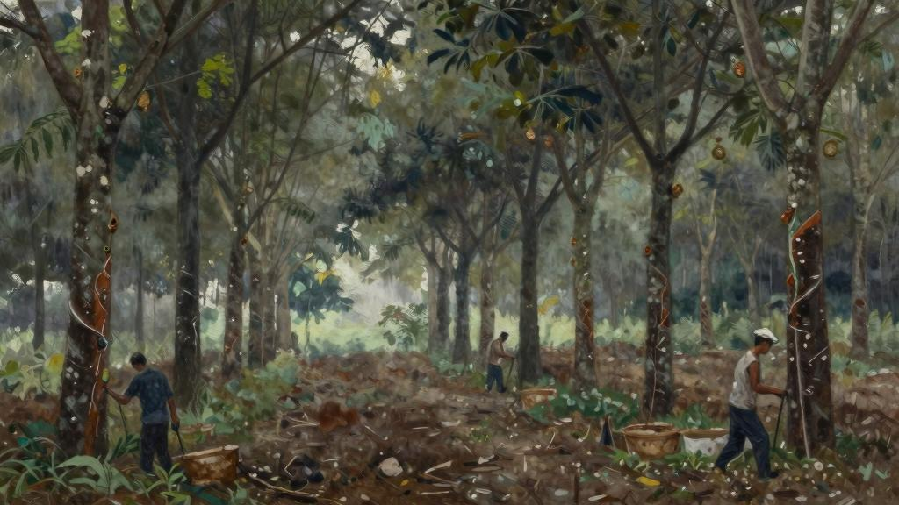
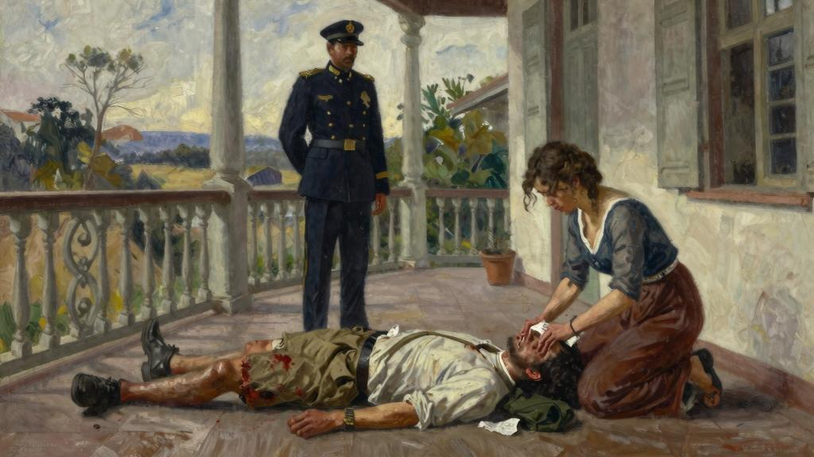
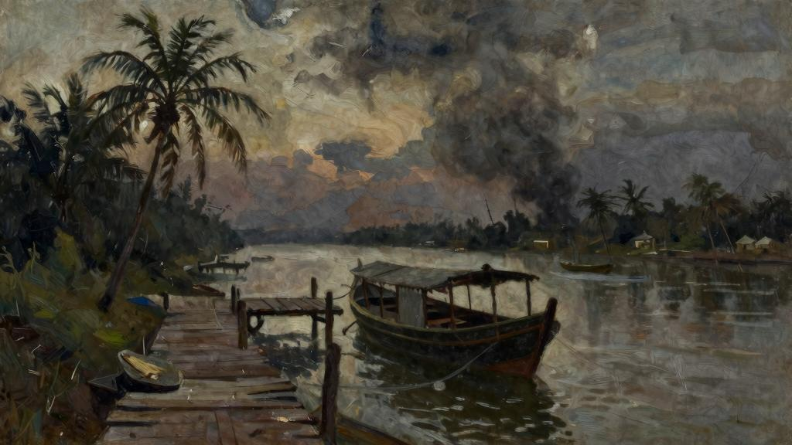

他们搞到了一个没有人的头等间。运气着实不错，因为他们随身带了很多行李，除了阿尔班的手提箱和旅行袋，还有安妮的梳妆箱和帽盒。行李车厢里另有两只大旅行箱，里面装的是随时会用到的东西，阿尔班把剩下的行李寄存在一家代理那里，运抵伦敦后，由代理保管，直到他们安顿下来。他们的东西实在太多了，有画作、书籍、阿尔班在东方收集的珍藏品，还有的枪支和马鞍。他们再也不会回宋都拉了。阿尔班仍然像以前一样出手阔绰，赏给搬运工一大笔小费，然后走去书报摊前买报纸。买了《新政治家》[199]、《国家》[200]、《闲谈者》[201]、《速写》[202]，还有最新一期的《伦敦信使》[203]。回到车厢，把一摞报纸统统扔在座位上。

“路上只有一个小时。”安妮说。

“我知道，可就是想买。我已经忍了很久了。想想明天一早，我们就能看到当天的《泰晤士报》、《快报》[204]和《邮报》[205]，多么美好啊！”

她没有回答，阿尔班看见两个人往这里走过来，于是朝他们转过身去。那两个人是夫妻，从新加坡启程就和他们一路同行。

“过海关顺利吗？”兴高采烈地对他们喊道。

那个男人似乎没有听见的话，径直往前走，的妻子回答了阿尔班：

“很顺利，他们没有找到香烟。”

她看到了安妮，对她友好地笑了一笑，便走开了。安妮顿时涨红了脸。

“我是担心他们想和我们坐一块，”阿尔班说，“尽量不要让别人进这个房间。”

她神色古怪地看着。

“我觉得你不用担心，”她回答道，“没有人会进来的。”

点了支烟，靠在房门上，脸上挂着愉悦的笑容。邮轮驶过红海，穿越运河[206]的时候，海上刮起了凛冽的寒风，男人们纷纷穿上保暖的衣服，安妮看惯了他们穿白色帆布西装的体面模样，惊讶地发现他们换了衣服后全变了样，变得糟糕透顶。领带难看极了，没有一个人的衬衫是合身的。法兰绒长裤邋里邋遢，高尔夫球外套破旧不堪，一看就是廉价货，蓝色哔叽西服显然是乡下裁缝的手艺。大多数乘客在马赛[207]下了船，船上只剩下十几个人，有的人在东方住了太久，觉得沿着海岸旅行一趟对他们有好处，还有的人与安妮和阿尔班一样，口袋里的钱不多，所以直接去蒂尔伯里[208]，这会儿，有几名乘客在站台上散步。他们头戴遮阳帽或是有双层帽檐的特莱帽[209]，身穿长大衣，也有人戴着扁塌不成形的软帽和圆顶硬礼帽，帽子脏兮兮的，还显小。见到他们这副打扮真叫人震惊，他们看起来就像是平庸的乡下人。不过，阿尔班俨然已是一副伦敦人的派头。时髦的长大衣上没有一丁点灰尘，黑色的洪堡帽[210]像是新的一样，完全看不出是三年没有回过英格兰的人。衬衫的领子不松不紧，丝质印花领带打得规矩齐整。安妮看着，忍不住暗自赞叹，真的帅极了。阿尔班差不多有六英尺高，身材苗条，深谙穿衣之道，衣服的剪裁也十分考究。的发色很淡，头发仍然相当浓密，眼睛是蓝色的，皮肤微微泛黄，年轻时皮肤白里透红的男人随着年岁渐长，都会变成现在的肤色。的脸上没有血色，头形漂亮匀称，脖子修长，喉结略微突出；长得很好看，然而令人印象更深刻的是身上卓尔不凡的气度。五官端正，鼻梁笔直，额头宽阔，所以格外上镜。从照片上看，确实非常英俊，其实真人没有那么好看，可能因为眉毛和睫毛的颜色太淡了，嘴唇又太薄，但是的样子看起来很聪明。不仅相貌优雅，还有一种超凡脱俗的气韵，非常动人。大家常常觉得诗人就应该是长得这个样子的；安妮和订婚后，她的女伴问她，阿尔班是个怎样的人，她形容长得像雪莱[211]。此时，转过身来看她，蓝眼睛里有一丝笑意，迷人极了。

“在这样的日子里回到英格兰多好啊！”

现在是十月份。他们乘坐汽船，横渡英吉利海峡，海水是灰色的，天空也是灰色的，空气中连一丝风也没有。渔船一动不动地停泊在平静的水面上，仿佛这片海上从来不曾有过狂风巨浪。沿岸的植被绿得不可思议，不过这种绿色是明亮舒适的，和东方的丛林颜色不一样，那种绿更加浓重，更加肆意张扬。沿途时不时经过的一些红色小镇像家一样温馨。小镇对背井离乡的人们友好地微笑着，欢迎他们远道归来。汽船驶入泰晤士河口，埃塞克斯郡富饶的平原跃入眼帘，过了一会儿，他们看见了肯特郡沿岸的乔克教堂[212]，教堂孤零零地伫立在饱经风霜的树木中间，远处是郁郁葱葱的科伯姆森林[213]。一轮红日低悬在薄雾弥漫的沼泽地上，而后夜幕降临。火车站的弧光灯在黑暗中投下一团团又冷又硬的亮光。搬运工穿着脏兮兮的制服，费力地把行李搬上搬下，胖乎乎的站长戴着圆顶硬礼帽，神气十足，这幅景象真让人高兴啊。站长吹响了哨子，挥动手臂。阿尔班走进车厢，舒服地坐进安妮对面的角落。火车缓缓地开动了。

“我们到伦敦是六点十分，”阿尔班说，“七点应该能到杰明街。然后，我们有一个小时的时间梳洗换装，八点半就能在萨沃伊[214]吃晚餐了。今晚来瓶香槟酒，宝贝儿，我们要美餐一顿。”轻轻地笑了起来。“我听说，斯特劳德一家和蒙迪一家约定在特罗卡德罗烤肉餐厅[215]共进晚餐。”

拿起报纸，问她想不想看一份。安妮摇了摇头。

“累了？”微笑着问她。

“不是。”

“兴奋吗？”

她不想回答，只是微微地笑了一笑。阿尔班低下头去，从报纸上出版社的广告开始看起，安妮知道现在无比满足，这些报纸让觉得和这个世界又有了联系。他们在宋都拉也会看这几份报纸，可是要等上六个星期才能收到，虽然也能了解到他们关心的时事，但是过期的报纸时时刻刻提醒着他们漂泊在外的事实。然而，这些报纸是新鲜出炉的，连味道也不一样，纸张挺括，看起来就很舒服。迫不及待地想要一口气全都

读完。安妮望向窗外。夜里的乡村一片漆黑，除了玻璃上映出的车厢灯光，几乎什么都看不见。紧接着，火车驶过一处城镇，许多寒碜的小房子扑入眼帘，一幢接着一幢，延绵数英里，处处可见亮着灯的窗户，屋顶上耸立着一排排烟囱，在夜幕下构成一组乏味枯燥的图案。他们经过了巴金[216]、伊斯特汉姆[217]和布罗姆利[218]——经过站台的时候，她看到站台上的地名竟然起了一阵颤栗，真是太可笑了——然后，到了斯特普尼[219]。阿尔班放下了报纸。

“我们还有五分钟就要到啦。”

戴上帽子，把搬运工搁在行李架上的东西拿下来，看着她，眼睛闪闪发亮，嘴唇微微动了动。安妮看得出来，正在极力压抑着内心的激动。随后，阿尔班也朝窗外望去，火车经过灯火辉煌的大街，有轨电车、公交车和小货车挤成一团，把马路堵得水泄不通，街上到处是黑压压的人群。太壮观了！商店里灯火通明，小贩他们推着小车，在人行道上吆喝叫卖。

“这就是伦敦。”说。

牵起安妮的手，轻轻地握了一握，脸上的笑容温柔极了，安妮觉得她必须得说些什么。她尽量让自己表现得轻松一些。

“你现在是不是觉得有点不舒服？”

“我不知道究竟是想哭，还是想吐。”

到芬乔奇街火车站[220]了。放下车窗，向搬运工挥手示意。伴随着刺耳的刹车声，火车慢慢地停下来。搬运工打开车厢门，阿尔班把行李一一递给，然后跳下车，以一贯绅士礼貌的姿态把手伸给安妮，扶她下到站台上。搬运工跑去拿推车装行李，他们站在站台上，脚边堆着大大小小的箱子。两个之前同船的乘客走过他们身边，阿尔班对他们挥了挥手。其中一个男人对僵硬地点了点头。

“多好啊，我们再也不用假装对那些讨厌的人彬彬有礼了。”阿尔班漫不经心地说。

安妮飞快地瞥了一眼。这个人真是难以理喻。搬运工推来小车，把行李放上去，他们跟着搬运工去取另外两只大行李箱。阿尔班紧紧地挽着妻子的手臂。

“啊，伦敦的味道。真是美妙极了！”

车站里熙熙攘攘，他们夹在人群里被推来挤去，可是乐在其中。弧光灯的光线十分明亮，灯下的阴影清晰又浓重，这一切都让欣喜若狂。他们走到大街上，搬运工去叫出租车。阿尔班注视着马路上的公交车和在混乱的车群里奋力指挥的警察，眼睛里闪烁着光芒，那张气度不凡的脸上的表情好似灵感顿现。出租车来了。司机旁边的位子上堆满了他们的行李，阿尔班给了搬运工两个半先令，然后上了车。出租车拐了个弯，驶上格雷斯丘奇街，他们在坎农街遇到堵车，不得不停下来。阿尔班突然放声大笑。

“你怎么了？”安妮问。

“我实在是太兴奋了。”

他们沿着堤岸[221]一路前行。这片区域安静很多。车窗外不断有出租车和小轿车疾驶而过。有轨电车的铃声在听来如同天籁之音。在威斯敏斯特桥那里，车子穿过议会广场，之后又经过了静谧的圣詹姆斯公园。他们在杰明街上的酒店订了一间房间。前台接待领他们上楼，搬运工把行李提了上来。房间里有两张单人床和一间浴室。

“看起来不错，”阿尔班说，“在我们找到公寓或是别的住所之前，这个地方应该够住了。”

看了看怀表。

“亲爱的，你看，要是我们同时打开行李，肯定会互相妨碍。我们的时间很充裕，你梳洗换装肯定比我久。你先用房间，我去俱乐部看看有没有我的信。晚礼服就在手提

箱里，我只要二十分钟就可以洗漱完毕，换好衣服。这样安排，你满意吗？”

“很好。没问题。”

“我会在一个小时之内回来。”

“好的。”

从口袋里掏出一直带在身边的小梳子，梳理了一番自己的金色长发，然后戴上帽子，朝镜子里看了一眼。

“要不要我帮你放浴缸水？”

“不用，不必麻烦了。”

“好吧。一会儿见。”

走出了房间。

等离开后，安妮把梳妆箱和帽盒搁在她的大行李箱上，拉了一下铃绳。她没有摘掉帽子，直接坐下来，点了支烟。仆人听到铃声，上来问有什么事，她让仆人把搬运工叫来。搬运工来了，她指了指行李。

“你把那些东西先搬到楼下大堂去。我一会儿再告诉你要做什么。”

“好的，夫人。”

她给了搬运工两个先令。搬运工把大行李箱提出房间，然后带着其东西走出去，随手关上了房门。有几滴眼泪顺着她的脸颊淌下来，她摇了摇头，擦干眼泪，重新扑上粉。现在她需要冷静。看到阿尔班主动地提出要去一趟俱乐部，她感到很高兴，这就让事情变得简单多了，也给了她一点时间理清思绪。

现在，是时候把几个星期前就做好的决定付诸行动了，她必须要说出那些可怕的话来，非说不可，她忽然害怕起来，心沉了下去。她很早就想好了要对阿尔班说的话，每个字都在心里重复过一百遍，从新加坡到伦敦漫长的一路上，她每天都要对自己说上三四回，可是她还是害怕把事情会搞成一团糟。她特别害怕和阿尔班争执，一想到那个场面，她就觉得不舒服。不管怎样，她有一个小时的时间让自己镇定下来。阿尔班会指责她冷酷无情、不可理喻。但是她别无选择。

“不，不，不！”她大声喊道。

她害怕得浑身发抖。突然，她看到自己又置身在那栋别墅里，坐在以前坐过的地方，仿佛一切回到了最初的时候。午餐时间快到了，再过一会儿，阿尔班就要从办公处回来了。宽敞的凉廊是他们的起居室，想到即将回到这么雅致的家里，她就觉得很开心，虽然他们已经在这里住了十八个月，但是她知道阿尔班仍然对她布置的房间赞不绝口。百叶窗放下来，遮挡了正午炽热的阳光，柔和的光线从窗叶的缝隙里流淌进来，给人一种凉爽而安宁的感觉。安妮很讲究家居布置，因为殖民地公职机构[222]调派职务的缘故，他们不停地从一个地区搬到另一个地区，很少会在同一处地方住上很久，尽管如此，每到一处新的地方，她都满怀热情地把新家布置得漂亮又舒适。她的审美观念很现代。前来拜访的客人看到他们家里没有常见的小摆设都很惊讶，看到颜色鲜亮的窗帘更是大吃一惊，安妮把玛丽·罗兰珊[223]和高更[224]淡色调的复制画镶在镀银画框里，用一种别出心裁的方式挂在墙上，客人也无法理解这种装饰风格。安妮很清楚，几乎没有人赞同她的布置，住在华莱士港和彭伯顿的那些循规蹈矩的夫人都觉得这种装饰既古怪又做作，一点也不得体；不过，她不在乎别人怎么说。们会慢慢地改变看法的。小小地颠覆一下他们的观念不是坏事。此刻，她环顾宽敞的长廊，像是艺术家欣赏自己最满意的作品一样，满足地叹了一口气。长廊上的色彩活泼鲜明，明亮开阔的空间闲适宁静，既感到让人神清气爽，又恰到好处地留出了想象的余地。三只大花盆里插满了黄美人蕉，使得整体的色彩搭配更加完美。她的视线在摆满书籍的书架上停留了片刻；这架子书也是让殖民地的那些人坐立不安的东西，在他们看来，这上面的书不但稀奇古怪，而且大部分都太沉重了，安妮朝那些书深情地望了一眼，仿佛它们是有生命的东西一

样。接着，她瞥了一眼钢琴。琴谱还摊开搁在谱架上，大概是德彪西[225]的作品，阿尔班去上班前曾弹过这首曲子。

阿尔班被任命为达喀塔尔的地区长官[226]时，安妮在殖民地的朋友都来安慰她，因为那是宋都拉最偏僻的地区。总督[227]署设在镇上，达喀塔尔和镇上既不通电话，也不通电报。不过安妮喜欢那个地方。他们在那里住过一段时间，她希望在阿尔班下次休假回国之前能够一直待在那儿，待满十二个月。达喀塔尔的面积有英格兰的一个郡那么大，海岸线很长，海上星罗棋布地散布着很多小岛。一条宽阔的河流蜿蜒穿过这片土地，两岸群山起伏，山丘上覆盖着茂密的原始森林。驻地在河流上游很远的地方，当地有一排中国人的店铺，一处掩映在椰子林间的原住民村庄，还有地区长官的办公处和别墅、职员宿舍和兵营。再沿河往上游走几英里，有一座英国人管理的橡胶种植园，支流的岸边有一处伐木场，场主和助手都是荷兰人，这些人就是他们仅有的邻居了。橡胶种植园的汽船每个月往来两趟，他们和外界的定期联络全靠这艘船。这里的生活虽然孤独，但是非常充实，并不枯燥。拂晓时分，马儿已经整装待发，他们在凉爽的清晨骑马踏上林间小径，那时，丛林还未彻底从热带夜晚的神秘气氛中苏醒过来。回到家，他们洗个澡，换身衣服，然后一起享用早餐，之后，阿尔班出发去办事处上班。上午，安妮通常会写写信、做做家务。从来到这里的那天开始，她就深深地爱上了这个国家，她花了很多精力学会了和当地人交流，从他们那里听来很多关于爱、嫉妒和死亡的故事。她的想象力也随之自由驰骋。当地人还对她讲述了许多传奇故事，那些事情就发生在不远的过去。她沉浸在那些陌生人的传说中潜心钻研。安妮和阿尔班都读过很多书。家里的藏书在当地可谓相当丰富，而且，他们几乎每次收到从伦敦寄来的邮件，里面都会附有几本新书。们差不多网罗了所有值得一读的书。阿尔班还喜欢弹钢琴。作为业余爱好者来说，的琴技算是相当不错的。学得很认真，触键柔和舒缓，辨音能力也很敏锐；能毫不费力地看懂乐谱，每次练习新曲，安妮都喜欢坐在身边，看着琴谱，聆听音乐。不过，最快乐的事情要数在达喀塔尔四处游历，有时候，们会外出半个月。他们乘坐三角帆船顺河而下，穿梭在岛屿之间，在海里游泳、钓鱼，或者划船逆流而上，行到河面变成浅滩的地方，两岸树林相距咫尺，仰头只能看见一线天空。船到此处，船夫只能撑篙前行，晚上，他们就在当地人家里过夜。他们在河流凹处的水潭里游

泳，河水清澈极了，就连水底闪着银光的细沙也能看得见。那个地方是那样地安静、迷人，远离尘嚣，让人想要永远留在那里。然而，有时候他们也会一连数日徒步穿越丛林，住在帆布帐篷里，尽管林中蚊子肆虐，还有吸血的蚂蟥，他们依然觉得很快乐，即使躺在行军床上也照样酣然入睡。结束旅行回到家里也非常愉快，他们的家舒适整洁，井井有条，置身其中心情愉悦，从伦敦寄来的信件和报纸静静地等待他们拆阅，还有那架钢琴，也在家里迎接他们回来。

那时，阿尔班就会坐到钢琴面前，手指跃跃欲试地渴望触摸琴键。弹奏斯特拉文斯基[228]、拉威尔[229]和达律斯·米约[230]的作品时，安妮感觉在旋律里融入了一些属于的东西，有夜里丛林的声音、河口的黎明、繁星点点的夜晚，还有森林里如水晶一般清澈的水潭。

有时候，大雨一连几天倾盆而下。每当这种时候，阿尔班就会潜心学习中文。学会了中文，就能和当地的中国人用他们的母语交谈，安妮则会做很多之前没有时间做的事情。下雨的日子里，他们的关系变得更加紧密。在一起总有人说不完的话，分开做各自的事情时，又能愉快地切身感觉到对方近在咫尺。他们的关系非常融洽。雨天把他们困在家里，俩人反而感觉像是融为了一体似的，共同面对这个世界。

他们偶尔会去华莱士港。虽然去那里可以解解闷，但是回到家里安妮会更开心。

她在那里感觉很不自在，心里清楚他们遇到的每一个人都不喜欢阿尔班。那些人都是从小地方来的中产阶级，平庸又无趣，她和阿尔班有很多高雅的爱好，生活过得充实又多姿多彩，而那些人对这些东西不感兴趣。不仅如此，他们中间还有很多人思想狭隘，心怀叵测；但是，她和阿尔班大部分的人生里都要同那些人打交道，她真的很讨厌他们对阿尔班这么不友好。他们说阿尔班自负狂妄。其实，对他们总是和颜悦色，可是安妮知道那些人讨厌阿尔班热情友好的态度。表现得活泼些，他们就说是装腔作势，若是拿他们打趣，又说这是嘲讽消遣。

有次，他们暂住在总督府上，总督的妻子汉内夫人挺喜欢安妮，对她讲起了这件事。可能是总督让妻子给安妮提个醒。

“亲爱的，你要知道，你的丈夫没能和大伙打成一片真是可惜。很聪明；可是，如果不在别人面前显摆这点，不是更好吗？就在昨天，我的丈夫还对我提过：我当然知道阿尔班·托瑞尔是公职机构里最聪明的小伙子，但是让我最生气的人也是。我是总督，可是每次和我说话，都让我觉得自己在眼里就是个大傻子。”

最糟糕的事情莫过于安妮知道了总督对阿尔班的评价有多差。

“并不想表现得高人一等，”安妮微笑着回答，“一点也不自负。我想，是因为的鼻梁太挺，颧骨太高，所以才给人留下那种印象。”

“要知道，俱乐部的人也不喜欢，叫‘涂脂抹粉的雪莱’。”

安妮涨红了脸，眼睛里蓄满泪水。她之前听说过这件事，当时就生气极了。

“我认为这实在太不公平了。”

汉内夫人拉起她的手，充满关爱地轻轻握了一下。

“亲爱的，你要明白，我不是想让你难过。你的丈夫可以平步青云。要是再多一点人情味，事情就会容易很多。为什么不踢足球呢？”

“不爱踢足球，只喜欢打网球。”

“可是给人的感觉不是那样的，让人觉得这里没人配得上和打球。”

“好吧，的确没有。”安妮被她的话刺痛了。

阿尔班的网球打得相当出色，在英格兰的时候就打过很多场锦标赛。安妮知道，每次把那些吵吵嚷嚷的大块头打得满地找牙，就会感到极其满足。可以让他们中间打得最好的人洋相百出，在球场上把对手惹得火冒三丈，安妮其实也知道，有时候就是克制不住要使坏。

“确实有点显摆，是不是？”汉内夫人问。

“我觉得不是这样的。你要相信我，阿尔班一点都不知道别人不喜欢。就我所见，对每个人都彬彬有礼，非常友好。”

“这正是最招人厌的地方。”汉内夫人冷冷地说。

“我知道大家不怎么喜欢我们，”安妮勉强地笑了一笑，“我很难过，但是我真的不知道该怎么做。”

“这不是针对你，亲爱的，”汉内夫人喊道，“大家都喜欢你，所以才能容忍你的丈夫。你那么好，谁会不喜欢你呢？”

“我不知道他们为什么会喜欢我。”安妮说。

然而，她这话说得不够真诚。她有意扮出可爱的小女人姿态，心里则是欢腾地冒着泡泡。那些人讨厌阿尔班，因为身上总是有一种卓尔不群的气质，喜欢艺术和文学；可是他们不懂，觉得那些东西都很娘他们儿气。他们讨厌阿尔班，也是因为的能力远在他们之上，受到的教育程度比他们好。那些人觉得阿尔班高人一等；好吧，确实高人一等，但不是他们想的那样。他们之所以对安妮网开一面，是因为她长得难看又毫不起眼——她这样形容自己，其实她并不难看，或者说，即使她真的丑，那也是讨人喜欢的丑。她长得像只小猴子，不过是很可爱的小猴子，也很平易近人。她最有魅力的地方是她娇小玲珑的身材，还有那双眼睛。她长了一双深棕色的大眼睛，清澈又明亮，眼睛里总是透露出快乐和活泼的神采，有时候也会变得很温柔，流露出怜悯和同情的迷人神色。她的肤色很深，一头鬈发差不多是黑色的；小小的鼻子肉厚圆润，鼻孔很大，嘴巴也很大。她机敏又活泼，兴致盎然地和殖民地的那些夫人聊起她们的丈夫、仆人和在英格兰的孩子，也会装作欣赏的样子聆听那些男人对她讲故事，即便那些故事她早已听了无数遍。他们觉得安妮人很好，却不知道她背地里是怎样刻薄地嘲笑他们，也绝对不会想到，她把他们看作一群狭隘、粗鄙又自以为是的人。东方在他们眼里毫无魅力，那是因为他们眼光粗俗，只看重物质享乐。罗曼司就在门口徘徊，而他们挥挥手把它赶

走，就像打发纠缠不休的乞丐一样。她对那些人漠不关心，常常在心里默念兰德[231]的诗：我热爱大自然，其次是艺术。

她琢磨过和汉内夫人的谈话，不过总的来说，汉内夫人的提醒没有触动她。她寻思着是否要对阿尔班提一提这件事；她一直觉得奇怪，怎么就没有察觉出来大家都讨厌呢，但是，她又担心如果告诉了阿尔班，就会处处在意。阿尔班从未注意到俱乐部里的人对的态度很冷淡。他们在面前拘束不适。每次一出现，大家就很尴尬，而快快乐乐地毫无察觉，对每个人都热情得很。实际上，对这些人视若无睹，这点很奇怪。对安妮不是这样的，还有一小撮伦敦的朋友，和那些人都相处得很好，可是从来没有清醒地认识到殖民地的这些人，总督署的官员、种植园主和他们的妻子，他们也是人。在阿尔班眼里，这些人就像是游戏里的棋子。同他们一起大笑，拿他们打趣，态度既亲切又宽容。安妮轻轻地笑起来，心想阿尔班就像是预备学校的校长，带领一群小男孩出去野餐，努力想让每个人都玩得开心。

她担心即使把这件事情告诉了阿尔班也毫无益处。无法掩饰真实的情感，而安妮却高兴地发现她在这方面颇为得心应手。对这些人还能怎么样呢？来殖民地的那些男人都是从二流学校毕业的，对生活一无所知，活到五十岁还是一副傻头傻脑的样子。他们中的多数人都喜欢酗酒，读的东西完全不值得一看，他们的理想就是要和其人平起平坐，对一个人最高的评价就是“人很好”。要是有人对精神层面的东西感兴趣，他们就觉得那人自命清高。他们互相之间眼红嫉妒，心里满是精明的算盘。那些女人也是可怜，总是为了微不足道的事情和别人一争高下。她们的社交圈比英格兰最小的小镇上的圈子还要迂腐，个个表面上假正经，暗地里心怀鬼胎。即使这些人不喜欢阿尔班，又有什么关系呢？他们还是得忍气吞声，因为阿尔班太能干了，聪明过人，精力充沛。谁也不能说的工作做得不好。迄今为止，在每个职位上的表现都很出色。阿尔班心思细腻，想象力丰富，所以能够明白当地人的想法，让他们按照的话去做，其人都做不到这一点。在语言方面也很有天赋，会说当地所有的方言，不仅了解官场套话，还熟悉官话里细微的差异，在典礼上的致辞也很得体，既奉承了长官，又让他们对刮目

相看。阿尔班还很会组织事务，不怕承担责任，假以时日，肯定会被擢升为参政司[232]。在国内也有点人脉；父亲生前是准将，在战争中殉职了，虽然除了工资，没有其的收入，但是认识一些有头有脸的朋友。提起那些人，阿尔班总是带着一丝调侃的意味。

“民主政府的好处之一就是，”说，“只要有权力的支持，有才能的人就会得到应有的回报。”

毋庸置疑，公职机构里最能干的人就是阿尔班，看样子最后肯定能坐上总督的位置。安妮心想，现在大家讨厌高高在上的姿态，等到成了总督，这种做派就恰如其分了。们会听命于阿尔班，阿尔班也会有办法让别人尊敬、服从。安妮没有被设想的未来搅得目眩神迷，相反地，她认为那是他们应得的权利。如果阿尔班成了总督，她成了总督夫人，那就太有意思了。这是多好的机会啊！那群总督署的职员和种植园园主只会听命盲从，如果总督府变成了文化中心，那么他们也会跟风模仿，如果总督青睐饱学之士，那么所有人都会从善如流。她和阿尔班会保护当地的艺术，把那段业已消失的历史留下的纪念物小心翼翼地收集起来。这个国家将会经历无法想象的变化。们会恪守秩序与美，全力发展它，同时，也会让手下的人逐渐爱上这片美丽的土地，爱上当地浪漫的民族，理解音乐的意义。他们还会培育文学，创造美。这个国度即将步入黄金时代。

突然，安妮听见了阿尔班的脚步声，立刻从白日梦里惊醒过来。这一切仍然是遥远的未来，阿尔班现在只是个地区长官，他们过好当下的生活才是最重要的。她听见阿尔班走去浴室冲凉，过了一会儿，换上了衬衫和短裤走了进来，金发还是湿漉漉的。

“午餐准备好了吗？”问。

“已经好了。”

阿尔班走到钢琴前坐下，弹起早晨弹过的那首曲子。清凉悦耳的音符在闷热的空气中缓缓流淌而下，让人感觉置身于一座井然有序的花园里，眼前是遮阴蔽日的参天大

树，人工水景优美雅致，休闲步道两旁竖立着一座座仿古典式的雕像。阿尔班的指法里蕴含着一种独特的温柔和细腻。就在这个时候，领班仆人进来宣布午餐时间到了。从琴凳上站起来，和安妮手拉着手走进餐厅。天花板上垂下来的布屏风扇[233]懒洋洋地扇动着。安妮看了看餐桌，色彩鲜艳的桌布上摆着造型有趣的餐盘，一派欢乐活泼的气氛。

“上午的工作有什么好玩的事情吗？”她问阿尔班。

“没什么。只有一桩水牛案。哦，普林派人叫我去趟种植园。有几个苦力砍了橡胶树，想让我调查一下。”

普林是上游橡胶种植园的经理，安妮和阿尔班时常会去的种植园里留宿。有时候，普林想解解闷，也会来下游吃顿晚餐，在地区长官的别墅里住上一晚。他们都很喜欢普林。今年三十五岁，红彤彤的脸上皱纹深如沟壑，头发乌黑。没怎么受过教育，不过生性快活、随和，因为两天的路程之内能见到的英国人只有，所以他们别无选择，只能把当作朋友。起初，普林在他们面前有点拘束。在东方，消息传得很快，早在阿尔班和安妮来达喀塔尔之前，已经听说了他们是品位高雅的知识分子，不知道该怎么面对他们。普林可能不知道自己很有魅力，其实魅力可以取代很多值得称赞的品质，阿尔班的心思细腻婉约，尤其喜欢普林这一点。普林则觉得阿尔班比预想中更加平易近人，至于安妮，她的魅力自然不消说。阿尔班会弹奏雷格泰姆[234]给普林听，在总督面前才不会做这种事情呢，两个人还会在一块玩多米诺骨牌。阿尔班和安妮第一次在达喀塔尔各地游历时，提出想要去橡胶园住几天，普林觉得最好提前告诉阿尔班，在和一个当地女子同居，还和她有了两个孩子，会尽量不让他们出现在安妮的视野里，但是没办法把他们送走，因为无处可送。阿尔班听了哈哈大笑。

“安妮绝对不是那种女人。你别想着把他们藏起来。安妮喜欢小孩子。”

很快，安妮就和那个娇小漂亮又腼腆的当地女子成了朋友，常常和她说些悄悄话，一聊就聊上很久。两个小孩子也很喜欢她，和她玩得很开心。她经常在华莱士港买些可爱的玩具送给他们。普林看到安妮微笑宽厚的样子，再想起殖民地其白人女子对

他们嗤之以鼻的嘲讽，惊讶得简直要晕倒了。欣喜若狂，对他们感激涕零，不知道该怎么表示才好。

“要是所有的知识分子都和你他们一样，”说，“我巴不得见到的每个人都是大知识分子呢。”

想到他们一年后就要永远离开达喀塔尔，普林就觉得不快活，要是下一任地区长官是结了婚的人，的妻子可能看不惯普林放着好好的单身生活不过，偏要和当地女人鬼混，而且，还相当地迷恋那个女人。

然而，最近橡胶园的苦力有些不安分。他们都是中国人，受到一些思想的影响，变得难以管教。阿尔班不得不给其中一些人安上各种罪名，把他们送进监狱。

“普林对我说，等那些人的合约一到期，就把他们统统送回中国，再找爪哇人代替，”阿尔班说，“我想的决定是对的。爪哇人温顺多了。”

“不会有麻烦吧？”

“哦，不会的。普林知道该怎么做，又是说一不二的性格，不会允许那些苦力胡来。再说，有我和警察支持，那些中国人不会耍什么花招，”笑了一笑，“这叫做外柔内刚。”

话音刚落，外面突然传来一声喊叫，随即响起一阵喧哗，脚步声纷至沓来，叫喊声、吵闹声，乱作一团。

“大人，大人。”

“究竟出什么事啦？”

阿尔班从椅子上一跃而起，迅速走到凉廊上。安妮紧紧地跟在身后。台阶底下围着一群当地人，有巡佐和三四个警察，还有船夫和几个村里的人。

“怎么了？”阿尔班大声问他们。

有两三个人齐齐高声回答。巡佐把其人推到一边，阿尔班看到地上躺着个身穿衬衫和卡其布短裤的男人。冲下台阶，认出了那个男人是普林种植园的助理。是个混血儿，眼下已经昏迷了，短裤上都是血，半边脸颊和头上也糊满了凝结的血块。

“把带上来。”安妮叫道。

阿尔班一声令下，其人把这个男人抬上凉廊，平放在地板上，安妮在脑后垫了个枕头，叫人去端水，顺带把急救药箱取来。

“死了吗？”阿尔班问。

“没有。”

“最好给喝点白兰地。”

船夫带来的消息骇人听闻。橡胶园的中国苦力突然造反，袭击了经理的办公室。

普林被杀了，这个叫欧克利的助理勉强捡回了一条命。那伙暴徒打劫办公室的时候，正巧迎面撞上，看到普林的尸体被扔出窗外，吓得拔腿就跑。有几个中国人发现了，立刻追了上来。奔到河边，跳进汽船的时候受了伤。船上的人抢在那些中国人跳上船之前驶离了岸边，以最快的速度来到下游求援。离开种植园的时候，他们望见几幢办公建筑都起了火。毫无疑问，苦力把所有能烧的东西全烧掉了。

欧克利呻吟了一声，睁开眼睛。是个肤色黝黑的小个子男人，五官扁平，头发又密又硬，一双大眼睛是当地人的模样，此刻，的眼睛里充满了恐惧。

“没事了，”安妮对说，“你现在很安全。”

叹了口气，微笑了一下。安妮清洗干净脸上的血迹，在伤口上涂了一些消炎药。头上的伤不是很严重。

“你现在能说话吗？”阿尔班问。

“等一下，”安妮说，“还要检查一下的腿。”

阿尔班命令巡佐赶走聚集在凉廊上的人。安妮撕开一侧的裤管，布料已经和凝血的伤口黏在一起了。

“我的腿血流如注。”欧克利说。

好在只是皮肉伤。阿尔班的手法很娴熟，虽然伤口又开始出血，但是他们成功地止住了血。给伤口贴上敷料，绑上绷带。巡佐和警察把欧克利抬上长椅。阿尔班给喝了杯白兰地兑苏打水，很快，就有力气开口说话了。欧克利知道的消息不比船夫多，普林死了，种植园成了一片火海。

“那个姑娘和她的孩子怎么样了？”安妮问。

“我不知道。”

“哦，阿尔班。”

“我必须出动警察。你确定普林已经死了吗？”

“是的，先生。我亲眼所见。”

“暴徒手上有枪吗？”

“我不知道，先生。”

“‘你不知道’是什么意思？”阿尔班生气地吼道，“普林有人把枪，不是吗？”

“是的，先生。”

“种植园里肯定还有好几把枪。你有一把，不是吗？总监工也有一把。”

那个混血儿陷入了沉默。阿尔班严厉地看着。

“该死的中国人有多少？”

“一百五十个。”

安妮不明白为什么问这么多问题，这简直就是浪费时间。现在重要的事情就是把苦力召集起来去上游的种植园，准备船只，同时给警察发放弹药。

“您有多少警力，先生？”欧克利问。

“八个，还有一名巡佐。”

“我可以一起去吗？这样就有十个人了。我已经包扎好了，应该能行的。”

“我不会去的。”阿尔班说。

“阿尔班，你必须去。”安妮大声喊道，她不敢相信阿尔班居然会说出这样的话。

“胡闹。疯子才会去。欧克利显然一点用也没有，再过几个小时，肯定会发烧，去了也是累赘。那样一来，我们只有九个人了。可对方是一百五十个中国人！而且他们手里有枪，有充足的弹药。”

“你怎么知道？”

“显而易见，他们做好了万全的准备才会造反。如果没有准备好就动手，那也太愚蠢了。”

安妮瞠目结舌地看着。欧克利眼里满是疑惑。

“那你准备怎么做？”

“好在我们有汽船。我派人驾船去华莱士港请求增派支援。”

“但是增援至少要两天才能到啊。”

“哎呀，那又能怎么办呢？普林已经死了，种植园烧成了一片白地，就算我们现在去也做不了什么。我会派个当地人去侦察一下，看看那伙暴徒到底在干什么。”对安妮笑了一笑，笑容依旧十分迷人。“相信我，亲爱的，多等一两天，那群恶棍该受的惩罚一点也不会少。”

欧克利张开嘴巴想要说什么，但或许没那个胆量。不过是一个混血的种植园助理，而阿尔班是地区长官，代表总督的权威。转头看向安妮，安妮在的眼睛里看到了急切的恳求。

“可是那群人可以在两天内犯下最可怕的暴行，”安妮大喊道，“让人无法想象的暴行。”

“不管他们做了什么，都会付出应有的代价。我向你保证。”

“哦，阿尔班，你不能光坐在这里什么也不做。我求求你，马上出发吧。”

“别傻了。就凭八个警察和一个巡佐绝不可能平息暴乱，我没有理由去冒险。我们只能坐船去种植园，你想想，他们肯定会发现我们的。岸边的白茅丛就是最好的掩护，他们只要藏在里面一通乱射就行了。我们一点胜算也没有。”

“先生，我担心如果两天内没有人去镇压，那些人会以为我们软弱可欺。”欧克利说。

“需要你发表意见的时候，我会问你的，”阿尔班尖刻地说，“依我所见，你遇到危险掉头就跑，什么也没做。我很难相信危难临头你会有什么用。”

混血儿的脸涨得通红，再也没有开口说话，笔直地看着前方，眼里满是不安。

“我去办公室了，”阿尔班说，“等我写好简报，立刻派人送去下游。”

对巡佐下达了命令。他们说话的时候，巡佐就一动不动地站在台阶顶上。接到命令，对阿尔班敬了个礼，转身跑开了。阿尔班走去小过道上拿遮阳帽。安妮立刻跟上。

“阿尔班，看在上帝的分上，听我说一句吧。”她低声说道。

“亲爱的，我不想对你发脾气，但是现在时间真的很紧。你还是管好自己的事情吧。”

“你不可以什么事情都不做，阿尔班。你必须去。不管有多么危险。”

“别犯傻了。”阿尔班怒气冲冲地说。

从来没有对安妮发过火。安妮抓住的手，不让走。

“我跟你说过，去了也没用。”

“你不明白。种植园里还有那个姑娘和普林的孩子，必须把他们救出来。让我和你一起去吧。否则暴徒一定会杀了他们的。”

“他们可能已经被杀了。”

“噢，你怎么可以这样冷血！哪怕只有一线希望，也必须一试。这是你的职责。”

“我的职责是理智行事。我不会为了一个当地女人和她的混血孩子，拿自己和手下的性命冒险。你当我傻吗？”

“们会说，你不去是因为害怕。”

“谁是他们？”

“殖民地的每一个人。”

轻蔑地笑了一下。

“你还不知道吧，我从来没有把他们的想法放在眼里。”

安妮久久地看着，像是要彻底认清眼前的人似的。他们结婚八年了，她对阿尔班的每一个表情和每一个想法都了如指掌。她看进蓝色的眼睛里，像是看着一扇打开的窗户一样。安妮的脸色突然变得煞白，甩开的手，掉头就走。她一言不发地回到凉廊上，像猴子一样难看的脸上满是恐惧。

阿尔班去了办公室，在报告里简明扼要地叙述了事情经过。几分钟后，一艘汽船轰鸣着朝下游驶去。

接下来的两天仿佛漫长得没有尽头。从种植园逃出来的当地人不断带来各种消息，但是这些人要么激动过头，要么吓破了胆，无法从他们的讲述中得知可靠的真相。

种植园里死了很多人。总监工也被杀了。大家众说纷纭，尽是些骇人听闻的暴行。安妮无从得知普林的女人和那两个孩子的下落，一想到他们可能面对的命运，她就不寒而栗。阿尔班把所有能够召集到的当地人都叫来了，给每个人配备了剑和长矛，还征用了一些船只。形势很严峻，但是依然非常冷静。觉得自己能做的都已经做了，剩下的就是照常过日子。仍然去办公室办公，时不时会坐在钢琴前弹奏一曲，每天清晨，仍然和安妮骑马出行，似乎忘了不久前的争执是他们结婚至今第一次发生的严重的意见分歧。阿尔班以为安妮已经领会了决定的高明之处，两个人在一起的时候，依旧和以前一样爱说笑，热情又快活，提起那伙暴徒，的话里话外都是阴冷的讥讽：等到秋后算账，他们中有很多人会宁愿自己没有生在这个世界上。

“们会受到怎样的惩罚？”安妮问。

“这个嘛，们会被绞死。”阿尔班厌恶地耸了耸肩膀。“我向来讨厌去现场观刑，总觉得很不舒服。”

他们把欧克利挪到床上，由安妮亲自照料。阿尔班很同情，或许是为自己一时恼火而失言感到歉疚，所以对特别和气。

第三天下午，他们用完午餐正在喝咖啡，阿尔班敏锐听到由远及近的汽船马达声。就在这个时候，有个警察快步跑来报告说，总督的汽船来了。

“终于来了。”阿尔班喊道。

像道闪电一样冲了出去。安妮拉起一扇百叶窗，朝河上望去。此时声音越来越清晰，不多一会儿，她看见汽船驶过河道拐弯的地方，阿尔班站在浮桥上，跳上三角帆船往汽船划去，等汽船抛下锚，登上了汽船。安妮对欧克利说，增援的人来了。

“他们去种植园的时候，长官会一起去吗？”问安妮。

“当然会去。”安妮冷淡地答道。

“我觉得不一定。”

安妮心里有些不舒服。这两天她一直极力克制住自己不哭出来。她没有再回答欧克利的话，径直走出了房间。

过了一刻钟，阿尔班带着警察队的队长回来了。队长接到命令，率领二十个锡克兵前来镇压暴乱。斯特拉顿队长是个脸红红的小个子男人，长了一双罗圈腿，小胡子也是红色的。安妮经常在华莱士港遇到。精神抖擞，风度翩翩。

“嗨，托瑞尔夫人，事情真是一团糟啊，”一面和安妮握手，一面欢快地大声地说，“我来啦，带了我的人，全副武装预备大干一场。小伙子他们，上啊！这儿荒郊野岭的，你有什么喝的吗？”

“来人。”安妮微笑着，扬声唤来仆人。

“我先来一大杯冰镇的、稍微带点酒精的饮料，然后坐下来说正事。”

精神焕发的样子让人十分欣慰。种植园的暴乱打破了这里的宁静，斯特拉顿的出现就像是一阵风吹散了笼罩在别墅上空的愁云惨雾。仆人端着托盘走进来，给自己

调了杯威士忌苏打。阿尔班对简明扼要地讲述了事情经过，用词十分精准。

“我得说我很佩服你，”斯特拉顿说，“换做是我，肯定忍不住带上八个警察，去把那些家伙狠狠地揍一顿。”

“依我看，这么做纯属没头没脑的冒险。”

“安全第一嘛。是不是，小老弟？”斯特拉顿爽朗地说，“我很高兴你没去冒险。我们遇上这种事的机会可不多。要是你想一个人独吞功劳，那就太奸诈了。”

斯特拉顿队长认为应该立刻动身去上游镇压暴乱，但是阿尔班对指出这么做不妥当。汽船的马达声会惊动暴徒，岸边茂密的草丛给那些人提供了很好的掩护，而且暴徒有充足的枪支弹药，可以让他们的登陆过程变得困难重重。把队伍暴露在对方的火力下毫无意义，必须要记得对手是一百五十个不怕死的人，一不小心就会中埋伏。阿尔班对说了自己的计划，斯特拉顿仔细地听着，时不时地点头。这个计划显然很巧妙，从背后发动攻击，打他们一个措手不及，几乎不费一兵一卒就可以解决他们。要是不采纳，那就是傻子了。

“可是你为什么不亲自去呢？”斯特拉顿问。

“就靠我手下的八个警察和一个巡佐？”

斯特拉顿没有回答。

“不管怎样，你的计划不错，就这么定了。离出发还早，托瑞尔夫人，如果您允许的话，我想洗个澡。”

他们在日落时分出发。斯特拉顿队长率领二十个锡克兵，阿尔班则带着的警察和召集来的当地人。夜里没有月亮，四周一片漆黑。汽船后面跟着阿尔班征用来的独木舟，他们打算驶出一段距离后，换乘独木舟。最重要的是不能发出声音，以免惊动对方。汽船大约开出三个小时之后，所有人都坐上了独木舟，悄悄地划桨前行。种植园占

地很广，他们抵达了外围，悄无声息地摸上岸。向导带领他们走一条小路。这条路非常狭窄，又荒废多时，走起来很困难，他们只能排成一列前进，中途两次被溪流拦住去路，不得不涉水而过，最后迂回地来到苦力寮的背后。他们计划黎明发起进攻，于是，斯特拉顿下令暂时休整。夜里很冷，他们在树林里等了很久，终于浓重的夜色似乎变淡了，虽然仍旧看不清每一棵树，但是可以隐约分辨出黑暗里树木的轮廓。斯特拉顿原本靠着树干坐在地上，此时悄悄地对巡佐下了令，没过几分钟，所有人都集合起来，继续往前走。突然，他们发现来到了大路上，于是，组成四人一组的队列前行。天边破晓了，天光稀薄，四周的景物看起来像苍白的影子。队长轻声发令，一行人都停下来。在这里已经看得见苦力寮了。所有人都鸦雀无声。他们蹑手蹑脚地靠近，然后再度停下。

斯特拉顿对阿尔班笑了一笑，眼睛闪闪发亮。

“那群混蛋还在做梦哩。”

让部下站成一排，子弹上膛，随后朝前跨出一步，举起手。卡宾枪瞄准了苦力寮。

“开火。”

子弹哒哒哒呼啸而出。寂静中突然爆发出一阵喧哗，中国人全都拥了出来，喊叫着挥舞手臂，然而让阿尔班困惑不解的是，冲在最前面大吼大叫着朝他们挥拳头的是个白人。

“那妈是谁？”斯特拉顿喊道。

那胖乎乎的大块头男人穿着卡其布裤子和背心，撒开两条胖腿，拼尽全力朝他们奔来，边跑边挥动双拳，大声喊道：

“卑鄙的家伙！该死的混蛋！[235]”

“我的天啊，是范·哈瑟尔特。”阿尔班说。

那个人是伐木场的荷兰经理。的伐木场在一条主要的支流边上，离这里有二十英里。

“你他们妈的在干什么？”荷兰经理跑到他们跟前，气喘吁吁地喊道。

“你妈的怎么会在这里？”斯特拉顿反问。

斯特拉顿看见中国人四下逃散，命令部下把他们全部围拢起来，然后转向范·哈瑟尔特。

“这是怎么回事？”

“怎么回事？怎么回事？”荷兰人火冒三丈地喊道，“我还想问你呢。你和你该死的警察大清早来这里朝我们开枪，你他们妈的在干什么？射靶练习吗？你们差点杀了我。

白痴！”

“来支烟吧。”斯特拉顿说。

“范·哈瑟尔特，你怎么到这里来了？”阿尔班又问了一遍，困惑极了，“这些人是从华莱士港派来镇压暴乱的警力。”

“我怎么到这里来的？我用脚走来的。不然你以为我是怎么来的？该死的暴乱。我已经全都解决了。如果你他们来就是为了这事，现在可以带上该死的警察回家了。刚才一颗子弹险些擦着我的头皮飞过去。”

“我没搞明白。”阿尔班说。

“没什么好明白的，”范·哈瑟尔特的火气还没有消，怒气冲冲地说道，“有几个苦力跑来伐木场，说中国佬杀了普林，还妈把这地儿全烧了，所以我带上助手、总监工，还有一个借住在我那里的荷兰朋友，来看看到底是怎么一回事。”

斯特拉顿队长睁大了眼睛。

“你他们就这么溜达进来的吗？像来野餐一样？”问道。

“得了吧，你不会以为我在这个国家待了这么多年，会让几百个中国人吓破胆吧？

他们看到我吓得魂儿都没了。有个人胆子挺大，敢拔出枪指着我，我一枪打爆了的头，其人马上就投降了。领头的几个已经被我绑了起来。我打算今天早上派条船去下游，让你他们来拿人呢。”

斯特拉顿目瞪口呆地看了很久，突然爆发出一阵大笑，笑得眼泪都流下来了。

荷兰人起先还对怒目而视，接着自己也笑了；长得胖，笑起来中气十足，浑身的肥肉都跟着一颤一颤。阿尔班气极了，绷着脸看他们。

“普林的女人和孩子怎么样了？”问。

“哦，他们没事，都逃走了。”所以说，当初安妮歇斯底里地恳求，没有因此改变主意是多么地明智。那些孩子当然没事啦，从来没想过们会有事。

范·哈瑟尔特一行人启程返回伐木场，随后，斯特拉顿也带着二十个锡克兵坐船离开了，留下阿尔班和手下的警察在种植园处理善后事宜。阿尔班写了份简报，让斯特拉顿捎给总督。要处理的事情太多了，看样子得在这里住上好长一段时间；可是种植园的房子全烧了，只能住在苦力寮里，心想安妮最好别来陪。给安妮捎去一张便条，叮嘱她别来种植园，还告诉她可怜的普林的女人安然无恙。很高兴这个好消息能让安妮放心。阿尔班立刻开始工作，展开初步调查，审问了一大堆证人。然而，过了一个星期，接到命令让立刻去华莱士港。前来传令的汽船会带走，沿途可以去见一见安妮，但是只有一个小时。阿尔班有些不快。

“我不明白，为什么总督不能让我留在种植园把事情查清楚，非要让我去一趟呢？

简直就是添乱嘛。”

“哦，这个嘛，我们这位总督从来不在乎给属下添多少麻烦，是吧？”安妮微笑着说。

“这就是官僚作风。本来我想带你一起去，亲爱的，只是我在那里一分钟也不会多待。我想尽快收集齐证据，呈给治安法院。在这样的国家里，我认为让不法分子及时得到法律的制裁是非常重要的。”

汽船抵达华莱士港，港口警察告诉阿尔班，港务局长有一张给的便条。便条是总督秘书写来的，称总督阁下希望阿尔班抵达后，在方便的时候尽早去见。当时是早上十点钟。阿尔班去了一趟俱乐部，洗好澡，刮过脸，换上一身干净的白色帆布西装，把头发梳理得整整齐齐，然后叫了辆人力车，吩咐车夫去总督办公室。到了那里，立刻有人把引进秘书办公室。秘书和握了握手。

“我这就去告诉总督阁下您已经到了，”秘书说，“您先坐一会儿吧。”

秘书走出房间，没过多久，又回来了。

“总督阁下马上就会召见您。我要继续写信了，您不介意吧？”

阿尔班对笑了一笑。秘书对的态度不是很热情。等待的时候抽了支烟，沉浸在思绪中自得其乐，心想初步调查做得不错，对这些事情也很感兴趣。过了一会儿，勤务兵进来说，总督准备好见了。阿尔班站起来，跟着走进总督办公室。

“早上好，托瑞尔。”

“早上好，先生。”

总督坐在大书桌后面，对阿尔班颔首致意，请坐下。总督整个人都是灰白色的，花白的头发、苍白的肤色、灰白的眼睛，看起来像是热带的阳光把晒得褪色了；在这个国家生活了三十年，从公职机构最底层一级一级地升到现在的位置；现在的样子既疲惫又消沉，就连声音也是灰暗沉闷的。阿尔班挺喜欢这位总督，因为话不

多；不觉得总督聪明过人，但是没有人比总督更了解这个国家，何况经验丰富，很好地弥补了才智上的短板。总督看着阿尔班，好一会儿没有说话，阿尔班不由得冒出个奇怪的想法，觉得总督此时很尴尬。差一点就想要抢在总督之前开口。

“我昨天见过了范·哈瑟尔特。”总督突然说道。

“是吗，先生？”

“我想听你讲一讲发生在艾路德橡胶园的事情，还有你采取的对策。”

阿尔班思路清晰，也很冷静。有条不紊地开始陈述事实，描述准确，用词都经过斟酌，讲得非常流利。

“你手下有一名巡佐和八名警察，为什么不立即赶去暴乱现场呢？”

“我认为没有理由冒那样的险。”

总督苍白的脸上浮现出一抹浅笑。

“要是总督署上下的官员都是这样，没有理由就不去冒险，那么这里也不会是大英帝国的海外行省了。”

阿尔班沉默着没有说话。要和一个满嘴胡言乱语的人好好说话真的太难了。

“我很想听一听你做这个决定的理由。”

阿尔班镇定地阐述了观点，确定自己这么做没有错。把暴乱刚刚发生时对安妮说的那些话讲给总督听，不过增加了很多细节。总督全神贯注地听讲述。

“范·哈瑟尔特带着的助手，一个荷兰朋友，还有当地的监工，他们似乎很快就平息了暴乱。”总督说。

“那只是运气好，但不代表聪明。那样做完全就是疯了。”

“你没有意识到吗？让一个荷兰种植园主做了本应该由你来做的事情，整个总督署都因此沦为了笑柄。”

“没有，先生。”

“你也成了整个殖民地嘲笑的对象。”

阿尔班笑了一下。

“我对那些人的看法不屑一顾，不管他们如何奚落我，我都不会放在心上。”

“一个政府官员是不是可堪大用，很大程度上取决于的声望，如果背上了懦夫的耻名，恐怕声望也荡然无存了。”

阿尔班的脸红了一下。

“我不太清楚您这番话的意思，先生。”

“我做了详细的调查。我见过了斯特拉顿队长、欧克利——就是可怜的普林的助手，也和范·哈瑟尔特谈过。现在也听过你的辩词了。”

“我不认为刚才是在为自己辩护，先生。”

“请不要打断我的话。我认为你的判断错得离谱。事实证明，这件事的风险非常小，可是无论风险多大，你都应该面对。处理这类事情，最重要的是要迅速和坚决地应对。你请求警察队支援，在他们到达之前什么都没做，这背后的动机是什么，我没兴趣知道，但是我得说，你在公职机构里恐怕是不堪重用了。”

阿尔班震惊地看着总督。

“换做是您，在那种情况下，您会亲自去吗？”问。

“责无旁贷。”

阿尔班耸了耸肩膀。

“你不相信？”总督厉声问。

“我当然相信你，先生。但是请允许我这么说，如果您不幸殉职，殖民地将会蒙受难以弥补的损失。”

总督用手指敲着桌面，朝窗外看了一会，又回头看阿尔班。再次开口的时候，语气仍然是客气的。

“托瑞尔，我认为你的性格不适合这里混乱无序的生活。听我一句劝，你应该回国。凭你的能力，我肯定你很快就能找到合适的工作。”

“我不理解您的意思，先生。”

“哦，得了吧，托瑞尔，你又不笨。我尽量不想让你为难。为了你的妻子，也为了你自己，我不希望你因为懦弱而背上被开除公职的耻辱离开殖民地。我在给你主动请辞的机会。”

“非常感谢您，先生。可我不准备接受您的好意。如果我主动辞职，就等于承认自己犯了错，承认你对我的指责是合理的。但是我不认同。”

“随你怎么说吧。我已经仔细考虑过这件事了，也下定了决心。我不得不开除你，有关文件很快会下来。在此期间，你要回驻地去，等接替你的人到任，把工作交接给。”

“非常好，先生，”阿尔班说，眼睛里闪过愉悦的光芒，“您希望我什么时候回驻地呢？”

“马上。”

“您不反对我走之前去俱乐部吃顿午餐吧？”

总督惊讶地看着阿尔班，很恼火，可又情不自禁地生出一丝敬佩。

“当然可以。我很抱歉，托瑞尔，这件不幸的事最后会这样收场，总督署失去了一位公认的热爱工作的职员，而原本可以凭借机智、聪颖和勤奋官居高位。”

“我想，阁下没有读过席勒[236]吧。您可能没有听过席勒的名言：mit derDummheit kämpfen die Götter selbst vergebens.”

“什么意思？”

“大意是：面对愚蠢，神祇他们的斗争也是徒劳无功。”

“再见。”

阿尔班微微一笑，自信满满地离开了总督的办公室。总督免不了好奇，那天晚些时候，问秘书阿尔班是不是真的去了俱乐部。

“是的，先生。在那里用了午餐。”

“这要有点勇气才做得到啊。”

阿尔班走进俱乐部的时候神采飞扬，吧台边上站了一群人，加入了他们，和以前一样轻松友好地同他们聊天，有意想要化解大家的尴尬。自打斯特拉顿回到华莱士港，讲了在上游的经历，这些人就一直在议论阿尔班，不断地嘲笑、讽刺。大多数人厌恶阿尔班傲慢的态度，看到这回栽了个大跟头，都像打了胜仗似的得意扬扬。

然而，他们没料到阿尔班会在这个时候出现，看到还是那副自信的样子，既惊讶又困惑，好像感到尴尬的人应该是他们似的。

有个人明知故问，问阿尔班来华莱士港做什么。

“哦，我来是为了艾路德橡胶园的暴乱。总督阁下想要见我。可惜和我意见不合。愚蠢的老家伙把我开除了。等任命的新地区长官一到，我立刻就回国。”

有那么一瞬间，大家都陷入了尴尬。有个人心地还不错，说道：

“我真为你难过。”

阿尔班耸了耸肩。

“我亲爱的朋友，面对一个十足的蠢货，还能怎么做呢？只能让自尝苦果喽。”

秘书尽可能婉转地把这些事情转述给上司听，总督听后笑了起来。

“勇气真是奇怪的东西。我宁可对着自己开一枪，也不愿意在那个时候去俱乐部，面对那样一群人。”

两个星期后，他们把安妮精心布置的装饰都卖给了新任的地方长官，剩下的东西打包好装进木箱和行李箱，乘船来到华莱士港，等候当地去新加坡的轮船。牧师的妻子邀请他们去家里住，但是安妮拒绝了，坚持要住在酒店。他们到华莱士港才一个小时，总督的妻子派人捎来一封短信，邀请安妮去总督府上喝茶，信里的口吻非常亲切。安妮去了。起先只有汉内夫人在场，很快，总督也来了。对安妮即将离开这里深表遗憾，还说一想到她为什么要走就很难过。

“您这么说真叫人感动，”安妮笑得很开心，“但是请别以为我会为此难过。我完全支持阿尔班，做得非常对。希望您不会介意我这么说——我认为您对的处置很不公平。”

“相信我，我也不想那样做的。”

“我们别再说这件事了吧。”安妮说。

“你他们回国后有什么打算？”汉内夫人问道。

安妮愉快地打开了话匣子，像是无忧无虑似的。她看起来对回国的事很感兴趣，非常开心，说话风趣极了，还时不时地开些小玩笑。告辞的时候，她对总督和总督夫人

的关照表示感谢。总督一直送她到门口。

第三天，他们在晚餐后登上了干净舒适的小客船。牧师和妻子来到码头为他们送行。他们走进船舱，看见安妮的铺位上有只大包裹，收件人是阿尔班。拆开包裹，发现里面是一只巨大的粉扑。

“看哪，我想不出谁会送给我们这个东西，”哈哈笑着说，“亲爱的，这肯定是给你的。”

安妮飞快地看了一眼，脸色顿时变得煞白。那群浑蛋！怎么可以这样过分？她硬是挤出一丝笑容。

“这东西可真大，是吧？我这辈子还没见过这么大的粉扑呢。”但是等到船驶出港口，阿尔班离开了船舱，安妮随即把粉扑狠狠地扔进海里。

此时此刻，他们回到了伦敦，宋都拉远在九千英里以外的地方，可是安妮一想起那只粉扑，仍然气得攥紧拳头。不知道为什么，在她看来那个恶作剧是最卑劣的。把那种可笑的东西送给阿尔班实在太刻薄了，涂脂抹粉的雪莱；多么狭隘，多么恶毒的心思。那就是们所谓的幽默吗？这件事情最伤安妮的心，即使过去了这么久，她仍然觉得要抱紧自己才不会哭出来。突然，她吓了一跳，阿尔班开门进来了。她仍旧坐在之前坐的椅子上，没有动过。

“嘿，你怎么没有梳洗？”阿尔班环视一眼房间，“连行李也没有打开。”

“不必了。”

“到底是为什么呀？”

“我不会整理行李的，也不会留在这里。我要离开你了。”

“你在说什么啊？”

“我一直坚持到现在。我决定回到伦敦之前什么都不说，所以紧紧闭上嘴，我忍无可忍，但是仍然忍住了。不过现在一切都结束了。我已经做得够好了，我们回到了伦敦，现在我可以走了。”

阿尔班困惑地看着她。

“安妮，你是疯了吗？”

“哦，我的上帝，我都忍受了些什么呀！去新加坡的船上，所有的官员都心知肚明，甚至连中国服务生都知道。在新加坡，酒店里的人看我们的那种眼神，我不得不忍受那些人的同情和怜悯，他们无心的失言，还有意识到失言以后的那种尴尬。天呐，我恨不得杀了他们。回国这一路更是漫长得不堪忍受。船上没有一个人不知道的。他们对你是那样地蔑视，又自以为是地来安慰我。还有你，你自我感觉那么好，什么都看不到，什么都感觉不到。你的脸皮一定有犀牛皮那么厚吧。看到你开心地说个不停，我痛苦极了。我们就是贱民，到处被人鄙视。而你看起来还任由别人怠慢。怎么会有这么不知羞耻的人呢？”

安妮怒火中烧。现在，她终于不用再戴着那副冷漠而骄傲的面具了，她抛开克制，说话毫不留情。伤人的话语从她颤抖的嘴唇中间源源不断地涌出来。

“亲爱的，你怎么会变得这么可笑呢？”阿尔班微笑着，和善地说道，“你肯定是太紧张了，整天神经紧绷才会生出那些念头。为什么不告诉我呢？你就像个乡下土包子，第一次来伦敦以为所有人都盯着自己看呢。没有人在意我们，即便有人那样想，那又有什么关系呢？傻瓜说的话有什么可在意的呢？还有，你觉得他们在说什么呢？”

“他们说，你是被开除的。”

“好吧，这个不假。”阿尔班笑起来。

“他们说你就是个懦夫。”

“那又怎么样呢？”

“哈，你看，这也是真的。”

阿尔班若有所思地看了她一会儿，微微抿紧了嘴唇。

“你为什么会这样想呢？”尖锐地问道。

“我在你的眼睛里看到了，就在消息传来的那天，你拒绝去橡胶园，我跟着你到过道里拿遮阳帽，我恳求你去种植园，觉得无论多么危险你都必须去。就在那个时候，我突然在你的眼睛里看到了恐惧。我差点吓昏过去。”

“如果我毫无意义地拿性命去冒险，那就真的成傻子了。为什么要那样做？我在意的东西没有受到威胁。勇气是愚蠢的人身上最突出的美德。我觉得那一点也不重要。”

“你在意的东西没有受到威胁？你怎么可以这样说？如果真是那样，那么你整个人生就是一场空。你放弃了所有你支持的东西，所有我们一起支持的东西。你让我们大失所望。我们的确认为自己高人一等，比其人都好，因为我们热爱文学、艺术和音乐，不愿意被卑劣的忌妒和粗俗的八卦围绕，我们的确珍爱精神世界，热爱美。那就是我们的精神食粮。那些人嘲笑我们，挖苦我们，那是必然的。无知平庸的人看见别人对他们不懂的事情感兴趣，自然会生出憎恨和害怕。我们不在乎，认为他们不懂什么是美和艺术。我们鄙视他们，也有权利鄙视他们，因为我们比他们优越，比他们高贵，比他们聪明，比他们勇敢。但是，你不比他们优越、高贵、勇敢。危难临头，你像只被抽了一鞭子的野狗，夹紧尾巴溜走了。在所有人中间，最不应该怯懦的人就是你。现在那些人可以尽情地鄙视我们，他们有权利这么做，鄙视我们和所有我们支持的东西。他们可以说艺术和美毫无用处；到了紧要关头，我们这种人都靠不住。他们一直在寻找机会，想要狠狠地咬我们一口，而你给了他们这个机会。现在这些人就可以说，他们早知道会有这么一天。他们赢了。以前，我听见他们叫你‘涂脂抹粉的雪莱’，非常生气。你知道他们这么叫你吗？”

“当然知道。那太粗俗了，可我完全不在乎。”

“可笑的是，他们的直觉居然是对的。”

“你是说，在过去几个星期里，你心里一直藏着这些话？我真没想到你能做到这一步。”

“所有人都反对你的时候，我不能离你而去。我太骄傲了，坚持不肯放下。我对自己发誓，不管发生什么都会跟随你直到回家。这一路上我受够了折磨。”

“你不再爱我了吗？”

“爱你？我现在一看到你就觉得恶心。”

“安妮！”

“上帝知道，我爱过你。八年来，我是那样地爱你、仰慕你，觉得你完美无瑕。你是我的一切。我相信你，就像有些人相信上帝那样虔诚。可是那天，当我在你的眼睛里看到了恐惧，当你对我说，你不会为了一个被包养的女人和她的混血孩子拿自己的性命冒险，我整个人都垮了，就像是有人猛地把我的心脏扯出胸膛，在上面重重地践踏。就是那个时候，阿尔班，你亲手扼杀了我对你的爱。我的心彻底死了。自那以后，每次你吻我，我要攥紧拳头才能忍住不把脸别开。一想到更亲密的事，我就觉得恶心。我憎恨你自满得意，憎恨你可怕的冷漠。如果那只是一瞬间的软弱，事后你为此感到羞耻的话，也许我可以原谅你。我原本应该痛苦万分，可我是那么地爱你，觉得应该同情你。但是你一点也不知道廉耻。现在，我什么都不相信了。你就是个愚蠢、虚伪、装腔作势的俗人。我宁愿自己是平庸的种植园园主的妻子，只要具备普通人都有的美德就行，也不要做你这个骗子的妻子。”

阿尔班没有回答。渐渐地，的脸开始垮塌。帅气端正的五官扭曲成可怕的样子。突然呜呜地哭了起来。安妮轻轻地叫了一声。

“不，阿尔班，别这样。”

“哦，亲爱的，你怎么可以对我这样残忍？我爱你，愿意用一生取悦你。没了你，我会活不下去的。”

安妮抬起手臂，像是要挡开迎面一击似的。

“不，不，阿尔班，你别想打动我。我不会改变主意的。我必须离开你，没法和你再过下去了。和你在一起，我觉得害怕。我忘不了那件事。实话告诉你吧，我现在对你只有轻蔑和反感。”

阿尔班跪倒在她脚边，想要抱住她的膝盖。安妮倒抽了一口气，从椅子上跳起来。阿尔班埋在空荡荡的椅子里，哭得撕心裂肺。的哭声太可怕了。安妮泪如雨下，她不想听见歇斯底里的恸哭，捂住耳朵，跌跌撞撞地冲向门口，跑了出去。

（李佳韵　译）

记《月亮和六便士》《人生的枷锁》等长篇小说闻名于世的英国作家毛姆在短篇小说创作上也是一流的。一九五一年，他亲自甄选九十一篇精品佳作，汇集为三大卷本《短篇小说全集》。一九六三年，英国企鹅出版公司将其作为四大卷本重新刊印。三年前的一天，著名翻译家吴建国教授告诉我，九久读书人有意将该《短篇小说全集》翻译出版，问我有无兴趣和勇气牵头，尽快组织人员做成这件事。我二话没说，非常爽快地答应下来，根本没有充分考虑可能会遇到的各种困难。

众所周知，毛姆的短篇小说大体可分为三种类型：欧美为背景的“西方故事”，南太平洋、东南亚和中国、印度等为背景的“东方故事”及“阿申登间谍故事”。这些故事：1）内容源于生活又高于生活。既能满足读者的猎奇心理，激发其心灵共鸣，也能帮助读者认识历史原貌，感悟人生；2）语言谐谑风趣，寓庄于谐，就连讥诮、讽刺也不乏幽默感，意味深长；3）半数上采用了第一人称讲述，亲切自然，仿佛在和家人及朋友他们闲聊社会各个阶层的世情风貌和生活姿态；4）具有一种愤世嫉俗、悲天悯人的基调，人情味浓郁，道德意义深刻，而且结局出人意料，非常契合普通读者的心理诉求和审美品位。掩卷之余，令人难忘怀。迄今为止，不仅在欧美各国一版再版，而且被翻译成多种文字，在世界各地广为流传。

我们本次翻译任务所恪守的一个总原则可用四个字来概括：达信兼备。所谓“达”，意思是译文语言须符合汉语的“语文习惯”。用钱钟书先生的话来讲就是，译文语言“不因（英汉[237]）语文习惯的差异而露出生硬牵强的痕迹”。所谓“信”：一是译文语义“不倍原文”；二是译文语效与原文相同或相似。用钱钟书先生的话来讲就是，尽量“完全保存原作风味”。实话说，译文语义“不倍原文”，做到这一点不是太难；难就难在使得“译文语效与原文相同或相似”，其前提自然是译文语言须符合汉语的“语文习惯”。众所周知，毛姆的短篇小说语言清新流畅、简洁朴实、诙谐幽默、通俗易懂，鲜有诘屈聱牙的辞藻堆砌及艰涩难懂的句法结构，可读性极强。这也是他能够拥有众多

读者的重要原因。这就是说，若要译好毛姆的短篇小说，就必须全力保存其语言风格，即要在译文语义“不倍原文”、译文语言须符合汉语“语文习惯”的同时，尽最大努力实现“译文语效与原文相同或相似”。

值得一提的是，我们经过反复讨论，最后决定将英国企鹅四卷本《毛姆短篇小说全集》拆分成7册，其中第一卷拆分成第1—2册；第二卷拆分成第3—4册；第三卷不作拆分，为第5册；第四卷拆分成第6—7册。而且，我们将每一册都加命名。我本人主译第1册《雨》，邀请哈尔滨工业大学齐桂芹副教授主译第2册《狮子的外衣》，山东大学赵巍教授主译第3册《带伤疤的男人》，上海海事大学青年教师李佳韵和才女董明志女士主译第4册《丛林里的脚印》，上海交通大学王越西教授主译第5册《英国特工》，上海电机学院李和庆教授主译第6册《贪食忘忧果的人》，上海海事大学吴建国教授主译第7册《一位绅士的画像》。

最后，请允许我借此机会表示我由衷的谢意。首先，感谢九久读书人和人民文学出版社，感谢他们“为人作嫁衣”的奉献精神，感谢他们“吹毛求疵”的敬业精神。第二，感谢各位译者，感谢他们不畏艰难的笔耕，及他们的家人所给予的莫大支持。最后，衷心感谢作为读者的您，如蒙批评指正，我和各位译者将倍感荣幸！

薄振杰2020年3月

[1]出《道林·格雷的画像》第二章。

[2]佩特罗尼乌斯·阿尔比特（Petronius Arbiter，?—66），古罗马政治家、小说家，生活于罗马皇帝尼禄统治时期。《萨蒂利孔》是一部诗文结合的长篇讽刺小说，描绘了公元一世纪罗马的社会生活。

[3]收录于1947年出版的短篇小说集《环境的产物》（Creatures of Circumstance）。

[4]十字军功勋章（MC），属于铁十字勋章的一种，授予没有直接参加战斗却对战争进程有贡献者，例如军医、炊事员、文职人员等等。

[5]杰出服务勋章（DSO），一般奖励少校军衔以上的军官，极少但也有时奖励表现特别突出的下级军官。

[6]威尔士近卫团（Welsh Guards），建立于1900年。

[7]谢菲尔德（Sheffield），伦敦以外英国最大的8座城市之一，建在7座山之上，坐落于英格兰南约克郡。

[8]乔治三世（Geroge III，1738—1820），1760年10月25日登基为大不列颠国王及爱尔兰国王。

[9]治安法官（Justice of the Peace），法、英、美等国家基层法院法官的职称。

[10]伊顿公学（Eton），英国最著名的贵族中学，由亨利六世于1440年创办。

[11]埃德加·爱伦·坡（Edgar Allan Poe，1809—1849），19世纪美国诗人、小说家和文学评论家，美国浪漫主义思潮时期的重要成员。

[12]这句诗选自法国诗人让—雅克·勒赛克尔（1946—）的诗集《胡诌诗集》，让—雅克·勒赛克尔是法国第十大学言学教授，代表著作有《马克思主义言哲学》。

[13]这句诗选自英国诗人托马斯·格雷（1716—1771）的诗集《墓畔挽歌》，托马斯·格雷是英国18世纪重要抒情诗人。

[14]《亨利五世》（Henry V），是英国剧作家威廉·莎士比亚（1564—1616）创作的戏剧，以1414年至1420年间英法两国交战并最终靖和的历史事实为背景。

[15]布林普上校（Colonel Blimp），20世纪英国漫画家大卫·洛（David Low，1891—1963）创作的人物，一个思想顽固的矮胖退休军官。

[16]圣詹姆斯街（St James'Street），位于伦敦市中心的位置，因其为上流人士的出入场所而极享赞誉。

[17]自由诗（free verse），按照言的抑扬顿挫和意象模式，而不是按照固定韵律写出的诗。

[18]艾米莉·狄金森（Emily Dickinson，1830—1886），美国传奇诗人，被视为20世纪现代主义诗歌的先驱之一，代表作有《云暗》《逃亡》《希望》等。

[19]沃尔特·萨维奇·兰德（Walter Savage Landor，1775—1864），英国著名诗人、作家。

[20]海因里希·海涅（Heinrich Heine，1797—1856），德国抒情诗人和散文家，被称为“德国古典文学的最后一位代表”，代表作有《罗曼采罗》《佛罗伦萨之夜》《游记》等。

[21]萨福（Sappho，约前630或者612—约前592或者560），古希腊著名的女抒情诗人，一生写过不少情诗、婚歌、颂神诗、铭辞等。

[22]《田野》（The Field），英国1853年创立的关于乡村生活的杂志，以射击、钓鱼、打猎等主要内容。

[23]克拉里奇大酒店（Claridge's），伦敦历史悠久的五星级酒店，坐落在伦敦梅菲尔大街，创建于1856年，以其奢华和传统著称，是英国标志性建筑，历来备受英国王室的眷顾，是20世纪20年代的政治家、时装设计师、文艺界明星他们的钟情之地。

[24]皮卡迪利大道（Piccadilly），英国伦敦中心区的繁华街，以时髦的商店、俱乐部、旅馆和住宅著称。

[25]伦敦东区口音（Cockney），指东伦敦（East London）以及当地民众使用的伦敦方言，在伦敦的工人阶级中很常见。

[26]阿尔弗雷德·豪斯曼（Alfred Houseman，1859—1936），英国著名悲观主义诗人，作为田园式、爱国主义、怀旧的创作高手，至今受到英国人的欢迎，著有诗集《什罗普郡少年》和《最后的诗章》。

[27]突尼斯（Tunis），北非国家，首都为突尼斯。

[28]这个故事首次发表于1939年，收录于1940年出版的短篇小说集《换汤不换药》（The Mixture AsBefore）。

[29]苏黎世（Zurich），瑞士城市，瑞士最大城市和历史悠久的工业中心。

[30]西格蒙德·弗洛伊德（Sigmund Freud，1856—1939），奥地利精神病医师、心理学家、精神分析学派创始人。他开创了潜意识研究的新领域，1899年出版《梦的解析》，被认为是精神分析心理学的正式形成。

[31]卡尔·荣格（Carl Gustav Jung，1875—1961），瑞士心理学家。创立了荣格人格分析心理学理论，把人格分为内倾和外倾两种，主张把人格分为意识、个人无意识和集体无意识三层。

[32]威姆波尔街（Wimpole Street），伦敦威斯敏斯特的一条“医疗街”。

[33]保守党（Conservative Party），英国老牌大党，距今已有300多年的历史，是英国两大主要资产阶级政党之一，另一个是工党。

[34]查理二世（Charles II，1630—1685），苏格兰、英格兰及爱尔兰国王，生前获得多数英国人的喜爱，以“欢乐王”“快活王”闻名。

[35]玫瑰战争（Wars of the Roses），是英王爱德华三世（1327—1377在位）的两支后裔兰开斯特家族和约克家族的支持者为了争夺英格兰王位而发生于1455—1485年间的断断续续的内战。

[36]此处原文为法：nouveau riche，意为“新富，暴发户”。

[37]切斯特菲尔德伯爵（Lord Chesterfield，1694—1773），英国政治家和文学家。因写给私生子菲利普·斯坦霍普（Philip Stanhope）的书信而闻名。这些书信风格简洁优美、充满了处事智慧、睿智的建议和犀利的评论。直到现在，“切斯特菲尔德式”（Chesterfieldian）仍然表示温文儒雅的意思。

[38]波旁王朝（Bourbon），是一个在欧洲历史上曾断断续续统治纳瓦拉、法国、西班牙、那不勒斯与西西里、卢森堡等国以及意大利若干公国的跨国王朝。

[39]皇家内科医学院（Royal College of Physicians），英国一所久负盛名的内科医学院，成立于1518年。

[40]大公（archduke），旧时公国君主，尤其是奥匈帝国皇太子的称号。

[41]《双座脚踏车》（A Bicycle Made for Two），是美国流行歌曲女作者哈里·达克雷（Harry Dacre，1857—1922）创作于1892年的一首歌曲，原名为《黛西·贝尔》（Daisy Bell），原本是一首欢快活泼的圆舞曲，至今仍被人们所传唱。

[42]莱姆豪斯大街（Limehouse），位于东伦敦区，旧时为华人聚居区。

[43]舰队街（Fleet Street），伦敦市内一条著名的街道，因邻近的弗利特河（The Fleet）河而得名，汉译“舰队街”系误译沿用至今。一直到上世纪80年代，舰队街都是传统英国报馆和媒体的集中地，被称为英国报纸的老家。

至今，舰队街依旧是英国媒体的代名词。

[44]查灵十字医院（Charing Cross Hospital），英国一家集教学、科研于一体的综合性医院，位于伦敦西北部。

[45]这个故事首次发表于1929年，收录于1936年首次出版的短篇集《四海为家之人》（Cosmopolitans）。

[46]托马斯的昵称。

[47]1929 年首次发表的短篇小说，收录于1936 年首次出版的短篇小说集《四海为家之人》（Cosmopolitans）。

[48]祭衣室一般设在祭台附近，为弥撒时牧师更衣的场所，亦为存放各种弥撒祭器的地方。

[49]东区（East End），指伦敦城以东、泰晤士河以北的区域，无明确的划分界线。19世纪时这里聚集了大量贫民和外来移民。

[50]教会执事，指由当地教众推选出来协助牧师管理教堂日常事务的人。

[51]金叶（Gold Flake）是印度帝国烟草公司生产的一种香烟。20世纪初在印度非常流行，出口至英国、爱尔兰、加拿大等国。

[52]出自《圣经·新约·马太福音》第22章第21节。有人问耶稣，罗马政府管辖下的犹太人是否应该向政府缴纳人头税，耶稣回答说：“凯撒的物当归给凯撒，神的物当归给神。”意为个人应该尽俗世的义务。

[53]指过去英格兰银行代表财政部发行的债券。因债券纸质凭证的边缘烫金，故称为金边债券。

[54]这个故事首次发表于1924年，收录于1936年出版的短篇小说集《四海为家之人》（Cosmopolitans）。

[55]里格（league），旧时长度单位，1里格约为5572.7米。

[56]安达卢西亚（Andalusia）是位于西班牙最南的历史地理区，也是西班牙南部一个富饶的自治区，州府为西班牙第四大城市塞维利亚。

[57]此处原文为西班牙：hacidenda，意为“庄园”。

[58]爪哇岛（Java），印度尼西亚的第五大岛，南临印度洋，北面爪哇海，是世界上人口最多，也是人口密度最高的岛屿之一。

[59]小亚细亚（Asia Mionr），是亚洲西南部的一个半岛。北临黑海，西临爱琴海，南濒地中海，东接亚美尼亚高原，半岛大部分属土耳其领土。

[60]此处原文为意大利：Signora，在意大利中意为“夫人”、“太太”。

[61]佛兰德斯（Flanders），中世纪欧洲一个伯爵的领地，包括现在比利时的东佛兰德省和西佛兰德省，以及法国北部的部分地区。

[62]原文为意大利：Signor。

[63]最早收录在1922年首次出版的旅行札记《在中国屏风上》（On a Chinese Screen）。大班一词为旧时对中国洋行老板的称呼。

[64]巴恩斯（Barnes），英国地名，伦敦郊外的一个地区。

[65]圣保罗学校（St.Paul's School）是一所创办于16世纪的私立学校，位于伦敦巴恩斯。

[66]傍晚用的膳食，通常有茶。

[67]苏玳酒，一种甜白葡萄酒，产自法国波尔多苏玳地区。

[68]波特酒，一种葡萄牙的甜红葡萄酒，通常配甜点饮用。

[69]即1900年的义和团运动。

[70]旧时殖民者对当地出卖力气干重活的工人的贬称。

[71]《笨拙》（Punch），1841年创立的英国周刊杂志，内容以幽默和讽刺漫画为主。

[72]收录于1922年出版的《在中国屏风上》（On a Chinese Screen）。

[73]蒂罗尔（Tyrol），奥地利西部与意大利北部相接壤的一个地区，位于阿尔卑斯山中。

[74]1925年首次发表，收录于1936年首次出版的短篇小说集《四海为家之人》（Cosmopolitans）。

[75]约为1.63米。

[76]神户（Kobe），位于日本兵库县东南部的港口城市。

[77]横滨（Yokohama），位于日本神奈川县东部的港口城市。

[78]指1923年的关东大地震。

[79]梭哈，一种使用扑克牌的赌博游戏。

[80]盐屋（Shioya），地名，位于日本神户市垂水区。

[81]垂水（Tarumi），神户市西南部的一个区。

[82]首次发表于1924年，收录于1931年出版的短篇小说集《六个用第一人称单数写的故事》（Six StoriesWritten in the First Person Singular）。

[83]布莱顿（Brighton），英格兰南部海滨城市，标志性建筑是英皇阁（Royal Pavilion），布莱顿以其密布鹅卵石的海滩而著称。

[84]即乔治四世（George IV，1762—1830），英国汉诺威王朝国王，乔治三世长子，威廉四世的同母兄，平生沉醉奢华生活。

[85]此为乔治四世的支持者给他的雅称（the First Gentleman in Europe），赞赏他衣着雅致、举止高贵；但是，作为君主，他骄奢无度的生活与这个名号正好成为对照。

[86]南丘羊（South Down），短毛型肉用绵羊品种。因原产于英格兰东南部丘陵地区而得名，原名叫丘陵羊。

18世纪后期育成，是英国最古老的绵羊品种。

[87]摄政王（Prince Regent），指的是乔治四世在其父王乔治三世罹患精神病无法执政而兼任摄政王；菲茨尔伯特夫人是他多年的情妇，俩人曾秘密结婚。

[88]萨克雷（全名：William Makepeace Thackeray，1811—1863），英国小说家，作品多讽刺上层社会，主要作品有长篇小说《名利场》和《彭登尼斯》。

[89]门德尔松（全名：雅科布·路德维希·费利克斯·门德尔松·巴托尔迪，Jakob Ludwig Felix MendelssohnBartholdy，1809—1847），德国犹太裔作曲家、德国浪漫乐派最具代表性的人物之一，被誉为浪漫主义杰出的“抒情风景画大师”，作品以精美、优雅、华丽著称。

[90]《无词歌》（Lieder ohne Worte），门德尔松的钢琴小品系列，创作于1829至1845年间，具有极大的音乐价值，在19世纪极受欢迎。

[91]亚历山德拉皇后（Alexandra of Denmark，1844—1925），是俄罗斯帝国最后一位沙皇尼古拉二世的皇后。

[92]丁尼生（全名：阿尔弗雷德·丁尼生，Alfred Lord Tennyson，1809—1892），是英国维多利亚时代最受欢迎及最具特色的诗人。他的诗歌准确地反映了他那个时代占主导地位的看法及兴趣，这是任何时代的英国诗人都无法比拟的。代表作品为组诗《悼念》。

[93] 阿尔玛— 塔德玛（Alma-Tadema Lawrence ，1836—1912 ），受封为劳伦斯爵士（SirLawrence），荷兰裔英国画家。作品描绘田园史诗，多取材于希腊和罗马古迹。

[94]荒凉山庄（Bleak House），发表于1852年至1853年之间，是英国著名作家查尔斯·狄更斯（1812—1870）最长的作品之一，它以错综复杂的情节揭露英国法律制度和司法机构的黑暗。

[95]金叶（Gold Flake）为印度帝国烟草公司生产的一种香烟。20世纪初在印度非常流行，出口至英国、爱尔兰、加拿大等国。

[96]《惠特克年鉴》（Whitaker's Almanack），1868年起在英国出版的大型年鉴，主要收集英国各类统计、讯息和综述。

[97]特罗洛普（全名：安东尼·特罗洛普，Trollope Anthony，1815—1882），英国作家，代表作品《巴彻斯特养老院》。

[98]威廉·布莱克（William Black，1841—1898），英国第一位重要的浪漫主义诗人、版画家，英国文学史上最重要的伟大诗人之一。主要诗作有诗集《纯真之歌》《经验之歌》等。

[99]罗达·布劳顿（Rhoda Broughton，1840—1920），威尔士小说家、短篇小说家。故事以耸人听闻和敢于描绘女性欲望著称，被称为“流动书摊女王”。

[100]奥维达（Quida，1839—1908），英国维多利亚时代的著名女作家。奥维达是一个多产的女作家，从1863年出版第一部小说起，陆续出版过四十多部小说和散文集。后文提到的《两面旗帜之下》（Under TwoFlags，1867）是她的作品之一。

[101]德累斯顿（Dresden），在德国是“文化的代言词”，德国十大主要城市之一，以生产瓷器出名。

[102]亨弗莉·沃德（Humphery Ward，1851—1920），英国小说家，她的叔叔即为诗人、评论家马修·阿诺德（Matthew Arnold，1822—1888）。

[103]克朗（crown），英国旧制5先令的硬币。

[104]信仰治疗师（faith healer），通过信仰、祈祷等疗法给人治病的医师。

[105]战时公债（war-loan），英国政府在战争时期发行的债券，主要为筹集作战资金。

[106]伊斯特本（Eastbourne），英国英格兰东南区域东萨塞克斯郡最大的镇，是著名的海滨度假胜地。

[107]道格拉斯·杰罗尔德（Douglas Jerrold，1803—1857），英国剧作家、作家。

[108]沃伦·黑斯廷斯（Warren Hastings，1732—1818），英国驻印度殖民官员。

[109]皇家人道学会（Royal Humane Society），创立于1774年，是一家英国官方慈善机构，创立初期的宗旨是普及急救知识、奖励急救行为，后来表彰的范围逐步放宽，奖励英帝国内拯救他人生命的见义勇为者。

[110]莎士比亚剧作《麦克白》中原句是：“Vaulting ambition, which o'erleaps itself”。

[111]波尔图红葡萄酒（port），一种原产自葡萄牙的高度数红葡萄酒。

[112]亨利·欧文爵士（Sir Henry Irving，1838—1905），英国演员和导演，1895年成为第一位受封爵士的演员。

[113]兰心剧院（Lyceum），伦敦著名剧场，始建于1765年。

[114]埃弗拉德·米莱斯爵士（Sir Everett Millais，1829—1896），19世纪英国画家，是拉斐尔前派创始人之一。其作品题材涉猎广泛，尤以描绘浪漫历史场景和孩童为主题的作品居多，还为维多利亚王朝许多显贵画过肖像。《盲女》是其最著名的代表作。

[115]嘉里克文学俱乐部（Garrick Club），1831年创建，位于伦敦西区。对于英国的绅士来说，嘉里克文学俱乐部是艺术的象征，尤其与剧院息息相关。直到现在，嘉里克文学俱乐部仍然有包含了许多与歌剧以及剧院相关的手稿和文件的图书馆。

[116]《造谣学校》（School for Scandal），由英国剧作家理查德·谢立丹（Richard Brinsley Sheridan，1751—1816）创作于1777年，同年上演，描写英国上层社会的虚荣、贪婪和虚伪。

[117]威尔基·柯林斯（Wilkie Collins，1824—1889），英国侦探小说作家，主要作品有《月亮宝石》和《白衣女人》等。

[118]沃茨（全名：乔治·费德里科·沃茨，George Frederic Watts，1817—1904），英国画家，雕塑家。一生对画坛的贡献极大，对后世的画家影响极大。

[119]约翰·艾佛里特·米莱斯（John Everett Millais，1829—1896），19世纪英国画家，是拉斐尔前派的3个创始人中年龄最小、才华最高的一位，以画风细腻著称，1896年出任英国皇家艺术科学院院长。

[120]拉斐尔前派（Pre-Raphaelite），1848年在英国兴起的美术改革运动，作品以写实的传统风格为主。

[121]罗塞蒂（全名：但丁·加百利·罗塞蒂，Dante Gabriel Rossetti，1828—1882），出生于英国维多利亚时期意大利裔的罗塞蒂家族，是19世纪英国拉斐尔前派重要代表画家。

[122]劳伦斯·阿尔玛—塔德玛（Lawrence Alma-Tadema，1836—1912），英国维多利亚时代的著名画家，其作品以豪华描绘古代世界（中世纪前）而闻名。

[123]收录于1931年出版的短篇小说集《六个用第一人称单数写的故事》（Six Stories Written in the FirstPerson Singular）。

[124]科尔索大街（Corso），古罗马主要街道，也是现代罗马观光、购物的胜地。

[125]国家咖啡馆（Caffé Nazionale），又称“佩罗尼＆阿拉尼奥咖啡馆”，罗马科尔索街上的著名咖啡馆。

[126]西斯廷大教堂（Sistine Chapel），始建于1445年，由教宗西斯都四世发起创建，教堂的名字“西斯廷”便来源于当时的罗马教皇之名“西斯都”。

[127]圣彼得大教堂（St Peter）是基督教最宏伟的教堂，高耸在梵蒂冈山上，它是许多建筑天才的结晶。

[128]伯恩—琼斯（Burne-Jones，1833—1898），英国画家、图书插画家、彩色玻璃和马赛克设计师，曾深受英国拉斐尔前派画家的影响，其作品堪称英国浪漫主义流派的代表作。

[129]帕丁顿火车站（Paddington Station，又称London Paddington），是伦敦中央枢纽火车站和终点站，也是英国乃至世界最早的地铁的发源地和枢纽站。

[130]泰普洛（Taplow），白金汉郡的一个村庄，距离伦敦的帕丁顿火车站大约30公里。

[131]布林迪西（Brindisi），意大利东南部城市。

[132]罗德岛（Rhodes），是希腊第四大岛，希腊最大的旅游中心。在毛姆创作这篇小说的时候（1930年）属于意大利。

[133]波特兰广场（Portland Place），位于伦敦城中繁华大街上的著名大厦，是伦敦著名景点之一。

[134]康沃尔郡（Cornwall），位于英格兰西南部，有2000多年的采锡历史，曾是世界最著名的产锡区之一，如今拥有全球最大的温室“伊甸园”。

[135]活人造型（Tableaux），指由活人扮演的静态画面、场面或历史性场景，尤指舞台造型。

[136]戛纳（Cannes）位于法国南部港湾城市尼斯附近，是地中海沿岸风光明媚的休闲小镇。

[137]圣安德鲁斯（St Andrews），是坐落在英国苏格兰东海岸的大镇，苏格兰历史上最著名的城镇之一，也是中世纪时苏格兰王国的宗教首都。圣安德鲁斯不但有苏格兰最古老的大学，也由于其在高尔夫运动发展中做出的诸多贡献被称为“高尔夫故乡”。

[138]酒神的女祭司（Maenad），希腊神话中酒神狄俄尼索斯的众女随从。Maenad一词来自希腊，意为“发狂”或“疯狂”。

[139]伦敦东区（East End），英国首都伦敦东部、港口附近地区。曾是一个拥挤的贫民区。街道狭窄、房屋稠密，多为19世纪中期建筑。第二次世界大战中，大部分遭受轰炸破坏，后重建。

[140]里士满公园（Richmond Park），是伦敦最大的皇家公园。

[141]英国边远地区或下层人士的口音里常省略H的发音。

[142]克拉里奇大酒店（Claridge's），始建于19世纪初、二战时曾接待欧洲数国流亡王室，伦敦最著名的酒店之一。

[143]圣玛格丽特大教堂（St Margaret's），位于威斯敏斯特大教堂的北面，是忏悔国王爱德华于11世纪所建，以绚丽的彩色玻璃而著称一世。这3座历史建筑物成为英国的标志性建筑之一，为世人所铭记。从11世纪威廉开始，除爱德华五世和爱德华七世外，所有英王都在此加冕登基，当今英女王伊丽莎白二世就是于1953年在威斯敏斯特大教堂里举行加冕典礼的。

[144]14世纪初期，希腊僧侣骑士团开始统治罗德岛，直至1523年将控制权让给了奥斯曼帝国；尤其是从1480年起，骑士团在岛上修建了强大的防御工事。

[145]普莱耶海军烟丝（Player's Navy Cut），英国香烟品牌，于19世纪末、20世纪初在英、德十分流行。

[146]亚历山大港（Alexandria），是埃及在地中海岸的一个港口，也是埃及最重要的海港，埃及的第二大城市和亚历山大省的省会。

[147]科斯（Cos），希腊岛屿。位于爱琴海东南，是多德卡尼索斯群岛中的第二大岛，仅次于罗德岛。

[148]阿伯杜勒·哈米德二世（原文Abdul Hamid，应指Addul-Hamid II，1842—1918），奥斯曼帝国苏丹，1877年对俄作战失败后，解散议会，恢复专制制度，建立恐怖统治，推行泛伊斯兰主义，迫害少数民族。其统治年代是帝国历史上最黑暗的时代，史称“暴政时期”。

[149]帕夏（Pasha），是奥斯曼帝国行政系统里的高级官员，通常是总督、将军及高官。帕夏是敬，相当于英国的“勋爵”，是埃及前共和时期地位最高的官衔。

[150]毛姆此处显然套用了荷马对爱琴海的描绘。《荷马史诗》中常将大海描述为“葡萄紫色”“酒红色”“酒蓝色”等等，即所谓的“史诗套”（epic clichés）。

[151]切尔西（Chelsea），伦敦市的文化区域，位于伦敦市区西南部，泰晤士河北岸，历来是英国艺术家和作家的聚集地。

[152]此处原文为法：en bande，意为“成群结队”。

[153]潘尼尼（Giovannni Paolo Panini，1691—1765），意大利画家，18世纪最重要的罗马地形画家。

[154]卡索奈长箱（Cassone），起源于意大利文艺复兴时期的一种带盖的长箱，有精致的雕花和装饰。

[155]帕特默斯岛（Patmos），是多德卡尼斯群岛最北的岛屿之一，距离罗德岛约300公里。

[156]赫迪夫（Khedive），1867年至1914年间土耳其苏丹授予埃及执政者的称号。

[157]奥赛罗（Othello），莎士比亚同名戏剧中的人物，因受坏人挑拨而妒火中烧，丧失理智地掐死了自己心爱的妻子苔丝狄蒙娜，得知真相后悔恨交加，拔剑自刎，倒在苔丝德蒙娜身边。

[158]1923年首次发表，收录于1931年出版的短篇小说集《六个用第一人称单数写的故事》（Six StoriesWritten in the First Person Singular）。

[159]一种用酸性溶液除去金属表面污迹和锈斑的方法。

[160]一种源于15世纪的昂贵布料，先以提花织机织出布料，再用金银丝线以浮雕绣的手法绣出花纹。

[161]17世纪到18世纪早期在法国十分流行的刺绣方法，经常用于装饰沙发和座椅的面料。

[162]克拉里奇酒店（Claridge's）是伦敦一家高级酒店，始创于1812年。

[163]弗朗索瓦·马塞尔·盖图（François Marcel Grateau，1852～1936），法国理发师。他发明的马塞尔波浪卷在上世纪20年代非常流行。

[164]乔治时期是指英国四任乔治国王连续统治的时期。乔治一世（1714～1727），乔治二世（1727～1760），乔治三世（1760～1820），乔治四世（1820～1830）。

[165]英格兰伍斯特郡，以出产高品质的瓷器而闻名。

[166]利伯提百货（Liberty's）是一家精品百货商店，于1875年成立，位于伦敦市中心。

[167]茶会礼服是19世纪下半叶到20世纪早期在英国流行的一种女性服装，面料轻薄，高贵典雅，通常在家里和亲朋好友用晚餐时穿着。

[168]出自源于18世纪的英国儿歌《六便士之歌》（Sing a Song of Sixpence）。其中一句歌词唱到：“唱一支六便士之歌，黑麦满口袋；24只乌鸫，烤进一个派。”

[169]出自古罗马诗人奥维德的叙事长诗《变形记》。皮格马利翁是位雕刻家，爱上了自己雕刻的女人雕像，给她取名伽拉忒亚，并向阿芙洛狄忒许愿让雕像复活。阿芙洛狄忒满足了他的愿望，赋予了雕像生命。

[170]英国维多利亚女王（1819～1901）在位期间有不少逸闻趣事。据传，一位王室侍从武官在温莎城堡的晚宴上讲了个不正经的笑话。他讲完后，女王说：“我们不觉得好笑”。

[171]斯塔福德公馆（Stafford House），伦敦西区的一处私人宅邸，始建于1825年，毗邻圣詹姆斯宫（St.James's Palace），曾为宫殿建筑群的一部分。第二代斯塔福德侯爵购得此宅邸，并于1840年建造完工，其后，这里成为伦敦重要的社交中心，名人贵族纷至沓来，英国维多利亚女王也曾造访此处。1912年，宅邸出售给英国实业家威廉姆·海斯克斯·利华（William Hesketh Lever），改名为兰开斯特府（Lancaster House）。

[172]出自莎士比亚戏剧《安东尼与克莉奥佩特拉》第二幕第二场。

[173]1927年发表的短篇小说，收录于1933年首次出版的短篇小说集《阿金》（Ah King）。

[174]Tanah Merah，位于马来半岛东海岸，隶属于马来西亚的吉兰丹州。

[175]此处原文为荷兰Raad Huis。

[176]马来联邦（1895—1946），由马来半岛上受英国政府控制的4个州组成。

[177]特指一种周围常建有游廊的单层坡屋顶住宅。因为其建造方便，在英国各地流行。该建筑的特点是门窗大，室内天花板高，有深檐或游廊，适合在炎热地区居住。

[178]坎特伯雷（Canterbury），位于英国肯特郡的市镇。坎特伯雷大教堂是英国最古老的基督教建筑之一。

[179]一种用琴酒（也称杜松子酒）做底酒，加入果汁等调配而成的水果鸡尾酒。

[180]《伦敦新闻画报》（Illustrated London News），创办于1842年的英国周刊。

[181]一种头尾全都削平的雪茄烟。

[182]也称为木髓头盔。早期的欧洲旅行家和探险家在非洲、东南亚等热带地区会戴这种遮阳帽。

[183]原文stengah为马来，指一种用威士忌加苏打水调配而成的鸡尾酒，20世纪初，在亚洲的英属殖民地非常受欢迎。

[184]苏伊士运河地处埃及，连通地中海和红海，是欧亚之间的重要航路。

[185]亚丁（Aden），今也门港口城市，曾是英属殖民地。

[186]横滨（Yokohama），位于日本神奈川县的港口城市。

[187]马尔伯勒公学（Marlborough College），位于英国威尔特郡，成立于1843年。

[188]新加坡的一家酒店。始建于1857年，后几经易主，于1918年重新命名为欧洲大酒店。

[189]原文是chik chak，一种横斑蜥虎，多生活在热带，晚上常在屋檐下及墙上活动，发出的声音像chik-chak。

[190]大牌，指一门花色中5张最高的大牌之一，即A、K、Q、J和10。

[191]边花，指将牌以外的三门花色。墩，一名牌手攻出一张牌后，其余每人各打出一张牌，4张牌构成一个牌墩。

[192]巡佐，英国警察职务阶级之一，上级为巡官，下级为基层警员。

[193]本森牌（J.W.Benson），英国知名钟表品牌，由詹姆斯·威廉姆·本森（James William Benson）创立于1847年，曾为多家欧洲皇室制造钟表。

[194]通常为银制的小扁盒，拴在怀表链一端，可以装5到6枚金镑（旧时英国的金币，面值1英镑）。在维多利亚时期（1837～1901）和爱德华七世时期（1901～1910），这种硬币盒非常流行，是绅士身份地位的象征。

[195]也作纱笼，指马来西亚人和印度尼西亚人裹在腰或者胸以下的长方形的布，类似筒裙，男女均穿。

[196]码，长度单位。1码等于0.9144米。

[197]基督教认为，当世界末日来临时，上帝会对世人进行审判。

[198]作者在1931年创作的短篇故事，最早收录于1933年出版的短篇小说集《阿金》（Ah King）。

[199]《新政治家》（The New Statesman），在伦敦出版的英国政治和文学周刊，创刊于1913年。成立初期曾得到爱尔兰作家萧伯纳的资助。

[200]《国家》（The Nation），20世纪初在美国出版的文学周刊，是《纽约晚报》的文学增刊。

[201]《闲谈者》（The Tatler），1901年首次出版的英国新闻周刊，关注上流社会生活和政治新闻。

[202]《速写》（The Sketch），1893年首次出版的英国社会周刊，内容涵盖上流社会生活、戏剧、电影和艺术研究。1923年到1924年之间，英国著名作家阿加莎·克里斯蒂为该周刊撰写了40多个短篇故事。

[203]《伦敦信使》（The London Mercury），1919年首次在伦敦出版的英国文学月刊，刊登小说、诗歌、散文、书评等。后期，杂志社陷入资金困境，1939年4月出版了最后一期月刊。

[204]《快报》（The Express），1900年首次在伦敦出版的英国报纸。

[205]《邮报》（The Mail），1896年首次在伦敦出版的英国报纸。

[206]此处指连接红海和地中海的苏伊士运河。

[207]马赛（Marseilles），位于地中海沿岸的法国港口城市。

[208]蒂尔伯里（Tilbury），英国埃塞克斯郡的港口城市，靠近泰晤士河的入海口。

[209]一种亚热带地区常见的宽边软帽，透气防晒，以尼泊尔的特莱地区命名，双层帽檐能更好地遮挡阳光。

[210]一种由毛毡制成的凹顶硬礼帽。在20世纪早期，洪堡帽是上层社会男士的日常礼帽。

[211]珀西·比希·雪莱（Percy Bysshe Shelley，1792～1822），英国著名的浪漫主义诗人。

[212]乔克教堂，也称圣玛丽教堂（St.Mary's Church），位于英国肯特郡的乔克村庄附近，已有1000多年历史。

[213]位于英国肯特郡罗切斯特市西郊。

[214]萨沃伊酒店（Savoy Hotel），位于伦敦市中心的豪华酒店。

[215]Trocadero Grill Room，位于伦敦沙夫茨伯里大街上的高档餐厅，于1896年开张。

[216]巴金（Barking），位于伦敦东郊的地区。

[217]伊斯特汉姆（East Ham），伦敦郊区。

[218]布罗姆利（Bromley），位于伦敦郊区的城镇。

[219]斯特普尼（Stepney），位于伦敦东部，曾经是贫民区。

[220]位于伦敦市东南部乔芬奇街（Fenchurch Street）上的火车站。

[221]堤岸（Embankment）指维多利亚堤岸，伦敦的河滨道路，位于泰晤士河北岸。

[222]英国殖民地公职机构（the Colonial Service）由英国殖民部主管，负责管理英国的殖民帝国。其正式名称于1954年改为“女王陛下的海外文职机构”（Her Majesty's Overseas Civil Service）。

[223]玛丽·罗兰珊（Marie Laurencin，1883～1956），法国女画家，风格深受立体派和野兽派的影响，画作以粉色调为主，呈现出现柔美、优雅的女性气质。

[224]保罗·高更（Paul Gauguin，1848～1903），法国印象派画家。

[225]阿希尔—克洛德·德彪西（Achille-Claude Debussy，1862～1918），法国作曲家，是19世纪末20世纪初最有影响力的作曲家之一。

[226]由英国殖民地公职机构委任、负责管理殖民地中某一个地区的行政长官。

[227]在英国各殖民地，总督是最高统治者，也是该殖民地公职机构中级别最高者。

[228]伊戈尔·费奥多罗维奇·斯特拉文斯基（Igor Fyodorovich Stravinsky，1882～1971），美籍俄国钢琴家、作曲家及指挥家，西方现代派音乐的重要人物。斯特拉文斯基出身于俄罗斯，第一次世界大战期间在瑞士居住，1939年起定居美国。

[229]约瑟夫·莫里斯·拉威尔（Joseph Maurice Ravel，1875～1937），法国作曲家和钢琴家。他的音乐以纤细、丰富的情感著称。

[230]达律斯·米约（Darius Milhaud，1892～1974），有犹太血统的法国作曲家，风格深受爵士乐和新古典主义乐派的影响。二战爆发后，米约在1940年移居美国。

[231]瓦特·萨维吉·兰德（Walter Savage Landor，1775～1864），英国诗人和散文家。

[232]由英国殖民政府任命的高级官员，长期驻扎在殖民地。

[233]过去在东南亚等地常用的一种风扇，用树叶或是布片做成，吊在天花板上。通常由仆人操纵扇风。

[234]早期爵士音乐，多在钢琴上演奏，20世纪初由非洲裔美国音乐家发展而成。

[235]此处原文为荷兰。

[236]弗里德里希·冯·席勒（Friedrich von Schiller，1759～1805），德国著名诗人和哲学家，德国启蒙文学的代表人物之一。

[237]作者加。

权信息国特工作者：（）毛姆译者：王越西品牌方：九久读书人

录权信息

“一花一世界”——《毛姆短篇小说全集》总序前言金小姐墨西哥秃头茱莉亚·拉扎里叛国者大使先生哈林顿先生的洗衣袋疗养院后记

“花世界”——《毛姆短篇小说全集》总序引言现代英国文学史上，毛姆（William Somerset Maugham，1874—1965）是一位多才多艺、成就斐然的重要作家。他的社会阅历之广博，创作生涯之漫长，几乎无人堪比。毛姆一生著有二十一部长篇小说、一百五十多篇短篇小说、三十一部戏剧、两部文学评论集、三部游记、四部散文集和两部回忆录，是二十世纪上半叶英国文坛极负盛名的一位能工巧匠。尽管评论家他们历来对他褒贬不一，毛姆本人也曾戏称自己为“二流作家中的佼佼者”，但他确是同时代的英国作家群体中寥若晨星的几位雅俗共赏的经典作家之一。他读者中所享有的声誉远胜于文艺批评界对他的认可度。他的作品，尤其是短篇小说，一直深受读者的喜爱，不仅欧美连续再版，而且被翻译成多种文字，并改编为戏剧或拍摄成电影，世界各地广为流传，甚至走进了各类教材。人们对他作品的阅读和研究兴趣至今方兴未艾。

文学向来是生活和时代的审美反映。文学创作的对象是人的社会生活，或者说是社会生活中的人，而社会生活则是文学创作的唯一源泉。作家靠着充实的生活，才可能写出真正的作品。毛姆丰赡的文学成就与他纷繁复杂的生活经历以及独特的审美观密不可分。他所描写的生活是一个现象与本质、偶然性与规律性、具体性与概括性相融合的不可分割的整体，表现了他对生活和时代整体的透视和评价。他笔下的每一个故事都不啻为一个完整的“自我世界”、一个具体场景，即可烛照出一个时代和一代人生活的整体面貌。

毛姆很会讲故事。他创作中常常刻意追寻人生的曲折离奇，布下疑局，巧设悬念，描述各种山穷水尽的困境和柳暗花明的意外结局。他的作品不仅对上流社会的揭露和批判入木三分、对人的本性刻画淋漓尽致，而且故事性强，情节跌宕多变又不落窠

臼。他的故事既融思想性和娱乐性于一体，又艺术表现手法上常有神来之笔，隽语警句俯拾即是，幽默的揶揄或辛辣的讽刺随处可见，真是达到了内容与形式完美的结合。

二　毛姆小传毛姆出身于律师世家，祖父是英国声名显赫的律师，父亲是英国派驻法国大使馆的律师，其长兄也是闻名遐迩的律师，曾担任过英国大法官兼上议院议长，另外两个哥哥也都是著名律师。毛姆于一八七四年一月二十五日出生巴黎，第一语言是法语，自幼便接受了法国文化的熏陶。他八岁母亲死于肺结核，十岁父亲死于癌症，父母的早逝给他留下了难以磨灭的心灵创伤。一八八四年，他被伯父接回英国，送入坎特伯雷一所贵族寄宿制学校就读。由于英语不好，且身材矮小，常常被同学耻笑，加之伯父生性严峻高冷，缺少沟通，致使毛姆落下了终身间隙性口吃的缺陷。幸运的是，童年的种种不幸遭遇竟然变成了一种伟大而珍贵的财富，不仅激发了他的语言和文学天赋，也造就了他善于精妙讥诮、辛辣讽刺的本领，这种本领他以后的文学创作中随处可见。

毛姆十六岁中学毕业。伯父的支持下，他于一八九〇年赴德国海德堡大学修习文学、哲学和德语。此期间，他编写了一部描写歌剧作曲家生平的传记作品《贾科莫·梅耶贝尔传》（A Biography of Giacomo Meyerbeer，1890），并与一个年长他十岁的英国青年相恋。次年他返回英国，被伯父安排一家会计事务所工作，但一个月后他便辞去了这份工作。伯父希望他继承家族传统当律师，可是他不感兴趣；伯父继而又劝说他教会担任牧师，他又因为口吃无法胜任；他想政府任职，但伯父认为这不是一个高尚的绅士应当从事的职业。最后，朋友劝说下，伯父勉强同意他进入伦敦圣托马斯医学院学医，同时以实习医生的身份贫民区兰贝斯为穷苦人接生、治病。

五年后，他取得外科医师资格，但并未正式开业行医，因为他从十五岁起就开始练笔写作，渴望成为一名职业作家。他的第一部长篇小说《兰贝斯的丽莎》（Liza ofLambeth，1897），就是根据他当见习医生贫民区为产妇接生的经历撰写而成。

他作品中以冷静、客观甚至挑剔的目光审视人生，笔锋凌厉、超逸，富有强烈的嘲讽意味。首次创作大获成功，作品几周之后便告售罄，这促使他立即放弃了医生职业，从此开启了长达六十五年的文学生涯。为积累创作素材，他西班牙、法国等欧洲各国游

历了数十年，创作了十部长篇小说、大量散文、文学评论、新闻报道和短篇小说。一九〇七年，他的剧作《弗里德里克夫人》（Lady Frederic，1903）首次伦敦公演，好评如潮。第二年，伦敦西区的四家剧院同时上演他的四部剧本，盛况空前，他成为了英国名噪一时的剧作家，从而也使他创作舞台剧的热情一发不可收。一九〇三至一九三三年间，他编写了近三十部剧本，深受观众的欢迎。

第一次世界大战爆发，毛姆因已超过服兵役年龄，便自告奋勇地加入了英国红十字会组织的“文艺界战地救护车队”（Literary Ambulance Drivers），欧洲前线救治伤员。这支救护车队的二十四名成员里有美国作家约翰·多斯·帕索斯、E.E.卡明斯、欧内斯特·海明威等人。一九一四年十一月初，毛姆结识了同这支救护车队中来自美国旧金山的文学青年弗里德里克·哈克斯顿（Frederic Gerald Haxton，1892—1944），俩人遂成为好友并发展成同性恋人，这种关系一直存续了三十一年，直至哈克斯顿于五十二岁时纽约死于肺癌。这些岁月里，毛姆始终孜孜不倦地坚持创作，并敦刻尔克附近的军营校对了他的长篇巨作《人生的枷锁》（Of HumanBondage，1915）。这是一部具有自传性的小说，描写了医科大学生菲利普·凯里受到不合理的教育制度的摧残和宗教思想的束缚，爱情上屡遭打击的人生经历，从而表现了作者对新思想和新的人生道路的向往与追求，这是毛姆最重要、流传最广的作品之一。小说出版之初曾受到英美两国一些评论家的猛烈抨击，但是美国小说家兼文学评论家西奥多·德莱塞却对它赞誉有加，称它为“天才之作”、“堪与贝多芬的交响曲相媲美”，将小说高举到了经典之作的地位。

一九一五年九月，毛姆加入英国情报机构，负责瑞士搜集情报，监视和记录参战各国派驻日内瓦的使节他们的外交活动。一九一六年，他辞去间谍工作，与哈克斯顿同行，首次前往南太平洋诸岛，为他的长篇小说《月亮和六便士》（The Moon andSixpence，1919）收集素材。这部小说以法国印象派画家保罗·高更的经历为原型，描写一位画家来到南太平洋中的塔希提岛，与当地纯朴的土著人共同过着原始的生活中，创作了不少著名画作。小说表现了这位天才画家对社会的逃避和执著追求，这是毛姆又一部广为流传的重要作品。一九一七年六月，他再次受聘为英国“秘密情报局”（后简称“MI6”）的军官，被秘密派往俄国，肩负劝阻俄国退出战争的特殊使命，并与临时

政府的首脑克伦斯基有过接触。两个半月后他回国述职时，俄国爆发了“十月革命”。毛姆自认为继承了父亲的律师天赋，具有沉着冷静、多谋善断、慧眼识人的本领，不会被表象所迷惑，是适合做间谍的人才。以后，他以这段当间谍和密使的经历为素材，写出了脍炙人口的《英国特工》（AshendenOr the British Agent，1928）。他该系列故事中，塑造了一位风度翩翩、精明强干、特立独行的特工阿申登。这部小说对英国小说家伊恩·弗莱明（Ian Lancaster Fleming，1908—1964）的影响颇深，他后来创作的长篇系列小说《詹姆斯·邦德》（James Bond）中的那位风靡全球的主人公邦德，可谓与阿申登一脉相承。

一九一五至一九五六年间，毛姆与英国著名药业巨擘亨利·卫尔康姆（HenryWellcome，1853—1936）风姿绰约的妻子赛瑞（Syrie Wellcome，1879—1955）有过一段婚外情，并与她生下女儿丽莎。他们于一九一七年五月正式结婚，遂将女儿改名为玛丽·毛姆（Mary Elizabeth Maugham，1915—1998）。然而这段婚姻并不幸福，俩人终于一九二七年宣告离婚。毛姆一九二八年迁居法国，海滨度假胜地里维埃拉的卡普费拉镇买下了占地面积九英亩的莫雷斯克别墅。此后他的大部分岁月都这里度过。这座豪华别墅也是当时英法文人和上流社会名流常相聚的文艺沙龙之地。

一次大战后，毛姆多次前往远东和南太平洋地区旅行，足迹遍布东南亚各国、南太平洋诸岛、中国和印度等地。毛姆历来喜欢将沿途的所见所闻、风土人情和自己的真实感受详细记录。正因如此，他的许多游记、随笔、散文、戏剧和长短篇小说都写得栩栩如生，具有鲜活的时代和生活气息。一九二〇年，他来到中国的大陆和香港，写下游记《中国屏风上》（On a Chinese Screen，1922），并以中国为背景，创作了长篇小说《面纱》（The Painted Veil，1925）和若干短篇小说。此后他又游历了拉丁美洲。毛姆的作品之所以能够引起不同国家、不同时代和不同阶层读者的兴趣，都与他作品中富有浓郁的异国情调和他丰富的阅历息息相关。

二十世纪二十至三十年代，毛姆依然保持着旺盛、高产的创作势头，各类作品层出不穷。长篇小说《寻欢作乐》（Cakes and Ale，1930）是毛姆最得意和喜欢的

作品。这部小说以漫画式的笔调描绘一战后英国文艺圈内各种可笑和可鄙的人与事，锋芒毕露地鞭笞和嘲讽欧洲种种光怪陆离、尔虞我诈的丑陋现象。迷人的酒吧侍女罗西，是毛姆笔下最为丰满的女性形象，而故事里的另外两位作家则是毛姆影射英国作家托马斯·哈代和休·华尔浦尔。短篇故事《相约萨马拉》（An Appointment inSamarra，1933）以巴比伦的古老神话为题材，表现“叙事者和主人公的最终归属都是死亡”的主题。美国小说家约翰·奥哈拉（John O'Hara，1905—1970）曾宣称，他的长篇小说《相约萨马拉》（Appointment in Samarra，1934）的创作灵感，则得益于毛姆。《总结》（The Summing Up，1938）则是一部文字优美、可读性极强的作家自传，毛姆以直白、坦诚的语言描述了自己的创作生涯和心路历程。

二次大战爆发后，法国沦陷，毛姆一九四〇年逃离了里维埃拉，旅居美国。此期间，他应英国政府的要求发表过数次爱国演讲，号召美国政府支持英国联合抗击纳粹法西斯。洛杉矶时，他改编了不少电影脚本，曾是当年稿酬最高的作家之一。以后他相继南卡罗来纳、纽约、罗德岛等地居住，并潜心于文学创作。长篇小说《刀锋》（The Razor's Edge，1944）即是他旅美期间的作品。《刀锋》是毛姆的重要代表作，描写一名年轻的美国复员军人如何丢掉幻想、探索人生终极意义和存价值的艰苦历程，富有哲学和美学意蕴。故事的场景大都欧洲和印度，但主人公拉里·达雷尔以美国著名哲学家维特根斯坦为原型。作品中表现的东方神秘主义和厌战情绪，激起了正身处二战硝烟烽火中读者的心灵共鸣，那些引人入胜的故事情节和通俗易懂的表达形式，也深得历代读者的喜爱。

一九四四年毛姆回到英国，两年后再度返回他法国的别墅。此后，除外出采风，他常年居住此，尽管已年逾七十，却仍笔耕不辍，主要撰写回忆录、文学评论和整理旧作。一九四七年，他设立了“萨默塞特·毛姆文学奖”（Somerset MaughamAward），用于奖励优秀作品和资助三十五岁以下杰出文学青年。英国著名作家V.S.奈保尔、金斯利·艾米斯、马丁·艾米斯、汤姆·冈恩等，都曾获此奖项。一九四八年，他出版了以十六世纪西班牙为背景的长篇小说《卡塔丽娜》（Catalina  ARomance），并陆续发表了《作家笔记》（A Writer's Notebook，1948）、《随性而至》（The Vagrant Mood，1952）、《观点》（Points of View，

1958）、《回望》（Looking Back，1962）等著作。毛姆曾收藏了大量戏剧油画，数量仅次于英国嘉里克文艺俱乐部的藏品。从一九五一年起，这些油画英、法各地巡回展出达十四年之久，一九九四年被收藏英国戏剧博物馆。为表彰毛姆卓越的文学成就，牛津大学一九五二年授予他荣誉博士学位，英国女王一九五四年授予他“荣誉爵士”称号，并吸纳他为英国“皇家文学会”成员。一九五九年，毛姆完成了最后一次远东之行。一九六五年十二月十六日，毛姆法国与世长辞，享年九十一岁。去世前夕，他将自己的全部版税捐赠给了英国皇家文学基金会。

三　毛姆短篇小说的艺术特色毛姆享有“故事圣手”“英国的莫泊桑”“二十世纪最伟大的短篇小说家”之盛誉。跨越两个世纪的文学生涯中，毛姆曾数度将他的短篇小说汇编成册出版，如《方向集》（Orientations ，1899 ）、《叶之震颤》（The Trembling of a Leaf ，1921）、《木麻黄树》（The Casuarina Tree，1926）、《阿金》（AhKing，1933）、《四海为家之人》（Cosmopolitans，1936）、《换汤不换药》（The Mixture As Before ，1940 ）、《环境的产物》（Creatures ofCircumstance，1947）等。一九五一年，他从中甄选出九十一篇精品佳作，汇编为洋洋三大卷《短篇小说全集》。一九六三年，英国企鹅出版公司将其改为四卷本重新刊印。此后，该版本被多次再版，并被翻译成各种文字，世界各地广为流传至今。这套《毛姆短篇小说全集》（7卷）即据此译出，以飨我国读者。

毛姆的创作始终坚持把读者放首位，力求“投读者所好”，创作“具体、充实、戏剧性强的故事”。他的短篇小说有伏笔、有悬念、有高潮、有余音，结构紧凑、情节曲折，强调故事的完整、连贯和生动。他的短篇小说大体可分为三大类：以欧美为背景的“西方故事”；以南太平洋、东南亚、中国和印度等为背景的“东方故事”；以及“阿申登间谍故事”系列。

叙事视角与叙事声音　毛姆的短篇小说大多用第一人称撰写，故事中的“我”几乎就是毛姆本人的形象：温厚、友善，喜欢读书和打桥牌，对世事和人生的千变万化充满好奇。故事常常用一种漫不经意的口吻开头，然后娓娓道来发生普通人身上的那些富

有传奇色彩的经历，犹如向朋友闲聊他道听途说来的轶事趣闻，因而能快速地拉近作品与读者间的距离。即便以第三人称讲述的故事中，叙事者通常也是个置身局外的旁观者，只是用其敏锐的目光观察事件的发展，偶尔加以评判，与毛姆的“我”如出一辙。

聆听那些或身陷囹圄、或心怀鬼胎、或历经磨难、又往往是可笑的主人公诉说衷肠时，“旁观者”至多只是点点头，或宽慰地附和几声。换言之，故事里“重中之重”的叙述者常常扮演着一个次要的角色，但他始终是一位饱经世故、处事不惊、温文尔雅的人。

他的叙事声情并茂，斐然成章，即使是讽刺挖苦也不乏幽默感，而且总显得那么超然而儒雅。很多故事中，叙事者通常是一个见多识广的作家，他周围的大都是上层社会的名流：作家、歌手、演员、政要，或他所熟悉的绅士，而作为作者的毛姆与他笔下的叙事者间的界线却被有意混淆了。采用这种若是若非的创作手法，无疑增添了故事的可信度，然而这种将真实生活中的人与事作为创作原型的手法，难免会使心虚者“对号入座”，招来非议。我们他创造的那个首尾呼应的文学世界里，不难看见社会各阶层人物的百态脸谱，也领略了出人意表的启示。

人物塑造　一个多世纪以来，受弗洛伊德和拉康理论的影响，文学创作和文艺批评越来越重视“意识流”和“心理现实主义”，那就是通过心理分析来解读人的内心世界，解构人对客观世界的认知。但毛姆既没有像詹姆斯·乔伊斯和弗吉尼亚·伍尔夫那样采用“意识流”手法，通过心理描写来塑造人物，也没有像E.M.福斯特和D.H.劳伦斯那样去深入探究两性关系相和谐或相对抗的深层原因，而是他创作中始终坚持传统的现实主义和自然主义。尽管他作品里也对人物的心理活动和情感变化描绘得细致入微，富有艺术张力，但这不是他创作的重点。他的大部分故事主要涉及的是社会生活中人的世态百相，叙事者似乎也只关心眼前人物的外表形象。正因为如此，他的故事能最大程度地贴近读者的现实生活。

毛姆笔下的人物大多是肖像式的，常“以貌取人”，通过对人物直观、具体的描绘来揭示其内的心理和性格特征，寥寥数笔就将人物从外表到灵魂刻画得活灵活现。毛姆不仅采用人物的对话和各种错综复杂的矛盾冲突来铺设和展开情节，而且常常用人物的仪表容貌为主线，着重描写他们面对一系列事件、场景和紧要关头时做出的反应，

同时细腻地刻画他们表情、姿势、言行举止、生存方式甚至穿着打扮等方面出于本能或习惯性的细节变化，以此突显人物的本质特征，由表及里、有血有肉地塑造人物形象。即使那些描写惊心动魄的谋杀或惨不忍睹的自杀事件的故事中，人物的心理活动往往也是通过其外表形象及其微妙的变化表现出来，而叙事者则不露声色，保持着冷峻、超然的态度。读者看到的往往是表象，很少能走进这些各具特色人物的内心世界，因为叙事者讲述的大多是他“事后”听来的，或通过“第三者的叙述”得来的故事。这样的写法使人物形象显得更加丰满，也更加容易使读者有身临其境的感觉，诚如奥斯卡·王尔德的那句绝妙的遁词所言：“只有浅薄的人才不以貌取人。”[1]艺术真实　艺术真实是文学的基本品格，文学作品所反映的善与美必须以真为伴。毛姆短篇小说的成功秘诀就于其源于生活又高于生活。他的很多故事，究其本质而言，是经过他自出机杼的拔高，已经升华为艺术真实的“街谈巷议”。除了利用第一人称或第三人称的叙事者故事中夹叙夹议、推波助澜之外，毛姆还时常别出心裁地唤起读者的“群体意识”，因为他笔下的人物及其非凡的人生故事，往往正是人们日常生活中耳熟能详或津津乐道的人与事。这些源自生活、为大众所喜闻乐见的“民间杂谈”、“桌边闲话”和“内幕新闻”，经过作者融会贯通的再创造之后，往往被赋予了崭新的艺术魅力，既能满足读者的猎奇心理，也能激发人们的心灵共鸣。尤其以南太平洋诸岛和远东各地为背景的故事中，毛姆不但以精湛的笔触如实记述了英属末代殖民地的社会风貌、生活习惯和旖旎的自然风光，还刻意使用当地的土语和词汇来描写富有东方神秘色彩的宗教礼俗、田园房舍，以及人们的服饰装束、菜肴饮品、交往方式等，栩栩如生地展现了当地原生态的生活。这些富有原始质朴的乡土气息的故事，使人百读不厌。

毛姆一生走南闯北，交游广阔，结识了大量禀赋各异的人，从高官贵族，到平民百姓，从欧洲白人到土著居民，三教九流无所不有。如同他很多故事中所说，作为深谙人情世故的作家，人们愿意向他敞开心扉，吐露衷肠，使他获得了大量真实的创作素材。经过艺术提炼后，这些或凄婉动人、或骇人听闻的奇人逸事都被他绘声绘色地融化作品里。毛姆喜欢搜集和讲述来自现实生活中的人们千姿百态的人生故事，他笔下的主人公他们也喜欢讲故事和听故事，而不少故事本身也会交待或评判故事的来龙去脉（即

所谓“环环相扣”的“故事套故事”）。这些具有文学品味的真实故事，既使读者真实地认识和了解历史的原貌，感悟人生，也使作品拥有了持久的生命力。

反讽　人类思想史和文学批评史上，反讽是理论家他们争论已久、各执己见的话题。长期以来，研究者们从哲学、语言学、修辞学、叙事学、跨文化研究等领域对其进行阐发，使反讽得到了较为全面的诠释。

反讽源于古希腊语eironeia，意为“装傻”，原指苏格拉底式的谈话方式：即智者面前装作一无所知地请教问题，结果推演出与之相反的命题。反讽的基本特征是“言非所指”或“言此而意反”的二元对立。言语反讽又称反语（verbal irony），是一种修辞手段，与讽刺和比喻相近，其意义产生于话语的字面意思与真实内涵的不符甚至悖反，并能不动声色地传递某种情感诉诸，听者/读者可从这种“表象与事实”相互矛盾的对比反观中解读出具有幽默或讽刺意味的“韵外之韵”。戏剧性反讽则是一种文学表现方法，具体可分为悲剧性反讽、结构性反讽、情境反讽和随机反讽等，其意义蕴涵作品的整体结构之中，通过故事的语境和情节铺展来实现：读者对故事里的事件、场景、个人命运的了解会先于或高于“身其中”的人物，因此，故事中的人物的言行举止、动机和目的往往与读者的理解和审美体验相冲突，呈现出截然不同甚至完全相反的意义。文学叙事中，作者不仅通过话语层面的反讽，更通过现象与本质、期望与现实、主观意志与现存伦理等方面的相互矛盾、相互排斥、相互消解来表现人的认识能力和价值取向的相对性、多重性和心智活动的复杂性，藉以形成强烈的反讽意味，从而增强故事的戏剧性效果和艺术张力。

如同欧·亨利、契诃夫、莫泊桑，毛姆也是善于使用戏剧性反讽的行家里手。我们可以看到，悲剧故事中，他常常直截了当地采用悲剧性反讽，故事的主人公大多是“被命运之神捉弄的傻瓜”——满怀希望、孜孜以求地想实现某个既定目标，经过百般努力和抗争后却发现，结果总是事与愿违、适得其反。言情故事、间谍故事和寓言故事中，毛姆常巧妙运用随机反讽、情境反讽和结构性反讽，由低到高、张弛有度地构建不同层级的反讽意义，使故事情节峰回路转，并逐步将故事推向高潮。叙事进程中，毛姆常将叙述的重点集中读者、叙事者与主人公之间伦理判断和心理期待等方

面的审美差距上，通过多角度的交替变换和对比关照，形成多层次、多维度的反讽。故事戛然而止的零度结尾或出人意表的结局往往蕴含着幽默而又深刻的道德意义，耐人反复回味。这是他的短篇故事常使人掩卷之余久久难以忘怀的另一个原因。

中年视阈　毛姆短篇小说创作上取得卓越成就的另一重要原因或许与他的年龄有关。早一八九九年毛姆就有短篇小说集问世，但他自认为这些故事不够成熟。晚年他选编这套《短篇小说全集》时，便没有将那些早期作品纳入其中。毛姆真正开始热衷于创作短篇小说是一战结束之后。一九二一年出版的《叶之震颤》标志着他创作领域迈上一个新的高度。那时他已人到中年，具有宽广的视野、丰富的经验和敏锐独到的见解。他创作的优秀、精湛的短篇小说，大都是他年届五十之后写成的。

毛姆已臻成熟的创作经验和审美取向使他讲述的故事都带有意味深长的人生哲理和岁月的厚重感。毛姆经历过爱德华时代的歌舞升平和维多利亚时代的空前繁荣，纵情参与过英国上流社会声色犬马的时尚生活和法国名人荟萃、灯红酒绿的社交聚会，但他并没有像司各特·菲茨杰拉德那样去描绘朝气蓬勃、怀揣理想的年轻一代面对令人眼花缭乱的现实世界和“美国梦想”时的惊奇不已以及他们理想幻灭之后的失望、彷徨与悲哀，也没有像海明威那样浓笔重墨地记叙“迷惘的一代”巴黎天马行空、纸醉金迷、放浪不羁的生活景象。他描写的常常是年长的一代人稳练达观、富有雅趣的行事作风和虚怀若谷的境界。作为一个饱经沧桑、老成持重的作家，他的激情已经渐渐淡去，能够以冷静、超脱的姿态看待世态炎凉和生死人生。他笔下的主人公他们也常以疑惑、忧戚、嘲讽的眼光看世界，尽管偶有迷离困窘、错愕惶恐，但终究还是表现得温厚、儒雅、理性、风趣。无论风云变幻，他都处之泰然，始终保持着他那份闲情逸致和文质彬彬的良好修养。

同样，毛姆笔下的女主人公大多也是与他本人年龄相仿、已身为人母甚或祖母的女人。故事中虽不乏清纯美丽的少女和风骚冶艳的美妇，但他着重描写的并不是她们年轻貌美的姿容或离经叛道的表现，而是长辈对她们的担忧和管束。值得一提的是，毛姆的同性恋倾向使他描绘的女性形象与众不同。他对女性的态度向来礼貌得体，既没有把她们塑造成供男人去勾引和发泄的对象，也没有墨守成规地谴责和批判她们不守妇道的

堕落行为，而是客观中肯、准确传神地描摹她们本来的面貌，把她们从外表到心灵刻画得惟妙惟肖。为了创造喜剧效果，他的故事中有时会出现饱经风霜、邋遢干瘪、面目丑陋，却浓妆艳抹、搔首弄姿的老妇人，但作者同样也对她们寄予了深厚的同情。这是毛姆不同于其他作家、而被读者和评论家们所称道的一大特点。

剖析人性　毛姆对人性的深刻剖析和锐敏透彻的洞察力与他的家庭背景、童年经历和他后来坎坷的职业生涯中逐渐形成的人生观密不可分。毛姆见证了整整三代人的盛衰变迁。他亲历了两次世界大战的浩劫，切身体验过英国宦海沉浮和文坛争衡的滋味，亲眼目睹了各色人物的悲欢离合和命途多舛的凄凉境遇，而他的个人生活中也多有艰辛和变故，因此，对人生的态度他总体上是消极、悲观的。他看来，人的命运是由各种变数、个人无力左右的外界因素和偶然事件决定的。他是个无神论者，认为基督教信仰纯属一派胡言。他蔑视“普渡众生”之说，不相信上苍能拯救芸芸众生。他也不相信善良和美德是人类与生俱来的本性，甚至对人的聪明才智也持怀疑态度。这些尖锐的观点和他对人的本质的深刻认识，使他的作品常常流露出一种愤世嫉俗、悲天悯人的情感，再加上他所特有的寓庄于谐、意言外的讽喻形式和戏谑幽默、引人发噱的精妙笔调，因而，非常迎合普通读者的心理诉求和审美品位。

对人性鞭辟入里的剖析应该是毛姆的作品最震撼人心的显著特色，也是他的每一篇短篇小说几乎必不可少的重要内容和主题。当过医生和间谍的作家，毛姆无疑会将这些经历糅合到他的创作中去。他总会别开生面地以医生的眼光审视和剖析人的本性和良知，或从间谍和侦探的视角去探究和破解现实生活中各等人物的日常活动、行为方式、爱恋与婚姻、希望与失望、道德与罪孽等的成因和导致他们最终结局的奥秘，将人性中可憎可悲的阴暗面，诸如怯懦、嫉妒、傲慢、虚荣、愚妄、歧视、偏见、自私、自负、贪婪、色欲、势利、骄横、残忍等缺陷，毫无保留地展示读者面前，并对其根源加以深入细致的剖析，做出恰如其分的评判。这些故事里，我们可以清楚地看到，他对盛行于西方上流社会的因循守旧、浮华炫鬻、腐败堕落之风深恶痛绝，对欧洲中上阶层的绅士贵妇、神甫和传教士、政界要人、商界大贾、文艺圈名流，以及英国派驻南太平洋和东南亚等殖民地的总督和各类官员充满了鄙夷和嫌恶之情，经常站道德的制高点上，以犀利、辛辣的笔锋揭露和抨击他们欺世盗名、尔虞我诈、恃强凌弱、伤天害理、

草菅人命、肆意践踏法律和人的尊严，以及嫖妓、通奸、乱伦等道德缺失的恶劣行径，毫不留情地讽刺和痛斥，揭露他们道貌岸然、实为男盗女娼的虚伪本质。对于生活社会底层的穷苦人和殖民地的土著居民他有一颗仁厚友善、宽宥大度、以礼相待的心。尽管他作品中也常常会善意地取笑他们的愚昧无知和缺少教养，幽默地调侃他们刁顽古怪的性格和某些滑稽可笑的恶习和癖好，揶揄和嘲讽他们的自私自利、目光短浅等缺点，但这些都难掩他喜欢这些淳朴、善良、耿直的百姓，对他们怀有真挚的同情、怜悯和关爱之心。

毛姆刻画的形形色色的人物和那些感人肺腑的故事，不仅富有不可抗拒、令人着迷的艺术魅力，而且具有极强的说服力和可信度，因为那些讽刺和鄙夷、怜悯和感伤，是经历过苦难和创伤、见识过世道悲凉的人才能有的感悟。这样的文学作品无疑具有强大的感染力，可改变人们对人性的根本认识，甚至刷新人们的世界观。

鲜活明畅的语言　毛姆虽说成名已久，但他并没有像同时期的其他现代主义作家那样勇于革故鼎新。毛姆的语言以清新流畅、简洁朴实、诙谐幽默、通俗易懂见长，尤其注重让人“看着悦目、听着悦耳”。他的叙述鲜有晦涩冷僻或华美矫饰的辞藻堆砌，也没有诘屈聱牙、艰涩难懂的句法结构，更罕见深奥玄妙的心理描写，而是采用贴近生活、直白易懂的语句和扣人心弦的情节来讲述故事。我们常可以看到，他一个段落就能将一个人物的容貌特征勾勒得纤毫毕见，然后便执手牵引读者缓缓走进他布下的迷宫，张弛有度的节奏中一步步走向令人意想不到的情景和地域，循序渐进地发现始料不及的惊天秘密，最终到达快意恩仇的结局，或走向假作悲哀、实则富有喜剧色彩的故事高潮。

毛姆向来喜欢从现实生活中去捕捉和采撷鲜活、生动的语言。那些自然、人人皆知的语句经过他的打磨之后，被赋予了新的含义，一经问世便广为流传，成为人们的时尚用语甚至金科玉律，尤其为普通读者所喜爱。他的作品中，无论借景抒情、或阐发议论、或人物对话，毛姆都采用口语化的语言，以一种体恤人意、推心置腹、犹如酒吧与朋友交谈的口吻娓娓道来，仿佛他就你的眼前，不露声色之中运用他的睿智和幽默与你侃侃而谈，并煞有介事地向你讲述“蜚短流长”、令人称奇的坊间传闻。这些故

事会令你时而忍俊不禁，时而目瞪口呆，时而又不寒而栗。他善于运用富有活力的意象比喻，善于借助特定的细节来渲染和烘托气氛，那些精湛的象征和比拟常含有多种层次的意义和情感，能诱发丰富的联想，使读者进入如梦如画的意境。此外，毛姆设譬的智慧和他特有的暗含讥讽的幽默格调也无处不。即使主题非常严肃或描写血腥凶杀案的故事里，他也照样妙语如珠，精辟、凝练、发人深省的隽语警句和至理名言俯拾即是，运用得恰到好处。这些特点使他的故事不仅具有极高的可读性，而且具有极高的欣赏性和美学意义。毛姆鲜活明畅、幽默风趣的语言是他能拥有无数读者的一个重要法宝。

四　毛姆短篇小说的迷人魅力这套《毛姆短篇小说全集》（7卷）题材广泛，风格多样，几乎囊括了短篇小说文学题材的所有类别：爱情故事、间谍故事、悬疑故事、恐怖故事、童话故事，历险小说、惊悚小说、艳情小说，赌场见闻、幽默小品等应有尽有，而且长短相宜，各具特色，中篇短篇辉映成趣，可谓名篇荟萃，异彩纷呈。这些作品如实反映了社会生活中各个层面的世情风貌和各种矛盾与冲突，触及到人类灵魂最深处的隐秘，揭示了人的本性中的善恶是非及可悲、可恨、可怜、可笑之处，同时寄托了作者深藏若虚的忧患意识和人文情怀。这些风格各异、富有奇趣的故事的共同点是：主题明确，结构严谨，情节引人入胜，语言幽默晓畅，寓意深刻隽永。每一篇都堪称经典之作。

文学作品能够给人带来阅读的快感。毛姆的短篇小说不仅内容丰富多彩，表现形式也不拘一格：有言重九鼎的社会伦理小说，有感人至深的悲情故事，有令人唏嘘的人生无常，有令人毛骨悚然的惨案，也有皆大欢喜的喜剧和令人捧腹的闹剧，更有美轮美奂、令人心驰神往的异域风情的描写，凡此种种，不一而足。这些各有千秋的故事有供娱乐消遣的，有令人扼腕感慨的，也有让人会心一笑的，故事的结尾都含有振聋发聩的反讽意义或耐人寻味的弦外之音。读者倘若看厌了那些揭露和批评社会丑恶现象和人性阴暗面的故事，不妨转而去浏览那些滑天下之大稽的历险故事，或者去翻阅那些篇幅短小、却笑话迭出的轶事趣闻之作。无论为了欣赏名作、陶冶情操，还是为了猎奇解颐、消磨时光，读者都能从这部全集中找到适合自己的故事。尽管有评论家认为，其中一篇

很短的故事《一位绅士的画像》是例外，但这个短篇也写得妙趣横生，值得玩味。毛姆短篇小说的迷人魅力就于其老少皆宜、雅俗共赏。

五　无法终结的结语毛姆是一位视野广阔、博闻强识的文学家和旅行家。他一生探奇览胜，足迹几乎遍及欧亚美三大洲。这些故事大都以他自己英国和世界各地的切身经历为原型和素材创作而成的。让人匪夷所思的是，毛姆本人的身影竟会毫不避讳地时时出现故事里，而且常以第一人称来讲述那些奇人奇事。我猜想，这也许正是他屡遭英国上流社会的嫉恨，却让普通读者倍感亲切的原因所致吧。

毛姆笔下的故事，从欧洲到南美洲，从南太平洋到亚洲，值得注意的是，故事里的人物虽然来自不同国度，操各种语言，穿不同服饰，肤色和形象迥然有别，但本质上却如此惊人地相近——他们的所思所想，他们的爱与恨，甚至连欺骗和撒谎的招数都大同小异。我们不可否认，世界各地的人们确有诸多相通之处，但也存千差万别。毛姆以不同的故事向我们展现的正是这个千奇百怪的世界里同时并存、互为映衬的同质性和异质性的相互交融和碰撞，以及由此而产生的无穷魅力，正所谓“一花一世界”。

至于毛姆是不是“二流作家”，还是由读者来评说为好。

吴建国2020年3月5日

言我这部短篇小说集的第五卷中，我采用了跟其他几卷不同的编排方式。其他小说集里，我放入了一些以马来亚为背景的小说，这些故事太长了，如果把它们和以世界上其他地方为背景的短小故事放一起，可以让读者读起来觉得张弛有度，所以我把它们分散各卷中。但我还写了一系列主要描述一战中英国情报部门的一位特工的冒险经历的故事。我给他起名阿申登。因为这些故事都与我虚构的这个人物有关，尽管它们篇幅很长，我觉得还是把它们放一起比较合适。这些故事基于我个人战争中的一些经历，但我必须要让读者知道的是，它们并非是法语里所说的报告文学，而是小说作品。事实上，就像我卷序里所说，我只是个蹩脚的故事叙述者。开始时它讲述一个很久以前就偶然存的故事，漫无目的地闲谈，逐渐接近尾声，最后留一个悬念让结局留有余地、耐人寻味。情报部门特工的工作总体上是单调乏味的，很多都没有价值。它为这些故事提供的素材大都散乱而无意义，是作者本人使它们看起来连贯、充满戏剧性和悬疑感。这就是我想这卷特别的系列里着力呈现给读者的。