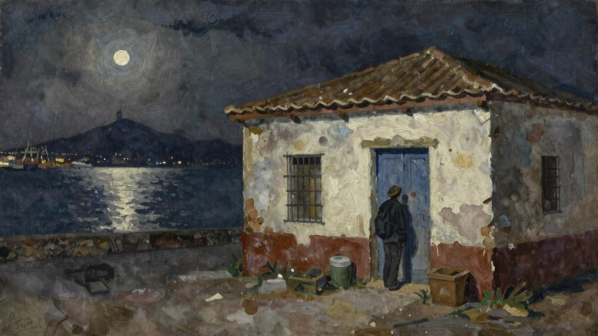
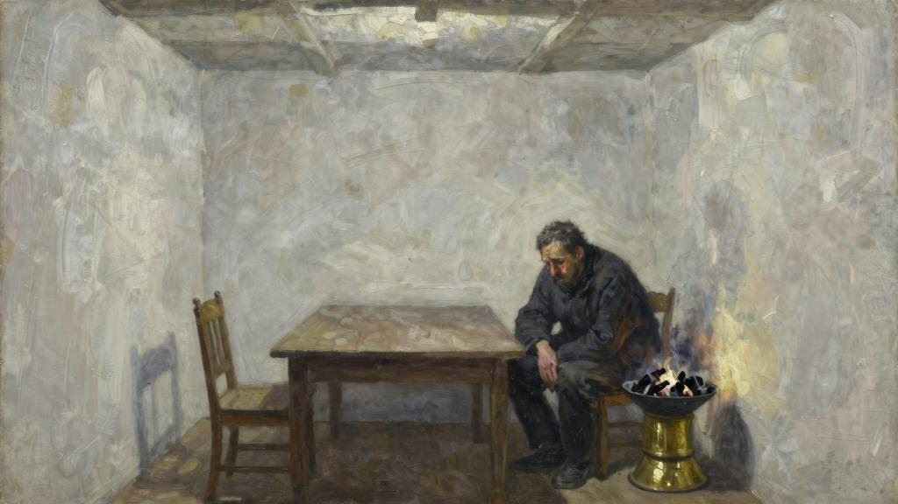
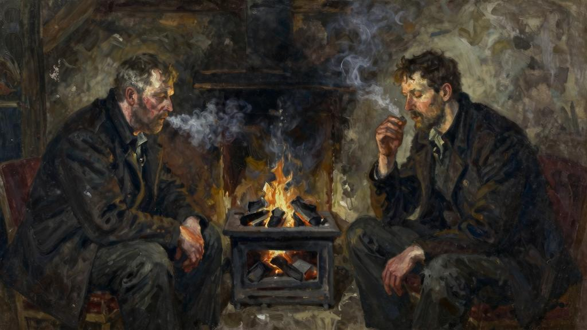
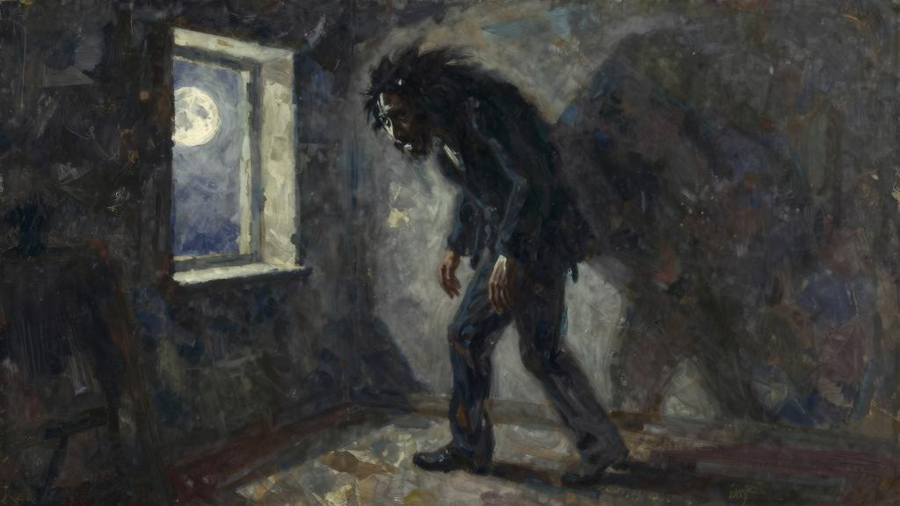

有一次走进一座偌大的城市就能目睹一些奇闻轶事，少之又少。然而，塞雷就遇到过，亲眼看到了一件奇怪的事。他第一次开车去那不勒斯时，偶遇这么一件事：一位年轻人从路边的店铺里跑出来，一个男人手里拿着刀紧随其后，追上后，一刀刺进年轻人的颈部，年轻人当场倒地而亡。塞雷本来就是菩萨心肠，他并不知道眼前的一切是这里司空见惯的，所以很惊恐，为这样的暴行而义愤填膺。可是，当他向同行的卡拉布里亚[115]的一位牧师表示自己的愤慨时，这位牧师开怀大笑，对身材魁梧、壮实的塞雷挖苦和讥讽了一番。塞雷说从来想象不出自己会去殴打别人。

这么刺激的事，我可没碰到过。不过，倒是有件事在我看来已经不同寻常了。第一次到阿尔赫西拉斯[116]时，我经历了一件奇怪的事。当年的阿尔赫西拉斯又脏又乱，我到那里时已是午夜，所以就在码头附近的一个客栈住了下来。虽然这个客栈破烂不堪，但是它和直布罗陀市仅隔一个海湾，对面的全貌尽收眼底。那天，皓月当空，我走进客栈，接待客人的办公室在二楼，一位看起来非常邋遢的女仆把我带到楼上。客栈的主人正在玩牌，见到我进来，高兴地抬起头，上下打量了一番，他脱口而出一个房间号，之后又继续他的游戏，再也没理睬我。

女仆领我到了房间，我问她有没有什么东西可以吃。

“你想吃什么？”她问我。

我心里非常清楚，在这里肯定吃不到像样的饭菜。

“客栈里都有什么能吃的？”

“你可以吃点鸡蛋和火腿。”

看着这里的环境，我也猜到没有什么别的东西可吃。女仆领着我到了一个狭长的房间。房间墙面粉刷过，屋顶很低，室内摆着一张长条餐桌，以备次日午餐使用。一个高个子男人背对着门，蜷缩着坐在火盆旁。安达卢西亚地区有个传统，在不是极端寒冷的冬天里，用一个黄铜盆用作火盆，装上炭火，就可以取暖。虽然这并不足以解决寒冷的问题，但是可以让人感觉温暖许多。我坐下来，在等着我那可怜的晚餐，然后瞟了一眼旁边的陌生人，他也同时在看我，当四目相对时，他很快移开了视线。最后，女仆终于把我要的鸡蛋端了上来，这时他又抬头看了一眼。

“麻烦你明天早晨叫醒我，我要赶第一班船。”他说。

“好的，先生。”

从口音可以听得出英语是他的母语，而且从魁梧的体格和面部特征来着，我猜他应该是英国北方人。在西班牙，强壮的苏格兰人比英格兰人要多，无论是在力拓河[117]富裕的矿区，还是赫雷斯市[118]酒窖，抑或是在塞维利亚和加的斯，都可以听到特威德河[119]对岸的那种慢悠悠的腔调。在卡莫纳[120]的橄榄树林里你可以见到苏格兰人；在阿尔赫西拉斯和博瓦迪利亚区间的铁路上，甚至在梅里达[121]的软木林中都有苏格兰人的足迹。

吃完鸡蛋，我来到火盆边。时值隆冬，海湾吹来的风，寒冷刺骨。在我把椅子拉近火盆时，那位先生把自己的椅子向后推了推。

“不用挪动。”我说，“这里足够我们两个人坐的。”

我点燃了一支烟，也随手递给他一支。在西班牙，经由直布罗陀运过来的哈瓦那雪茄一直很受欢迎。

“也好。”他说着，伸出手接过香烟。

我听得出他是格拉斯哥人，这个地区的口音说话如唱歌一样。这位陌生人不健谈，总是只言片语，任凭我怎么努力都无法和他交流。我们谁也不说话，默默地吸着

烟。靠近看，他比我之前看到的还要高大，肩膀宽厚，笨手笨脚，皮肤晒得黝黑，花白的头发剪得很短。他的鼻子、嘴和耳朵又大又厚，满脸皱纹，整个面部轮廓分明，硬朗、严肃；蓝色的眼睛暗淡、没有活力。他不断地用手捋着下巴上凌乱、花白的胡须，透露出内心的不安。我心里对这个陌生人产生了反感。突然，我感到他在看我，而且越来越专注，这令我非常厌烦，我索性抬起头，直视着他。正如之前一样，他迅速挪开目光，开始看着地面。片刻之后，他又抬起头，长而浓密的眉毛下的那双眼睛一直在审视着我。

“刚刚从直布罗陀过来？”他突然问我。

“是的。”

“我明天就离开了——回家。谢天谢地！”

最后四个字他说得非常用力，我禁不住笑了笑。

“你不喜欢西班牙吗？”

“哦，西班牙还不错。”

“你在这住很久了吗？”

“太久了，实在是太久了。”

他说这话时叹了口气。我随口一提的问题似乎激起了他内心的波澜，不知他为何情感如此强烈。这时，他突然站了起来，来回踱步，所到之处的椅子全都被他挪到了一边，就像一头关在笼子里的野兽一样，而且不时地重复着那几个字：“太久了，实在是太久了。”我坐在那里，一动不动，感觉十分尴尬。为了缓解一下自己的情绪，我把火盆里下面的热灰翻到了表面，而此时他突然居高临下地站在我面前，仿佛我的动作唤回了他的意识，猛然间又想起我还在房间里。接着，他重重地坐在椅子上。

“你觉得我很奇怪吗？”他问。

“当然，不过有很多人比你还要怪异。”我笑了笑。

“你没有看出来我有什么地方很怪异吗？”

说这句话时，他已经俯下身来，以便使我看得更加清楚。

“没有。”

“即使看出来了，你也会说没有，是吧？”

“看出来的话我是会直说的。”

我完全懵了，不明白他是什么意思，心想他是喝醉了吧。有两三分钟的时间，他什么都没说，我觉得该说点什么打破沉闷。

“你叫什么名字？”他突然抢先问道。我告诉了他我的名字。

“我叫罗伯特·莫里森。”

“苏格兰人？”

“格拉斯哥人。我已经在这个倒霉的国家住了好多年了。你有烟叶吗？”

我将烟草袋递给他，他把自己的烟斗装满，用火盆里燃烧的木炭点燃了香烟。

“我不能再在这里住下去了，时间太久了，太久了。”

他突然又很冲动地站了起来，开始来回走动，但是过了一会儿还是克制住了，一下子坐在了椅子上。从他的表情我看得出，他在努力压制自己的情绪。这种心神不定的状态应该是酒精在慢慢地发挥作用。醉汉格外令人厌恶。所以，我打算尽快找个借口溜出去，回到自己的房间。

“我一直经营着橄榄树的生意，”他接着说，“被派到这里工作，公司是格拉斯哥和西班牙南方橄榄油有限公司。”

“哦，是吧。”

“你是知道的，我们已经研究出一种新的油品提取方法，如果一切顺利的话，西班牙的橄榄油将和卢卡[122]的产品质量一样好，可是我们的价格更低。”

他的话冷冰冰的，平淡无奇，完全是一种商人的口吻。和其他苏格兰人一样，他说的每一个字都是精准无误，看起来非常清醒、冷静。

“要知道，埃西哈应该算是橄榄油中心，我们雇用了一个西班牙人负责这里的业务。可是，我发现他卷走了我们的钱财。现在，我要去把他追回来。我过去住在塞维利亚，那里交通方便，有利于橄榄油的装运。可是，去年怎么也找不到一个可靠的人负责埃西哈的业务，这样我得亲自去管理。你知道吗？”

“不知道。”

“在距离城镇两英里的地方，公司有一处很大的房产，就位于圣洛伦佐村的外面。

这座房子很好，位于山顶，外观也很美，放眼望去整座房子全都是白的，几只鹤在屋顶筑了窝。房子没有人住，但是我觉得住在那里倒是可以节省一大笔租金。”

“但是会比较孤独。”我说。

“是的，很孤独。”

罗伯特·莫里森又安静下来了，有两三分钟的时间他一声不响地吸烟。我暗想他为什么要告诉我这些。

我看了看手表。

“着急回去吗？”

“不太着急，不过时间不早了。”

“哎，那又有什么关系？”

“我想你住在那儿见不到很多人吧？”我继续说，又回到了刚才的话题。

“没有什么人，我和一对老夫妇住在那儿，他们照顾着我的生活起居。我有时也到村里去，和药房老板费尔南德斯玩一玩西班牙的特雷西洛扑克牌[123]游戏，在他的药铺偶尔也能遇到一两个人。以前，我还常去射击和骑马。”

“不过听起来这种生活也不错。”

“到去年春天，我在那里住两年了。说实话，从未见过五月份这么热的，没有人去干活，工人都躺在树荫下睡觉。羊都热死了，其他一些动物也像要发疯了一样，狂躁不安。就连牛都热得罢工了，它们后背隆起，呼呼喘着粗气。该死的太阳照在地上，炙热难耐，人感觉眼睛像要冒出来了一样。干旱的地面已经开裂，有的地方完全爆开。庄稼的叶子打了卷，橄榄树几乎被毁了，简直是地狱一般。这种天气里，根本无法入睡，我挨个房间走，想找个能喘上来气的地方。我根本不敢开窗，在地面上洒了些水，可是无济于事。晚上和白天没有什么差别，仍然是闷热，整个人就像待在火炉里一样。”

“最后，终于想到了一个办法，我在楼下朝北的房间里搭了个床。通常的年头，这里是不住人的，因为这个季节会非常潮湿。不管怎么热，这里应该还好，每天晚上可以睡几个小时，所以值得尝试一下。可是，真见鬼，这次尝试很失败，仍然是闷热难耐。

我躺在床上翻来覆去，感觉床滚烫滚烫，无法忍受。我起来打开门，出门就是一个阳台，我走了出去。深夜的天空美妙无比，皓月当空，亮如白昼，你甚至都可以借着月光看书。我之前和你讲过，这个房子位于山顶吧？我凭栏而望，眼前的橄榄树林一望无际，犹如大海，无边无垠。此情此景令我格外思念故土。我想念冷杉树间的一袭微风，忘不了格拉斯哥喧闹的街市。不管你信不信，我仿佛嗅到了家乡的气息，感受到了大海的苦涩。老天作证，在这个世界上我愿意倾其所有人去换取一个小时来感受家乡的空气。

有人说格拉斯哥空气非常糟糕，可是不知你相信不，我爱那里的雨，想念那里灰蒙蒙的

天空，还有泛黄的大海和波涛。但是，我却忘了自己身在西班牙，置身于乡下的橄榄园里。我张大嘴，深吸一口气，犹如在海雾中大口大口地呼吸一样。”

“忽然间，我听到了什么声音，好像是个男人发出的，声音不大。你能想象出吧，就是那种低沉的说话声。这声音穿过寂静的橄榄林，无法准确地描述到底像什么，可是的确使我大吃一惊。这个时候，已过了午夜，谁能跑到橄榄树林里呢？这个奇怪的声音听起来就像一个男人在笑，笑得很滑稽。我猜想你应该听到过这种笑，就是那种咯咯的笑声。这笑声仿佛顺着山坡向上爬着，时断时续。”

莫里森看着我，似乎在揣摩我是否理解这种极其震撼的感觉，可是他自己都描述不清。

“我的意思是，当时的感觉就好像投掷了一个东西的声音，很像从桶里扔出一个石头一样。我俯身向前，仔细查看。月光亮如白昼，我要是真的看到了什么，也得吓死。

突然，声音消失了，可我还是朝声音传来的地方张望着，生怕有人在动。一分钟后，又响了起来，但是要比之前响亮。这次已经不是在咯咯笑，应该是捧腹大笑，笑声在午夜的空中回荡。这声音犹如醉汉在咆哮。我感到很奇怪，这么大的声音两个仆人竟然没有被吵醒。”

“‘是谁在那里？’我喊了一声。”

“没有回答，只能听到笑声在持续。我也不介意和你说，当时我很恼怒，甚至有点想下去看个究竟。三更半夜，讨厌的醉鬼在我的地盘大吵大闹，太不像话，无法容忍。可是，这时忽然发出一声号叫。天啊，我真是吓了一跳。接下来，号叫声又变成了哭泣的声音。这个人大笑时是浑厚的低音，可是哭起来简直就是在尖叫，好比猪被砍断脖子时撕心裂肺的声音。”

“‘我的天啊！’我喊起来。”

“我猜想一定是有人被害了，于是我翻过护墙，朝着声音的方向跑去。可是，突然声音完全消失，紧接着一声刺耳的尖叫，然后传来了呜咽和呻吟声。我告诉你，那声音

是什么样的，就像有人濒临死亡时的哀号。接下来是长长的呻吟和叹息声，之后就什么都听不见了。周围恢复了宁静，无边无际的宁静。我在林子里跑来跑去，什么也没有发现。之后，我只好上山，回到了房间。”

“你能想象得出那晚上我睡了多长时间。天刚一放亮，我就立刻从窗子向晚上发出声音的方向望去。我惊讶不已，在橄榄树林中有个山谷，山谷中竟然矗立着一座白色的小房子。山谷那面的土地并不归我们所有，所以我从未到过那里，更没有去过那座白房子，而且以前从未见过那里还有座房子。于是我去问住在附近的何塞。他说，只知道以前一个疯子、他的哥哥和仆人住在那里。”

“哦，这就是事情的原因了吧？”我说，“有这样邻居可够倒霉的。”

这位苏格兰人突然俯下身来，抓住我的手腕，他的脸凑到了我面前，双眼仿佛吓得要冒出来一样。

“那个疯子已经死了二十多年了。”他低声说。

他松开我的手，背靠着椅子，气喘吁吁。

“我下山，来到那个白房子附近，绕着屋子转了一圈。所有的窗户都安装了铁栅栏，还挂着百叶窗帘，门都上了锁。我敲门，使劲摇动门把手，按响了门铃。可以听得到院子里门铃的叮咚声，并没有人出来开门。这个房子共有两层，我抬头看了看，百叶窗拉得严严实实，看起来这里根本没有人居住。”

“我想知道，房子的状况怎样？”我问。

“哎，破烂不堪。墙上的白灰已经脱落，门和百叶窗上的油漆也几乎掉光了，屋顶上一些瓦片掉到了地上，应该是被大风吹落下来的。”

“太奇怪了！”我说。

“我于是就去了药店找到费尔南德斯，他说的和何塞之前告诉我的一样。我又问了关于那个疯子的一些事，费尔南德斯说并没有人见过他。通常情况下他都是昏睡，急性躁狂症[124]会偶尔发作，发作时距离房子很远都可以听到。他笑得死去活来，然后又大哭，令人毛骨悚然。”有一次发作时，他再也没有活过来。管家他们很快收拾收拾，就把他埋葬了。从此，再没有人敢住那个房子。

“我并没有和费尔南德斯讲我听到的声音，怕他嘲笑我。那天回来后，晚上我一直没睡，观察着周围的一切。可是，什么都没发生，一点声响都没有，一直等到黎明时分我才上床睡下。”

“你再也没有听到过这个声音吗？”

“之后的一个月都没有听到。干旱燥热的天气一直持续，晚上我也始终在后面的杂物室里睡。一天晚上，我睡得正酣，突然好像身边有什么东西。真不知怎么说好，那种感觉很奇怪，仿佛有人轻轻地推了我一下，想要提醒我什么，我一下子就醒了。我躺在床上，这时听到了和上次一样的声音，低沉的咯咯笑声持续很久。这声音听起来似乎有人听了一个老掉牙的笑话，被逗乐了一样。声音是从山谷里传出来的，而且笑声越来越大，震耳欲聋。我跳下床，来到窗前，两条腿在发抖。午夜时分，这种瘆人的笑声划过夜空，让人无法忍受。笑声停止，片刻之后又是由于疼痛发出的尖叫，然后是凄惨的呻吟。声音不像人发出来的，特别像动物被虐杀时的惨叫。不怕你笑话，我吓得僵在了那里，完全动弹不了。过了一会儿声音停止了，但是并不是戛然而止，而是渐渐变弱，最后消失了。我竖起耳朵，可是再也没有听到什么。我爬到床上，用被子盖住了头。”

“我突然记起来费尔南德斯说疯子是间歇性发作，平日里很安静。费尔南德斯说这话时没有什么目的，却引起了我的思考：躁狂症的发作是否有一定的规律呢？回想两次之间的间隔是二十八天，这样应该很容易推断出来。显而易见，每次月圆时就会发作。

我真不是轻易就被吓破胆的人，所以决心要一探究竟。于是，我在日历上标出了下次月圆的日子。这一天我一直没睡，把左轮手枪擦得锃亮，装上子弹，准备了一个灯笼，之后就来到屋顶护栏处静候。说实话，我感觉自己非常勇敢，没有被吓住，很为自己骄

傲。那天晚上起风了，站在屋顶可以听到呼啸的风声，风吹过橄榄树沙沙作响，如同波浪拍打着岸上的卵石。看到月光下山坳里的白房子，我顿时感到格外兴奋。”

“终于，我听到轻微的响动，这声音已经很熟悉了，我禁不住笑了。果然不出所料，月圆和狂躁症发作就如同钟表一样，再准不过了。那就来吧，我正等着呢。我一跃而起，翻墙而过，冲进了橄榄树林，径直朝那个房子跑去。当我离房子越来越近时，咯咯的笑声也愈发响亮。等到了房子跟前时，我抬头看了看，里面没有灯光。我把耳朵贴在门上仔细听了听，只听到疯子在大笑，笑得很凄惨，难以自制。我用拳头使劲砸门，猛按门铃。仿佛我砸门的声音助长了他的士气一样，发出了更凄惨响亮的笑声。我又开始敲门，越来越用力。可是，我敲门的声音越大，他的笑声也越大。然后，我扯着嗓子喊了起来。”

“‘把该死的门打开，不然我撞开了。’”

“我向后退了一步，使出全身力气，一脚踹在门栓上，然后用身体拼命撞到门上，门被撞裂了，再用力一推，该死的门终于打开了。”

“我从口袋里掏出左轮手枪，另一只手提着灯笼。打开门，笑声越来越大。我走进去，一股恶臭袭来，熏得我几乎站不住脚。我的意思是，屋子的窗户有二十多年没有打开过，可想而知气味是怎样的。这一阵吵闹完全可以使死者复活，可是问题是我不能判断他在哪个方向，因为声音碰撞到四周的墙壁，回声传向四面八方。我用身体一侧撞开一个房间的门，进去一看，只有四面白墙，屋里面什么都没有，连一件家具都没有。叫声越来越大，我循着声音而去，撞开了第二个房间的门，里面仍然是空无一物。这时，我打开了一扇门，发现已经到了通往二楼的楼梯口，疯子就在我头上的房间里爆笑着。

我蹑手蹑脚地往楼上走。你知道的，我绝对不能大意。到了二楼，面前有一个走廊，沿着走廊往前走，把灯笼举在前面照亮，最后来到走廊尽头的房间。他就在里面。我和可怕的声音只隔着一扇薄薄的门板。”

“在这里听着凄惨的声音太恐怖了，我浑身战栗，一直在发抖。我恨自己太懦弱、胆小。这声音完全不像人发出的。天啊，我吓得差点拔腿就跑。我咬紧牙，使劲地控制

着不要颤抖，可是无论如何都没有勇气去旋转门的把手。这时，笑声戛然而止，可以说像用刀切的一样，突然停了下来。接着，听到由于疼痛发出的唏嘘声。之前的几次，我是没有听到过这个声音的，因为声音很低，在我住处不可能听得到。然后，就发出了气喘吁吁的声音。”

“‘哦！’我听到里面的人用西班牙语说，‘你是要杀死我吗？赶快拿开。哦，上帝啊！救救我！’”

“他这样喊着。是谁这么残暴地折磨他，我猛地把门打开，冲了进去。由于门突然被打开，一阵风吹起了一片百叶窗，明亮的月光顺着缝隙照射进来，灯笼的光线顿时黯淡了许多。就如同我和你面对面说话一样，也是这么清晰，离得也是这么近。我的耳畔还听得到那个人凄惨地呻吟、哀怨和呜咽，最后是令人恐怖的喘息声。这声音能把人吓晕死过去，因为这声音听起来仿佛他就要死了。我和你提过吧？我听到他断断续续的哽咽声就在耳边。可是，房间空空的，什么都看不到。”

罗伯特·莫里森一下子跌坐在椅子上。很奇怪，这个大块头、壮实的男人突然看起来就像一个画室里的人体模型，仿佛轻轻一推就会变成碎片掉在地上。

“然后怎么样了？”我问。

他从口袋里掏出一个脏兮兮的手帕，擦了擦额头：

“我感到不能在这个朝北的房间睡了，所以无论天热不热，我都要搬回到原来的房间去。可是，就在四周之后，大约凌晨两点钟，我又一次被疯子的笑声惊醒，声音近得仿佛就在耳边。也不怕你笑话，我的精神快崩溃了。所以，下一次这个讨厌鬼就要发作时，我指的是月圆快到的那天晚上，我让费尔南德斯过来和我一起住。当然，关于听到声音这件事我只字未提，就是拖着他打牌直到凌晨两点。这时，我再次听到了那个声音。我问他是否听到有什么声音，他说：‘什么声音都没有啊。’我说：‘分明有人在笑。’他说：‘你喝醉了吧，’他也开始笑了起来。这太过分了。‘住嘴，别笑了，你这个傻瓜。’我说。笑声越来越大，我喊叫起来，用手捂住耳朵，不想再听。可是，真见

鬼，捂住耳朵完全没有用，笑声和疼痛的尖叫依然在耳边。虽然费尔南德斯没有直接说，我知道他以为我疯了。因为他很清楚，如果真的这样说了，我会杀了他的。他说要去睡了，就离开了。可是第二天早晨我发现他的床从来没有睡过的痕迹，他半夜就溜走了。夜里他离开我后，就偷偷地跑回家了。”

“这件事后，再也不能待在埃西哈了，找了一个代理人处理那里的事务，我就回到了塞维利亚。在那里，感觉更安全。可是，随着时间越来越近，我又开始担忧起来，我也常常告诉自己不能这么愚蠢。可是，你可能也很清楚，真是难以控制。主要是我担心那个声音已经跟上我了，如果在塞维利亚也能听到的话，那一生都难以摆脱。我也是个男人，有男人的魄力，所以我鼓足了勇气。可是，真是该死，勇气也是有限度的，有些事情人的血肉之躯无法忍受，我很清楚自己快要发疯了。这种状况下，我开始喝酒，因为精神焦虑太恐怖了。我经常躺在床上，数着日子，无法入睡。可是，最终该来的还是会来的。结果，它真的来了。在塞维利亚——离埃西哈六十英里外的地方，我又听到了那个声音。”

我不知道该说什么，一时间沉默了。

“你上一次听到那个声音是什么时候？”我问。

“四周前。”

我猛然抬起头，惊魂不定。

“你这话是什么意思？今晚又不是满月？”

他看着我的表情很神秘，却又很气愤。他张嘴正要说话，却停住了，仿佛失去了发声的能力，听起来好像声带出了问题。最后，他用一种非常奇怪的很粗的声音回答。

“不，今晚是满月。”

他盯着我，本来失去光泽的蓝眼睛看起来越来越红，这种恐惧以前在人的表情中还从未见过。他很快起身，阔步走出房间，随手关上了门。

我得承认，那天晚上我根本没睡好。

园会之前金纳夫人一贯很守时，她早早地就穿戴整齐。黑丝裙符合她的年龄，在女婿过世后服丧期内穿着这样的衣服也非常得体。她戴上了那顶丝绒帽，可是又有些犹豫。今天聚会肯定会遇到很多朋友，帽子上面装饰的白鹭羽毛也许会招惹朋友他们尖刻的指责和规劝。在鸟儿交配的季节杀了它们，只为换取漂亮的羽毛来装饰帽子，这种残忍行为令人难以接受。可是，看看那顶帽子，又漂亮又时尚，放着这么好看的帽子不戴也是不太明智，更对不起女婿的良苦用心。他不远万里从婆罗洲[125]拿回来送给她，一心期望她见到这么漂亮羽毛会欢欣鼓舞。凯瑟琳当时很不高兴，她讨厌这些羽毛。不过，发生了这么多事，现在她肯定已经后悔，当初不该那样对待姐夫。可话又说回来，凯瑟琳从来都没有真正地喜欢过哈罗德。金纳夫人选了一枚带有黑玉珠子的别针装饰在帽子上，站在梳妆镜前，戴在头上，这是唯一一顶可以拿得出手的帽子。就算有人指责的话，她心里已经知道如何应对。

“我明白这样做很残忍，”她会这么说，“而且我是决不会主动去买的，可是这是我可怜的女婿上次回来度假时带回来的。”

这样就可以说得很明白了，她从哪里得到的这些羽毛，为什么坚持用它们来装饰帽子。人们都是善良的，可以理解这种情感。金纳夫人从抽屉里取出一个干净的手帕，在上面喷了点科隆香水。她从来都不用香水，总感到气味太浓，不过科隆香水却不同，可以使人神清气爽。一切都准备就绪，她抬起头，透过梳妆镜后的窗子向外望去。

外面天气真好，坎农·海伍德选择今天举行游园会，再适合不过了。蓝天，暖阳，春天的树叶还没有脱去嫩绿的衣装。屋后，长长的花园里，小外孙女忙着收拾只属于她自己的花坛。金纳夫人会心地笑了。实际上，她不愿意看到琼苍白的脸色，觉得让她在热带地区住这么久是错误的。而且，对于这个年龄的小孩子来说，她过于一本正经。从未见她到处跑着玩耍，总是安安静静地做自己想出来的游戏，或者到花园去浇花。金纳夫人拍打了一下裙子，拿起手套，走下楼。