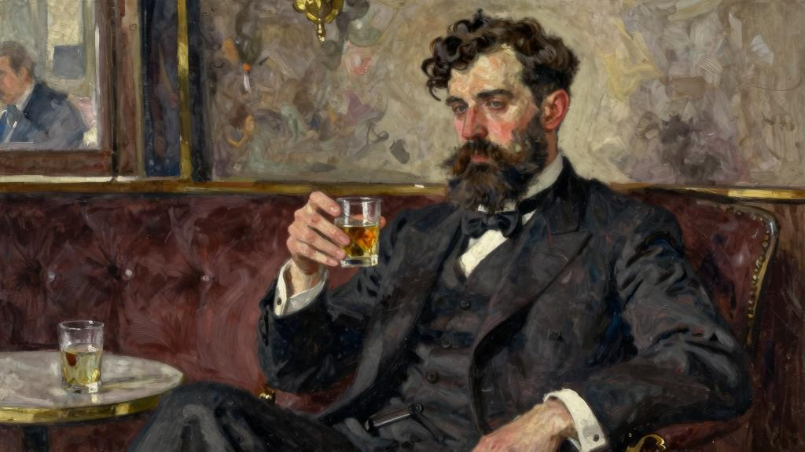
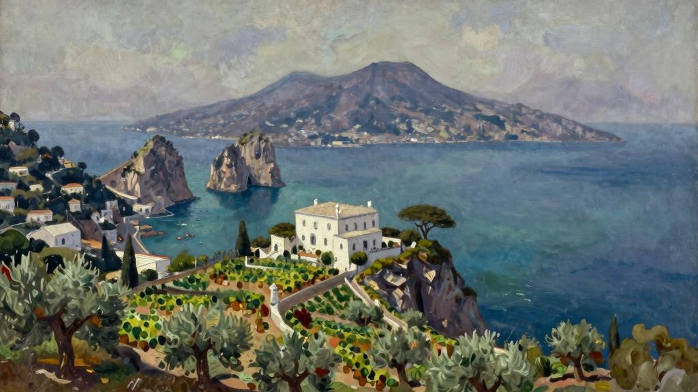
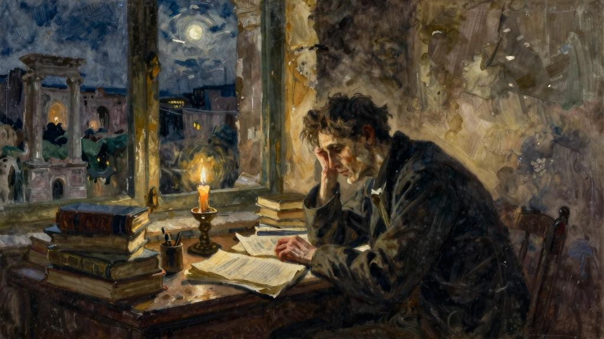
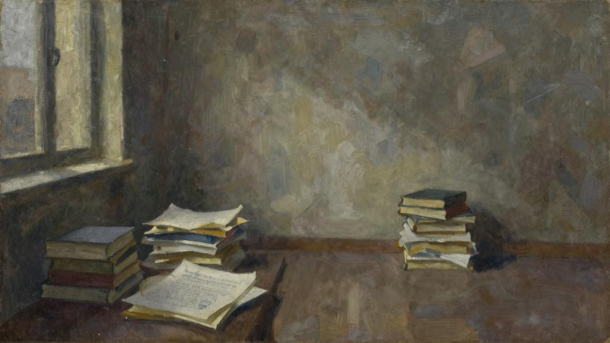

多数人的生活都受环境的影响，命运带来的种种境遇，人们只能听之任之，甚至心甘情愿地接受。他们就像悠然自得地沿着轨道前行的电车，鄙视那些廉价的小汽车，嫌它们在马路上窜来窜去，嫌它们在开阔的乡间吵吵闹闹。对这样的人，我持尊重的态度。他们是遵纪守法的公民，是温和谦让的丈夫，是慈眉善目的父亲。当然，税需要有人缴，可是在这种人身上，我就是看不到留给人深刻印象的地方。我最钦佩的，是那些牢牢掌控自己命运，按自己的喜好生活的人，但这样的人，世间寥寥无几。也许世上根本不存在随心所欲，而我们的心却永向往之。在人生的岔路口，我们可以选择向右，也可以选择向左，而且确实也曾经做过这样的选择。但事后，便难看清其实是历史的车轮迫使我们接受当年的选择。

我见过的人当中，再没有比梅休更有意思的了。他是底特律的一名律师，既能干又成功，三十五岁便已事业有成、日进斗金，日子过得舒适惬意，在业内也小有名气。

他天资聪颖，很有人格魅力，而且为人正直。无论是生意上，还是政治上，他都没有理由不能成为一方霸主。一天晚上，他和一帮朋友坐在俱乐部喝酒，也许是不胜酒力（或是太胜酒力），其中的一位不久前刚从意利回来，对在座的人说，他在卡普里岛上看到过一栋房子，这座房子建在山上，还有个树木葱翠、绿草如茵的花园，从那里可以眺望整个那不勒斯湾。他绘声绘色地向家讲述了地中海上的卡普里岛如何如何美丽。

“听上去不错嘛！”梅休说，“那房子卖吗？”

“意利什么都卖。”

“给他们发封电报，报个价。”

“天哪！你要卡普里的房子做什么？”

“住啊！”梅休道。

他让人取来电报纸，填好，发了出去。几个小时后，他就接到回电。对方接受了报价。

梅休并不是那种虚伪的人，若是在清醒的时候，断不会做出如此疯狂的举动。对此，他毫不掩饰，但既然做了，也绝不后悔。他既不冲动鲁莽，也不感情用事，相反是既诚信又真实。他不会因一时逞能而一味蛮干，结果做出不明智的决定。一旦下定决心，他肯定说到做到。他不在乎钱，他的钱足以让他住在意利。比起眼下处理凡夫俗子间的小打小闹，他觉得自己应该做些更有意义的事。但梅休并没有什么明确的计划，只想摆脱眼下什么都不缺的日子，过种别样的生活。朋友他们概都认为他疯了，有的朋友肯定尽自己所能劝阻过他，但他依然安排好了事务，收拾好了家具，动身去了卡普里。

一眼望去，沐浴在蔚蓝海中的卡普里岛，全是岛礁，一点儿也不起眼。但是，岛上的葡萄园郁郁葱葱，果实累累，给卡普里增添了一分柔和与舒心的优雅。小岛虽然远离尘嚣，但日子过得倒也其乐融融。梅休选择在这个美丽的小岛上定居，我实在不解，因为我从来没见过他这么对自然的美无动于衷的。我不知道他住在这里为的是什么：幸福、自由，或者仅仅是逍遥自在。但我清楚他找到了什么。在这个自然强烈吸引各个感官的地方，他追求的完全是一种精神生活。岛上有许多古迹，到处弥漫着提比略帝[49]的神秘记忆。站在窗前，可以俯瞰那不勒斯湾，神圣的维苏威火山随着斗转星移变化着色彩。梅休发现，这里有一百多处古希腊和罗马的遗址，过去的历史让他痴迷。他之前从未出过国，眼前看到的一切都是破天荒头一次，让他不禁遐想联翩，在灵魂深处又激发了更多的神往。再加上，他天生精力充沛，所以，他很快打定主意写一本史书。他花了些时间思考合适的主题，最终选定了罗马帝国的第二世纪。这段历史鲜为人知，在他看来，这段历史中的一些问题跟当代社会所面临的一些问题有很多相似之处。

他开始搜集相关图书，不久就掌握了量的文献。做律师时受过的训练，教会了他如何快速阅读。他着手开始工作。刚开始，他在傍晚还经常光顾露天市场附近的小酒

馆，与画家、作家或其他文人聊聊天，但不久便闭门不出，埋头进行深入研究。以前，他还经常跑到温暖的海水中去沐浴，在迷人的葡萄园里漫步，但渐渐地，因为吝惜时间，连这他也放弃了。他甚至比在底特律做律师时更加努力。他经常是正午时分开始，通宵达旦地工作，直到每天清晨从卡普里岛开往那不勒斯的汽轮笛声响起，提醒他已经五点钟，是时候去睡觉了。那段浩瀚而又影响深远的历史在他面前缓缓展开，让他觉得，完成这项工作后，自己将与伟的史学家比肩。几年过去了，人们已经很难再看到梅休的身影。只有下棋和辩论才能偶尔吸引他走出家门，因为他喜欢这种脑力的比拼。

现在他博览群书，不仅是历史，还阅读哲学跟科学。他是辩论高手，思路敏捷，逻辑清晰，论点深刻。不仅如此，他生性乐观，为人厚道。虽说在下棋和辩论中战胜对方，未免给他带来常人之喜，但他绝不会因沾沾自喜让对方难堪。

刚来卡普里岛时，他身材高，身体健壮。一头浓密的乌发，乌黑的络腮胡子，让人一看就知道他身强力壮。可是，渐渐地，他的皮肤变得苍白，变得松弛下来，人也比之前消瘦、虚弱了。梅休虽然是一个自信到近乎偏激的唯物论者，却鄙视自己肉体的这种变化，认为肉体只不过是他用来完成精神使命的一副廉价工具。这种观点放在一个最讲逻辑的人身上，真的是自相矛盾、令人费解。无论疾病痛苦，还是倦怠疲乏，都阻止不了他继续工作。十四年来，他孜孜不倦地耕耘，作了成千上万条笔记，然后进行归纳、整理。他对所有文献都了如指掌后，最后便准备坐下来开始写作。可是，他死了。

这位一直藐视自己肉体的唯物论者，终于得到了报应。

他日积月累起来的浩瀚知识体系，也随之消失，无迹可寻。那份本想与吉本、莫姆森[50]争雄的雄心壮志——当然不是龌龊的志向——也前功尽弃了。想起梅休，只有几个朋友仍对他念念不忘。随着岁月的逝去，记着他的人只怕是越来越少了。岂不悲哉！时至今日，在这个世界上，他的死一如他的生，已无人知晓了。不过，在我看来，他的一生是成功的。他选择的生活道路是完美的。他做了自己想做的事，在目标触手可及时，撒手尘寰，而且还没尝到目标达成后的那种苦楚。