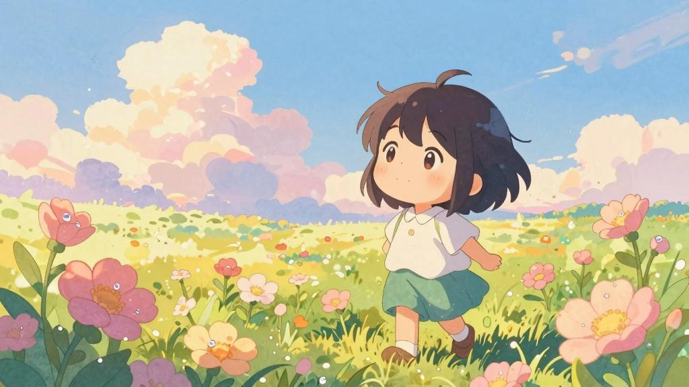
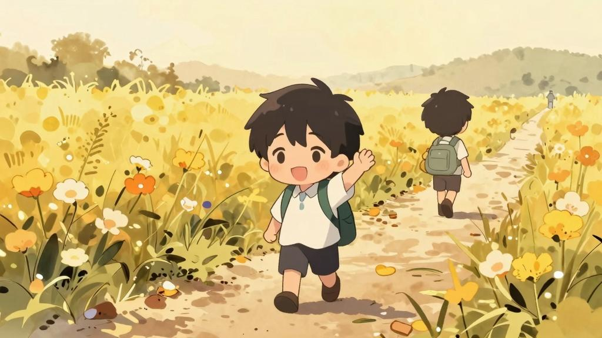

# 许嵩《前程似锦》：眼泪不是成熟的代价，而是雨露之于鲜花

> *"你就放手飞吧，内心别多挣扎"*

《前程似锦》是首批三首曲目中最温柔的一首，也是最容易让人泪目的一首。它写的是告别——不是愤怒的决裂，不是凄美的放手，而是一个人在清晨微光中，对另一个人说出最残忍的温柔：**你走吧，去过你该过的人生。**

## 一、清冷广场上的一整晚

> *"天色已微亮"*
> *"清冷的广场"*
> *"座椅有点脏"*
> *"将就躺躺"*
> *"我们的话"*
> *"说了一整晚"*
> *"细数哀乐"*
> *"互诉衷肠"*

画面感极强。天快亮了，广场很冷，座椅很脏。两个人说了一整夜的话——把过去所有的喜怒哀乐都翻出来，像是在做一场漫长的告别仪式。

"细数哀乐，互诉衷肠"——注意是"哀乐"而非"悲欢"。**哀乐**，是葬礼和婚礼上才会奏的曲子。许嵩用一个词，暗示了这场对话的分量：既是送行，也是祝福。

## 二、"你就放手飞吧"

> *"你就放手飞吧 内心别多挣扎"*
> *"可别像我 拘束平庸的活法"*
> *"下段远行 我不再陪你到达"*
> *"请原谅我 依依不舍的废话"*

副歌是全曲的核心。每一句都是矛盾体：说"放手飞吧"，自己却"依依不舍"；说"别像我"，带着自嘲的苦笑；说"我不再陪你到达"，却用了"请原谅我"。

**"可别像我 拘束平庸的活法"**——这一句读来心碎。许嵩很少这样评价自己。一个功成名就的音乐人，在告别时刻说出"拘束平庸"，这是一种极度的坦诚：**在人生的某些维度上，他觉得自己不够好，不值得被追随。**

这不是谦虚，而是深爱之人离开前特有的自我贬低——**因为你太好，所以我不配。**

## 三、从携手的，变成了挥手的

> *"你就放手飞吧 累赘自觉退下"*
> *"做过的梦 就一一去实现了吧"*
> *"故事最后 我们从携手的 变成了挥手的"*
> *"就此别过"*

**"累赘自觉退下"**——五个字，字字千钧。把自己称为"累赘"，主动"退下"，这种姿态太卑微也太决绝。

"从携手的变成挥手的"——全曲最精妙的一句词。携手和挥手，一字之差，一个是并肩前行，一个是目送远去。**人生的聚散，往往就是这一字之距。**

"就此别过"——古风式的告别，简短、利落、不回头。但前面的铺陈告诉我们，这份简短背后是一整晚的辗转。

## 四、雨露之于鲜花

> *"天边出现了好看云霞"*
> *"空的座椅 有人来擦"*
> *"眼泪不是成熟的代价"*
> *"而是 雨露之于鲜花"*

结尾四句，是整首歌的"戏眼"，也是全网最被讨论的段落。

"空的座椅有人来擦"——你走了，你坐过的位置空了，但有人来擦拭它。**这意味着：你存在过的痕迹，没有被遗忘，而是被珍惜了。**

**"眼泪不是成熟的代价，而是雨露之于鲜花。"**

这一句是对整首歌情感基调的翻转。前面所有的告别、不舍、自嘲，在这里被重新定义——眼泪不是你为成长付出的惨痛代价，它像雨露滋养鲜花一样，**滋养了你的生命，让你绽放。**

这是许嵩给所有人的温柔：**你的眼泪没有白流。它不是伤口的证明，而是花开的前兆。**

## 五、告别与安泊

将《前程似锦》放在《安泊猜想》中理解，它讲述的是另一种"安泊"——**有时候，安顿自己的方式，是放手让别人飞。**

你留下，我放手。你不平庸，我先退下。你的眼泪会变成雨露。你的前程似锦。

**这不是悲伤的歌，这是一首用温柔包裹着的、最深的祝福。**

## 结语

三首首批曲目中，《粗糙》教你如何与世界相处，《洛阳纸》教你如何与历史相处，《前程似锦》教你如何与离别相处。

许嵩四十岁了。他写的告别，没有撕心裂肺，没有痛哭流涕，只有清晨微光中一句"你就放手飞吧"。

**但最轻的告别，往往最重。**

眼泪不是成熟的代价，而是雨露之于鲜花。

前程似锦。
