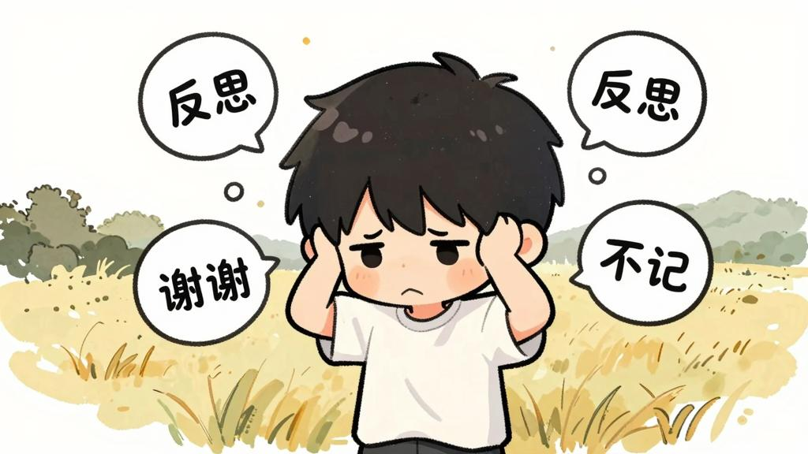
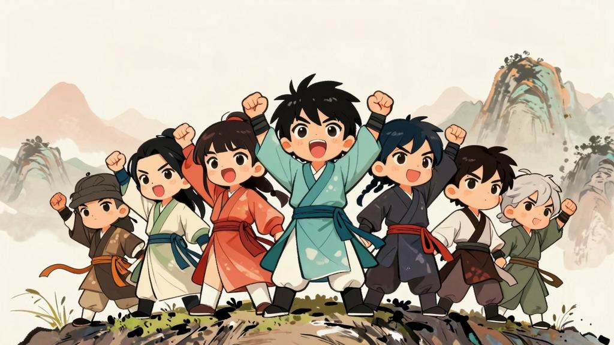

# 许嵩《粗糙》：把规训扳倒，然后粗糙地活着

> *"我们一起变粗糙"*

如果说《洛阳纸》是文人式的思辨，那么《粗糙》就是一记漂亮的直拳——它不讲典故，不绕弯子，直接对着每个深夜辗转反侧的内耗型人格说：**别装了，粗糙一点吧。**

## 一、医嘱：请你粗糙一点

> *"有阵子常常失眠"*
> *"医生说你有郁结"*
> *"细腻的心思像紧绷的琴弦"*
> *"医嘱是劝你粗糙一点"*

开篇四句，许嵩罕见地直接谈论"生病"。失眠、郁结、紧绷的琴弦——这是当代都市人最熟悉的症状。而医生的处方不是药片，不是冥想APP，而是一句看似荒诞的话：**粗糙一点。**

"细腻"向来被当作褒义词，但许嵩把它比作"紧绷的琴弦"——太紧了就会断。**过度敏感不是优点，而是一种自我消耗。**这首歌的第一层内核就在这里：承认脆弱，是变强大的开始。

## 二、"别人冒犯我边界 我竟然说谢谢"

> *"我俩算同病相怜"*
> *"反思模块要从头拆卸"*
> *"别人冒犯我边界 我竟然说谢谢"*
> *"风度翩翩像是中邪"*

这几句精准地击中了"讨好型人格"的要害。被冒犯了还要道谢，被伤害了还要反思自己——这不是教养好，这是"中邪"。

**"反思模块要从头拆卸"**，是整首歌最狠的一句。许嵩把人的心理机制比作机器，主张把"反思"这个模块整个拆掉。这当然是一种夸张，但它指向了一个真实的困境：**在这个时代，善良和细腻的人总是在反思自己，而真正冒犯你的人从来不反思。**

所以与其不断自我审查，不如"变粗糙"。

## 三、掌心的老茧，粗糙反而惊艳

> *"放大镜请卖给骆驼"*
> *"包袱重很擅长数沙粒的细活"*
> *"我掌心的老茧 粗糙反而惊艳"*
> *"居然才发现"*

"放大镜卖给骆驼"——化用"骆驼穿针眼"的隐喻，讽刺那些总是拿着放大镜挑毛病的人。包袱太重的人，擅长"数沙粒的细活"——对每一个微小的不完美都耿耿于怀。

**但掌心的老茧，粗糙反而惊艳。**

这一句是全曲的灵魂。老茧是劳动的痕迹，是磨砺的证据。它不光滑、不精致，但它代表了真实的生命厚度。许嵩在这里完成了一个漂亮的翻转：**粗糙不是缺陷，而是一种历经磨砺后的勋章。**

## 四、副歌：一场温柔的暴动

> *"我们一起变粗糙"*
> *"碾碎内耗 冲恶意怪叫"*
> *"我们一起变粗糙"*
> *"在群魔里我看出你很好"*
> *"我们一起变粗糙"*
> *"放肆哭笑 把规训扳倒"*
> *"我们一起变粗糙"*
> *"别怕闲人说你有点难搞"*

副歌用"我们一起"开场，瞬间从私人独白变成了群体宣言。四个动作——碾碎内耗、冲恶意怪叫、放肆哭笑、把规训扳倒——每一个都是对"乖巧人生"的反叛。

"在群魔里我看出你很好"——这一句格外温柔。世界群魔乱舞，但我能穿过喧嚣看见你的好。**粗糙不是冷漠，而是为了在浊世中更好地保护内心的柔软。**

"别怕闲人说你有点难搞"——这是许嵩给每一个"老好人"的解药。怕被说难搞？那就难搞一点。**你的人生，不需要所有人满意。**

## 五、九专第一曲：用"粗糙"开场

《粗糙》是《安泊猜想》的第一首曲目。许嵩选择用它打头阵，不是偶然。

整张专辑的核心概念是"安泊"——在喧嚣中找到定力。而"粗糙"恰恰是通往"安泊"的第一步：**你只有先放下对完美的执念，才能在信息洪流中站稳脚跟。**

编曲上，开头的人声做了刻意的"粗糙化"处理，初听会觉得有些冲击，但这正是许嵩的用意——**他用自己的声音示范了什么叫"变粗糙"**，拒绝修饰，拒绝圆滑。

## 结语

《粗糙》是一首"反鸡汤"的歌。它没有说"你很好，加油"，而是说"别太把自己当回事，也别把别人当回事"。碾碎内耗，放肆哭笑，把规训扳倒——

**与其精致地崩溃，不如粗糙地活着。**

许嵩四十岁了。他写《粗糙》，不是因为他学会了妥协，而是他终于想明白了：**这世界上最值得保护的东西，恰恰需要一层粗糙的外壳。**

我们一起变粗糙吧。
