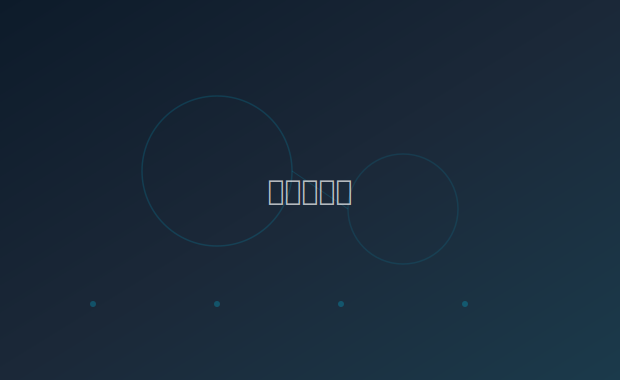

人工智能的蓬勃发展让我们不得不重新思考一些根本性的问题：创造力的本质是什么？当机器可以写出流畅的文字、画出精美的画作时，人类的独特价值在哪里？

我并不打算给出确定的答案。事实上，这些思考本身就是开放的、未完成的——就像一篇永远在修订中的草稿。但我相信，提出好的问题，往往比匆忙给出答案更有价值。

## 工具与伙伴

我们习惯把技术视为工具。锤子是工具，计算器是工具，搜索引擎也是工具。工具的特征在于：它完全服从于使用者的意志，自身没有能动性。

但当我们与 AI 对话时，事情变得微妙起来。它会追问、会建议、会「思考」。这种交互模式更像是在和一个有见解的伙伴交流，而非简单地使用工具。

> 真正的工具革命不是让工具变得更强，而是让工具变成伙伴。当我们不再「使用」AI，而是与它「协作」时，一个新的时代就开始了。

当然，这种拟人化的描述需要警惕。AI 并没有真正的意识或情感。但当它的输出质量足够高时，我们的心理体验确实发生了变化——这本身就是值得思考的现象。

---

## 创造力的新维度

有人说 AI 会消灭创造力。我持相反的观点。我认为它拓展了创造力的维度。

过去，一个有创意但没有绘画技巧的人，很难把脑海中的画面呈现出来。现在，通过 AI 的辅助，创意可以更直接地表达。这不是在取代创造力，而是在降低表达的门槛。

真正的创造力从来不是机械性的工作。它是对世界的敏感、对问题的洞察、对美的追求。这些品质，至少目前，还深深地植根于人类的经验之中。

### 一个有趣的实验

试试让 AI 写一首关于「冬天的树」的诗。它会写出语法完美、意象工整的作品。但如果你自己写，哪怕粗糙、哪怕笨拙，那里面会有你真正在某个冬天午后看到一棵枯树时的感受。

这种「在场的温度」，是机器无法复制的。它是人类创作最珍贵的部分。

## 保持谦逊

面对技术的快速迭代，最重要的大概是保持谦逊。既不盲目乐观地拥抱一切，也不恐惧地拒绝变化。而是带着好奇和审慎，一步一步探索。

毕竟，我们正在书写的，是人类与技术关系的全新篇章。每一代人都有自己的课题，而这，恰好是我们的。
