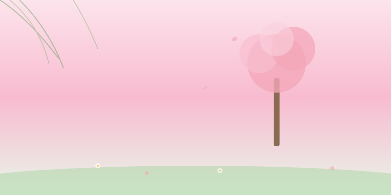

春天是从泥土里醒来的。

最先知道春天来了的，不是人，是那些埋在土里的种子。它们在漫长的冬天里沉默着，积蓄着，等到某个夜晚温度悄悄越过了某个临界点，便开始了一件了不起的事——发芽。

> 春天不是季节，而是内心的一次苏醒。

我总喜欢在三月的时候去散步。空气里有一种特殊的味道，是湿润的泥土和新芽混合在一起的气息。那味道很轻，轻到如果你不刻意去闻就会错过。但一旦闻到了，心里就有什么东西跟着柔软下来。

河边的那棵老柳树，每年都是它最先绿起来。那些嫩绿的芽像是被谁用毛笔一点一点点上去的，疏疏朗朗，有一种克制的欢喜。等过些日子再去看，就已经是满树的绿烟了。

春天教会我一件事：**耐心等待，不必着急。** 最美的绽放，都经历了漫长的沉默。
