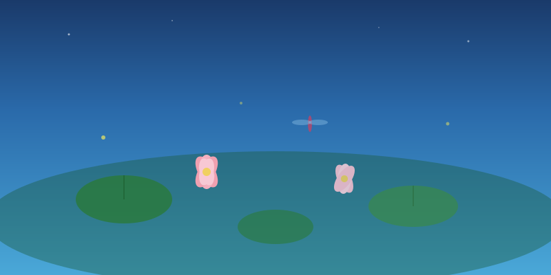

夏天是浓烈的，像一幅被泼了太多颜料的画。

蝉鸣从清晨就开始了，一浪接一浪，像是有人在看不见的地方不停地敲鼓。阳光把所有的颜色都晒得饱和：树叶绿得发黑，天空蓝得不像真的，傍晚的火烧云更是不管不顾地铺满了半个天际。

小时候的夏天是冰棍的味道。那种最便宜的老冰棍，五毛钱一根，咬一口满嘴的甜。融化的速度总是比吃的速度快，于是冰棍水顺着手指往下淌，滴在地上，马上就被太阳吸走了。

> 夏天教会我们：用力地活着。不保留，不克制，把每一天都当作最热烈的一天。

夏天的夜晚是最值得等待的。白天所有的燥热在日落后慢慢散去，取而代之的是一种温柔的凉意。搬一把竹椅坐在院子里，抬头就能看到银河。那时候天上星星真多啊，多到你以为它们会掉下来。

夏天告诉我：**热情不是消耗，而是一种存在的证明。**
