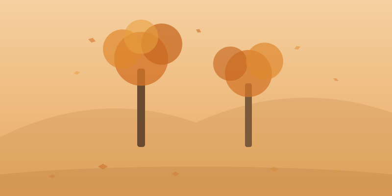

秋天是一个关于"放下"的季节。

树叶用了一整年来生长，却在秋天毫不犹豫地松手。它们从枝头飘落的样子并不悲伤，反而带着某种从容和优雅。也许是因为它们知道，落下不是结束，而是另一种开始。

秋天的天空是一年中最高的。那种蓝不是夏天的深蓝，而是一种清澈到透明的浅蓝，像是被水洗过。云也变少了，偶尔飘过的几朵都带着金边，像是谁用铜笔勾了轮廓。

> 落叶不是坠落，而是一次深情的告别。

秋天的气味是独特的——干燥的、带着木质的、微微发甜的。那是落叶在分解之前最后的芬芳。踩在厚厚的落叶上，脚下发出沙沙的声响，像是大地在跟你说话。

秋天教会我：**懂得放下，才能轻装前行。** 手里握得太紧的东西，有时候恰恰是最该放开的。

秋收冬藏，自然之道如是。
