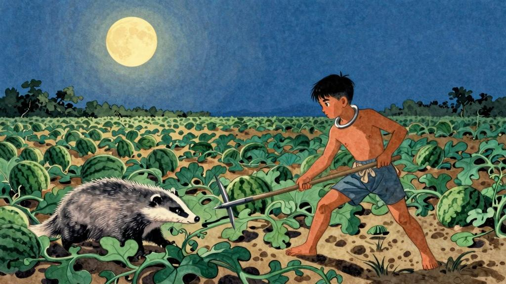

我冒了严寒，回到相隔二千余里，别了二十余年的故乡去。

时候既然是深冬；渐近故乡时，天气又阴晦了，冷风吹进船舱中，呜呜的响，从篷隙向外一望，苍黄的天底下，远近横着几个萧索的荒村，没有一些活气。我的心不禁悲凉起来了。

阿！这不是我二十年来时时记得的故乡？我所记得的故乡全不如此。我的故乡好得多了。但要我记起他的美丽，说出他的佳处来，却又没有影像，没有言辞了。仿佛也就如此。于是我自己解释说：故乡本也如此，——虽然没有进步，也未必有如我所感的悲凉，这只是我自己心情的改变罢了，因为我这次回乡，本没有什么好心绪。

我这次是专为了别他而来的。我们多年聚族而居的老屋，已经公同卖给别姓了，交屋的期限，只在本年，所以必须赶在正月初一以前，永别了熟识的老屋，而且远离了熟识的故乡，搬家到我在谋食的异地去。

---

第二日清早晨我到了我家的门口了。瓦楞上许多枯草的断茎当风抖着，正在说明这老屋难免易主的原因。几房的本家大约已经搬走了，所以很寂静。我到了自家的房外，我的母亲早已迎着出来了，接着便飞出了八岁的侄儿宏儿。

我的母亲很高兴，但也藏着许多凄凉的神情，教我坐下，歇息，喝茶，且不谈搬家的事。宏儿没有见过我，远远的对面站着只是看。

但我们终于谈到搬家的事。我说外间的寓所已经租定了，又买了几件家具，此外须将家里所有的木器卖去，再去增添。母亲也说好，行李已几乎是全部搬去了。

"你休息一两天，去拜望亲戚本家一回，我们便可以走了。"母亲说。

"是的。"

"还有闰土，他每到我家来时，总问起你，很想见你一回面。我已经将你到家的大约日期通知他，他也许就要来了。"

这时候，我的脑里忽然闪出一幅神异的图画来：深蓝的天空中挂着一轮金黄的圆月，下面是海边的沙地，都种着一望无际的碧绿的西瓜，其间有一个十一二岁的少年，项带银圈，手捏一柄钢叉，向一匹猹尽力的刺去，那猹却将身一扭，反从他的胯下逃走了。

这少年便是闰土。我认识他时，也不过十多岁，离现在将有三十年了；那时我的父亲还在世，家景也好，我正是一个少爷。那一年，我家是一件大祭祀的值年。这祭祀，说是三十多年才能轮到一回，所以很郑重；正月里供祖像，供品很多，祭器很讲究，拜的人也很多，祭器也很要防偷去。我家只有一个忙月（我们这里给人做工的分三种：整年给一定人家做工的叫长年；按日给人做工的叫短工；自己也种地，只在过年过节以及收租时候来给一定的人家做工的称忙月），忙不过来，他便对父亲说，可以叫他的儿子闰土来管祭器的。

我的父亲允许了；我也很高兴，因为我早听到闰土这名字，而且知道他和我仿佛年纪，闰月生的，五行缺土，所以他的父亲叫他闰土。他是能装弶捉小鸟雀的。

我于是日日盼望新年，新年到，闰土也就到了。好容易到了年末，有一日，母亲告诉我，闰土来了，我便飞跑的去看。他正在厨房里，紫色的圆脸，头戴一顶小毡帽，颈上套一个明晃晃的银项圈，这可见他的父亲十分爱他，怕他死去，所以在神佛面前许下愿心，用圈子将他套住了。他见人很怕羞，只是不怕我，没有旁人的时候，便和我说话，于是不到半日，我们便熟识了。

我们那时候不知道谈些什么，只记得闰土很高兴，说是上城之后，见了许多没有见过的东西。

第二日，我便要他捕鸟。他说：

"这不能。须大雪下了才好。我们沙地上，下了雪，我扫出一块空地来，用短棒支起一个大竹匾，撒下秕谷，看鸟雀来吃时，我远远地将缚在棒上的绳子只一拉，那鸟雀就罩在竹匾下了。什么都有：稻鸡，角鸡，鹁鸪，蓝背……"

我于是又很盼望下雪。

闰土又对我说道：

"现在太冷，你夏天到我们这里来。我们日里到海边捡贝壳去，红的绿的都有，鬼见怕也有，观音手也有。晚上我和爹管西瓜去，你也去。"

"管贼么？"

"不是。走路的人口渴了摘一个瓜吃，我们这里是不算偷的。要管的是獾猪，刺猬，猹。月亮底下，你听，啦啦的响了，猹在咬瓜了。你便捏了胡叉，轻轻地走去……"

我那时并不知道这所谓猹的是怎么一件东西——便是现在也没有知道——只是无端的觉得状如小狗而很凶猛。

"他不咬人么？"

"有胡叉呢。走到了，看见猹了，你便刺。这畜生很伶俐，倒向你奔来，反从胯下窜了。他的皮毛是油一般的滑……"

我素不知道天下有这许多新鲜事：海边有如许五色的贝壳；西瓜有这样危险的经历，我先前单知道他在水果店里出卖罢了。

"我们沙地里，潮汛要来的时候，就有许多跳鱼儿只是跳，都有青蛙似的两个脚……"

阿！闰土的心里有无尽的稀奇的事，都是我往常的朋友所不知道的。他们不知道一些事，闰土在海边时，他们都和我一样只看见院子里高墙上的四角的天空。

可惜正月过去了，闰土须回家里去，我急得大哭，他也躲到厨房里，哭着不肯出门，但终于被他父亲带走了。他后来还托他的父亲带给我一包贝壳和几支很好看的鸟毛，我也曾送他一两次东西，但从此没有再见面。
