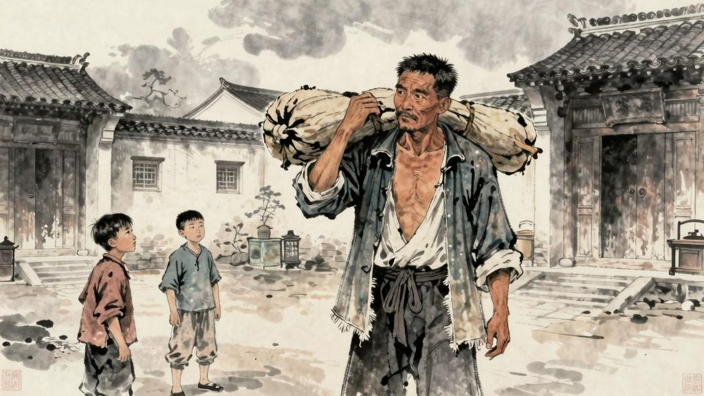

现在我的母亲提起了他，我这儿时的记忆，忽而全都闪电似的苏生过来，似乎看到了我的美丽的故乡了。我应声说：

"这好极！他，——怎样？……"

"他？……他景况也很不如意……"母亲说着，便向房外看，"这些人又来了。说是买木器，顺手也就随便拿走的，我得去看看。"

母亲出去了，我叫宏儿来陪我说话。宏儿听得屋外面有人叫："迅哥儿！"便跑去开门。我迎出去看时，却是一个凸颧骨，薄嘴唇，五十岁上下的女人站在我面前，两手搭在髀间，没有系裙，两脚张着，正像一个画图仪器里细脚伶仃的圆规。

我愕然了。

"不认识了么？我还抱过你咧！"

我愈加愕然了。幸而我的母亲也就进来，从旁说：

"他多年出门，统忘却了。你该记得罢，"便向着我说，"这是斜对门的杨二嫂，……开豆腐店的。"

哦，我记得了。我孩子时候，在斜对门的豆腐店里确乎终日坐着一个杨二嫂，人都叫伊"豆腐西施"。但是擦着白粉，颧骨没有这么高，嘴唇也没有这么薄，而且终日坐着，我也从没有见过伊这圆规式的姿势。那时人说：因为伊，这豆腐店的买卖非常好。但这大约因为年龄的关系，我却并未蒙着一毫感化，所以竟完全忘却了。然而圆规很不平，显出鄙夷的神色，仿佛嗤笑法国人不知道拿破仑，美国人不知道华盛顿似的，冷笑说：

"忘了？这真是贵人眼高……"

"那有这事……我……"我惶恐着，站起来说。

"那么，我对你说。迅哥儿，你阔了，搬动又笨重，你还要什么这些破烂木器，让我拿去罢。我们小户人家，用得着。"

"我并没有阔哩。我须卖了这些，再去……"

"阿呀呀，你放了道台了，还说不阔？你现在有三房姨太太；出门便是八抬的大轿，还说不阔？吓，什么都瞒不过我。"

我知道无话可说了，便闭了口，默默的站着。

"阿呀阿呀，真是愈有钱，便愈是一毫不肯放松，愈是一毫不肯放松，便愈有钱……"圆规一面愤愤的回转身，一面絮絮的说，慢慢向外走，顺便将我母亲的一副手套塞在裤腰里，出去了。

此后又有近处的本家和亲戚来访问我。我一面应酬，偷空便收拾些行李，这样的三四天也过去了。

一日是天气很冷的午后，我吃过午饭，坐着喝茶，觉得外面有人进来了，便回头去看。我看时，不由的非常出惊，慌忙站起身，迎着走去。

这来的便是闰土。虽然我一见便知道是闰土，但又不是我这记忆上的闰土了。他身材增加了一倍；先前的紫色的圆脸，已经变作灰黄，而且加上了很深的皱纹；眼睛也像他父亲一样，周围都肿得通红，这我知道，在海边种地的人，终日吹着海风，大抵是这样的。他头上是一顶破毡帽，身上只一件极薄的棉衣，浑身瑟索着；手里提着一个纸包和一支长烟管，那手也不是我所记得的红活圆实的手，却又粗又笨而且开裂，像是松树皮了。

我这时很兴奋，但不知道怎么说才好，只是说：

"阿！闰土哥，——你来了？……"

我接着便有许多话，想要连珠一般涌出：角鸡，跳鱼儿，贝壳，猹，……但又总觉得被什么挡着似的，单在脑里面回旋，吐不出口外去。

他站住了，脸上现出欢喜和凄凉的神情；动着嘴唇，却没有作声。他的态度终于恭敬起来了，分明的叫道：

"老爷！……"

我似乎打了一个寒噤；我就知道，我们之间已经隔了一层可悲的厚障壁了。我也说不出话。

他回过头去说，"水生，给老爷磕头。"便拖出躲在背后的孩子来，这正是一个廿年前的闰土，只是黄瘦些，颈子上没有银圈罢了。"这是第五个孩子，没有见过世面，躲躲闪闪……"

母亲和宏儿下楼来了，他们大约也听到了声音。

"老太太。信是早收到了。我实在喜欢的了不得，知道老爷回来……"闰土说。

"阿，你怎的这样客气起来。你们先前不是哥弟称呼么？还是照旧：迅哥儿。"母亲高兴的说。

"阿呀，老太太真是……这成什么规矩。那时是孩子，不懂事……"闰土说着，又叫水生来打拱，那孩子却害羞，紧紧的只贴在他背后。

"他就是水生？第五个？都是生人，怕生也难怪的；还是宏儿和他去走走。"母亲说。

宏儿听得这话，便来招待水生，水生却松松爽爽同他一路出去了。

母亲叫闰土坐。他迟疑了一回，终于就了坐，将长烟管靠在桌旁，递过纸包来，说：

"冬天没有什么东西了。这一点干青豆倒是自家晒在那里的，请老爷……"

我问问他的景况。他只是摇头。

"非常难。第六个孩子也会帮忙了，却总是吃不够……又不太平……什么地方都要钱，没有规定……收成又坏。种出东西来，挑去卖，总要捐几回钱，折了本；不去卖，又只能烂掉……"

他只是摇头；脸上虽然刻着许多皱纹，却全然不动，仿佛石像一般。他大约只是觉得苦，却又形容不出，沉默了片时，便拿起烟管来默默的吸烟了。

母亲问他，知道他的景况也很暗淡，他大约只是觉得苦，却又形容不出，便拿起烟管来默默的吸烟了。母亲便和我商量要搬走的事情，叫他来搬这些破烂木器，他便满口答应了。
