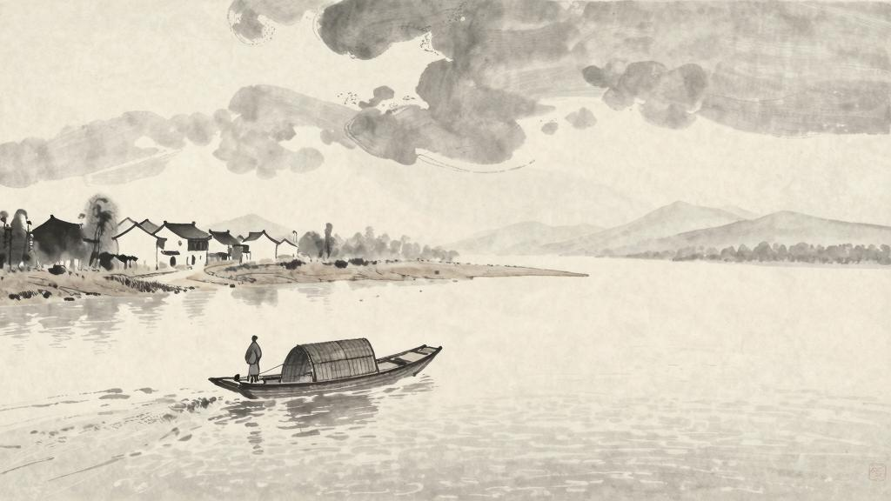

早晨，他（闰土）出去了，直到午后，他才来拿了他所要的东西——两个长桌，四个椅子，一副香炉和烛台，一杆抬秤。他又向我说要到我家来拣择东西，我也满口答应了。

他拣好了几件东西：两条长桌，四个椅子，一副香炉和烛台，一杆抬秤。他又要所有的草灰（我们这里煮饭是烧稻草的，那灰可以做沙地的肥料），待我们启程的时候，他用船来载去。

夜间，我们又谈些闲天，都是无关紧要的话；第二天早晨，他就领了水生回去了。

又过了九日，是我们启程的日期。闰土早晨便到了，水生没有同来，却只带着一个五岁的女儿管船只。我们终日很忙碌，再没有谈天的工夫。来客也不少，有送行的，有拿东西的，有送行兼拿东西的。待到傍晚我们上船的时候，这老屋里的所有破旧大小粗细东西，已经一扫而空了。

我们的船向前走，两岸的景物在傍晚的暗色中渐渐向后退去。

宏儿和我靠着船窗，同看外面模糊的风景，他忽然问道：

"大伯！我们什么时候回来？回来的时候，你叫闰土来管祭器。"

"回来？你怎么还没有走就想回来了。"

"可是，水生约我到他家玩去咧……"他便想着，尽想着，默默的去了。

我躺着，听船底潺潺的水声，知道我在走我的路。我想：我竟与闰土隔绝到这地步了，但我们的后辈还是一气，宏儿不是正在想念水生么。我希望他们不再像我，又大家隔膜起来……然而我又不愿意他们因为要一气，都如我的辛苦展转而生活，也不愿意他们都如闰土的辛苦麻木而生活，也不愿意都如别人的辛苦恣睢而生活。他们应该有新的生活，为我们所未经生活过的。

我想到希望，忽然害怕起来。闰土要香炉和烛台的时候，我还暗地里笑他，以为他总是崇拜偶像，什么时候都不忘却。现在我所谓希望，不也是我自己手制的偶像么？只是他的愿望切近，我的愿望茫远罢了。

我在朦胧中，眼前展开一片海边碧绿的沙地来，上面深蓝的天空中挂着一轮金黄的圆月。我想：希望是本无所谓有，无所谓无的。这正如地上的路；其实地上本没有路，走的人多了，也便成了路。
