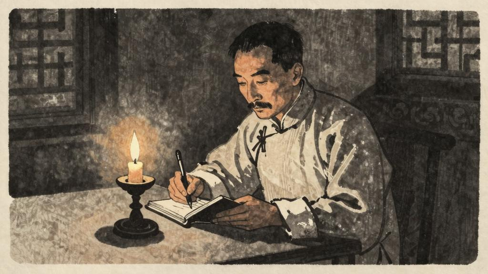

## 序言

某君昆仲，今隐其名，皆余昔日在中学校时之良友；分隔多年，消息渐阙。日前偶闻其一大病；适归故乡，迂道往访，则仅晤一人，言病者其弟也。劳君远道来视，然已早愈，赴某地候补矣。因大笑，出示日记二册，谓可见当日病状，不妨献诸旧友。持归阅一过，知所患盖"迫害狂"之类。语颇错杂无伦次，又多荒唐之言；亦不著月日，惟墨色字体不一，知非一时所书。间亦有略具联络者，今撮录一篇，以供医家研究。记中语误，一字不易；惟人名虽皆村人，不为世间所知，无关大体，然亦悉易去。至于书名，则本人愈后所题，不复改也。七年四月二日识。

## 日记一

今天晚上，很好的月光。我不见他，已是三十多年；今天见了，精神分外爽快。才知道以前的三十多年，全是发昏；然而须十分小心。不然，那赵家的狗，何以看我两眼呢？

我怕得有理。

## 日记二

今天全没月光，我知道不妙。早上小心出门，赵贵翁的眼色便怪：似乎怕我，似乎想害我。还有七八个人，交头接耳的议论我，张着嘴，对我笑了一笑；我便从头直冷到脚根，晓得他们布置，都已妥当了。

我可不怕，仍旧走我的路。前面一伙小孩子，也在那里议论我；眼色也同赵贵翁一样，脸色也铁青。我想我同小孩子有什么仇，他也这样。忍不住大声说，"你告诉我！"他们可就跑了。

我想：我同赵贵翁有什么仇，同路上的人又有什么仇；只有廿年以前，把古久先生的陈旧账本，踹了一脚，古久先生很不高兴。赵贵翁虽然不认识他，一定也听到风声，代抱不平；约定路上的人，同我作冤对。但是小孩子呢？那时候，他们还没有出世，何以今天也睁着怪眼睛，似乎怕我，似乎想害我。这真教我怕，教我纳罕而且伤心。

我明白了。这是他们娘老子教的！

## 日记三

晚上总是睡不着。凡事须得研究，才会明白。

他们——也有给知县打枷过的，也有给绅士掌过嘴的，也有衙役占了他妻子的，也有老子娘被债主逼死的；他们那时候的脸色，全没有昨天这么怕，也没有这么凶。

最奇怪的是昨天街上的那个女人，打他儿子，嘴里说道，"老子呀！我要咬你几口才出气！"他眼睛却看着我。我出了一惊，遮掩不住；那青面獠牙的一伙人，便都哄笑起来。陈老五赶上前，硬把我拖回家中了。

拖我回家，家里的人都装作不认识我；他们的脸色，也全同别人一样。进了书房，便反扣上门，宛然是关了一只鸡鸭。这一件事，越教我猜不出底细。

前几天，狼子村的佃户来告荒，对我大哥说，他们村里的一个大恶人，给大家打死了；几个人便挖出他的心肝来，用油煎炒了吃，可以壮壮胆子。我插了一句嘴，佃户和大哥便都看我几眼。今天才晓得他们的眼光，全同外面的那伙人一模一样。

想起来，我从顶上直冷到脚跟。

他们会吃人，就未必不会吃我。

你看那女人"咬你几口"的话，和一伙青面獠牙人的笑，和前天佃户的话，明明是暗号。我看出他话中全是毒，笑中全是刀。他们的牙齿，全是白厉厉的排着，这就是吃人的家伙。

照我自己想，虽然不是恶人，自从踹了古家的账，可就难说了。他们似乎别有心思，我全猜不出。况且他们一翻脸，便说人是恶人。我还记得大哥教我做论，无论怎样好人，翻他几句，他便打上几个圈；原谅坏人几句，他便说"翻天妙手，与众不同"。我那里猜得到他们的心思，究竟怎样；况且是要吃的时候。

凡事总须研究，才会明白。古来时常吃人，我也还记得，可是不甚清楚。我翻开历史一查，这历史没有年代，歪歪斜斜的每页上都写着"仁义道德"几个字。我横竖睡不着，仔细看了半夜，才从字缝里看出字来，满本都写着两个字是"吃人"！

## 日记四

早上，我静坐了一会。陈老五送进饭来，一碗菜，一碗蒸鱼；眼睛却仍是那么凶，唇边还带着冷笑。我很容易的便看出他的心思，那菜和鱼上都有"吃人"的痕迹。我想到这层，便不觉胃里作起呕来。

大哥带了老夫子来诊病，吩咐我好好静养。老夫子叫我伸出两手，按了一会脉，便连连摇头。我也不问他，只觉得他这个人面兽心的家伙，一定是看出了我的"心思"。他的意思，一定是教大哥赶快吃了我。

大哥是管理家务的，我怎能去问他呢？然而不可以。凡事须得研究，才会明白。

我想：我大哥何以会吃人呢？想来想去，忽然想起来了。记得我四五岁时，坐在堂前乘凉，大哥说："爹娘生病，做儿子的须割下一片肉来，煮熟了请他吃，才算好人。"母亲也没有说不行。一片肉，自然不算什么，但何以会吃人呢？况且他们吃的人不止一片肉，真是不堪设想。

后来我又想起，前年大哥和二哥分家产，因为二哥的脑筋灵敏些，所以大哥很不满意。他天天想设计害二哥，但总没有法子。后来他想来想去，终于想出了一个好法子。他请二哥吃酒，在酒里放了毒药，二哥吃下去便死了。

我想来想去，越想越怕。他们要吃我，我一个人，无论如何是逃不掉的。但是我不怕。我要"研究"他们。我不信他们这伙人能做出什么好事来。
