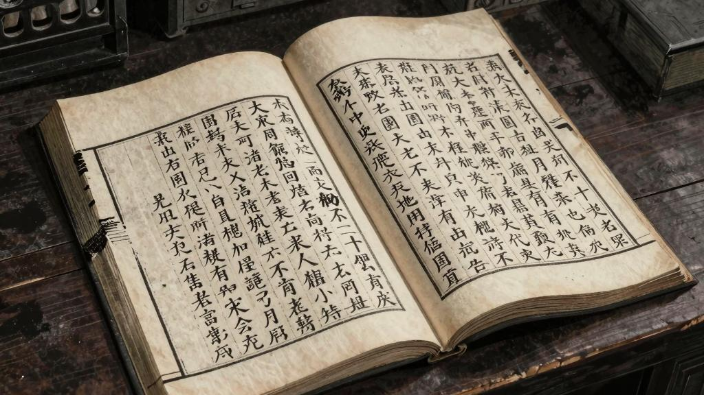
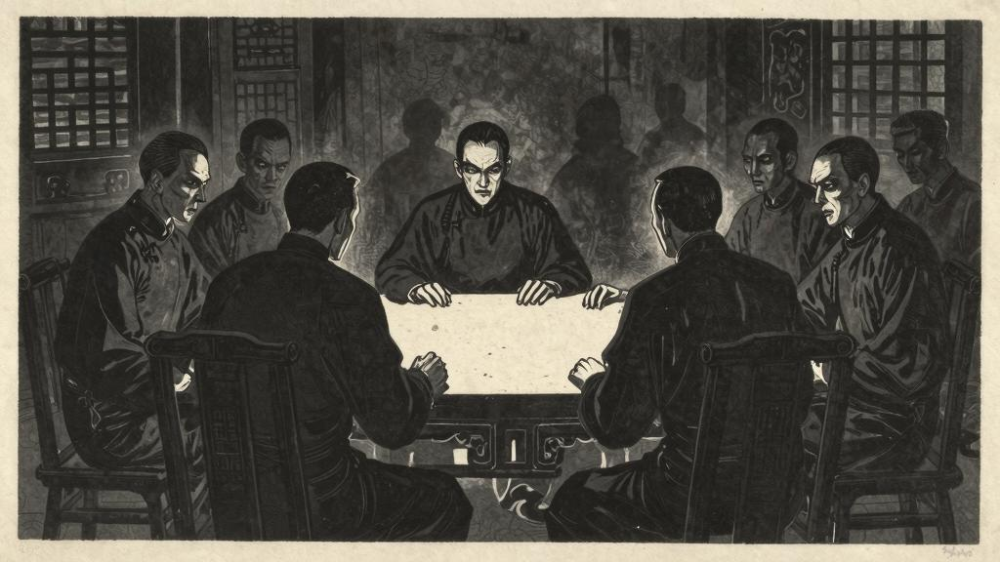

## 日记五

这几天是退一步想：假使那老头子不是刽子手扮的，真是医生，也仍然是吃人的人。他们的祖师李时珍做的"本草什么"上，明明写着人肉可以煎吃；他还能说自己不吃人么？

至于我家大哥，也毫不冤枉他。他对我讲书的时候，亲口说过可以"易子而食"；又一回偶然议论起一个不好的人，便说不但该杀，还当"食肉寝皮"。我那时年纪还小，心跳了好半天。前天狼子村佃户来说吃心肝的事，他也毫不奇怪，不住的点头。可见心思是同从前一样狠。既然可以"易子而食"，便什么都易得，什么人都吃得。我从前单听他讲道理，也胡涂过去；现在晓得他讲道理的时候，不但唇边还抹着人油，而且心里满装着吃人的意思。

黑漆漆的，不知是日是夜。赵家的狗又叫起来了。

狮子似的凶心，兔子的怯弱，狐狸的狡猾，……

## 日记六

晚上总是睡不着。凡事须得研究，才会明白。

他们——也有给知县打枷过的，也有给绅士掌过嘴的，也有衙役占了他妻子的，也有老子娘被债主逼死的；他们那时候的脸色，全没有昨天这么怕，也没有这么凶。

最奇怪的是昨天街上的那个女人，打他儿子，嘴里说道，"老子呀！我要咬你几口才出气！"他眼睛却看着我。我出了一惊，遮掩不住；那青面獠牙的一伙人，便都哄笑起来。陈老五赶上前，硬把我拖回家中了。

拖我回家，家里的人都装作不认识我；他们的脸色，也全同别人一样。进了书房，便反扣上门，宛然是关了一只鸡鸭。这一件事，越教我猜不出底细。

想起来，我从顶上直冷到脚跟。

他们会吃人，就未必不会吃我。

## 日记七

我翻开历史一查，这历史没有年代，歪歪斜斜的每页上都写着"仁义道德"几个字。我横竖睡不着，仔细看了半夜，才从字缝里看出字来，满本都写着两个字是"吃人"！

书上写着这许多字，佃户说了这许多话，却都笑吟吟的睁着怪眼睛看我。

我也是人，他们想要吃我了！

## 日记八

其实这种事，也不算什么。古来时常吃人，我也还记得，可是不甚清楚。我从每一页的字缝里看出来，满本都写着"吃人"两个字。我横竖睡不着，仔细看了半夜。

当初，他还只是冷笑，随后眼光便凶狠起来，一到说破他们的隐情，那就满脸都变成青色了。大门外立着一伙人，赵贵翁和他的狗，也在里面，都探头探脑的挨进来。有的是看不出面貌，似乎用布蒙着；有的是仍旧青面獠牙，抿着嘴笑。我认识他们是一伙，都是吃人的人。可是也晓得他们心思很不一样，一种是以为从来如此，应该吃的；一种是知道不该吃，可是仍然要吃，又怕别人说破他，所以听了我的话，越发气愤不过，可是抿着嘴冷笑。

忽然来了一个人；也不过二十多岁，中等身材，却也无什特别之处。我问他是做什么的，说是先生。我便照例问他："吃人的事，对么？"他仍然笑着说："不是荒年，怎么会吃人。"我立刻就晓得他也正是一伙；便逼紧一步问道："对么？"

"这等事问他什么。你真会……说笑话。……今天天气很好。"

天气是好，月色也很亮了。可是我要问你，"对么？"

他不以为然了。含含胡胡的答道，"不……"

"不对？他们何以竟吃？！"

"没有的事……"

"没有的事？狼子村现吃；还有书上都写着，通红崭新！"

他便变了脸，铁一般青。睁着眼说，"有许有的，这是从来如此……"

"从来如此，便对么？"

"我不同你讲这些道理；总之你不该说，你说便是你错！"

我直跳起来，张开眼，这人便不见了。全身出了一大片汗。他的年纪，比我大哥小得远，居然也是一伙；这一定是他娘老子先教的。还怕已经教给他儿子了；所以连小孩子，也都恶狠狠的看我。

## 日记九

自己想吃人，又怕被别人吃了，都用着疑心极深的眼光，面面相觑。……

去了这心思，放心做事走路吃饭睡觉，何等舒服。这只是一条门槛，一个关头。他们可是父子兄弟夫妇朋友师生仇敌和各不相识的人，都结成一伙，互相劝勉，互相牵掣，死也不肯跨过这一步。

