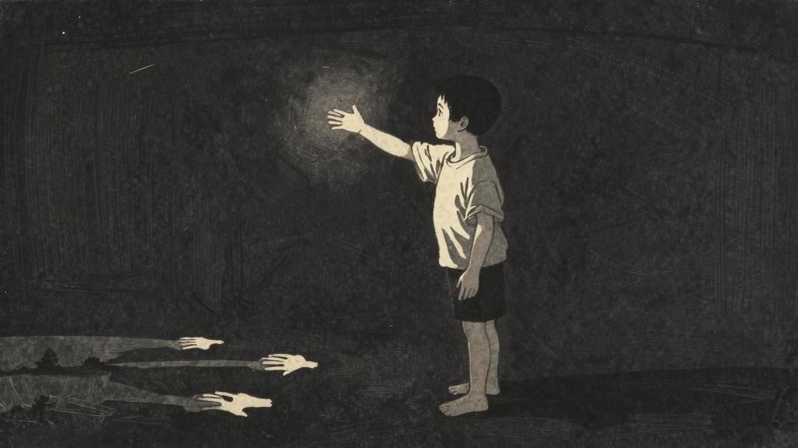

## 日记十

大清早，去寻找大哥；他立在堂门外看天，我便走到他背后，拦住门，格外沉静，格外和气的对他说：

"大哥，我有话告诉你。"

"你说就是，"他赶紧回过脸来，点点头。

"我只有几句话，可是说不出来。大哥，大约当初野蛮的人，都吃过一点人。后来因为心思不同，有的不吃人了，一味要好，便变了人，变了真的人。有的仍吃，也便始终是虫子——至于怕，那是因为他们忽然想到了，吓了自己。"

他似乎不大愿意听，但又不好不听，只是默默地点头。我便接下来说：

"大哥，大约古来时常吃人，原也不足为奇。我们只要不去吃人，就自然变作真的人了。这是一定的。"

他忽然笑了一笑，伸出手来摸着我的头，说："你好好的养养罢，不要胡思乱想。"

我说："吃人的人，也何尝没有好人。大哥，只要从今天起，不吃人了，便立刻变作真的人。"

他叹一口气，又摇了两摇头，说："你不要太费心。你的病还没有好。"

我说："我并没有病，我要对你说的是真话。"

## 日记十一

太阳也不出，门也不开，日日是两顿饭。

我捏起筷子，便想起我大哥；晓得妹子死掉的缘故，也全在他。那时我妹子才五岁，可爱可怜的样子，还在眼前。母亲哭个不住，他却劝母亲不要哭；大约因为自己吃了，哭起来不免有点过意不去。如果还能过意不去，……

妹子是被吃的了，母亲无可如何，只好哭。大哥吃了妹子，未必不动于心；然而他对我讲道理的时候，却自己说过"食肉寝皮"的话。既是"食肉寝皮"，便当然吃的了。吃了他妹子，一定也觉得坦然，无怪他不劝母亲不要哭。

我单晓得妹子是被吃的了；但我是被谁吃的呢？

母亲！大哥！你是吃了我的人！

我仔细的想了一想，大约我的被吃，和妹子的被吃，都只为父亲已死了，没有了保护人的缘故。母亲是早已死了的，大哥是吃人的，我要被人吃了，那是毫无疑义的了。

## 日记十二

四千年来时时吃人的地方，今天才明白，我也在其中混了多年；大哥正管着家务，妹子恰恰死了，他未必不和在饭菜里，暗暗给我们吃。

我未必无意之中，不吃了我妹子的几片肉，现在也轮到我自己，……

有了四千年吃人履历的我，当初虽然不知道，现在明白，难见真的人！

## 日记十三

没有吃过人的孩子，或者还有？

救救孩子……

