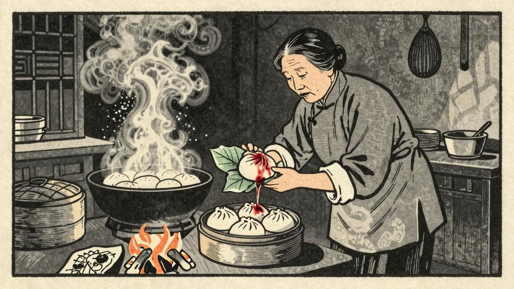

老栓走到家，店面早经收拾干净，一排一排的茶桌，滑溜溜的发光。但是没有客人；只有小栓坐在里排的桌前吃饭，铺着一大块老栓素来不敢用的油皮的桌布。见了老栓回来，便放下碗，站起来叫声"爹"，一齐在旁边坐下；花白胡子便取消了他的话，──仿佛这谈话是专门为着老栓似的。

"吃了么？好了么？老栓，就是运气了你！你运气，要不是我信息灵……。"

"包好，包好！这样的趁热吃下。这样的人血馒头，什么痨病都包好！"

华大妈听到"痨病"这两个字，变了一点脸色，似乎有些不高兴；但又立刻堆上笑，搭赸着走开了。这康大叔却没有觉察，他提高了喉咙只是嚷，嚷得里面睡着的小栓也合伙咳嗽起来。

"原来你家小栓碰到了这样的好运气了。这病自然一定全好；说不好，我又不信！——自然是运气的了。不是运气，谁家会花这许多洋钱？哼，我倒管不着，——这老东西!"

老栓一面听，一面应，一面扣上衣服；伸出手来说道，"你给我罢。"华大妈在枕头底下掏了半天，掏出一包洋钱，交给老栓，老栓接了，抖抖的装入衣袋，又在外面按了两下；便点上灯笼，吹熄灯盏，走向里屋子去了。那屋子里面，正在窸窸窣窣的响，接着便是一通咳嗽。

老栓又拿出一个碧绿的包，一个红红白白的破灯笼，一把一新一旧的两个茶壶，放在小栓面前。叫道："小栓，你赶紧吃罢。"

小栓慢慢的从小屋子里走出，两手按了胸口，不住的咳嗽；走到灶下，盛出一碗冷饭，便坐下了。华大妈跟着他走，轻轻的问道，"小栓你好些么？——你仍旧只是肚饿？……"

"包好，包好！"老栓匆促的说。

华大妈便出去了。不多时，拿了一片老荷叶，重新铺在桌面。小栓也吃完饭，回到他的小屋里去了。华大妈走到灶下，将那碧绿的包打开，从里面取出一个鲜血也似的红馒头，那馒头上面，还带着几条血丝。她叹了一口气，将荷叶包好，放在灶上的炭火里，不住的翻动着。过了些时候，便闻见一股奇怪的香味，弥漫了那两间小小的屋子。小栓在里屋子里，不住的咳嗽。

"好了好了！趁热吃下去。"华大妈从灶上取下那个馒头，又用荷叶包好，递给小栓。小栓接了，抖抖的吃起来。华大妈便走到他旁边，看着他的脸色，一心以为这便是良药，可以救她的儿子了。

"睡一会罢，——便好了。"

小栓依他母亲的话，咳着睡了。华大妈候他气喘平了，才轻轻的走到外间，倒在床上。老栓却只坐在桌旁，一句话也不说。外边夜里的秋风，吹动那一丛丛的落叶，窸窸窣窣的响。老栓听着，仿佛又看见了那个丁字街口，看见了那黑衣的人，那鲜红的馒头……

第二天早上，小栓的病似乎好了些。华大妈非常高兴，道："好了，好了！果然是灵药！"
