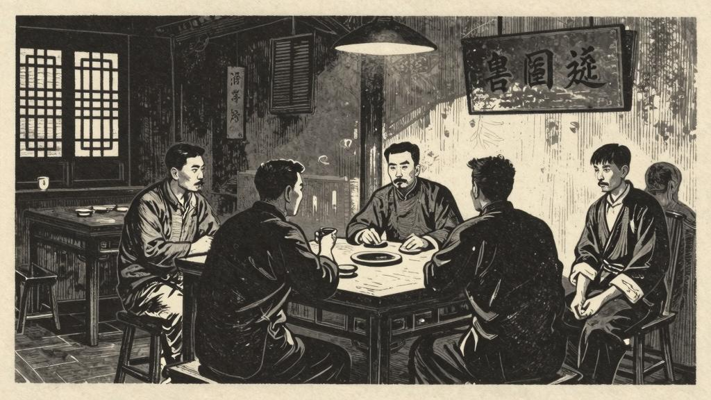

这天没有客人。花白胡子的一群，驼背的五少爷，也都不来。店里只有老栓夫妇两个，忙忙碌碌的。但到午后，客人渐渐来了。最先是一个浑身黑色的人，正是那卖人血馒头的黑的人。他大踏步走进来，往里间坐下，叫道，"老栓，你运气！要不是我信息灵……。"

老栓忙端出一盏茶来，陪笑道，"大叔，请喝茶。"

"包好，包好！"黑的人大声说，"这样的趁热吃下。这样的人血馒头，什么痨病都包好！"

"原来你家小栓碰到了这样的好运气了。这病自然一定全好；说不好，我又不信！——自然是运气了。不是运气，谁家会花这许多洋钱？哼，我倒管不着，——这老东西！"

黑的人便是康大叔。他大声说了这番话之后，又添了许多话，什么痨病怎样难治，什么人血馒头怎样灵验。旁边坐着的一个花白胡子的人，一面听，一面点头，说，"原来如此！原来如此！"

"我可是这一回一点没有得到好处。"康大叔说，"我可是这一回一点没有得到好处。连剥下来的衣服，都交给管牢的红眼睛阿义了。——一副，好衣服！——第二日，红眼睛阿义也连忙将衣服拿去当了。他这人是不吃亏的！"

"阿义可怜——疯话，简直是发了疯了。"花白胡子恍然大悟似的说。

"发了疯了。"二十多岁的人也恍然大悟的说。

店里的坐客，便又现出活气，谈笑起来。小栓也趁着热闹，拼命咳嗽；老栓走到他旁边，低声说道，"小栓，你不要起来。……"但小栓偏要起来，一面咳，一面走到柜台前。

驼背五少爷也来了。他每天总在茶馆里过日，来得最早，去得最迟，此时恰恰蹩到临街的壁角的桌边，便坐下问话，然而没有人答复他。茶馆里坐满了人，也不觉热，大家兴致勃勃的谈着。

"这小东西也真不成东西！关在牢里，还要劝牢头造反。"

"啊呀，那还了得。"坐在后排的一个二十多岁的人，很现出气愤的模样。

"你要晓得红眼睛阿义是去盘盘底细的，他却和他攀谈了。他说：这大清的天下是我们大家的。你想：这是人话么？红眼睛原知道他家里只有一个老娘，可是没有料到他竟会这么穷，榨不出一点油水，已经气破肚皮了。他还要老虎头上搔痒，便给他两个嘴巴！"

"义哥是一手好拳棒，这两下，一定够他受用了。"壁角的驼背忽然高兴起来。

"他这贱骨头打不怕，还要说可怜可怜哩。"

花白胡子的人说，"打了这种东西，有什么可怜呢？"

康大叔显出看他不上的样子，说，"你没有听清我的话；看他神气，是说阿义可怜哩！"

听着的人的眼光，忽然有些板滞；话也停顿了。小栓已经吃完饭，吃得满身流汗，头上都冒出蒸气来。

"阿义可怜——疯话，简直是发了疯了。"花白胡子恍然大悟似的说。

"发了疯了。"二十多岁的人也恍然大悟的说。

店里的坐客，便又现出活气，谈笑起来。
