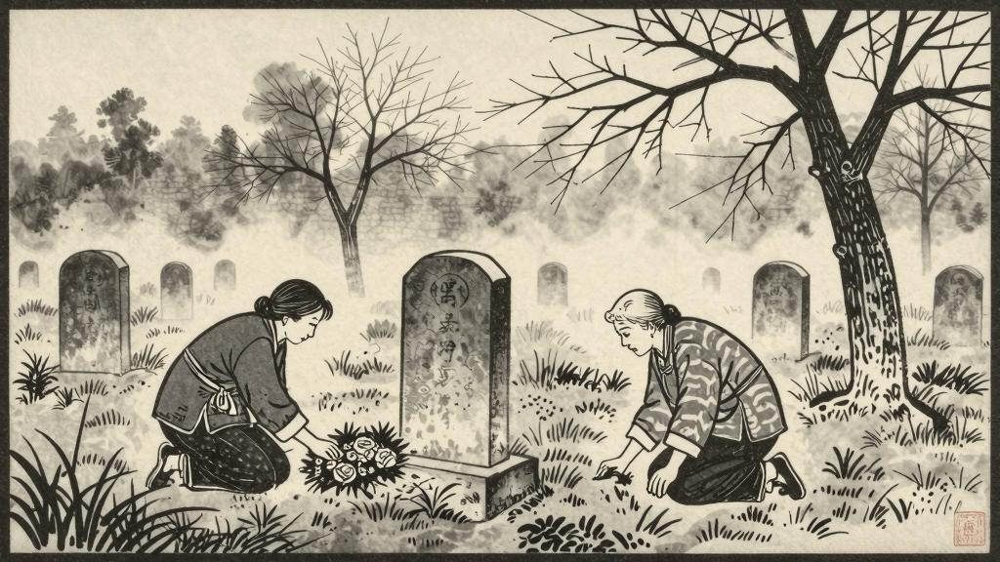

西关外靠着城根的地面，本是一块官地；中间歪歪斜斜一条细路，是贪走便道的人，用鞋底造成的，但却成了自然的界限。路的左边，都埋着死刑和瘐毙的人，右边是穷人的丛冢。两面都已埋到层层叠叠，宛然阔人家里祝寿时候的馒头。

这一年的清明，分外寒冷；杨柳才吐出半个米粒大的新芽。天明未久，华大妈已在右边的一坐新坟前面，排出四碟菜，一碗饭，哭了一场。化过纸，呆呆的坐在地上；仿佛等候什么似的，但自己也说不出等候什么。微风起来，吹动他短发，确乎比去年白得多了。

小路上又来了一个女人，也是半白头发，褴褛的衣裙；提一个破旧的朱漆圆篮，外挂一串纸锭，三步一歇的走。忽然见华大妈坐在地上看他，便有些踌躇，惨白的脸上，现出些羞愧的颜色；但终于硬着头皮，走到左边的一坐坟前，放下了篮子。

那坟与小栓的坟，一字儿排着，中间只隔一条小路。华大妈看他排好四碟菜，一碗饭，立着哭了一通，化过纸锭；心里暗暗地想，"这坟里的也是儿子了。"那老女人徘徊观望了一回，忽然手脚有些发抖，跄跄踉踉退下几步，瞪着眼只是发怔。

华大妈见这样子，生怕他伤心到快要发狂了；便忍不住立起身，跨过小路，低声对他说，"你这位老奶奶不要伤心了。——我们还是回去罢。"

那人点一点头，眼睛仍然向上瞪着；也低声，吃吃的说道，"你看，——看这是什么呢？"

华大妈跟了他指头看去，眼光便到了以前的丛冢，却见那坟顶上，分明有一圈红白的花，围着那尖圆的坟顶。

他们的眼睛都已老花多年了，但望这红白的花，却还能明白看见。花也不很多，圆圆的排成一个圈，不很精神，倒也整齐。华大妈看他排好四碟菜，一碗饭，立着哭了一通，化过纸锭；心里暗暗地想，"这坟里的也是儿子了。"那老女人徘徊观望了一回，忽然手脚有些发抖，跄跄踉踉退下几步，瞪着眼只是发怔。

华大妈忙看他儿子和别人的坟，却都已不怕似的，再也找不出什么别的奇怪。但那人也就不敢问他什么了。华大妈看他仿佛有了什么要紧的事，便也打算回去。那老女人犹豫了一回，待要走，却又不敢走。他仿佛要下什么决心似的，抖抖的伸手去掏那蓝布衫的口袋，但立刻又缩回来，没有敢掏出来。他的精神，此刻似乎全在那个坟顶上的花圈上。华大妈便催促他道，"我们还是回去罢。"

那老女人叹一口气，无精打采的收起饭菜；又迟疑了一刻，终于慢慢地走了。嘴里自言自语的说，"这是怎么一回事呢？……"

他们走不上二三十步远，忽听得背后"哑——"的一声大叫；两个人都悚然的回过头，只见那乌鸦张开两翅，一挫身，直向着远处的天空，箭也似的飞去了。
