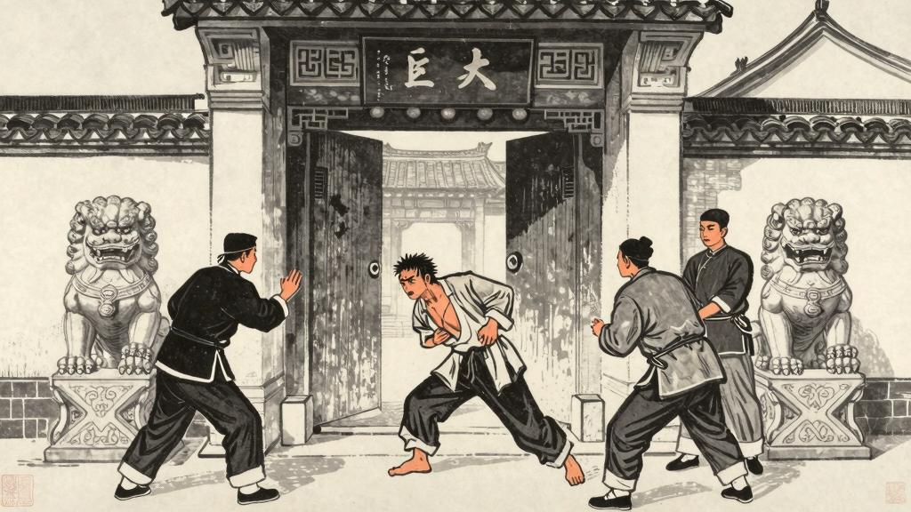

# 第三章 续优胜记略

然而阿Q虽然常优胜，却直待蒙赵太爷打他嘴巴之后，这才出了名。

他付过地保二百文酒钱，愤愤的躺下了，后来想："现在的世界太不成话，儿子打老子……"于是忽而想到赵太爷的威风，而现在是他的儿子了，便自己也渐渐的得意起来，爬起身，唱着《小孤孀上坟》到酒店去。这时候，他又觉得赵太爷高人一等了。

说也奇怪，从此之后，果然大家也仿佛格外尊敬他。这在阿Q，或者以为因为他是赵太爷的父亲，而其实也不然。未庄通例，倘如阿七打阿八或者李四打张三，向来本不算口碑，一上口碑，则打的既有名，被打的也就托庇有了名。错处是在阿Q，那时 mills 不该以为他是赵太爷的父亲。而这错误，虽然他后来想想觉得未免荒唐，但也并不十分后悔；因为假使有人来问他："你当时为什么不声明呢？"他便可以正面的回答道："我那时并不要这东西，所以打定主意，不去声明。"这回答，便是所谓"精神上的胜利法"了。

但他是阿Q，不是别个，所以另外又有了新法。这是看了别人赌赢而自己赌输之后，忽然想出来的。他的办法是：找寻对手方。但这对手方并不是谁都可以做的，须得照例的那种——比他更有力量的。阿Q所选的对手方有两种：一种是曾经打败过他的，一种是比他更有钱的。假如打不过那对手方，阿Q便跑，跑不掉时便求饶，求饶不遂时便躺在地下装死。他以为这也是一种"策略"。

阿Q此后倒得意了许多年。有一年春天，他醉醺醺的在街上走，在墙根的日光下，看见王胡在那里赤着膊捉虱子，他忽然觉得身上也痒起来了。这王胡，又癞又胡，别人都叫他王癞胡，阿Q却删去了一个癞字，一面表示亲热，一面也含有讥笑的意思。阿Q也脱下破夹袄来，翻检了一回，不知道是因为新洗的呢还是因为笨，终于捉到三四个虱子，都放在嘴里狠狠的咬了一口，劈啪的声音，不如王胡的响。

他癞疮疮块块通红了，便将衣服摔在地上，吐一口唾沫，说：

"这毛虫！"

"癞皮狗，你骂谁？"王胡轻蔑的抬起眼来说。

阿Q虽然失败，却又很藐视王胡，以为是自己的儿子，不应该和自己争斗。然而王胡不怕他，阿Q便想用"精神上的胜利法"来自慰，但终于想不出一句话来，只觉得委屈，便走上前去要打王胡。

王胡是阿Q本来以为不足畏的，但这回却出乎意料，竟被他抓住了辫子，在墙上碰了五下。阿Q觉得这是他生平第一件的屈辱，因为向来只碰到他打别人，虽然也有人打过他，但那是因为被人打败了，所以不算。现在的被王胡打，却是"儿子打老子"了。然而阿Q却也并不怎样消极，他想："我总算被儿子打了，现在的世界真不像样……"于是也心满意足的走了。

阿Q走到酒店门口，忽然遇见了"假洋鬼子"。这人原来也是未庄的居民，因为到东洋去过半年，所以回来后便被人称为"假洋鬼子"。他又到过西洋，到过南洋，那自然是"真洋鬼子"了。但他虽然到过西洋和南洋，却只学了些洋气——一根手杖，一顶拖在背后的假辫子。阿Q尤其深恶而痛绝之的，是他的一条假辫子；辫子而至于假，就是没有了做人的资格；他的老婆不跳第四回井，也不是好女人。

"假洋鬼子"来了！

阿Q本来恨他，因为他曾打过阿Q。这回阿Q一见，便想起从前的仇恨，想要骂他，但一时又想不出适当的话来，只好轻声的说道：

"秃儿。驴……"

"假洋鬼子"似乎没有听到，大踏步的走了过去。阿Q便高兴起来，以为得了胜利，因为他骂了这"秃驴"，而这"假洋鬼子"却没有还口。

然而"假洋鬼子"是不好惹的。他后来不知怎的知道了这件事，便在街上遇见阿Q的时候，用手杖在阿Q的头上敲了几下，说："你说什么？"阿Q没有法子，只得说道：

"我说他……"

"假洋鬼子"不等他说完，又打了他几下，然后扬长而去了。

阿Q碰了一鼻子灰，非常不快，但一转念，又以为是"儿子打老子"，便也心平气和了。

但阿Q的更痛苦的屈辱，是在赵家。赵家是未庄的第一大户，赵太爷是未庄的"名人"，他的儿子是文童，后来进了秀才，所以更了不得。阿Q曾在赵家做过短工，有一年秋天，赵家要请道士做斋事，阿Q也被叫去帮忙。那知赵家的规矩极其严格，阿Q不小心打碎了一个碗，便被赵家的地保喊去训了一顿，而且还罚了他二百文钱。阿Q很不服气，但也没有法子可想。

有一回，阿Q不知怎的竟然在赵家的厨房里偷了一只鸡腿，被人发觉了。赵太爷大怒，便叫家丁把阿Q推出大门，并且打了一顿。阿Q被打得鼻青脸肿，躺在地上爬不起来，但他的嘴里还在骂：

"儿子打老子……"

赵家的家丁把阿Q拖出了大门，砰的一声关上了。阿Q从地上爬起来，拍拍身上的灰尘，说道：

"我儿子不认我了，这世界太不像话了。"

于是他便也心满意足的走了。

阿Q此后在未庄的地位更加低落了。人们都知道他不但偷了赵家的鸡腿，而且还被赵太爷打了，于是更加看不起他。阿Q虽然还在未庄做短工，但已经没有人愿意请他了。他只好到别处去找工作，但别处的人也知道他的"行状"，所以也不愿意请他。阿Q的生活便越来越困难了。

然而阿Q并不灰心。他以为这是因为"现在的人太不讲道理了"，并不怪他自己。他还是照旧的自尊自大，照旧的用"精神上的胜利法"来自慰。他觉得他的"行状"并没有什么不好，只是"别人不理解"罢了。

阿Q在未庄的日子就这样一天一天的过去了。他虽然常常被人欺负，但他总是能够找到办法来安慰自己。这就是阿Q的"精神上的胜利法"——一种自欺欺人的、但是对他来说非常有效的方法。
