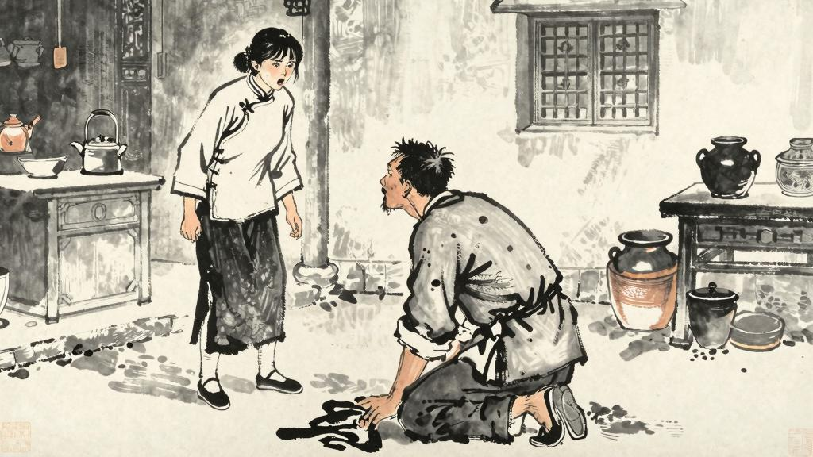

# 第五章 恋爱的悲剧

有人说：有些胜利者，愿意敌手如虎，如鹰，他才感得胜利的欢喜；假使如羊，如小鸡，他便反觉得胜利的无聊。又有些胜利者，当克服一切之后，看见死的死了，降的降了，"臣诚惶诚恐死罪死罪"，他于是没有了敌人，没有了对手，没有了朋友，只有自己在上，一个，孤零零，凄凉，寂寞，便反而感到了胜利的悲哀。然而我们的阿Q却没有这样乏，他永远是得意的：这或者也是中国精神文明冠于全球的一个证据了。

看哪，他飘飘然的似乎要飞去了！

然而这一次的胜利，却又使他有些异样。他飘飘然的飞了大半天，飘进土谷祠，照例应该躺下便打鼾。谁知道这一晚，他很不容易合眼，他觉得自己的大拇指和第二指有点古怪：仿佛比平常滑腻些。不知道是被赵太爷打的呢，还是另外有什么缘故？他有些觉得自己的手指有些滑腻，而且有一点异样的感觉。他想："这一定是因为我得罪了赵太爷的缘故。但我被'假洋鬼子'打了之后，并没有什么异样的感觉。那么，这一定是因为……"

他忽然想到了什么，但又说不出来。他翻来覆去的想，终于想清楚了——他需要一个女人。

他在未庄虽然常常被人家嘲笑，但他的心里却很有些不甘寂寞的意思。他看见赵太爷的太太们，虽然不敢正眼看，但心里却很有些羡慕。他又看见邹七嫂的女儿，虽然并不怎么好看，但觉得也不坏。他又想到吴妈。

吴妈是赵太爷家里的女佣，年纪还不大，大约二十多岁，虽然不是什么美人，但也不算丑。阿Q以前在赵家做工的时候，常常看见她，但并不觉得有什么特别。然而自从他被打之后，他忽然觉得吴妈是很好的了。他想："假使我能有一个像吴妈这样的女人……"

有一天晚上，阿Q在赵家做工，忽然看见吴妈独自一人在厨房里洗碗。阿Q的心里忽然跳了起来，他不知不觉的走到了厨房门口，看着吴妈的背影，忽然跪了下来。

"我和你困觉，我和你困觉！"阿Q忽然抢上去，对伊跪下了。

一刹时中很寂然。

"阿呀！"吴妈愣了一息，突然发抖，大叫着往外跑，且跑且嚷，似乎后来带哭了。

阿Q对了墙壁跪着也发愣，于是两手扶着空板凳，慢慢的站起来，仿佛觉得有些糟。他这时确也有些忐忑了，慌张的将烟管插在裤带上，就想去舂米。蓬的一声，头上着了很粗的一下，他急忙回转身去，那秀才便拿了一支大竹杠站在他面前。

"你反了……你这……"

大竹杠又向他劈下来了。阿Q两手去抱头，拍的正打在指节上，这使他很有几分痛。他冲出厨房门，恰巧和吴妈正对面，他万料不到，竟被吓了一跳，于是又将两目斗然一瞪，却什么也没有说，便匆匆的逃走了。

他在路上走，忽然觉得很惭愧，但他又想："这有什么要紧呢？我不过是和她说了一句笑话罢了。她太没有见识了，连一句笑话也听不懂。"于是他又心满意足的走了。

但这件事传出去之后，未庄的人便都看不起阿Q了。以前他们还觉得阿Q虽然有些荒唐，但还不至于做出这种事情来。现在他们便都觉得阿Q是一个"坏人"了。尤其是邹七嫂，她本来和阿Q还有些交情，现在却对他恨之入骨，因为她觉得阿Q的行为"太不成话了"。

赵太爷当然更是大怒。他叫地保把阿Q叫来，骂了一顿，并且罚了他几个条件：第一，明天必须送红烛一斤，重香一封，到赵府上赔罪；第二，必须请两个媒人，到赵府上赔礼；第三，以后不准再到赵府上来做工；第四，另外赔偿吴妈的"损失"若干。阿Q虽然觉得委屈，但也不敢不答应。

阿Q从此便更加潦倒了。他本来就没有什么积蓄，现在又被罚了这些钱，便更加穷了。他只好到别处去找工作，但别处的人也知道他的"行状"，所以也不愿意请他。阿Q的生活便越来越困难了。

他又想："我不过和吴妈说了一句话罢了，有什么要紧呢？现在的人太不开通了。"于是他便又心满意足了。

然而未庄的人从此便不再请阿Q做工了。阿Q的生计成了一个严重的问题。他只好到更远的地方去找工作，但到处都是一样的——没有人愿意请他。阿Q的生活便越来越困难了，他甚至有时候连饭都吃不上了。

这就是阿Q的"恋爱的悲剧"。他的悲剧不在于他求爱被拒绝，而在于他根本不理解什么是爱情。他只是出于一种动物性的本能，想要一个女人，而并不理解爱情的意义。这就是阿Q的悲剧所在——他不仅是一个被压迫者，也是一个愚昧者。他的愚昧使他不能正确地理解自己的处境，也不能正确地理解别人的感受。他只能用"精神上的胜利法"来自我安慰，而这种安慰并不能解决任何问题。
