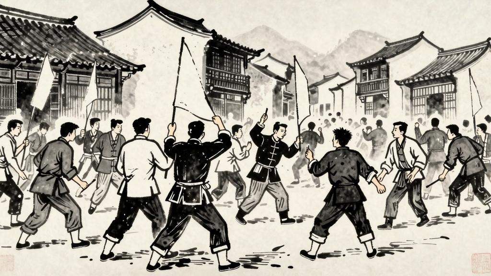

# 第六章 从中兴到末路

然而阿Q虽然这样，也时时有些不平之气。但这也不只是阿Q如此，便是未庄的人们也何尝不知道不平。只是他们怕事，不敢有所作为，所以只好忍耐着。阿Q的忍耐力尤其强大，因为他有他的"精神上的胜利法"。

但有一件意外的事，却使阿Q的处境忽然好转了。这事发生在阿Q被赵家赶出之后大约一个月的时候。那时候，未庄忽然来了一个"革命党"的消息。据说这个"革命党"已经把县衙门打了，县官也跑了。这个消息传来之后，未庄的人都很害怕，尤其是赵太爷，他更是惶惶不可终日，因为他怕"革命党"来抢他的财产。

在这个时候，阿Q忽然从城里回来了。他穿了一身新衣服，头上也戴了一顶新帽子，而且手里还提着一个包袱。未庄的人都很惊讶，不知道阿Q怎么会忽然变得这样阔气。他们纷纷来问阿Q，但阿Q只是笑而不答，显得很神秘的样子。

"阿Q，你怎么发了财了？"

"发财？我不过是到城里去了一趟罢了。"

"你到城里去做什么？"

"这个……"阿Q神秘地笑了笑，"你们以后就知道了。"

未庄的人更加好奇了，便纷纷猜测阿Q到底在城里做了什么。有人说他在城里做了一个大官的跟班，有人说他在城里开了一家店铺，还有人说他偷了一笔钱。但阿Q本人却什么也不说，只是神秘地笑着。

后来有人发现阿Q的包袱里有许多旧衣服和旧东西，便觉得阿Q一定是在城里偷了什么东西。但阿Q却否认了，他说这些东西都是他在城里赚来的。不过没有人相信他。

阿Q在未庄的地位忽然提高了。以前看不起他的人，现在都来巴结他了。赵太爷也对他客气起来了，因为赵太爷怕阿Q是"革命党"的人，不敢得罪他。阿Q觉得自己终于"翻了身"了，便非常得意。他开始摆起架子来，对人也爱理不理的。

然而好景不长。阿Q的"发财"很快就被人看穿了。原来阿Q在城里并没有做什么正经事，只是在一家赌场里做了一些小偷小摸的事情，赚了一些小钱。但他的钱很快就花光了，新衣服也穿破了，新帽子也不见了。他又回到了原来的样子——一个穷困潦倒的流浪汉。

阿Q的"中兴"就这样结束了。他又回到了原来的地位，甚至比以前更低了。因为以前人们只是看不起他，现在人们还觉得他是一个骗子。阿Q的生活便更加困难了。

# 第七章 革命

宣统三年九月十四日——即阿Q将褡裢卖给赵白眼的这一天——三更四点，有一只大乌篷船到了赵府上的河埠头。这船将那些不安分的农民从梦中惊醒了。但他们不久也就安心了，因为这船不过是邹七嫂的儿子，从城里叫来的，说是"革命党已进了城"的谣言，没有事实的根据。然而这谣言后来竟传到未庄来了，而且传得很快，虽然并没有人知道"革命党"到底是什么东西。

第二天早晨，未庄的人都知道了"革命党"进了城的消息。赵太爷很害怕，因为他听说"革命党"是专门杀有钱人的。他便把家里的银子藏了起来，又把大门关得紧紧的，不敢出来。

阿Q也听说了"革命党"的消息。他虽然不知道"革命党"到底是什么，但他觉得"革命"是一件很了不起的事情。他想："假使我也做了一回'革命党'，那一定是很威风的。"于是他便决定要去"革命"了。

他首先想到的是去城里找"革命党"。但他又怕城里的"革命党"不认识他，不会收他。他便想了一个办法：先在未庄造一些声势，让城里的"革命党"知道他也是一个"革命"的人。

于是阿Q便在未庄到处宣传"革命"。他跑到酒店里，大声地说："革命了！革命了！"他又跑到街上，大声地喊："造反了！造反了！"未庄的人都很惊讶，不知道阿Q怎么忽然变成了"革命党"。

赵太爷更加害怕了。他以为阿Q真的变成了"革命党"，便派人去请阿Q到家里来，好酒好肉的招待他。阿Q觉得这是他生平第一次被人这样尊敬，便非常得意。他想："我果然是一个'革命党'了。"

然而阿Q的"革命"并没有持续多久。因为他根本不知道"革命"是什么意思，也不知道"革命党"是干什么的。他只是觉得"革命"是一件很威风的事情，可以让他出出风头，报复一下以前欺负他的人。但他的"革命"很快就失败了，因为他既没有组织能力，也没有领导能力，更没有真正的革命意识。他只是一个孤独的、愚昧的、自欺欺人的流浪汉。

城里来的消息越来越多了。据说"革命党"已经占领了县城，县官已经跑了。但"革命"之后，一切似乎还是老样子——有钱人还是有钱人，穷人还是穷人。阿Q觉得很失望，他原来以为"革命"会改变一切，但现在看来，什么也没有改变。

有一天晚上，赵家被人抢了。据说是一群来路不明的人，闯进了赵家的院子，抢走了许多东西。赵太爷非常愤怒，便报了官。但官府已经不存在了，因为"革命"了。赵太爷只好自己想办法，他请了一些人来保护他的家。

阿Q听说赵家被抢了，心里很高兴。他想："这一定是'革命党'干的。"但他又觉得自己也应该去抢一些东西才对。于是他便想了一个办法：半夜里偷偷地去赵家，看看还有没有什么可以抢的东西。但他刚走到赵家门口，就被赵家的看门人发现了，把他赶走了。

阿Q很失望，但很快又想开了。他觉得"革命"虽然失败了，但他毕竟做了一回"革命党"，这也算是"精神上的胜利"了。于是他便又心满意足的走了。

然而阿Q的"革命"给他带来了一个严重的后果：他被赵家告了。赵家说赵家被抢的那天晚上，看见阿Q在赵家附近鬼鬼祟祟的，所以怀疑阿Q是抢劫犯之一。阿Q虽然否认了，但没有人相信他。

阿Q的处境便更加危险了。他不但被赵家告了，而且被全未庄的人怀疑了。人们都觉得阿Q是一个危险的人物，不敢和他来往。阿Q只好躲在土谷祠里，不敢出来。

这就是阿Q的"革命"——一个愚昧的、可笑的、但又令人悲哀的"革命"。他不知道什么是革命，也不知道革命的意义。他只是出于一种盲目的冲动，想要改变自己的处境，但他没有方向，没有方法，也没有勇气。他的"革命"注定是失败的，因为他是一个被压迫者，但也是一个愚昧者。他的愚昧使他不能正确地理解革命的意义，也不能正确地参与革命。
