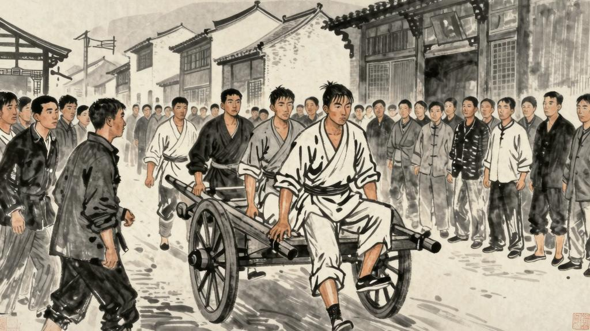
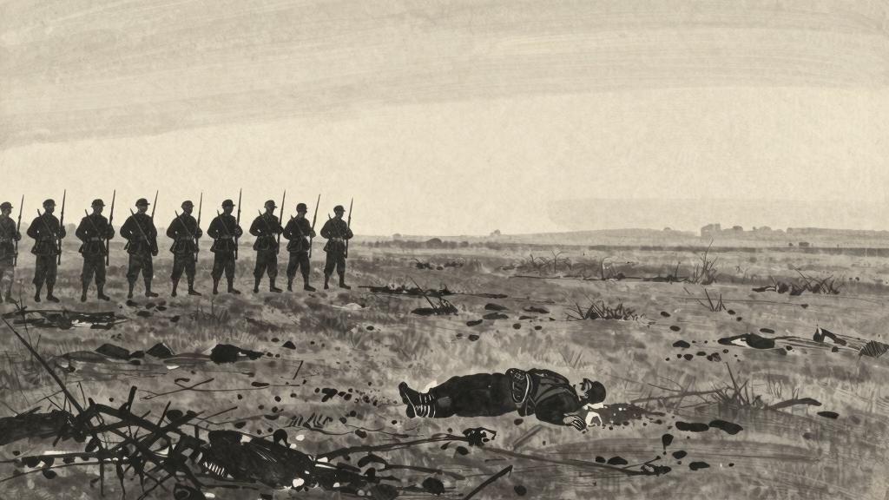

# 第八章 不准革命

未庄的人心日见其安静了。据传来的消息，知道革命党虽然进了城，倒还没有什么大异样。知县大老爷还是原官，不过改称了什么，而且举人老爷也做了什么——这些名目，未庄人都说不明白——官，带兵的也还是先前的把总。只有一件可怕的事是：另有几个不好的革命党，在外面捣乱，第二天就动手剪辫子，听说那邻村的航船七斤便着了道儿，弄得不像人样子了。但这却还不算大恐怖，因为未庄人本来少上城，即使偶有想进城的，也就立刻变了计，碰不着这危险。阿Q本也想进城去寻他的老朋友，一得这消息，也就中止了。

但未庄也不能说是无改革。几天之后，将辫子盘在顶上的逐渐增加起来了，早经说过，最先自然茂才公，其次便是赵司晨和赵白眼，后来是阿Q。倘在夏天，大家将辫子盘在头顶上或者打一个结，本不算什么稀奇事，但现在是暮秋，所以这"秋行夏令"的情形，在盘辫家不能不说是万分的英断，而在未庄也不能说无关于改革了。

赵司晨脑后空荡荡的走来，看见的人大嚷说，

"嚄，革命党来了！"

阿Q听到了很羡慕。他虽然早知道秀才盘辫子的说法，但想不到会是如此。他觉得自己也应该如此做，方才和革命党有交情。他用一支竹筷将辫子盘在头顶上，沉吟了半日，这才放下心来。

"好，"他想，"革命也好罢，"阿Q想，"革命也好罢，我这回可要发财了。想来想去，我的所以发财，是因为我做了革命党的缘故。"

于是阿Q便恍然大悟，以为革命党便是造反，造反便是与他有利，于是便决定要投降革命党了。但有一件可惜的事，他不知道革命党是什么样子，也不知道怎样去找他们。他只好在未庄等。

他等了好几天，却没有人来找他。他很失望，但又想："革命党一定是太忙了，没有时间来找我。"于是他便又安心了。

有一天，他听说城里的革命党到未庄来了。他很高兴，便去找他们。但他找了半天，也没有找到。他问了好几个人，但没有人告诉他革命党在哪里。他很失望，便回家了。

后来他才知道，城里的革命党确实到未庄来过，但他们并不是来找他的。他们是来找赵太爷的，因为他们想和赵太爷合作，共同"革命"。阿Q听了之后，非常愤怒，他觉得革命党不应该和赵太爷合作，因为赵太爷是有钱人，是革命的对象。但他的愤怒并没有什么用处，因为革命党并不听他的。

阿Q的"革命"就这样被"不准"了。他想参加革命，但革命党不要他。他想造反，但没有人跟他一起造反。他想改变自己的处境，但他没有方向，没有方法，也没有勇气。他只好回到土谷祠里，继续过他的穷困潦倒的生活。

# 第九章 大团圆

赵家遭抢之后，未庄人大抵很快意而且恐慌，阿Q也很快意而且恐慌。但四天之后，阿Q在半夜里忽被抓进县城里去了。那时恰是暗夜，一队兵，一队团丁，一队警察，五个侦探，悄悄地到了未庄，乘昏暗围住土谷祠，正对门架好机关枪；然而阿Q不冲出。许多时没有动静，把总焦急起来了，悬了二十千的赏，才有两个团丁冒了险，逾垣进去，里应外合，一拥而入，将阿Q抓出来了；直待等到照例摘下帽子来，这才认出这并不是什么盗犯，而是阿Q。他尤其惊愕的是想不到会有一队兵来捉他，而且机关枪又架在祠门外。

他于是被警察和侦探们簇拥着，到县衙门里去了。到了衙门，把他推推搡搡的弄进一个院子里。他看见上面坐着一个白胖白胖的人，知道这就是官了。他于是跪下去，说道：

"我是一个好人啊！"

那官却不理他，只是看旁边的一个人——大约是书记——递上来的什么纸片。看了之后，便问：

"你叫什么名字？"

"阿Q。"

"姓什么？"

"姓——"阿Q想了一想，说，"姓赵。"

"胡说！你怎么会姓赵！"那官大怒道，"你分明是犯了罪，还想冒充别人的姓氏！"

阿Q吓了一跳，不敢再说姓赵了。他便说：

"我没有姓。"

"你住在那里？"

"未庄。"

"做什么的？"

"做短工。"

那官又问了一些话，阿Q都一一回答了。后来那官便叫他画押。阿Q不会写字，只好画了一个圆圈。但他画的圆圈不很圆，他便很懊悔，觉得这是他生平第一件的耻辱。但他又想："孙子才画得很圆呢。"于是他便也心满意足了。

阿Q被关进了牢里。他觉得很害怕，因为他从来没有坐过牢。但牢里的人对他很好，给他饭吃，给他水喝。阿Q便也安心了。

过了几天，阿Q被提出去审问。这一次审问的场面比上一次大了许多，来了很多人，有官，有兵，有绅士，有记者，还有很多看热闹的人。阿Q觉得很紧张，但他又想："我是什么人？我是革命党啊！革命党不怕死的。"于是他便壮了壮胆子。

然而审问的结果却很出乎阿Q的意料。那官说他是赵家被抢的同犯，要判处他死刑。阿Q大惊，连忙喊冤，但没有人听他的。他只好被带回了牢里。

第二天，阿Q被提出去游街。他被绑在一辆车上，被人推着穿过大街小巷。两旁站满了看热闹的人，他们都伸长了脖子，争着看阿Q的样子。阿Q觉得很丢脸，但他又想："孙子才不丢脸呢。"于是他便也心满意足了。

阿Q在车上看了看两旁的人，他们都是一些什么样子呢？他们的脸上都带着一种奇怪的、麻木的表情，好像在看一件与自己毫无关系的事情。他们的眼睛里没有同情，也没有愤怒，只有一种无聊的好奇。阿Q忽然觉得很失望，因为他原来以为游街的时候，一定会有人来救他的。但现在看来，没有人会来救他了。

阿Q忽然想起了从前的事情。他想起他在未庄的日子，想起他被赵太爷打的情景，想起他和王胡打架的情景，想起他向吴妈跪下的情景，想起他"革命"的情景。他觉得他的一生都是可笑的、可悲的。但他又想："我总算活了一辈子，虽然没有什么出息，但也没有什么大错。"于是他便也心满意足了。

阿Q被押到了刑场。他看见前面有一排士兵，手里拿着枪。他忽然害怕起来了，因为他知道他马上就要被枪毙了。他想喊救命，但喊不出来。他想逃跑，但跑不了。他只好闭上了眼睛，等着死。

"砰！"一声枪响，阿Q倒在了地上。他觉得一阵剧烈的疼痛，然后便什么也不知道了。

阿Q死了。未庄的人很快便忘记了他。赵太爷还是赵太爷，有钱人还是有钱人，穷人还是穷人。什么也没有改变。

阿Q虽然没有后代，但他的"精神上的胜利法"却并没有失传。因为在这个世界上，像阿Q这样的人，何止千万呢？他们虽然不一定都像阿Q那样愚昧和可笑，但他们的心里都有一个阿Q。他们用各种各样的方法来欺骗自己，安慰自己，使自己能够在痛苦的生活中继续活下去。这就是阿Q的"精神"——一种普遍的、永恒的人类弱点。

至于舆论，在未庄是无异议，自然都说阿Q坏，被枪毙便是他的坏的证据；不坏又何至于被枪毙呢？而城里的舆论却不佳，他们多半不满足，以为枪毙并无杀头这般好看；而且那是怎样的一个可笑的死囚呵，游了那么久的街，竟没有唱一句戏：他们白跟了一趟了。
